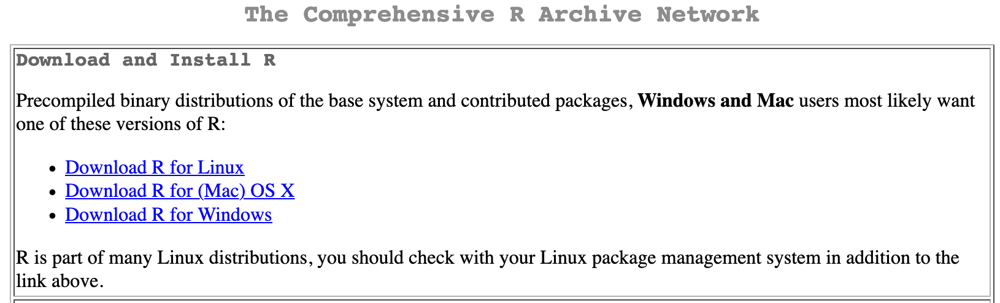
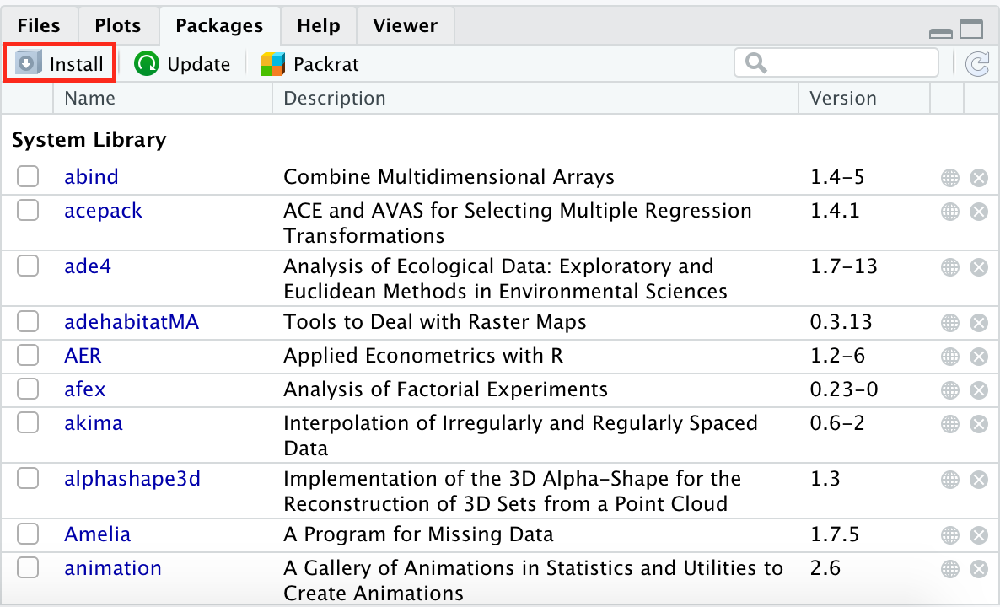
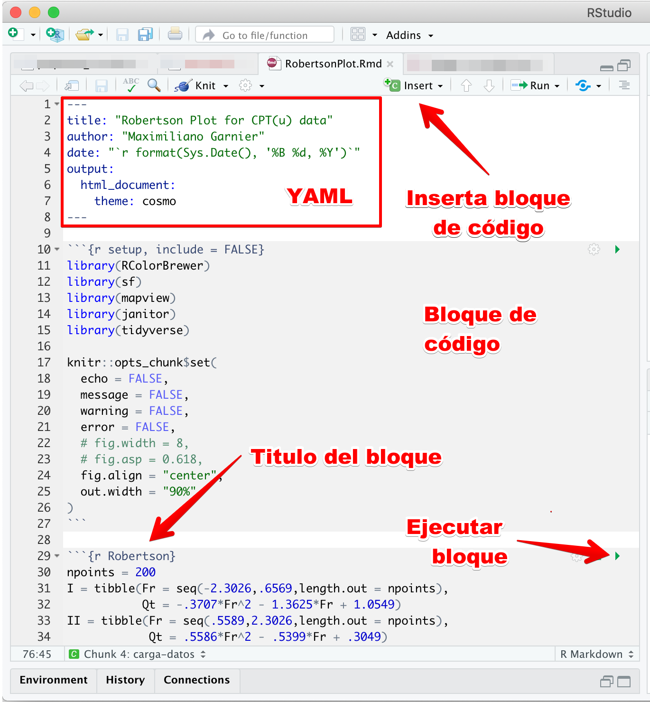

# (PART\*) R {-}

# Introducción {#intro}

**R** es un programa estadístico y de programación, el cual le permite al usuario hacer uso de funciones (en paquetes) ya definidas o la creación de funciones propias para resolver problemas específicos. Muchas de las funciones presentan un gran detalle en los resultados, haciendo fácil la interpretación de los mismos.

## Instalación de R y RStudio

**R** es el motor, donde se realizan las operaciones, **RStudio** es el chasis, lo que le permite al usuario interactuar con el motor, es una interfaz de desarrollo que facilita las tareas en un proyecto.

Primero hay que instalar **R**:

1. Ir a [R](https://cran.r-project.org/)
2. Descargar la versión dependiendo del sistema operativo (Figura \@ref(fig:cran))

```{r cran, echo=FALSE, fig.cap='Repositorio CRAN para descargar R'}

```

Después de instalar **R** hay que instalar **RStudio**:

1. Ir a [RStudio](https://rstudio.com/products/rstudio/download/)
2. Descargar RStudio Desktop, la versión libre (Free)

## Paquetes

La instalación de **R** básica trae una serie de paquetes (librerías) instaladas, que funcionan para cosas básicas y sencillas.

Para instalar paquetes de forma interactiva se va a la sección de paquetes (packages), se hace click en instalar (install), como se muestra en la Figura \@ref(fig:instalar), y se escribe el o los nombres de los paquetes a instalar, separados por espacios.

```{r instalar, echo=FALSE, fig.cap='Como instalar paquetes de forma manual'}

```

La forma mas practica de instalar (actualizar) paquetes es por medio de código, usando `install.packages("paquete")`.

Para cargar paquetes y sus funciones durante una sesión de **R** se usa la función `library(paquete)`. Cabe mencionar que en el orden que se carguen los paquetes así se habilitaran las funciones, y si hay funciones con el mismo nombre en diferentes paquetes, la que se va a habilitar por defecto es la del ultimo paquete cargado. Una forma de solucionar un conflicto de este tipo o llamar una función de un paquete sin cargarlo es por medio de `paquete::funcion`, donde se usa del paquete deseado la función correspondiente (Ejemplo `dplyr::select`).

```{r paquetes, eval=FALSE}
install.packages("devtools")
library(lubridate)
library(tidyverse)
```

## Ayuda en R

Para buscar ayuda sobre funciones y cuales argumentos requiere se puede usar `?funcion`, o se para sobre la función y se apreta *F1*.

```{r ayuda, eval=FALSE}
?mean
```

## RMarkdown

Un documento [R Markdown](http://rmarkdown.rstudio.com) es un tipo de documento que permite mezclar texto con código, manteniendo el análisis y los resultados en un mismo lugar. La interfaz y estructura típica se muestran en la Figura \@ref(fig:rmarkdown). Cuando ejecuta el código dentro del documento el resultado aparece por debajo del código.

```{r rmarkdown, echo=FALSE, fig.cap='Estructura de un documento RMarkdown'}

```

Todo documento empieza con el encabezado YAML, que se define entre guiones consecutivos (`---`). Aquí se definen las características generales del documento:

* titulo ('title')
* autor ('author')
* fecha ('date')
* tipo de documento ('output')
* etc

Idealmente todo bloque de código debiera llevar un nombre para poder identificarlo, así como su resultado. Para ejecutar una sección de código se puede hacer click en el botón verde de *Run* dentro de la sección o colocando el cursor dentro de la sección y ejecutando _**Ctrl+Shift+Enter**_ (Windows) o _Cmd+Shift+Enter_ (Mac). Así de fácil!

Se puede agregar una nueva sección haciendo click en *Insert Chunk* o ejecutando *Ctrl+Alt+I* (Windows) o *Cmd+Option+I* (Mac).

```{r include=FALSE}
library(plotly)
library(dygraphs)
library(rio)
library(tidyverse)
```

### Tipos de resultados

Se pueden tener resultados de diferentes tipos, los cuales se muestran a continuación.

#### Consola

Podemos crear diferentes objetos dentro de la sección como si fuera la consola de R. Creemos un objeto que contenga los números del 1 al 15.

```{r numeros}
numeros <- seq_len(15)
numeros
```

Podemos desplegar tablas (Tabla \@ref(tab:tabla)). La apariencia va a cambiar dependiendo el formato de salida y va a estar sujeta a la opción `df_print` en el encabezado YAML, a menos de que se sobre-escriba en el código. Para darle numero y etiqueta a una tabla se debe usar la función `kable` del paquete *knitr* [@knitr2014; @knitr2015].

```{r tabla}
mtcars %>% 
  knitr::kable(caption = 'Datos de diferentes carros')
```

#### Gráficos

Gráficos de **ggplot2** o cualquier otro gráfico estático son resultados que se pueden desplegar. Opciones para el control sobre las figura van a empezar con `fig.` en el encabezado del código (como se hace en el siguiente ejemplo, Figura \@ref(fig:gráfico) donde se ajusta el ancho a 6 pulgadas - `fig.width=6`).

```{r grafico, fig.width=6, fig.cap='Grafico estatico'}
q = ggplot(mtcars, aes(wt,mpg,col=factor(cyl))) + 
  geom_point(size=2,shape=1) + 
  theme_bw() + 
  labs(x='Peso',y='Millaje',col='Cilindros')
q
```

#### Widgets HTML

Si el análisis en R involucra componentes interactivos, estos también son compatibles con los resultados en el cuaderno o archivo HTML. La opción `eval=knitr::is_html_output()` se incluye para que el código sea evaluado únicamente cuando el formato de salida es HTML, ya que estos no pueden desplegarse en PDF o Word.

El siguiente código genera un gráfico interactivo (Figura \@ref(fig:widgets)).

```{r widgets, eval=knitr::is_html_output(), fig.cap='Ejemplo de grafico interactivo'}
dygraph(nhtemp, main = "Temperaturas de New Haven") %>% 
  dyRangeSelector(dateWindow = c("1920-01-01", "1960-01-01"))
```

En la Figura \@ref(fig:plotly) se muestra la versión interactiva de la Figura \@ref(fig:gráfico), anteriormente generada.

```{r plotly, eval=knitr::is_html_output(), fig.cap='Version interactiva del grafico estatico'}
ggplotly(q)
```

### Formulas

Expresiones matemáticas y formulas se pueden desplegar en linea, dentro del cuerpo del texto ($A = \pi*r^{2}$) o por separado $$E = mc^{2}$$
Para escribir estas expresiones se usa la metodología o lenguaje `LaTeX`.

### Importando datos

Los documentos *R Markdown* usan una dirección relativa a la ubicación del archivo.

```{r datos}
dat <- import("data/LungCapData2.csv")
```

### Cálculos en linea

Siempre que un valor exista dentro de un objeto guardado, este se puede acceder para ser desplegado en el cuerpo del documento. Esto se realiza escribiendo código entre comillas invertidas, como por ejemplo `round(mean(airquality$Temp), 2)`, lo que resulta en `r round(mean(airquality$Temp), 2)`, que es la temperatura media en grados Fahrenheit.

### Importando figuras

La mejor manera es usando el paquete `knitr`. Aquí se ajusta no el ancho de la figura directamente sino que se le dice que se ajuste a un 50% del ancho disponible. Existen otras opciones que empiezan con `out.`. En la Figura \@ref(fig:r-rocks) se ajusta el ancho de salida con `out.width='50%'`.

```{r r-rocks, fig.cap='R Rocks', out.width='50%'}

```


### Salvando y compartiendo

Los documentos *R Markdown* tienen como extensión `.Rmd`. Cuando se crea y se salva un cuaderno se crea un archivo adjunto con extensión `.nb.html`. Este archivo contiene una copia renderizada del cuaderno, que puede ser visualizada en cualquier navegador. Cuando se abre el archivo `.nb.html` en un navegador se va a tener la opción de descargar el código original (`.Rmd`).

Para previsualizar el cuaderno renderizado (`.nb.html`) haga click en *Preview*. La previsualización le muestra una copia renderizada del HTML. A diferencia de *Knit* (para otros documentos R Markdown), *Preview* no ejecuta ninguna sección de código, por lo que si una sección no se ha ejecutado en el editor el *Preview* no va a mostrar ningún resultado. La previsualización se actualiza cada vez que se salva el documento `.Rmd`.

#### Otros formatos

El cuaderno es un documento R Markdown. Se puede cambiar el formato de salida cambiando el orden en el encabezado YAML. En ese caso el *Preview* es reemplazado por *Knit* y genera un documento HTML corriente. También se puede generar desplegando el menú contextual haciendo click en la flecha junto a *Preview*. También se pueden crear documentos PDF o Word.

```{r include=FALSE}
# automatically create a bib database for R packages
knitr::write_bib(c(
  .packages(), 'bookdown', 'knitr', 'rmarkdown'
), 'packages.bib')
```
