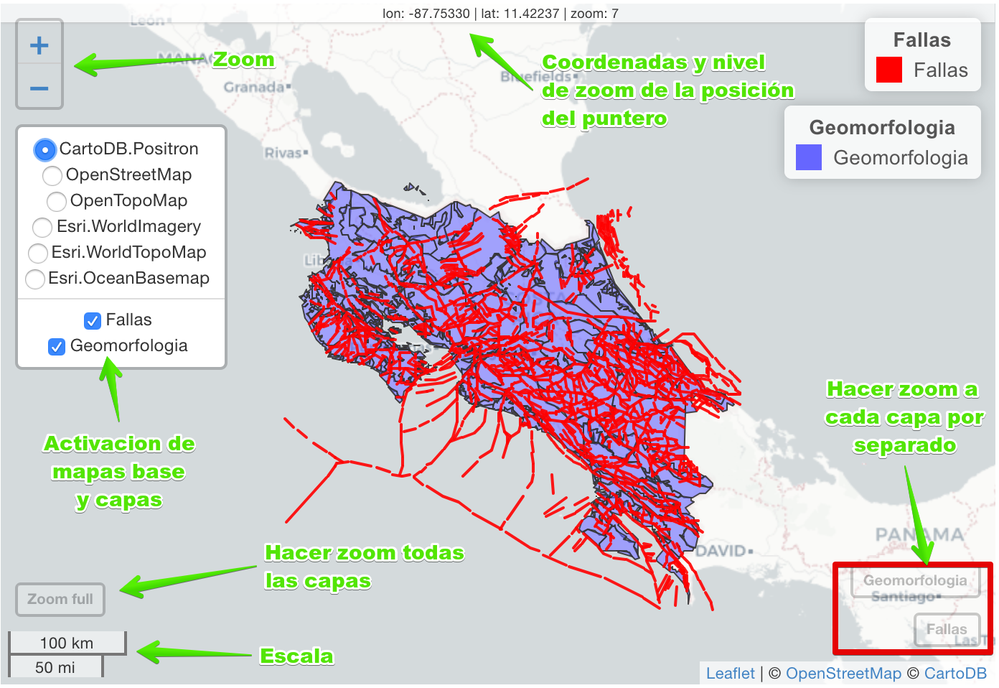

# Datos espaciales

```{r sp-setup, include=FALSE}
library(sp)
library(sf)
library(ggspatial)
library(raster)
library(stars)
library(viridis)
library(rgeos)
library(rgdal)
library(leaflet)
library(mapview)
library(RColorBrewer)
library(ggrepel)
library(rio)
library(tmap)
library(tidymodels)
library(tidyverse)
library(rayshader)

knitr::opts_chunk$set(
  echo = TRUE,
  message = FALSE,
  warning = FALSE,
  error = FALSE,
  # fig.path = "figs/",
  fig.retina = 3,
  fig.width = 8,
  fig.asp = 0.618,
  fig.align = "center",
  out.width = "90%"
)

```

En este capitulo se presenta una breve introduccion al uso de **R** como ambiente para trabajar datos espaciales. Los paquetes a utilizar son:

```{r sp-paquetes, eval=FALSE}
library(sp)
library(sf)
library(ggspatial)
library(raster)
library(stars)
library(viridis)
library(rgeos)
library(rgdal)
library(mapview)
library(RColorBrewer)
library(ggrepel)
library(rio)
library(tmap)
library(tidymodels)
library(tidyverse)
library(rayshader)
```

## Paquetes para datos espaciales

La comunidad de **R** ha desarrollado una gran variedad de paquetes para datos espaciales, algunos de los cuales han ido evolucionando y facilitando la manipulacion y presentacion de los mismos. 

Dentro de los paquetes mas usados estan:

* *sf* [@R-sf]: Para datos vectoriales dentro de la filosofia *tidyverse*
* *sp* [@R-sp]: El predecesor de *sf* para datos vectorales y en grilla (no exactamente raster)
* *raster* [@R-raster]: Para datos raster
* *stars* [@R-stars]: El candidato a susceder a *raster*
* *rgeos* y *rgdal* [@R-rgeos; @R-rgdal]: Interfaces para librerias basicas de manipulacion de datos espaciale
* *ggplot2* y *tmap* [@R-tmap]: Creacion de mapas estaticos (*tmap* puede crear mapas interactivos)
* *mapview* y *leaflet* [@R-mapview; @R-leaflet]: Creacion de mapas interactivos

Otro monton de paquetes brindan funciones adicionales y funciones para tareas especificas.

## Sistemas de Referencias de Coordenadas (CRS)

Los datos espaciales tienen por lo general un sistema de coordenadas asociado (geograficas, lambert, UTM, etc.). Estos sistemas se pueden identificar por medio de cordigos EPSG que han sido estandarizados para uso general.

Como ejemplo, las coordenadas geograficas en grados (WGS84) tiene el codigo 4326, las coordenadas geograficas en metros (WGS84/pseudo-mercator; son las utilizadas por GoogleMaps y otros) tiene el codigo 3857. Las coordenadas para Costa Rica con la proyeccion CRTM05 tienen el codigo 5367, mientras que para la proyeccion Lambert Norte tienen el codigo 5456. Todos estos se pueden obtener por medio del sitio web [epsg.io](http://epsg.io/) o en QGIS a la hora de buscar sistemas de coordenadas ahi aparece el codigo.

## Importar datos

### Desde archivos de texto

Datos en archivos de texto (`.txt`, `.csv`, etc. y principalmente para datos puntuales) se pueden importar de manera convencional con `rio::import`.

```{r sp-datos}
datos <- rio::import("data/BroomsBarn.txt", setclass = 'tibble') %>% 
  mutate(x = x*40, y = y*40, logK = log(K), logP = log(P))
```

Posteriormente pueden convertirse a datos espaciales (`st_as_sf`), indicando la posicion o el nombre de las columnas con las coordenadas X,Y y asignndole un CRS.

```{r sp-datos-sf}
datos_sf = st_as_sf(datos, coords = 1:2, crs = NA, remove = F) 
```

La venataja de *sf* es que permite manipular los dato asociados al objeto espacial haciendo uso de los vervos del *tidyverse*.

```{r sp-filter}
datos_sf %>% 
  filter(pH > 8)
```

Para algunas funciones todavia es necesario usar objetos *sp* por lo que se pueden crear estos a partir de los objetos *sf*.

```{r sp-datos-sp}
datos_sp = as(datos_sf, 'Spatial')
coordnames(datos_sp) = c('X','Y')
```

### Desde archivos espaciales

#### Shapefiles

De igual manera se pueden importar/leer directamente datos en muchos formatos espaciales (ejemplo: shapefiles, geopackage, raster, etc.). Las funciones para leer datos son: `st_read` y `read_sf`; la primera importa los datos como DataFrame, la segunda como tibble.

```{r sp-shp1}
fallas = read_sf('data/fallas.shp')
geomorfo = read_sf('data/geomorfo.shp')
```

En este caso no reconocen los metadatos de la proyeccion por lo que se les puede asignar por medio de `st_set_crs`, donde el argumento necesario es el codigo EPSG.

```{r sp-shp2}
fallas_ln = fallas %>% 
  st_set_crs(5456)
geomorfo_ln = geomorfo %>% 
  st_set_crs(5456)
```

Si se desean transformar a otro sistema se usa `st_transform`, donde, de nuevo, el argumento necesario es el codigo EPSG del sistema destino (En el caso del ejemplo a coordenadas geograficas).

```{r sp-shp3}
fallas_geog = fallas_ln %>% 
  st_transform(4326)
geomorfo_geog = geomorfo_ln %>% 
  st_transform(4326)
```

#### Geopackage

Si se tiene un archivo `.gpkg` es necesario explorar primero las capas disponibles para luego importar los datos deseados. Esto se realiza con `st_layers` y la direccion del archivo geopackage.

```{r sp-gpkg1}
st_layers(dsn = 'data/espaciales.gpkg')
```

Una vez se han identificado las capas se pueden importar con cualquiera de los metodos deseados, donde el argumento a especificar es `layer` y el nombre de la capa a importar.

```{r sp-gpkg2}
fallas2 = read_sf('data/espaciales.gpkg', layer = 'fallas')
geomorfo2 = read_sf('data/espaciales.gpkg', layer = 'geomorfo')
```

#### Raster

Para leer rasters de una banda se usa la funcion `raster`, para rasters multi-banda se puede usar `brick`. Para objetos `stars` es indiferente y se pueden leer por medio de `read_stars`. Para convertir de `raster` a `stars` se usa `st_as_stars`. 

La lectura de un raster de una banda se ejemplifica con un modelo de elevacion digital del Pacifico.

```{r sp-raster1}
pacifico = raster('data/pacifico.tif')
pacifico
pacifico_stars = read_stars('data/pacifico.tif')
pacifico_stars = st_as_stars(pacifico)
pacifico_stars
```

La lectura de un raster multi-banda se ejemplifica con un geotiff que viene con el paquete *stars*.

```{r sp-raster2}
sat_ras = brick(system.file('tif/L7_ETMs.tif', package = 'stars'))
sat_ras
sat_df = as.data.frame(sat_ras,xy=T)
sat_stars = read_stars(system.file('tif/L7_ETMs.tif', package = 'stars'))
sat_stars
```

## Exportar datos

### Vectoriales

Para exportar datos vectoriales se puede usar `st_write`, donde se define el objeto espacial a exportar y el tipo de archivo a generar (`.shp`, `.gpkg`, etc.). La opcion `layer_options = 'OVERWRITE=YES'` permite reescibir un objeto si ya se encontraba presente en la carpeta destino.

```{r}
st_write(fallas_geog, dsn = 'data/espaciales_geog.gpkg', 
         layer = 'fallas', layer_options = 'OVERWRITE=YES', quiet = T)
st_write(geomorfo_geog, dsn = 'data/espaciales_geog.gpkg', 
         layer = 'geomorfo', layer_options = 'OVERWRITE=YES', quiet = T)
```

Se puede revisar que el objeto haya sido creado apropiadamente, de nuevo usando `st_layers`.

```{r}
st_layers(dsn = 'data/espaciales_geog.gpkg')
```

### Raster

Dependiendo de si el objeto es `raster` o `stars`, se debera usar la funcion respectiva, `writeRaster` o `write_stars`. en el caso de `writeRaster` se tiene que especificar el formato (para esto se puede consultar la ayuda de la funcion).

```{r}
writeRaster(sat_ras, 'data/imagen_satelite.tif', 
            format="GTiff", overwrite=TRUE)
write_stars(sat_stars, 'data/imagen_satelite_stars.tif')
```

## Mapas

Existen diferentes formas de graficar datos espaciales, aqui se presentan las mas usadas, donde se recomienda *ggplot2* o *tmap*. El primero ya que se esta familiarizado con el funcionamiento del mismo y es nada mas agregar un par de funciones especificas para datos espaciales; el segundo ya que es especifico para datos espaciales siguiendo una idea similar a *ggplot2*.

### Estaticos

#### *basico*

Todos los objetos espaciales tienen un metodo de ploteo basico (`plot`). Si el objeto tiene mas de 1 atributo va a plotear todos o los que pueda. Para evitar esto se puede especificar cual atributo se quiere plotear. En general esto se puede usar mas para una visualizacion rapida pero no para mapas finales. Se muestran diferentes opciones para visualizar los diferentes tipos de datos, pero no se muestra el mapa final por ser muy basico.

```{r sp-mapas-plot, eval=FALSE}
plot(fallas_ln)

plot(datos_sf[,'K'])

plot(geomorfo_ln[,'CODIGO'])

plot(pacifico)

plot(pacifico_stars)
```

#### *ggplot*

El paquete *ggplot* tiene geometrias especificas para objetos `sf` (vector) y `stars` (raster o grillas), por lo que facilita la creacion de mapas en un ambiente ya conocido.

La forma mas basica de crear un mapa vectorial usando *ggplot* es usando `geom_sf` y especificando el argumento `data` que corresponde con el objeto espacial, pero por defecto despliega coordenadas geograficas (Figura \@ref(fig:sp-mapas-ggplot1)).

```{r sp-mapas-ggplot1, fig.cap='Mapa basico en *ggplot2*'}
ggplot() + 
  geom_sf(data = fallas_ln)
```

Para que el mapa se despliegue en las coordenadas del objeto y no geograficas, hay que cambiar el argumento `datum` en `coord_sf` al CRS del archivo deseado (Figura \@ref(fig:sp-mapas-ggplot2)).

```{r sp-mapas-ggplot2, fig.cap='Mapa en *ggplot2* con el `datum` modificado'}
ggplot() + 
  geom_sf(data = fallas_ln) + 
  coord_sf(datum = st_crs(fallas_ln))
```

El paquete *ggspatial* ofrece algunas capas adicionales especificas (elementos cartograficos) para datos espaciales, con las cuales se pueden agregar una escala (`annotation_scale`) y el norte (`annotation_north_arrow`), ademas de poder agregar un mapa de fondo (`annotation_map_tile`), donde `zoom` define el nivel de detalle, a menor `zoom` menor detalle (Figura \@ref(fig:sp-mapas-ggplot3)).

```{r sp-mapas-ggplot3, fig.cap='Mapa en *ggplot* con elementos cartograficos (escla y norte)'}
ggplot() + 
  annotation_map_tile(zoom = 8) +
  geom_sf(data = fallas_ln) + 
  coord_sf(datum = st_crs(fallas_ln)) + 
  annotation_scale(location = 'bl') + 
  annotation_north_arrow(location = 'tr',
                         height = unit(.75, "cm"), 
                         width = unit(.75, "cm"))
```

Para datos puntuales (Figura \@ref(fig:sp-mapas-ggplot4)) o de poligonos (Figura \@ref(fig:sp-mapas-ggplot5)) se puede especificar una columna de los datos, por la cual colorear los puntos.

```{r sp-mapas-ggplot4, fig.cap='Mapa de puntos en *ggplot* coloreados por la variable "K"'}
ggplot() + 
  geom_sf(data = datos_sf, aes(col = K), size = 3, alpha = 0.6) + 
  scale_color_viridis_c()
```

```{r sp-mapas-ggplot5, fig.cap='Mapa de poligonos en *ggplot* coloreados por la variable "FORMA"'}
ggplot() + 
  geom_sf(aes(fill = as_factor(FORMA)), data = geomorfo_ln) + 
  coord_sf(datum = st_crs(geomorfo_ln)) + 
  scale_fill_brewer(palette = 'Set3')
```

La forma de crear un mapa a partir de un objeto `stars` (grilla de una banda) es por medio de `geom_stars`, donde, de nuevo, se especifica el objeto espacial en el argumento `data`. En este caso automaticamente se aplica al relleno (`fill`) la variable del objeto. Ademas, es necesario agregar `coord_equal` para que los ejes de coordenadas tengan las misma escala (Figura \@ref(fig:sp-mapas-ggplot6)).

```{r sp-mapas-ggplot6, fig.cap='Mapa de objeto `stars` en *ggplot*. Se especifica el relleno como un gradiente y se aplica la misma escala a ambos ejes'}
ggplot() + 
  geom_stars(data = pacifico_stars) + 
  scale_fill_gradient(low = 'black', high = 'white', na.value = 'white') +
  coord_equal()
```

Para imagenes multi-banda es necesario transforma el objeto espacial en una tabla (`sat_df = as.data.frame(sat_ras,xy=T)`) y graficar el relleno (`fill`) usando la funcion `rgb`, donde se especifica el nombre de las bandas que corresponde con cada uno de los canales rgb, y se debe definir `maxColorValue=255` (Figura \@ref(fig:sp-mapas-ggplot7)). Como lo que se va a graficar es una grilla se usa la funcion `geom_tile`, y de nuevo es necesario definir los ejes de coordenadas iguales con `coord_equal`.

```{r sp-mapas-ggplot7, fig.cap='Mapa de color verdadero para una imagen satelital multi-banda'}
ggplot(sat_df, aes(x, y, 
                   fill=rgb(red = L7_ETMs.3, 
                            green = L7_ETMs.2, 
                            blue = L7_ETMs.1, 
                            maxColorValue = 255))) + 
  geom_tile() + 
  scale_fill_identity() + 
  coord_equal() + 
  scale_x_continuous(expand = c(0,0)) +
  scale_y_continuous(expand = c(0,0)) +
  theme(axis.text.y = element_text(angle = 90, hjust = .5))
```

#### *tmap*

El paquete *tmap* es una opcion especifica para datos espaciales y sigue la misma ideologia de *ggplot* al trabajar en capas. Por defecto no despliega la grilla de coordenadas, hay que agregarselas con `tm_grid`. Para revertir los colores en la paleta se le agrega un menos (`-`) antes del nombre, y para colocar la leyenda fuera del area del mapa se debe usar `tm_layout(legend.outside = T)`. Existen opciones globales para los mapas generados con *tmap*, estas se pueden modificar con `tmao_options`, y uno de los argumentos es la leyenda afuera, asi no hay que aplicarlo en cada mapa por separado.

```{r sp-mapas-tmap0}
tmap_options(legend.outside = T)
```

La estructura basica de cualquier graficos es:

```{r sp-mapas-tmap1, eval = FALSE}
tm_shape(shp = <DATA>) +
  <tm_function>(col = <'VARIABLE'>, palette = '', 
                style = '', n = 5) +
  <tm_layout> +
  <tm_xlab> + 
  <tm_ylab> + 
  <tm_grid> +
  <tm_scale_bar> + 
  <tm_compass> + 
```

Se pueden agregar diferentes objetos espaciales agregando diferentes `tm_shape`. A diferencia de *ggplot* y `geom_sf` que era una funcion para todo objeto vectorial, es necesario definir el tipo de objeto con als diferentes funciones `tm_*`. Lo que se va a hacer es recrear los mapas de la seccion anterior pero con *tmap*.

Un mapa basico se observa en la Figura \@ref(fig:sp-mapas-tmap2), donde se grafican las lineas de falla.

```{r sp-mapas-tmap2, fig.cap='Mapa basico con *tmap*'}
tm_shape(fallas_ln) + 
  tm_lines()
```

El mapa de puntos se crea por medio de `tm_dots`. Por defecto *tmap* discretiza los datos (Figura \@ref(fig:sp-mapas-tmap3)), pero si se quiere representar como un gradiente (Figura \@ref(fig:sp-mapas-tmap4)) es necesario definir `style = 'cont'`, para continuo.

```{r sp-mapas-tmap3, fig.cap='Mapa de puntos con *tmap* coloreado de acuerdo a una variable'}
tm_shape(datos_sf) +
  tm_dots('K', size = .3, palette = 'viridis')
```

```{r sp-mapas-tmap4, fig.cap='Mapa de puntos con *tmap* coloreado de acuerdo a una variable, con la leyenda tipo gradiente'}
tm_shape(datos_sf) +
  tm_dots('K', size = .3, palette = 'viridis', style = 'cont') + 
  tm_layout(legend.outside = T)
```

En la Figura \@ref(fig:sp-mapas-tmap5) se observa un mapa de poligonos, donde ademas se agrega la grilla de coordenadas pero sin las lineas.

```{r sp-mapas-tmap5, fig.cap='Mapa de poligonos con *tmap*, agregando la grilla de coordenadas sin la lineas internas'}
geomorfo_ln %>% 
  mutate(FORMA = as_factor(FORMA)) %>% 
tm_shape() + 
  tm_polygons('FORMA') + 
  tm_grid(lines = F)
```

Para graficar objetos raster de una banda se usa `tm_raster` (Figura \@ref(fig:sp-mapas-tmap6)), donde hay que definir la paleta de colores a usar. Si se desea invertir simplemente se le agrega un `-` en frente del nombre.

```{r sp-mapas-tmap6, fig.cap='Mapa raster con *tmap*'}
tm_shape(pacifico) + 
  tm_raster(palette = '-Greys', style = 'cont')
```

Para ver las opciones de las paletas de color se puede usar:

```{r sp-mapas-tmap7, eval=FALSE}
tmaptools::palette_explorer()
```

Para graficar objetos raster multi-banda se debe usar `tm_rgb` (Figura \@ref(fig:sp-mapas-tmap8)) y especificar el orden de las bandas que corresponde con cada uno de los canales rgb.

```{r sp-mapas-tmap8, fig.cap='Mapa de color verdadero con *tmap*'}
tm_shape(sat_ras) + 
  tm_rgb(r = 3, g = 2, b = 1)
```

Finalmente, *tmap* trae incorporadas funciones para agregar escala (`tm_scale_bar`) y norte (`tm_compass`) (Figura \@ref(fig:sp-mapas-tmap9)).

```{r sp-mapas-tmap9, fig.cap='Mapa incorporando elementos de escala y norte'}
tm_shape(fallas_ln) + 
  tm_lines() + 
  tm_scale_bar(width = .2,position = c('left','bottom')) + 
  tm_compass(position = c('right','top'))
```

Para salvar un mapa de *tmap* como imagen se usa `tmap_save`. Idealmente hay que guardar el mapa en un objeto.

```{r sp-mapas-tmap10}
mapa1 = tm_shape(fallas_ln) + 
  tm_lines() + 
  tm_scale_bar(width = .2,position = c('left','bottom')) + 
  tm_compass(position = c('right','top'))

tmap_save(mapa1, 'figs/mapa_fallas.png', dpi = 300)
```

### Dinamicos

Una de la opciones con mapas interactivos es que se pueden definir diferentes mapas de fondo. Dentro de los mas usados estan los que se muestran acontinuacion: 

```{r sp-mapas-basemaps}
mybasemaps = c('CartoDB.Positron', 'OpenStreetMap', 'OpenTopoMap',
               'Esri.WorldImagery', 'Esri.WorldTopoMap', 'Esri.OceanBasemap')
```

De manera general se pueden asignar mapas de fondo para todos los mapas de una sesion definiendolos en las opciones de *tmap* y *mapview*:

```{r sp-mapas-tmap-opt}
tmap_options(basemaps = mybasemaps)
```

```{r sp-mapas-mv1}
mapviewOptions(basemaps = mybasemaps)
```

La Figura \@ref(fig:sp-mapas-mv-partes) muestra las diferentes opciones para manipular un mapa dinamico creado con *mapview*. Las mismas opciones y elementos se pueden agregar a un mapa de *leaflet* pero requieren ser especificadas explicitamente (haciendo mas largo el codigo), mientras que *mapview* ya agreaga muchos de estos por defecto.

```{r sp-mapas-mv-partes, echo=F, fig.cap='Partes de un mapa dinamico creado con *mapview*'}

```


#### *tmap*

Este paquete ofrece la opcion de viualizar un mapa estatico como dinamico, cambiando el modo de visualizacion (`tmap_mod(mode = c('plot','view'))`), donde `plot` es para mapas estatico y `view` para mapas dinamicos y traduce el mapa a un mapa *leaflet*. 

Lo anterior cambia el modo para todos los mapas que se creen a partir de que esto se modifica. Para visualizar de manera dinamica un mapa guardado en un objeto se puede usar `tmap_leaflet`, que genera un mapa *leaflet* a partir de uno de *tmap*, pero solo para el mapa que se quiere (Figura \@ref(fig:sp-mapas-tmap11)). Para demostrar esto se genera el mapa dinamico a partir del mapa que se salvo anteriormente (`mapa1`), que corresponde con la Figura \@ref(fig:sp-mapas-tmap2).

```{r sp-mapas-tmap11, fig.cap='Mapa interactivo *leaflet* a partir de un mapa estatico *tmap*'}
tmap_leaflet(mapa1)
```

#### *mapview*

Este paquete permite generar mapas interactivos de manera eficiente y rapida, pero no brinda la personalizacion de `leaflet`, el cual es mucho mas complejo y para generar un mapa similar se requiere aproximadamente de 4 a 5 veces mas lineas de codigo.

La funcion basica es `mapview` donde se le pasa el objeto espacial. Por defecto le asigna un color unico. El argumento `layer_name` es para definir el nombre que se quiere aparezca en la leyenda. Si se desean agregar diferentes capas simplemente se agregan funciones `mapview` con el operador `+` (Figura \@ref(fig:sp-mapas-mv2)). *mapview* es inteligente en el sentido de que dependiendo del tipo de objeto (poligono, linea, punto) lo va a graficar en el orden gerarquico visual (puntos por encima de lineas, lineas por encima de poligonos).

```{r sp-mapas-mv2-code, eval=FALSE}
mapview(fallas_ln, layer.name = 'Fallas', color = 'red') +
  mapview(geomorfo_ln, layer.name = 'Geomorfologia')
```

```{r sp-mapas-mv2, echo=FALSE, fig.cap='Mapa con *mapview*, donde se pueden combinar objetos espaciales usando el operador `+`'}
mv1 = mapview(fallas_ln, layer.name = 'Fallas', color = 'red') +
  mapview(geomorfo_ln, layer.name = 'Geomorfologia')
mv1@map
```

Se pueden colorear objetos espaciales definiendo una columna de la tabla de atributos por medio del argumento `zcol` (Figura \@ref(fig:sp-mapas-mv3)).

```{r sp-mapas-mv3-code, eval=FALSE}
mapview(datos_sf, zcol = 'logK', layer.name = 'logK')
```

```{r sp-mapas-mv3, echo=FALSE, fig.cap='Mapa de puntos con *mapview* coloreados de acuerdo a una variable'}
mv2 = mapview(datos_sf, zcol = 'logK', layer.name = 'logK')
mv2@map
```

Para graficar objetos raster de una banda simplemente se pasa el objeto a la funcion `mapview` (Figura \@ref(fig:sp-mapas-mv4)). Para raster multi-banda se debe usar `viewRGB` y definir el orden de las bandas de acuerdo a los canales rgb (Figura \@ref(fig:sp-mapas-mv5)).

```{r sp-mapas-mv4-code, eval=FALSE}
mapview(pacifico)
```

```{r sp-mapas-mv4, echo=FALSE, fig.cap='Mapa raster con *mapview*'}
mv3 = mapview(pacifico)
mv3@map
```

```{r sp-mapas-mv5-code, eval=FALSE}
viewRGB(sat_stars, r = 3, g = 2, b = 1)
```

```{r sp-mapas-mv5, echo=FALSE, fig.cap='Mapa de color verdradero con *mapview*'}
mv4 = viewRGB(sat_stars, r = 3, g = 2, b = 1)
mv4@map
```

Con mapview se pueden crear diferentes mapas y sincronizarlos por medio de `sync` del paquete *leafsync* (Simplemente se muestra el codigo).

```{r sp-mapas-mv6, eval=FALSE}
m1 = mapview(franconia, zcol = 'district', 
             layer.name = 'Distrito', burst = T)
m2 = mapview(breweries, legend = F)

leafsync::sync(m1, m2)
```

### Modelos de sombras

Para generar modelos de sombras en 2D y 3D se usa el paquete *raysahder* [@R-rayshader], el cual funciona a partir de objetos raster. Funciona con el pipe operator (`%>%`), por lo que es familiar a trabajar en el *tidyverse*. 

Primero hay que pasar el raster a matriz.

```{r sp-mapas-ray1}
pacifico_mat = raster_to_matrix(pacifico)
```

Para mejorar la apariencia del modelo de sombras es rcomendado agregar diferentes sombras ('shades'), las cuales son calculadas de diferente manera para resaltar diferentes aspectos del modelo.

```{r sp-mapas-ray2, cache=TRUE}
zscale = 200
elmat = pacifico_mat
raymat = ray_shade(elmat, zscale = zscale)
ambmat = ambient_shade(elmat, zscale = zscale)
lambmat = lamb_shade(elmat, zscale = zscale)
```

Para generar un modelo de sombras en 2D, se empieza con la matriz de elvacion, se le agregan las diferentes capas, y para mostrar el mapa se termina la cadena de comandos con `plot_map` (Figura \@ref(fig:sp-mapas-ray3)).

```{r sp-mapas-ray3, fig.cap='Modelo de sombras en 2D'}
elmat %>%
  sphere_shade(texture = "bw") %>%
  add_shadow(raymat, 0.5) %>%
  add_shadow(lambmat, 0.5) %>%
  add_shadow(ambmat, 0.5) %>%
  plot_map()
```

Para generar el modelo en 3D (Figura \@ref(fig:sp-mapas-ray4)), simplemente se termina la cadena de comandos con `plot_3d`. Esto abre una ventana interactiv donde se puede manipular el modelo, en este caso simplemente se toma una captura de la apariencia en 3D.

```{r sp-mapas-ray4, fig.cap='Model de sombras en 3D'}
elmat %>%
  sphere_shade(texture = "imhof1") %>%
  add_shadow(raymat, 0.5) %>%
  add_shadow(lambmat, 0.5) %>%
  add_shadow(ambmat, 0.5) %>%
  plot_3d(elmat, zscale = zscale, water = T, 
          theta = 0, phi = 40, zoom = .5,
          windowsize = c(1000,600))
render_snapshot(clear=TRUE)
```

Adicionalmente se puede crear una pequenha pelicula o animacion con `render_movie` (No se presenta aqui pero se muestra el codigo).

```{r sp-mapas-ray5, eval=F}
elmat %>%
  sphere_shade(texture = "imhof1") %>%
  add_shadow(raymat, 0.5) %>%
  add_shadow(lambmat, 0.5) %>%
  add_shadow(ambmat, 0.5) %>%
  plot_3d(elmat, zscale = zscale, water = T, 
          theta = 0, phi = 40, zoom = .5,
          windowsize = c(1000,600))
render_movie(filename = 'modelo3D')
rgl::rgl.close()
```


```{r include=FALSE}
# automatically create a bib database for R packages
knitr::write_bib(c(
  .packages(), 'bookdown', 'knitr', 'rmarkdown'
), 'packages.bib')
```
