# Introducción a estadística

```{r datos-setup, include=FALSE}
knitr::opts_chunk$set(
  echo = TRUE,
  message = FALSE,
  warning = FALSE,
  error = FALSE,
  # fig.path = "figs/",
  fig.retina = 3,
  fig.width = 8,
  fig.asp = 0.618,
  fig.align = "center",
  out.width = "70%"
)
```

Este capitulo da una introducción a estadística, en qué consiste, para qué se usa, los tipos, modelos y nomenclatura que se usan.

Estadística es la ciencia que estudia la manera en que se recolecta, se analiza, se interpreta la información proveniente de una población, así como el modo en que se extrapola esos resultados a otros casos similares. Tiene como objetivo principal analizar datos y transformarlos en información útil para tomar decisiones y sacar conclusiones, donde hay **incertidumbre** y **variación**.

## Tipos

En general hay dos tipos de estadística:

* Descriptiva: Lo que se hace es recopilar, organizar, resumir y presentar datos para facilitar su análisis y aplicación (Tablas y/o gráficos). En este tipo es donde se ubica lo que se conoce como análisis exploratorio de datos (AED o EDA en inglés), y consiste en el proceso para utilizar herramientas estadísticas (como gráficas, medidas de tendencia central y medidas de variación), con la finalidad de investigar conjuntos de datos para comprender sus características importantes. Un ejemplo se observa en la Figura \@ref(fig:eda).

```{r eda, echo=FALSE, fig.cap='Ejemplo de estadística desciptiva y análisis exploratorio de datos. Tomado de: http://www.universoformulas.com/imagenes/estadistica/descriptiva/estadistica-descriptiva.jpg'}
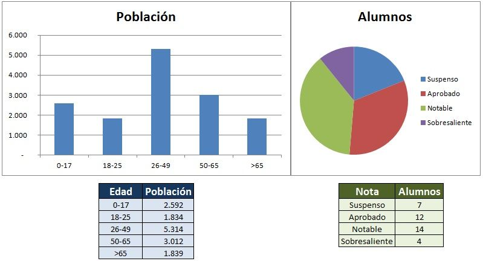
```

* Inferencial: El objetivo es hacer inferencias en base a una muestra, con la intención de generalizar a una población de interés (Figura \@ref(fig:inferencial)). En este caso los resultados se usan para corroborar o refutar creencias sobre la población de interés y sacar conclusiones con sustento estadístico.

```{r inferencial, echo=FALSE, fig.cap='Proceso de estadística inferencial. Tomado de: http://www.universoformulas.com/imagenes/estadistica/inferencia/proceso-estadistica-inferencial.jpg'}
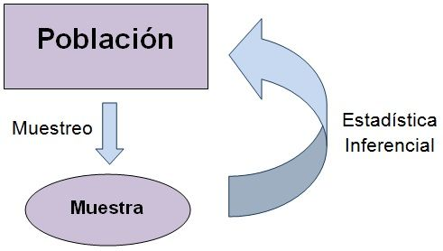
```

## Modelos

* Determinístico: Donde las mismas entradas producirán las mismas salidas, sin variación, esto debido a que no hay incertidumbre en los datos, se conocen con certeza.

* Probabilístico (aleatorio, estocástico): Donde los resultados (salidas) dependen de las entradas y de los componentes aleatorios (incertidumbre), pudiendo producir  resultados distintos a partir de una misma entrada. Los resultados se expresan en términos de probabilidad, que refleja la incertidumbre del modelo.

## Nomenclatura

En estadística se maneja cierta nomenclatura (definiciones) que es importante conocer y saber usar apropiadamente. Dentro de las definiciones que se van a trabajar a los largo del curso son:

* Población
  - Conjunto con alguna característica de interés
  - Normalmente muy grande para poder abarcarlo (estudiarlo) por completo

* Muestra
  - Subconjunto de la población de interés sobre el cual se hacen las observaciones y análisis
  - Debería ser representativa

* Variable
  - Característica observable de los componentes de una población (muestra) y que puede tomar distintos valores

* Observación o dato
  - Valor obtenido para los componentes de la muestra, como resultado de algún tipo de medición

Los conceptos de población y muestra se muestran en la siguiente figura.

```{r poblacion-muestra, echo=FALSE, fig.cap='Ejemplo de una población a la cual se le toma una muestra. Tomado de: http://aprendiendoadministracion.com/wp-content/uploads/2016/01/muestra-estadistica.jpg'}
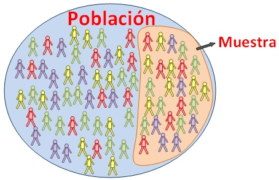
```

```{block2 muestra-geol, type='rmdnote'}
No hay que confundir los conceptos de muestra estadistica y muestra geologica. Una muestra estadistica es un conjunto de observaciones o datos, mientras que una muestra geologica en terminos estadisticos es una observacion o dato. Entonces *una* muestra estadistica es un conjunto de muestras geologicas.
```

## Variables

Hay dos tipos generales de variables: Cualitativa y Cuantitativa.

### Cualitativa

Lo que se conoce como datos categóricos, donde las entradas o datos toman valores de clases o niveles. Dentro de **R** estas son las que so codifican como factores. Dentro de este tipo podemos encontrar una subdivisión:

  - Nominal (nom): donde las clases o niveles no tienen un orden específico,
  - Ordinal (ord): donde las clases o niveles tienen un orden relativo, que se puede pensar como una escala.
  
Ejemplos de datos cualitativos son: color (nom), grado de meteorización (ord), nivel de fisuramiento (ord), intensidad (ord), escala de dureza de Mohs (ord), etc.

### Cuantitativa

Corresponden con datos numéricos, es el tipo de dato que por lo general se asocia a técnicas estadísticas y de análisis de datos, pero no se deben obviar los datos cualitativos.

Se puede dividir en: 

  - Intervalo: donde datos los datos se encuentran igualmente espaciados y no hay un cero absoluto, o sea pueden haber valores negativos,
  - Ratio: donde hay un cero absoluto, correspondiendo con valores positivos.

También se puede dividir en:

  - Discretos (disc): por medio de conteos, corresponde con números enteros,
  - Continuos (cont): por medio de mediciones (magnitudes), corresponde con infinitos valores entre enteros, puede expresarse con decimales.
    
Ejemplos de datos cuantitativos son: edad (cont), orientación (cont), espesor (cont), número de fisuras (disc), magnitud (cont), esfuerzos (cont), deformaciones (cont), longitud (cont), superficie (cont), volumen (cont), tiempo (cont), temperatura (cont), etc.

En las ciencias geológicas y de la tierra se manejan varios tipos de datos especiales, que van a requerir de adaptar técnicas de análisis generales para los casos específicos. Dentro de estos datos se tiene:

* *Cerrados*: Las variables son expresadas como proporciones y suman hasta un valor fijo total (Ej: 100%), en general el interés es más en la razón entre las variables y no el valor de la variable. Composiciones (Ej: tipo de roca) representan la mayoría de este tipo de datos.
* *Espaciales*: La(s) variable(e) de interés posee(n) componentes en 2D o 3D representando su distribución espacial (ubicación en un área determinada). Ejemplos: distribución de un tipo de fósil, cambios en el espesor de una capa de arenisca, distribución de trazas en el agua subterránea.
* *Direccionales*: Los datos son expresados en ángulos/orientaciones entre 0 y 360 y pueden tener ademas una inclinación. Ejemplos: rumbo o buzamiento de una capa, orientación de fósiles elongados, dirección del flujo de una colada de lava.

Una representación gráfica de los tipos de datos se observa en la Figura \@ref(fig:tipos-datos).

(ref:tipos-datos) Representación gráfica de los tipos de datos. Los datos cerrados (closed) y direccionales (directional) son más típicos de la ciencias geológicas [@swan1995].

```{r tipos-datos, echo=FALSE, fig.cap='(ref:tipos-datos)'}
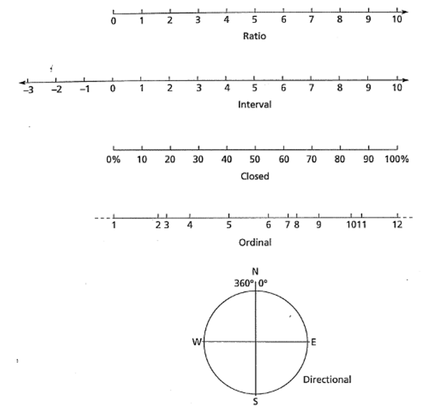
```

## Métodos de análisis

Existen diferentes métodos de análisis de datos. Éstos van a depender del tipo de dato y la cantidad de variables que se tengan. Dentro de las principales metodologías se tienen y una representación gráfica de las variable de interés se presenta en la Figura \@ref(fig:metodos-analisis):

* *Univariable*: Se analiza cada variable por separado, el interés está en enfocarse en una variable por si sola a la vez y sin considerar la relación que pueda tener con otras.
* *Bivariable*: Se analizan dos variables en conjunto, enfocándose en su relación y/o dependencia. Es la versión simple de un análisis multivariable.
* *Multivariable*: Cuando el análisis involucra 2 o más variable de interés a la vez y se requiere determinar la relación e interacción entre dichas variables.
* *Secuencias*: Cuando los datos se presentan como secuencias (por lo general implicando algún patrón o ciclicidad) en el tiempo/espacio, donde la forma más simple es un análisis bivariable donde una de las variables es el tiempo/espacio.
* *Espacial*: Cuando la ubicación de las muestras es de interés y se requiere entender o determinar cómo se dispone una variable en un área determinada. Por lo general tres (o cuatro) variables analizadas a la vez, donde dos (o tres) corresponden con la ubicación espacial y la otra corresponde con alguna medida de interés geológico, existen opciones univariables y multivariables.

(ref:metodos-analisis) Representación gráfica de las variables correspondientes a diferentes metodologías de análisis de datos [@swan1995].

```{r metodos-analisis, echo=FALSE, fig.cap='(ref:metodos-analisis)'}
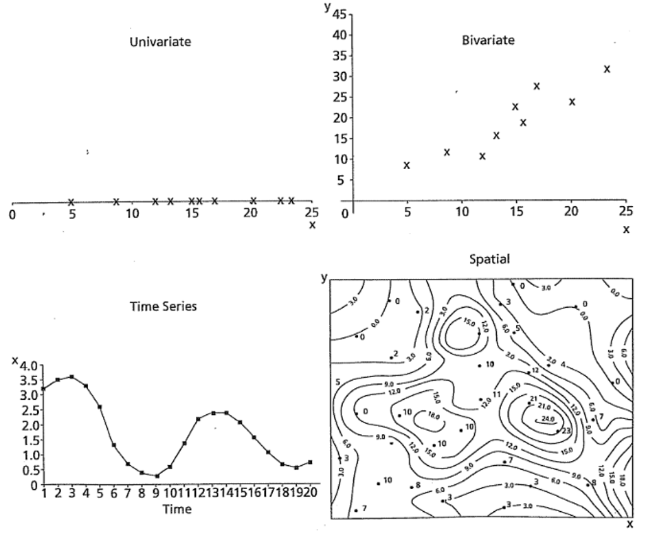
```

## Muestreo

El muestreo es un procedimiento para obtener datos/observaciones de una población, con la finalidad de usar esta información para realizar inferencias acerca de dicha población [@davis2002]. Las muestras son subconjuntos de los datos. El conjunto de todas las muestras que se pueden obtener de la población se denomina espacio muestral. La(s) muestra(s) debe(n) ser representativa(s), donde esto va a depender de la adecuada implementación de alguna de las técnicas de muestreo presentadas más adelante.

En la Figura \@ref(fig:muestra-geologia) se presenta y retoma la el concepto de muestra geológica, donde la población de interés es un afloramiento especifico, pero dicho afloramiento es demasiado grande para muestrear por completo, por lo que se deben tomar varias observaciones (muestras geológicas) para obtener una muestra que representa a la población meta.

(ref:muestra-geologia) Representación de una población de interés geológico donde es necesaria la toma de observaciones (muestras geológicas) para obtener una muestra representativa de dicha población [@trauth2015].

```{r muestra-geologia, echo=FALSE, fig.cap='(ref:muestra-geologia)'}
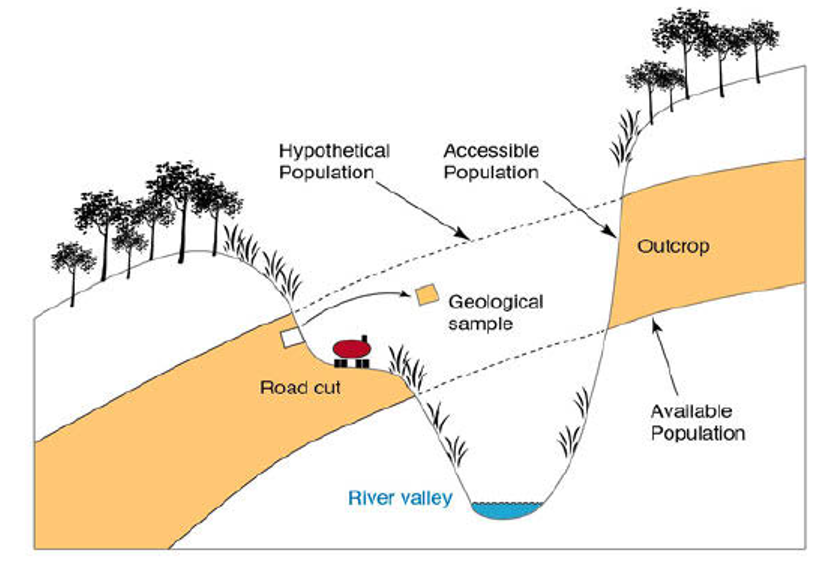
```

### Tipos

#### Aleatorio Simple

Una muestra se selecciona de modo que todos los elementos de la población tengan la misma probabilidad de ser elegidos. En general es poco recomendado cuando la población es muy grande o heterogénea (Figura \@ref(fig:muestreo-aleatorio)).

```{r muestreo-aleatorio, echo=FALSE, fig.cap='Representación de un muestreo aleatorio simple. Tomado de: http://www.universoformulas.com/imagenes/estadistica/inferencia/muestreo-probabilistico.jpg'}
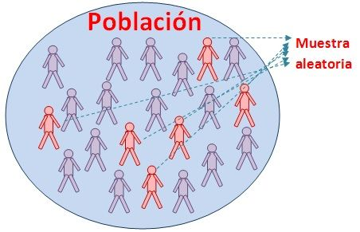
```

#### Sistemático

Se elige un punto de partida y luego seleccionamos cada k-ésimo (por ejemplo cada quincuagésimo) elemento en la población. Conlleva algunos riesgos cuando el marco muestral es repetitivo o de naturaleza cíclica (Figura \@ref(fig:muestreo-sistematico)).

```{r muestreo-sistematico, echo=FALSE, fig.cap='Representación de un muestreo sistematico. Tomado de: http://www.universoformulas.com/imagenes/estadistica/inferencia/muestreo-sistematico.jpg'}
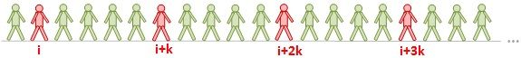
```

#### Estratificado

Consiste en definir previamente los estratos (grupos) que posee una población a partir de características comunes entre sus elementos y distintas con los elementos de los otros estratos. A partir de eso se deben tomar muestras aleatorias en cada estrato (Figura \@ref(fig:muestreo-estratificado)).

```{r muestreo-estratificado, echo=FALSE, fig.cap='Representación de un muestreo estratificado. Tomado de: http://www.universoformulas.com/imagenes/estadistica/inferencia/muestreo-estratificado.jpg'}
knitr::include_graphics('images/muestreo-estratificado.jpg')
```

#### Bloques (conglomerados)

Cuando la población está agrupada en conglomerados naturales, después se seleccionan aleatoriamente algunos de estos conglomerados, y luego se elige a todos los miembros de los conglomerados seleccionados o se muestrean los conglomerados con alguna otra técnica. Se usa cuando los conglomerados son muy heterogéneos y no existen muchas diferencias entre conglomerados (Figura \@ref(fig:muestreo-conglomerados)).

```{r muestreo-conglomerados, echo=FALSE, fig.cap='Representación de un muestreo en bloques o por conglomerados. Tomado de: http://www.universoformulas.com/imagenes/estadistica/inferencia/muestreo-estratificado.jpg'}
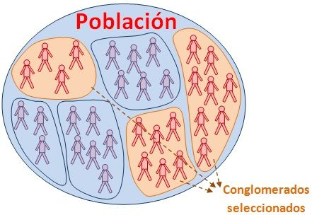
```

En geología muchas veces nos vemos forzados por disposición de afloramientos (clustered) o accesibilidad (traverse – cortes de carretera, ríos, etc), especialmente en climas tropicales, ver Figura \@ref(fig:muestreo-geologia), siendo estas las localidades donde se encuentra disponible la población a estudiar. Idealmente un muestreo exhaustivo y de alta resolución seria el que se define en grilla (regular).

(ref:muestreo-geologia) Típicas disposiciones de afloramientos en ciencias geológicas, especialmente en climas tropicales [@swan1995].

```{r muestreo-geologia, echo=FALSE, fig.cap='(ref:muestreo-geologia)'}
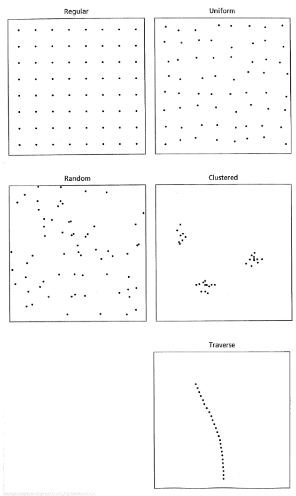
```

## Incertidumbre

Además de los retos de recolectar muestras representativas, las mediciones geológicas tienen incertidumbre. No es posible realizar una medición exacta (que siempre es la misma) y equipos de alta precisión aún van a tener incertidumbre, reducida pero existe. El objetivo durante la recolección de muestras es reducir la incertidumbre a la hora de tomar mediciones, haciéndolas más precisas y exactas.

Con lo anterior se puede diferenciar entre error reproducible y sistemático. El error reproducible es donde se tienen diferencias entre mediciones repetidas y se asocia con **precisión**, donde se puede detectar por medio de la dispersión de los datos, a menor dispersión mayor precisión. El error sistemático es más difícil de detectar, no se puede estimar únicamente a partir de mediciones repetidas, a menos que se tenga un valor de referencia (valor verdadero); se asocia con **exactitud**, donde mientras más cerca del valor de referencia mayor la exactitud. Estos conceptos se pueden visualizar en la Figura \@ref(fig:precision-exactitud).

```{r precision-exactitud, echo=FALSE, fig.cap='Diferencia entre precisión y exactitud. Tomado de: https://www.diferenciador.com/diferencia-entre-exactitud-y-precision/'}
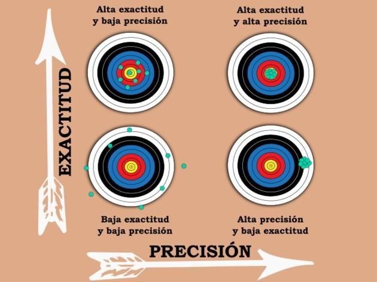
```

