# Estadística Descriptiva Univariable

```{r univar-setup, include=FALSE}
library(DescTools)
library(summarytools)
library(patchwork)
library(janitor)
library(tidyverse)

knitr::opts_chunk$set(
  echo = TRUE,
  message = FALSE,
  warning = FALSE,
  error = FALSE,
  # fig.path = "figs/",
  fig.retina = 3,
  fig.width = 8,
  fig.asp = 0.618,
  fig.align = "center",
  out.width = "70%"
)

theme_set(theme_bw())

```

Como se mencionó en la introducción, la estadística univariable se enfoca en describir una variable a la vez, sin considerar la relación con cualquier otra variable. La descripción y métodos a usar va a estar en función del tipo de variable: cualitativa o cuantitativa. Las tres formas en que se pueden describir los datos son: *tabularmente* (datos cualitativos o cuantitativos discretos), *gráficamente*, y por medio de *resúmenes numéricos*.

## Tablas de frecuencias

La idea es presentar un resumen de los datos, por lo general por medio de conteos de observaciones por clases. Con datos cualitativos simplemente se cuenta la cantidad de observaciones en cada clase, para datos cuantitativos discretos se cuenta la cantidad de observaciones para cada valor único observado, y para datos cuantitativos continuos lo común es dividir el rango de los valores en una cierta cantidad de clases y contar las observaciones que caen en cada clase.

Las tablas pueden contener diferentes tipos de frecuencias:

* Absoluta: Conteo de elementos por clase ($n$)
* Relativa: Porcentaje de elementos por clase
* Absoluta acumulada: Conteo de elementos que toman un valor menor o igual a una clase, suma a la cantidad de observaciones ($N$)
* Relativa acumulada: Porcentaje de elementos que toman un valor menor o igual a una clase, suma a 1 o $100\%$

Para datos cualitativos hay diferentes formas de generar tablas de frecuencias, y dependiendo de lo que se quiera mostrar. Lo más fácil es usar `tabyl` del paquete *janitor* y formatearla (Tabla \@ref(tab:tab-cual)). Se va a ejemplificar con los datos `gss_cat` y la variable `marital` que vienen con el paquete *forcats*. Por defecto cuando se usa solo una variable realiza el conteo y calcula el porcentaje de cada categoría. En el ejemplo se redondea a 3 dígitos y se ordena de forma descendente de acuerdo al conteo.

```{r tab-cual-code, eval=FALSE}
gss_cat %>% 
  tabyl(marital) %>% 
  adorn_rounding(3) %>% 
  arrange(-n)
```

```{r tab-cual, echo=FALSE}
gss_cat %>% 
  tabyl(marital) %>% 
  adorn_rounding(3) %>% 
  arrange(-n) %>% 
  knitr::kable(caption = 'Tabla de frecuencias para una variable cualitativa')
```

En el caso de datos cuantitativos continuos, donde hay que dividir el rango de valores en cierta cantidad de clases, no hay una manera única o definida de escoger el número de clases, pero hay algunas sugerencias. Una de las sugerencias se muestra en la Ecuación \@ref(eq:clases-eq).

\begin{equation}
  k = 1 + 3.33 log_{10}(N)
  (\#eq:clases-eq)
\end{equation}

donde $k$ es el número de clases y $N$ es el total de observaciones (datos). Otra sugerencia se muestra en la Tabla \@ref(tab:clases-tab)

```{r clases-tab, echo=FALSE}
knitr::kable(data.frame(N = c('< 50','50 - 100', '100 - 250', '> 250'), 
                        k = c('5 - 7', '6 - 10', '7 - 12', '10 - 20')),
             caption = 'Sugerencia para el número de clases de acuerdo a la cantidad de observaciones', align = 'c')
```

Un ejemplo de una tabla de frecuencia se muestra a continuación en la Tabla \@ref(tab:freq), usando los datos: 3.1 4.5 2.9 2.7 3.8 5.1 4.9 3.5 2.1 4.2 2.2 1.8 2.5 3.6 3.6 4.3 5.1 6.1 5.7 2.8 2.8 3.7 3.5 4.4 2.5 5.6 5.1 4.7 4.9 4.2 3.6 4.1 4.1 3.7 2.9 6.2 4.8 3.9 4.6 3.1.

```{r freq, echo=FALSE}
x = c(3.1, 4.5, 2.9, 2.7, 3.8, 5.1, 4.9, 3.5, 2.1, 4.2, 2.2, 1.8, 2.5, 3.6, 3.6, 4.3, 5.1, 6.1, 5.7, 2.8, 2.8, 3.7, 3.5, 4.4, 2.5, 5.6, 5.1, 4.7, 4.9, 4.2, 3.6, 4.1, 4.1, 3.7, 2.9, 6.2, 4.8, 3.9, 4.6, 3.1)
knitr::kable(Freq(x, breaks = 1:7, 
                  labels = c('1-2','2-3','3-4','4-5','5-6','6-7')), 
             caption = 'Tabla de frecuencias para una variable continua',
             col.names = c('Clase','Frecuencia absoluta', 'Frecuencias relativa',
                           'Frec. Abs. Acumulada', 'Frec. Rel. Acumulada'))
```

El código para generar la tabla fue el siguiente, donde `x` corresponde con el vector de datos, `breaks` con las divisiones para las clases, y `labels` con los nombres de la clases:

```{r freq-cod, eval=FALSE}
Freq(x, breaks = 1:7, 
     labels = c('1-2','2-3','3-4','4-5','5-6','6-7'))
```

## Gráficas

Dependiendo del tipo de variable así será la representación gráfica. Para datos cualitativos y cuantitativos discretos lo típico es usar gráficos de barras, mientras que para datos cuantitativos continuos se usa el histograma o gráfico de caja. 

El gráfico de barras correspondiente a los datos de la Tabla \@ref(tab:tab-cual) se muestra en la Figura \@ref(fig:barras). Para refrescar cómo se pueden construir estos gráficos ir a [Gráficos]. La finalidad de esto gráficos es brindar una idea del balance entre las categorías o niveles de una clase y ver si hay alguna categoría o nivel que sobre salga tanto por valores altos como por valores bajos.

```{r barras, echo=FALSE, fig.cap='Gráfico de barras para una variable cualitativa'}
gss_cat %>% 
    ggplot(aes(fct_infreq(marital),fill=marital)) + 
    geom_bar() + 
    scale_fill_viridis_d(option = 'C') +
    labs(x='marital')
```

El histograma (Figura \@ref(fig:hist)) permite dar una primera mirada al tipo de distribución de los datos:

* Si las alturas de las barras son similares se dice que tiene distribución tipo “uniforme”.
* Si las alturas son mayores en la zona central se dice que tiene forma tipo “campana” (distribución normal) y puede ser simétrica o asimétrica, con sesgo hacia el lado positivo o al lado negativo.
* Si hay barras muy alejadas del grupo, se dice que son datos atípicos.

```{r hist, echo=FALSE, fig.cap='Ejemplos de histogramas. Tomado de: http://pro.arcgis.com/en/pro-app/tool-reference/spatial-statistics/'}
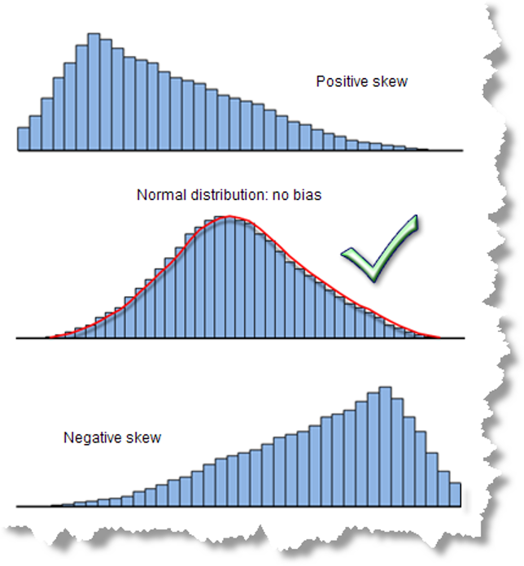
```

El gráfico de caja (Figura \@ref(fig:boxplot)) también puede brindar una idea de la distribución de los datos. Recordar que este tipo de gráfico se compone de los cuartiles $Q_1$ (límite inferior de la caja), $Q_2$ o mediana (barra dentro de la caja), y $Q_3$ (límite superior de la caja). Si los datos presentan una distribución normal tipo campana la mediana aparecería cerca del centro de la caja. Si los datos presentan una asimetría la mediana va a estar más cerca de uno de los bordes, y van a observarse puntos al extremo opuesto de la mediana, los cuales podrían representar valores extremos o atípicos.

```{r boxplot, echo=FALSE, fig.cap='Gráficos de caja, donde las cruces representan la media. **A** mostrando datos con distribución normal donde la mediana está cerca del medio de la caja. **B** mostrando datos asimétricos donde la mediana está más cerca de uno de los extremos y además se presentan posibles valores atípisoc (puntos).'}
set.seed(101)
normales = rnorm(100,50,10)
positiva = rchisq(100,1)
box1 = ggplot(tibble(normales),aes('',normales)) + 
  geom_boxplot() + 
  geom_point(aes('',mean(normales)), shape=3) +
  labs(x='',y='')
box2 = ggplot(tibble(positiva),aes('',positiva)) + 
  geom_boxplot() + 
  geom_point(aes('',mean(positiva)), shape=3) +
  labs(x='',y='')

(box1 | box2) + 
  plot_annotation(tag_levels = 'A')
```

Siguiendo con los datos del ejemplo de la Tabla \@ref(tab:freq), se pueden generar los histogramas (Figura \@ref(fig:histogramas)) correspondientes a las columnas. Para refrescar cómo se pueden construir estos gráficos ir a [Gráficos].

```{r histogramas, echo=FALSE, out.width='90%', fig.cap='Histogramas de los datos de ejemplo. **A** Frecuencia absoluta, **B** Frecuencia relativa, **C** Frecuencia absoluta acumulada, **D** Frecuencia relativa acumulada.'}
fa = ggplot(tibble(x), aes(x)) + 
  geom_histogram(breaks = 1:7, fill = 'coral1', col = 'black') + 
  labs(x = '', y = 'Frec. absoluta') + 
  scale_y_continuous(breaks = seq(0,14,2)) + 
  scale_x_continuous(breaks = 1:7)
fr = ggplot(tibble(x), aes(x)) + 
  geom_histogram(aes(y = after_stat(count/sum(count))), breaks = 1:7, 
                 fill = 'coral1', col = 'black') + 
  labs(x = '', y = 'Frec. relativa') + 
  scale_y_continuous(breaks = seq(0,1,.1)) + 
  scale_x_continuous(breaks = 1:7)
faa = ggplot(tibble(x), aes(x)) + 
  geom_histogram(aes(y = after_stat(cumsum(count))), breaks = 1:7, 
                 fill = 'coral1', col = 'black') + 
  labs(x = '', y = 'Frec. abs. acumulada') + 
  scale_y_continuous(breaks = seq(0,40,5)) + 
  scale_x_continuous(breaks = 1:7)
fra = ggplot(tibble(x), aes(x)) + 
  geom_histogram(aes(y = after_stat(cumsum(count/sum(count)))), breaks = 1:7, 
                 fill = 'coral1', col = 'black') + 
  labs(x = '', y = 'Frec. rel. acumulada') + 
  scale_y_continuous(breaks = seq(0,1,.1)) + 
  scale_x_continuous(breaks = 1:7)

(fa | fr) / (faa | fra) + plot_annotation(tag_levels = 'A')
```


## Resúmenes numéricos

Dependiendo del dato que se quiera presentar, éstos se pueden dividir en diferentes tipos. En esta sección se muestran y explican estos diferentes tipos, así como las funciones para calcularlas, enfocándose más en datos cuantitativos continuos.

### Medidas de tendencia central

Esta estadística es la más conocida, ya que representa el centro de la distribución de los datos, siendo la más conocida y usada la media aritmética o promedio ($\bar{x}$). Además de la media, otras medidas de tendencia central son la media ponderada, media geométrica ($\bar{x}_g$), mediana, y moda.

#### Media

La media aritmética o promedio se muestra en la Ecuación \@ref(eq:media) y tiene la característica de ser sensible a valores extremos (atípicos), por lo que no es muy recomendable para distribuciones asimétricas.

\begin{equation}
  \bar{x} = \frac{\sum_{i=1}^{N}{x_i}}{N}
  (\#eq:media)
\end{equation}

La media ponderada (Ecuación \@ref(eq:media-ponderada)) se usa cuando los elementos del vector tienen diferentes pesos ($f$). La media aritmética es de hecho una simplificación de la media ponderada donde todos los elementos tienen el mismo peso.

\begin{equation}
  \bar{x} = \frac{\sum_{i=1}^{k}{f_i m_i}}{\sum f}
  (\#eq:media-ponderada)
\end{equation}

#### Media geométrica

La media geométrica (Ecuación \@ref(eq:media-geom)) es típicamente usada para distribuciones con asimetría positiva (hacia la derecha), y es menos sensible a valores extremos (atípicos). Tiene la condición de que únicamente aplica para valores positivos, no pueden ser cero ni negativos.

\begin{equation}
  \bar{x}_g = \left(x_1 * x_2 * \cdots * x_N \right)^\frac{1}{N}
  (\#eq:media-geom)
\end{equation}

Los anteriores conceptos se muestran con un ejemplo donde se tiene las notas de exámenes (70, 50, 80, 95) y cada examen tiene diferente peso (20, 20, 20, 40). La media sería $\bar{x} = \frac{70+50+80+95}{4} = 73.75$, la media ponderada sería $\bar{x} = \frac{70*20+50*20+80*20+95*40}{4} = 78$, y la media geométrica sería $\bar{x}_g = \left(70 * 50 * 80 * 95 \right)^\frac{1}{4} = 71.81$.

En **R** se realizaría de la siguiente manera:

```{r}
notas = c(70, 50, 80, 95)
pesos = c(20, 20, 20, 40)

mean(notas)

weighted.mean(notas, pesos)

Gmean(notas)
```

#### Mediana

La mediana (Ecuación \@ref(eq:mediana)) es el valor de los datos que los divide en dos partes iguales. No se ve afectada por valores extremos, lo que la hace una medida robusta para distribuciones asimétricas.

\begin{equation}
  \text{si N es impar} \rightarrow Me = X_\frac{N+1}{2}\\
  \text{si N es par} \rightarrow Me = 0.5 \left(X_\frac{N}{2} + X_\frac{N+1}{2} \right)\\
  (\#eq:mediana)
\end{equation}

Ejemplos de la mediana y cómo no se ve afectada por valores extremos serían:

* $1, 2, 4, 5, 6, 6, 8 \rightarrow Me = 5$
* $1, 2, 4, 5, 6, 6, 6, 8 \rightarrow Me = (5+6)/2 = 5.5$
* $1, 2, 4, 5, 6, 6, 80 \rightarrow Me = 5$

#### Moda

La moda es el valor más frecuente o que se repite más, es más utilizada para datos discretos, aunque para datos continuos se puede calcular la curva de densidad de los datos y encontrar el pico de dicha curva. También existe la posibilidad de que los datos presenten más de una moda (Figura \@ref(fig:moda)).

(ref:moda) Distribuciones de datos con más de una moda [@trauth2015].

```{r moda, echo=FALSE, fig.cap='(ref:moda)'}
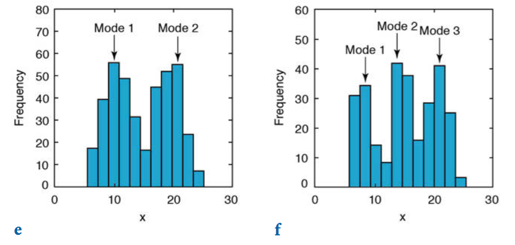
```

En variables con distribución simétrica los valores de media, mediana y moda coinciden. En las distribuciones asimétricas se van distanciando conforme incrementa la asimetría (Figura \@ref(fig:tend-cent)).

(ref:tend-cent) Diferencias entre medidas de tendencia central conforme la distribución presenta mayor asimetría [@trauth2015].

```{r tend-cent, echo=FALSE, fig.cap='(ref:tend-cent)'}
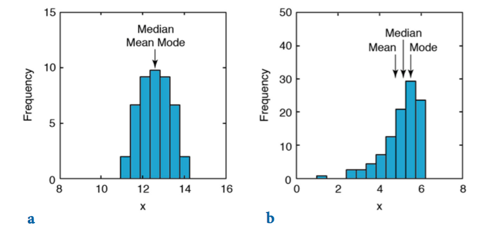
```

### Medidas de dispersión

Estas medidas brindan una idea de la dispersión o variabilidad que presentan los datos con respecto a una medida de tendencia central, típicamente la media. Siempre son positivas e idealmente para reducir la incertidumbre se busca que estas medidas sean lo más pequeñas posibles.

#### Rango ($R$)

El rango toma en cuenta el valor mínimos y máximo de la variable, sin tomar en cuenta el resto de valores intermedios. Se puede expresar de dos maneras: como un vector indicando los valores máximo y mínimo, o como la diferencia entre estos valores (Ecuación \@ref(eq:rango)). Una desventaja de presentarlo como al diferencia es que se pierde el contexto de la escala de los datos, ya que una misma diferencia puede estar presente a diferentes escalas. Ejemplo: Los datos pueden tener un rango de 5, pero los datos pueden estar entre 100 y 95 o 25 y 20. Para ambos casos aunque el rango es el mismo no confiere la misma información; en el primer caso la dispersión se puede considerar menor ya que representa un 5% con respecto al valor máximo, mientras que en el segundo caso representa un 20%.

\begin{equation}
  (a) R = (x_{min},x_{max})\\
  (b) R = x_{max}-x_{min}\\
  (\#eq:rango)
\end{equation}

Una ventaja de esta medida es la facilidad de calcularla e interpretarla, mientras que la desventaja es que considera únicamente los datos extremos y no la totalidad de los mismos, por lo que pudiera verse afectada por valores atípicos.

Usando los datos 2, 6, 11, 8, 11, 4, 7, 5 como ejemplo se puede determinar que $R=(2,11)=9$. En **R** la función `range` calcula el rango dando los valores mínimo y máximo, si se quiere la diferencia se puede usar `diff`, donde toma el segundo elemento y le resta el primero.

```{r}
vec = c(2, 6, 11, 8, 11, 4, 7, 5)
range(vec)
diff(range(vec))
```


#### Varianza ($s^2$)

La varianza toma en cuenta todos los datos y su diferencia al cuadrado con respecto a la media, esto se puede visualizar en la Figura \@ref(fig:varianza), donde la línea vertical roja representa la media, los puntos azules los datos, y las lineas horizontales azules las diferencias cuadradas entre la media y los datos. Una desventaja es que al elevar las diferencias al cuadrado la medida **NO** se encuentra en las mismas unidades (escala) de la variable original.

```{r varianza, echo=FALSE, fig.cap='Representación de la varianza'}
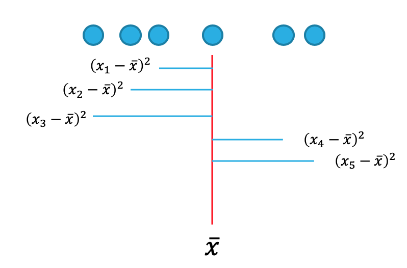
```

La varianza se calcula mediante la Ecuación \@ref(eq:varianza):

\begin{equation}
  s^2 = \frac{\sum_{i=1}^{N}{\left(x_i - \bar{x}\right)^2}}{N-1}\\
  \sigma^2 = \frac{\sum_{i=1}^{N}{\left(x_i - \mu\right)}}{N}
  (\#eq:varianza)
\end{equation}

En la ecuación anterior $s^2$ es la varianza muestral, $\sigma^2$ la varianza poblacional, $\bar{x}$ la media muestral, y $\mu$ la media poblacional. En el caso de la varianza muestral se usa en el denominador $N-1$, lo que se conoce como grados de libertad ($df \ o \ \nu$). Porqué $N-1$, porque para poder calcular la varianza se necesita saber la media, y si se conoce la media no importa la cantidad de datos que tenga el último dato va a estar condicionado para satisfacer el valor de la media, o sea todos los datos menos uno pueden variar libremente.

Un ejemplo de puede mostrar con los datos 8, 10, 5, 12, 10, 15. En este caso $N=6,\ \bar{x}=60/6=10,\ \sum_{i=1}^{N}{\left(x_i - \bar{x}\right)^2}=58,\ s^2=\frac{58}{6-1}=11.6 \ unidades^2$. En **R** se usa la función `var` para obtener la varianza de un vector.

```{r}
vec = c(8, 10,  5, 12, 10, 15)
var(vec)
```

#### Desviación estándar ($s$)

Esta medida es la más utilizada, ya que se encuentra en las mismas unidades (escala) de los datos originales, dado que es simplemente la raíz cuadrada de la varianza (Ecuación \@ref(eq:sd)), lo que la hace más fácil de interpretar y comprender.

\begin{equation}
  s = \sqrt{s^2} = \sqrt{\frac{\sum_{i=1}^{N}{\left(x_i - \bar{x}\right)^2}}{N-1}}\\
  \sigma = \sqrt{\sigma^2} = \sqrt{\frac{\sum_{i=1}^{N}{\left(x_i - \mu\right)}}{N}}
  (\#eq:sd)
\end{equation}

Siguiendo con los datos del ejemplo de la varianza se tiene que $s = \sqrt{s^2} = \sqrt{11.6} = 3.4 \ unidades$. En **R** se tiene la función `sd` para calcular esta medida directamente.

```{r}
sd(vec)
```

Visualmente (Figura \@ref(fig:sd)) se puede mostrar como al incrementar la desviación estándar la curva de densidad de los datos se aplana más.

```{r sd, echo=FALSE, fig.cap='Curvas de densidad con diferentes desviaciones estándar, donde a mayor desviación estándar más aplanada la curva y a menor desviación estándar más empinada la curva'}
ggplot(NULL, aes(x=-3:3)) + 
  stat_function(fun = dnorm, args = list(mean=0,sd=0.5), aes(col='0.5')) + 
  stat_function(fun = dnorm, args = list(mean=0,sd=2), aes(col='2')) +
  stat_function(fun = dnorm, args = list(mean=0,sd=4), aes(col='4')) + 
  labs(x='',y='',col='s') + 
  scale_color_brewer(palette = 'Dark2')
```

Como se va a ver más adelante hay una relación entre la desviación estándar y la media que se ve reflejada en la distribución normal (Figura \@ref(fig:sd-norm)). Típicamente se asocia que el 68% de los datos se encuentran a $1\ s$ de la media, el 95% de los datos se encuentran a $2\ s$ de la media, y el 99% de los datos se encuentran a $3\ s$ de la media.

```{r sd-norm, echo=FALSE, fig.cap='Relación entre desviación estándar y media en la distribución normal. Tomado de: http://algebra2.thinkport.org/module3/images/xyz-page2-graph.jpg'}
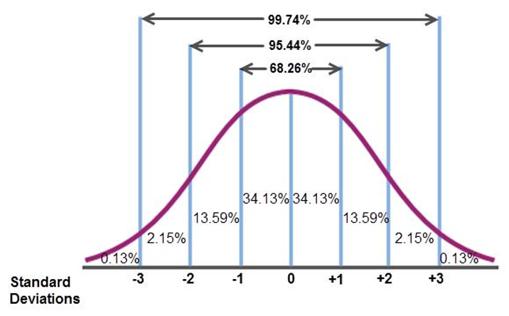
```

#### Rango intercuartil ($IQR$)

Mide la dispersión central de los datos, ya que se toma únicamente el 50% central de los datos, al ser la diferencia entre el tercer cuartil ($Q_3$) y primer cuartil ($Q_1$), ver Ecuación \@ref(eq:iqr). Se considera más robusta que la desviación estándar al no tomar en cuenta valores extremos. De hecho, valores extremos o atípicos suelen identificarse cuando se desvían más de 3 veces el $IQR$ con respecto a la mediana.

\begin{equation}
  IQR = Q_3 - Q_1
  (\#eq:iqr)
\end{equation}

En **R** se tiene el comando `IQR` para calcular esta medida, como se muestra a continuación.

```{r}
set.seed(10)
vec = rchisq(60,3)
IQR(vec)
```

#### Mediana de la desviación absoluta ($mad$)

Se calcula usando la Ecuación \@ref(eq:mad) y en general se considera más robusta que la desviación estándar y el rango intercuartil cuando se presentan datos extremos o atípicos y cuando la distribución es asimétrica. Se le aplica un factor de conversión de 1.4826 para cumplir con supuestos de normalidad.

\begin{equation}
  mad = Me\left(\left|x_i - Me(x)\right|\right) * 1.4826
  (\#eq:mad)
\end{equation}

Usando los datos generados para $IQR$ se puede calcular esta medida usando `mad`.

```{r}
mad(vec)
```

#### Coeficiente de variación ($cv$)

Esta es una medida estandarizada (Ecuación \@ref(eq:cv)), lo que nos va a permitir comparar la dispersión entre dos poblaciones distintas e incluso, comparar la variación producto de dos variables diferentes (que pueden provenir de una misma población). Si comparamos la dispersión en varios conjuntos de observaciones tendrá menor dispersión aquella que tenga menor coeficiente de variación.

\begin{equation}
  cv = \frac{s}{\bar{x}}*100
  (\#eq:cv)
\end{equation}

Un ejemplo se muestra a continuación. Para un grupo de datos $\bar{x}=20, s = 4$, entonces $cv = 4/20 = 0.2 = 20\%$. Para un segundo grupo $\bar{x} = 48, s = 6$, entonces $cv = 6/48 = 0.125 = 12.5\%$. Se concluye que el primer grupo tiene mayor variabilidad relativa con respecto a su media, lo que no se podría concluir de solo fijarse en la desviación estándar.

En **R** el paquete *DescTools* [@R-DescTools] tiene la función `CoefVar`, y si la aplicamos a los datos generados para $IQR$ tenemos:

```{r}
CoefVar(vec)
```

### Medidas de posición

Estas medidas corresponden con números que distribuyen los datos ordenados de la muestra en grupos de aproximadamente del mismo tamaño, con el propósito de resaltar su ubicación relativa. Estos números se denominan **cuantiles** en forma genérica.

#### Cuartiles

Los cuartiles son los tres valores de la variable que dividen a un conjunto de datos ordenados en cuatro partes iguales (Figura \@ref(fig:cuartiles)).

* Primer Cuartil ($Q1$): A la izquierda de $Q1$ están incluidos 25% de los datos (aproximadamente), y a la derecha de $Q1$ están el 75% de los datos (aproximadamente).
* Segundo Cuartil ($Q2$): Igual que la mediana divide al grupo de datos en dos partes, cada una con el 50% de los datos (aproximadamente).
* Tercer Cuartil ($Q3$): A la izquierda de $Q3$ están incluidos 75% de los datos (aproximadamente), y a la derecha de $Q3$ están el 25% de los datos (aproximadamente).

```{r cuartiles, echo=FALSE, fig.cap='Representación de los cuartiles. Tomado de: http://dieumsnh.qfb.umich.mx/estadistica/medidasd%20de%20posicion.htm'}
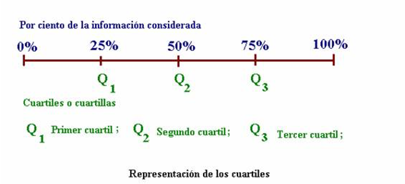
```

#### Deciles

Los deciles son los nueve valores de la variable que dividen a un conjunto de datos ordenados en diez partes iguales (Figura \@ref(fig:deciles)).

* Primer Decil (D1): A la izquierda de D1 están incluidos 10% de los datos (aproximadamente), y a la derecha de D1 están el 90% de los datos (aproximadamente).
* Segundo Decil (D2): A la izquierda de D1 están incluidos 20% de los datos (aproximadamente), y a la derecha de D1 están el 80% de los datos (aproximadamente)
* D5 coincide con la mediana.

```{r deciles, echo=FALSE, fig.cap='Representación de los deciles. Tomado de: http://dieumsnh.qfb.umich.mx/estadistica/medidasd%20de%20posicion.htm'}
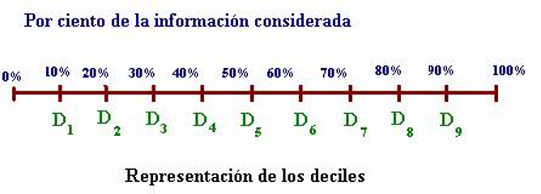
```

En **R** los cuantiles se pueden obtener con la función `quantile` y definiendo el argumento `probs`, donde corresponde con un vector de valores entre 0 y 1, para los cuantiles deseados.

```{r}
quantile(vec, probs = c(.25,.5,.75)) # para cuartiles
quantile(vec, probs = seq(.1,.9,.1)) # para deciles
```

### Medidas de forma

Estas medidas se usan para describir numéricamente la forma aproximada de la distribución de los datos.

#### Asimetría (skewness)

Se dice que una distribución es asimétrica cuando la media, mediana y moda no coinciden y la distribución muestra una forma diferente a la “campana”, con una cola más alargada que la otra.

Se pueden identificar dos tipos de asimetría: positiva (hacia la derecha) o negativa (hacia la izquierda), ver Figuras \@ref(fig:asim1) y \@ref(fig:asim2).

```{r asim1, echo=FALSE, fig.cap='Asimetría con el nombre de la dirección: hacia la izquierda o derecha. Tomado de: http://2.bp.blogspot.com/_bXZg80tWNts/S4SBFgzljbI/AAAAAAAAAd0/72BnnqmoA7g/s320/asimetria.gif'}
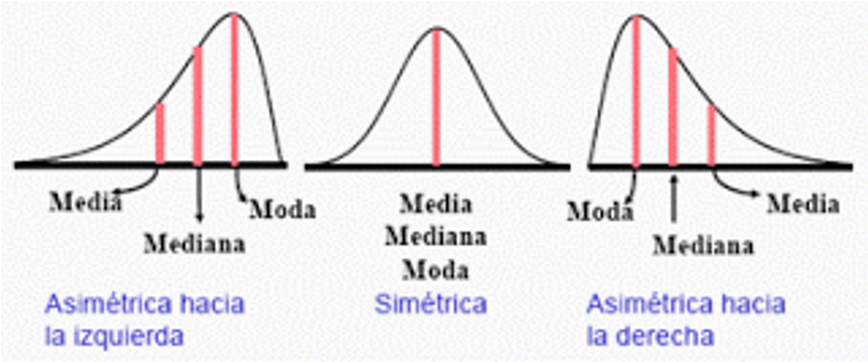
```

```{r asim2, echo=FALSE, fig.cap='Asimetría con el nombre del signo: positiva o negativa. Tomado de: http://pro.arcgis.com/en/pro-app/tool-reference/spatial-statistics/'}
knitr::include_graphics('images/asimetria2.png')
```

Si la asimetría es positiva se denomina a la derecha (media a la derecha de la mediana y moda) y si es negativa se denomina a la izquierda (media a la izquierda de la mediana y moda). Se pueden considerar como asimetrías importantes y que pueden afectar los datos aquellas que anden cerca de 1 y definittivamente las superiores a 1.

Se puede eliminar o reducir significativamente la asimetría usando transformaciones sobre los datos (Figura \@ref(fig:asim3)). La transformación logarítmica se puede usar cuando la distribución es asimétrica a la derecha (positiva), y la transformación exponencial se puede usar cuando la distribución es asimétrica a la izquierda (negativa).

```{r asim3, echo=FALSE, fig.cap='Transformaciones que se pueden aplicar sobre los datos para reducir la asimetría. Tomado de: http://pro.arcgis.com/en/pro-app/tool-reference/spatial-statistics/'}
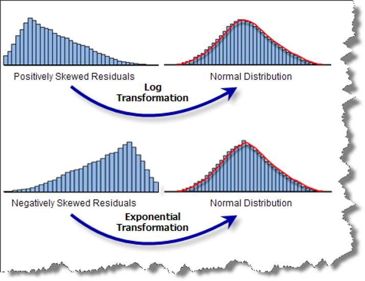
```

#### Curtosis (kurtosis)

Caracteriza el apuntalamiento (puntiagudez) de la distribución, si la distribución tiene un pico distintivo o es relativamente plana, y la concentración de valores alrededor de la media. Los nombres que puede tomar se presentan en la Figura \@ref(fig:curt1) y ejemplos de datos con diferentes curtosis se presentan en la Figura \@ref(fig:curt2).

(ref:curt1) Nombres de la curtosis que se le asigna a la distribución de los datos según el valor estimado de la curtosis. Leptocúrtica cuando $k>0$, mesocúrtica cuando $k \approx 0$, y platicúrtica cuando $k<0$. Tomado de: http://www.spssfree.com/curso-de-spss/curso/5-19.gif.

```{r curt1, echo=FALSE, fig.cap='(ref:curt1)'}
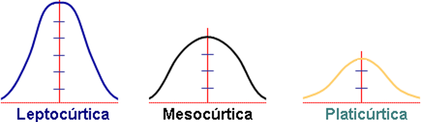
```

(ref:curt2) Ejemplo de alta curtosis (izquierda) y baja curtosis (derecha) [@trauth2015].

```{r curt2, echo=FALSE, fig.cap='(ref:curt2)'}
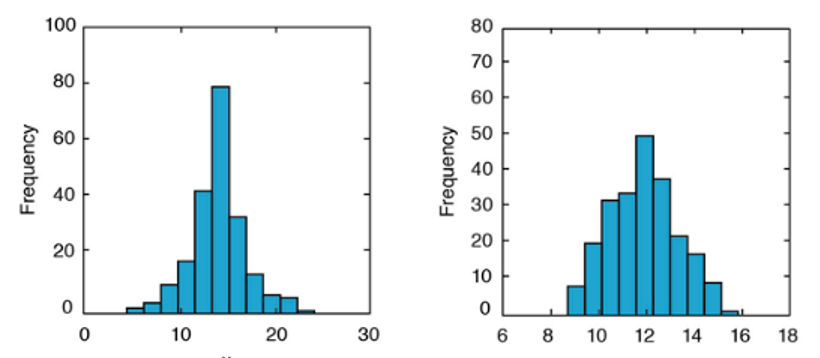
```

En **R** násico no hay una función para calcular la asimetría ni la curtosis, pero el paquete *DescTools* tiene la función `Skew` para asimetría y `Kurt` para curtosis. Usando los datos anteriores tenemos:

```{r}
Skew(vec)
Kurt(vec)
```

Con los resultados anteriores se tiene una asimetría positiva (hacia la derecha) bastante importante, y una curtosis positiva indicando que los datos presentan un apuntalamiento importante en vez de que sean más dispersos.

## Resumen general

En **R** hay varias funciones que presentan resúmenes generales presentando varias medidas (revisar [Descripciones generales (globales)]), aquí se presenta la función `descr` del paquete *summarytools* [@R-summarytools], que se usa para datos cuantitativos, si se tuvieran datos cualitativos se puede utilizar `freq` o la tabla de frecuencias como se presentó anteriormente ([Tablas de frecuencias]).

```{r}
descr(vec)
```

Usando esta función (`descr`) podemos comparar las diferentes medidas entre un vector de datos sin valores extremos y otro con 1 valor extremo, para ver cómo afecta o no este dato las diferentes medidas.

```{r}
original = c(22,10,10,16,15,15,24,19,15,19,18,16,18,12,17,17,11,18)
outlier = c(22,10,10,16,15,15,24,19,15,19,18,16,18,12,17,17,11,180)
DF = tibble(original, outlier)
descr(DF)
```

Viendo el resumen con las diferentes medidas y comparándolas, se puede observar como las medidas de media, desviación estándar, coeficiente de variación, asimetría y curtosis se ven muy afectadas por un único valor extremo, mientras que los cuantiles (incluyendo la mediana) y el *mad* no se ven afectadas del todo o muy poco.

```{r include=FALSE}
# automatically create a bib database for R packages
knitr::write_bib(c(
  .packages(), 'bookdown', 'knitr', 'rmarkdown'
), 'packages.bib')
```
