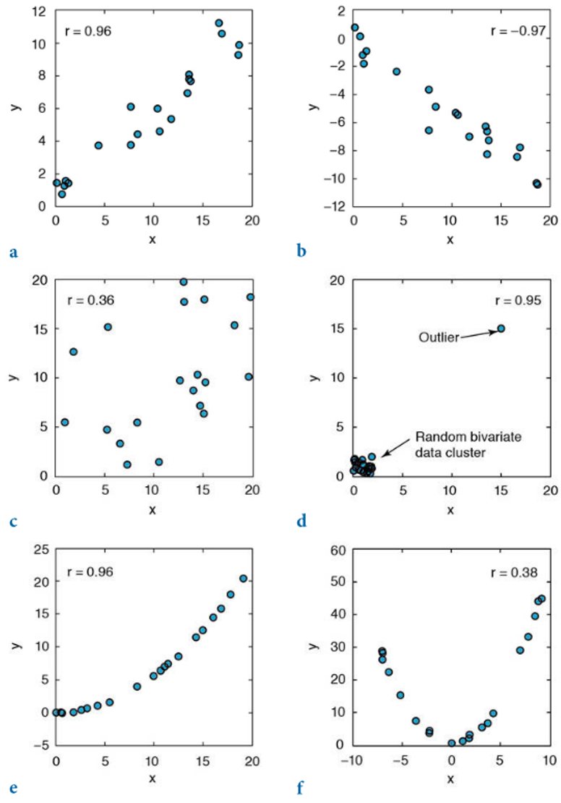
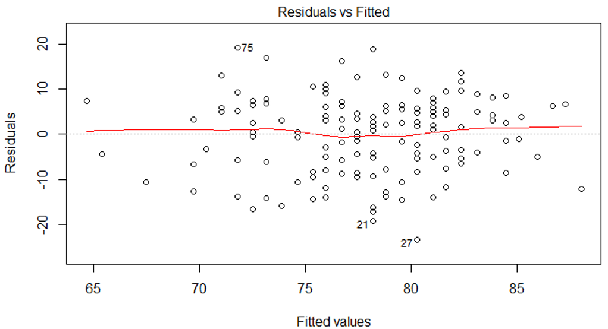
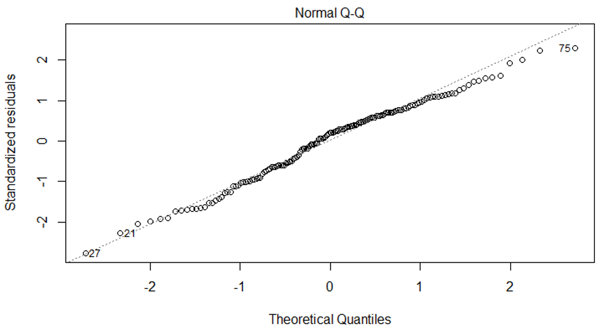
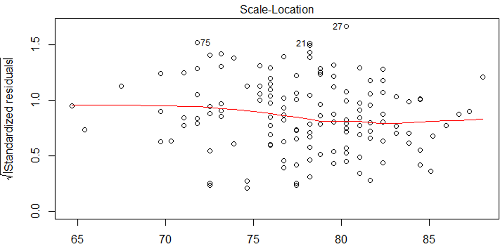
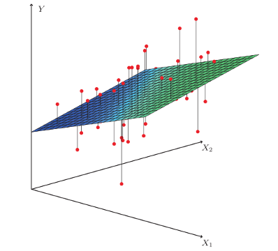
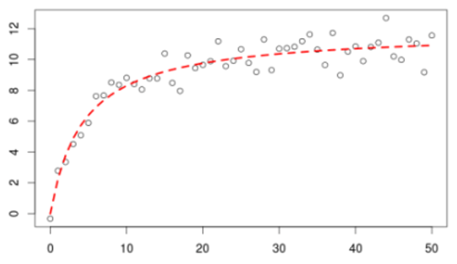
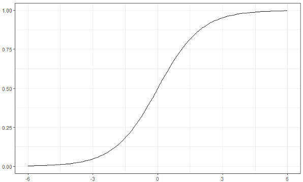

# Estadística Descriptiva Bivariable

```{r bivar-setup, include=FALSE}
library(DescTools)
library(summarytools)
library(patchwork)
library(janitor)
library(tidymodels)
library(tidyverse)

knitr::opts_chunk$set(
  echo = TRUE,
  message = FALSE,
  warning = FALSE,
  error = FALSE,
  # fig.path = "figs/",
  fig.retina = 3,
  fig.width = 8,
  fig.asp = 0.618,
  fig.align = "center",
  out.width = "70%"
)

theme_set(theme_bw())

```

## Introducción

En el capítulo anterior ([Estadística Descriptiva Univariable]) se enfocó en analizar una variable por separado, sin considerar otra(s) variable(s) que pudiera(n) estar relacionada(s). A veces ese puede ser el enfoque de un análisis o estudio, pero en la mayoría de los casos, muy probablemente, se cuenta con más de una variable y esa(s) variable(s) puede(n) ser importante(s), ya sea para efectos de simple correlación o para efectos de predicción. Esta relación entre dos variables es el enfoque de este capítulo.

De manera general se pueden mencionar tres formas de analizar una variable con respecto a otra: Covarianza (lineal), Correlación (lineal), y Regresión (lineal, no lineal).

## Covarianza

El objetivo de la covarianza (Ecuación \@ref(eq:cov)) es determinar si hay o no asociación entre 2 variables continuas, y si la hay cómo se comporta una con respecto a la otra, siempre que la relación entre las variables sea lineal. Es el homologo a la varianza pero para dos variables. Ésta puede ser positiva cuando una aumenta conforme la otra aumenta, o negativa cuando una aumenta conforme la otra disminuye.

\begin{equation}
  s_{xy} = \frac{\sum_{i=1}^{N}(x_i - \bar{x})(y_i - \bar{y})}{N-1}
  (\#eq:cov)
\end{equation}

donde $\bar{x}$ es la media de la variable $x$ y $\bar{y}$ es la media de la variable $y$.

Similar a la varianza de una variable, el valor de la covarianza va a depender de la escala de las variables, por lo que **NO** es ideal para comparar la magnitud de la relación entre las variables. Esta idea se puede demostrar en la Figura \@ref(fig:cov-ej), donde se muestra que aunque los datos tengan tienen una correlación perfecta, la covarianza va a cambiar de acuerdo a la cantidad y escala de los datos.

```{r cov-ej, echo=FALSE, out.width='90%', fig.cap='Visualización de la covarianza para diferentes datos donde se tiene una correlación perfecta pero la varianza cambia de acuerdo a la escala y cantidad de los datos.'}
df1 = tibble(x=1:4,y=x)
df2 = tibble(x=1:5,y=x)
df3 = tibble(x=1:6,y=x)
cov1 = ggplot(df1,aes(x,y)) +
  geom_point(col='red') + 
  annotate('text',label="cov(x,y)=1.7",x = 2.5,y = 5.5,size=3) +
  coord_fixed(xlim = c(1,6), ylim = c(1,6))
cov2 = ggplot(df2,aes(x,y)) +
  geom_point(col='blue') + 
  annotate('text',label="cov(x,y)=2.5",x = 2.5,y = 5.5,size=3) +
  coord_fixed(xlim = c(1,6), ylim = c(1,6))
cov3 = ggplot(df3,aes(x,y)) +
  geom_point(col='magenta') + 
  annotate('text',label="cov(x,y)=3.5",x = 2.5,y = 5.5,size=3) +
  coord_fixed(xlim = c(1,6), ylim = c(1,6))

(cov1 | cov2 | cov3) + 
  plot_annotation(tag_levels = 'A')
```

En **R** la función para la covarianza es `cov`. Si se le pasan dos vectores el resultado es un único valor, pero si se le pasa una matriz o tabla con diferentes variables numéricas el resultado es una matriz de varianza-covarianza.

```{r}
set.seed(101)
vec1 = rnorm(n = 30, mean = 40, sd = 5)
vec2 = rnorm(n = 30, mean = 20, sd = 3)
cov(vec1,vec2)
cov(tibble(vec1,vec2))
cov(rock)
```

Del resultado de la matriz de covarianza se observa cómo la escala de las variables afecta el valor de la varianza-covarianza. La diagonal de la matriz es la varianza de la variable respectiva, y las entradas fuera de la diagonal son las covarianzas entre las diferentes variables.

## Correlación {#bivar-cor}

El objetivo de la correlación de Pearson (Ecuación \@ref(eq:cor-pearson)) es determinar la magnitud de la asociación entre dos variables cuantitativas continuas que tengan una relación lineal. En el caso de que la relación entre las variables no sea lineal se pueden utilizar los coeficientes de correlación de Spearman o Kendall, los cuales son homólogos no-paramétricos que se cubrirán en el capítulo de [Estadística No Paramétrica].

\begin{equation}
  r = \frac{s_{xy}}{s_{x}s_{y}}
  (\#eq:cor-pearson)
\end{equation}

donde $s_{xy}$ es la covarianza entre las variables, $s_{x}$ es la desviación estándar de la variable $x$, y $s_{y}$ es la desviación estándar de la variable $y$.

El coeficiente de correlación corresponde con una medida **estandarizada** ya que tiene la propiedad de que va a estar entre -1 y 1, sin importar la escala y rango de las variables originales (Figura \@ref(fig:cor-ej1)). Como todas las medidas que dependen de la media, el coeficiente de correlación de Pearson se va a ver afectado por valores extremos (atípicos) y en este caso por la linealidad o no de la relación (Figura \@ref(fig:cor-ej2)).

```{r cor-ej1, echo=FALSE, out.width='90%', fig.cap='Visualización de coeficiente de correlación de Pearson, con los datos de la figura enterior.'}
cor1 = ggplot(df1,aes(x,y)) +
  geom_point(col='red') + 
  annotate('text',label="r=1",x = 2.5,y = 5.5,size=3) +
  coord_fixed(xlim = c(1,6), ylim = c(1,6))
cor2 = ggplot(df2,aes(x,y)) +
  geom_point(col='blue') + 
  annotate('text',label="r=1",x = 2.5,y = 5.5,size=3) +
  coord_fixed(xlim = c(1,6), ylim = c(1,6))
cor3 = ggplot(df3,aes(x,y)) +
  geom_point(col='magenta') + 
  annotate('text',label="r=1",x = 2.5,y = 5.5,size=3) +
  coord_fixed(xlim = c(1,6), ylim = c(1,6))

(cor1 | cor2 | cor3) + 
  plot_annotation(tag_levels = 'A')
```

(ref:cor-ej2) Ejemplos de la correlación de Pearson y cómo se ve afectado en casos de presencia de valores atípicos (d) y de no linealidad (e, f), estos últimos 3 siendo casos donde no es válido o apropiado usar este coeficiente de correlación [@trauth2015].

```{r cor-ej2, echo=FALSE, fig.cap='(ref:cor-ej2)'}

```

```{block2 correl-regr, type='rmdnote'}
Algo para notar en las Figuras \@ref(fig:cor-ej1) y \@ref(fig:cor-ej2) es que la correlación se presenta por medio de gráficos de dispersión sin línea de mejor ajuste, ya que si se agrega una línea mejor ajuste se asume regresión y dependencia de una variable con respecto a otra.
```

En **R** la función para calcular el coeficiente de correlación es `cor`, donde por defecto estima la correlación de Pearson. de manera similar a la covarianza, si se le pasan dos vectores el resultado es un único valor, pero si se le pasa una matriz o tabla el resultado es una matriz de correlaciones.

```{r}
cor(vec1,vec2)
cor(tibble(vec1,vec2))
cor(rock)
```

En los resultados se puede ahora sí estimar la magnitud de las relaciones, donde valores cercanos a 1 y -1 indican una asociación mayor y valores cercanos a 0 indican poca o nula asociación. Más delante en el capítulo de [Pruebas Estadísticas] se podrá determinar si la correlación es nula o no.

## Regresión {#bivar-reg}

A diferencia de la correlación donde se busca únicamente establecer la presencia y magnitud de las asociación entre variables, sin importar el orden, la regresión pretende establecer la dependencia de una variable con respecto a otra(s), con el fin de predecir dicha variable y/o entender su relación, ya sea porque es difícil de medir o porque se asume y/o conoce la dependencia de otra variables.

```{block2 causa-efecto, type='rmdnote'}
El hecho de que las variables estén correlacionadas y se establezca un modelo de regresión, no significa que ambas variables no dependen de una tercera o más variables, por lo que hay que tener cuidado y **NO** interpretar los resultados como causa y efecto, si ese no fue el diseño de la investigación.
```

De manera general la regresión es el ajuste de un modelo matemático a los datos observados, Ecuación \@ref(eq:modelo).

\begin{equation}
  y = f \left( x; \beta \right) + \epsilon
  (\#eq:modelo)
\end{equation}

donde $f \left( x; \beta \right)$ es el modelo de ajuste definido por el analista, $\beta$ son los parámetros desconocidos a estimar, y $\epsilon$ es el error del ajuste.

### Nomenclatura

En el ámbito de modelos de regresión se manejan diferentes nombres para las partes del modelo.

* Variable dependiente o respuesta: Es la variable que se pretende predecir, lo que comúnmente se conoce como $y$.
* Variable independiente o predictor: El o las variables que se van a utilizar para predecir la variable respuesta, lo que comúnmente se conoce como $x$.
* Coeficiente: El valor estimado del efecto de la variable independiente sobre la dependiente, $\beta$ en la ecuación del modelo estimado.

### Supuestos

De manera general los modelos de regresión deben cumplir ciertos supuestos para poder considerarlos como válidos. Para eso se pueden usar lo que se denominan gráficos diagnóstico. Entre los supuestos están:

* Linealidad: No se refiere la linealidad de los datos originales sino a la relación entre los valores residuales y los valores ajustados (Figura \@ref(fig:reg-sup1)), donde lo ideal es que no se observen fuertes desviaciones ni tendencias entre estos valores.

```{r reg-sup1, echo=FALSE, fig.cap='Supuesto de linealidad para un modelo de regresión. Lo ideal es que no se observen fuertes desviaciones ni tendencias.'}

```

* Normalidad: No se refiere la normalidad de los datos originales sino a la normalidad de los residuales, donde lo ideal es que estos residuales sigan una distribución normal, ésto se puede representar por medio del gráfico QQ (Figura \@ref(fig:reg-sup2)).

```{r reg-sup2, echo=FALSE, fig.cap='Supuesto de normalidad para un modelo de regresión. Lo ideal es que la mayoría de los puntos caigan cerca de la linea 1:1, y no hayan fuertes desviaciones.'}

```

* Homosquedasticidad (varianza constante): La idea es que los residuales y por ende el ajuste mantenga una varianza o error constante para todo el rango de valores, donde lo lo ideal es que no hayan tendencias ni formas de abanico (Figura \@ref(fig:reg-sup3)).

```{r reg-sup3, echo=FALSE, fig.cap='Supuesto de varianza constante para un modelo de regresión. Lo ideal es que no hayan fuertes desviaciones ni tendencias.'}

```

### Tipos

* Lineal simple: Es la más básica, cuando se trabaja únicamente con dos variables cuantitativas continuas (Figura \@ref(fig:reg-simple)), y el ajuste es una línea.

```{r reg-simple, echo=FALSE, fig.cap='Ejemplo de regresión lineal simple.'}
ggplot(airquality, aes(Temp, Wind)) + 
  geom_point() + 
  geom_smooth(method = 'lm', se = F)
```

* Lineal múltiple: Es cuando se trabaja con 3 o más variables, donde pueden ser de diferentes tipos (cualitativa o cuantitativa) (Figura \@ref(fig:reg-mult)), y el ajuste es un plano.

```{r reg-mult, echo=FALSE, fig.cap='Ejemplo de regresión lineal multiple. Tomado de: https://dlegorreta.files.wordpress.com/2015/09/regression_lineal.png.'}

```

* No lineal: Es cuando la relación entre las variables sigue una forma más compleja a la lineal (Figura \@ref(fig:reg-nolineal)), la cual puede ser polinomial, exponencial, potencia, logarítmica, o cualquier otro modelo o ecuación.

```{r reg-nolineal, echo=FALSE, fig.cap='Ejemplo de regresión no lineal.'}
# 
set.seed(101)
x = 1:50
y = log(x) + rnorm(50,sd = .5)
ggplot(NULL,aes(x,y)) + 
  geom_point() +
  geom_smooth(method = 'lm', formula = y ~ log(x), se=F)
```

* Logística: Es cuando la variable dependiente (respuesta) es cualitativa y puede tener dos clases o niveles (*regresión logística binomial*), tres o más clases nominales (*regresión logística multinomial*), o tres o más clases ordinales (*regresión logística ordinal*). La regresión logística binomial es la más común (Figura \@ref(fig:reg-logistica)). En todos estos casos el resultado se puede dar como la clase predecida, o las probabilidades de pertenencia a cada clase, donde generalmente se asigna la clase predecida a la clase con mayor probabilidad de pertenencia. Por esto el eje vertical (y) se representa como probabilidades.

```{r reg-logistica, echo=FALSE, fig.cap='Ejemplo de regresión logística binomial.'}
# 
iris %>% 
  filter(Species != 'virginica') %>%  
  mutate(Species = case_when(Species == 'setosa' ~ 0, 
                             T ~ 1)) %>%
  ggplot(aes(Sepal.Length,Species)) + 
  geom_point() +
  geom_smooth(method = 'glm', 
              method.args = list(family = "binomial"), 
              se=F) +
  labs(x='',y='')
```

#### Lineal Simple

Como se mencionó anteriormente es el tipo de regresión más básica y sencilla ya que lidia únicamente con dos variables cuantitativas continuas. Esta regresión presenta el modelo que se muestra en la Ecuación \@ref(eq:lin-simple), y la forma típica de realizar el ajuste del modelo a los datos es por medio del método de mínimos cuadrados (OLS - ordinary least squares, en inglés), donde se busca minimizar el error (los residuos) en la dirección vertical (Figura \@ref(fig:lin-simple-error)).

\begin{equation}
  \hat{y} = \hat{b}_0 + \hat{b}_1 x + \epsilon
  (\#eq:lin-simple)
\end{equation}

donde $\hat{y}$ son los valores predecidos, $\hat{b}_0$ es el intercepto, $\hat{b}_1$ es la pendiente, $x$ es la variable predictora, y $\epsilon$ es el error de ajuste.

En este tipo de regresión lo más importante es la pendiente ($\hat{b}_1$) que representa esa relación entre las variables de cómo cambia $y$ con respecto a $x$, donde el valor de la pendiente indica cuanto cambia (incrementa, disminuye) $y$ en promedio por cada unidad de incremento de $x$. El intercepto ($\hat{b}_0$) por lo general no es de importancia ya que es un parámetro de ajuste y en la mayoría de las ocasiones carece de sentido práctico.

```{r lin-simple-error, echo=FALSE, fig.cap='Ajuste de modelo lineal simple mostrando los errores como lineas verticales que unen los valores predecidos con los observados. Errores positivos aparecen en color rojo, y errores negativos aparecen en color azul.'}
sjPlot::plot_residuals(lm(Temp~Wind,airquality))
```

Cuando la relación entre las dos variables es lineal y se tiene un modelo lineal simple se puede estimar la correlación a partir de la pendiente y viceversa, como se muestra en la Ecuación \@ref(eq:cor-pend):

\begin{equation}
  r_{xy} = \hat{b}_1 \frac{s_x}{s_y}\\
  \hat{b}_1 = r_{xy} \frac{s_y}{s_x}
  (\#eq:cor-pend)
\end{equation}

Más adelante se va a introducir el concepto de estandarización, que es un tipo de transformación que se puede aplicar a una variable o a un modelo. En la regresión lineal simple el coeficiente de correlación, entre las variables $x$ y $y$, es igual a la pendiente ($\hat{b}_1$) estandarizada. Si se realiza una regresión lineal simple sobre variables estandarizadas la pendiente va a ser igual al coeficiente de correlación entre la variables.

En **R** para ajustar modelos lineales se usa a función `lm`, donde los argumentos son primero una formula del tipo `y~x` ($y$ en función de $x$), y `data` la tabla donde se encuentran los datos. Se muestra como ejemplo al ajuste del modelo que se presenta en la Figura \@ref(fig:reg-simple), que es base a un set de datos que trae **R** por defecto.

```{r}
fit_lin = lm(Temp ~ Wind, airquality)
fit_lin %>% 
  tidy()
```

Se muestra el ajuste de la temperatura en función de la velocidad del viento, donde el modelo resultante tiene la forma $\hat{Temp} = 90.13 - 1.23 Wind$. Este resultado se puede interpretar de la siguiente manera: por cada unidad que incrementa la velocidad del viento en millas por hora (mph), la temperatura decrece en 1.23 grados Fahrenheit. Otra interpretación podría ser que por cada 10 mph que incrementa la velocidad del viento, la temperatura decrece 12.3 grados Fahrenheit. Al multiplicar las unidades de $x$ por un factor la pendiente se va a ver afectada por ese mismo factor, en el ejemplo anterior siendo el factor 10.

Por el momento en la tabla de resultados que se muestra únicamente es de interés el coeficiente (`term`) y su valor (`estimate`), más adelante se explicará el resto de las columnas. La función `tidy` del paquete *broom* [@R-broom] y del metapaquete *tidymodels* [@R-tidymodels] es una función que ordena el resultado del ajuste en una tabla para mayor facilidad de interpretación y manipulación.

### Medidas de ajuste y error

Una vez ajustado un modelo es importante saber la calidad del ajuste, ya que se pueden generar varios modelos y se quisiera saber cuál modelo se ajusta mejor o representa mejor los datos. Para este fin se pueden usar varias métricas.

#### RMSE {#bivar-reg-rmse}

El Root Mean Square Error (RMSE en inglés) o error cuadrático medio (Ecuación \@ref(eq:rmse)) mide qué tan diferentes (alejados) son los residuos de la línea de mejor ajuste. Tiene la propiedad de que se encuentra en la misma escala de la variable respuesta, por lo que va a depender de la misma. En general a menor RMSE mejor ajuste, pero esta métrica es más útil para comparar modelos.

\begin{equation}
  RMSE = \sqrt{\frac{1}{N} \sum_{i=1}^{N} \left(y_i - \hat{y}\right)^2}
  (\#eq:rmse)
\end{equation}

#### Coeficiente de determinación ($R^2$) {#bivar-reg-r2}

El coeficiente de determinación ($R^2$) es una métrica de ajuste **estandarizada**, ya que varia entre 0 y 1, donde mientras más cercano a 1 mejor el ajuste. Esta métrica se puede interpretar como *el porcentaje de variación en la variable respuesta que puede ser explicado por la variable predictora*. Para el caso de la regresión lineal simple (únicamente) se puede relacionar el coeficiente de determinación con el coeficiente de correlación de la siguiente manera: $R^2 = r^2$, o lo que es lo mismo $r = \sqrt{R^2}$.

En **R** hay diferentes funciones para obtener diferentes métricas de ajuste. La función `glance` del paquete *broom* extrae del modelo varias medidas de ajuste, entre ellas el $R^2$. La función `RMSE` del paquete *DescTools* extrae el valor de esta métrica.

```{r}
fit_lin %>% 
  glance()

RMSE(fit_lin)
```

Con este valor de $R^2$ se puede estimar y corroborar el coeficiente de correlación. Tener en cuenta el signo de la pendiente, en este caso negativo, ya que el $R^2$ siempre es positivo y la raíz siempre va a ser positiva, por lo que hay que asignarle el signo de la pendiente.

```{r}
sqrt(fit_lin %>% glance() %>% pull(r.squared)) * -1

with(airquality, cor(Temp,Wind))
```

De manera similar, se puede estimar la correlación a partir de la Ecuación \@ref(eq:cor-pend).

```{r}
airquality %>% 
  select_at(vars(Temp,Wind)) %>% 
  map_df(sd) %>% 
  mutate(b1 = coef(fit_lin)[2],
         r = b1 * Wind/Temp)
```


```{r include=FALSE}
# automatically create a bib database for R packages
knitr::write_bib(c(
  .packages(), 'bookdown', 'knitr', 'rmarkdown'
), 'packages.bib')
```
