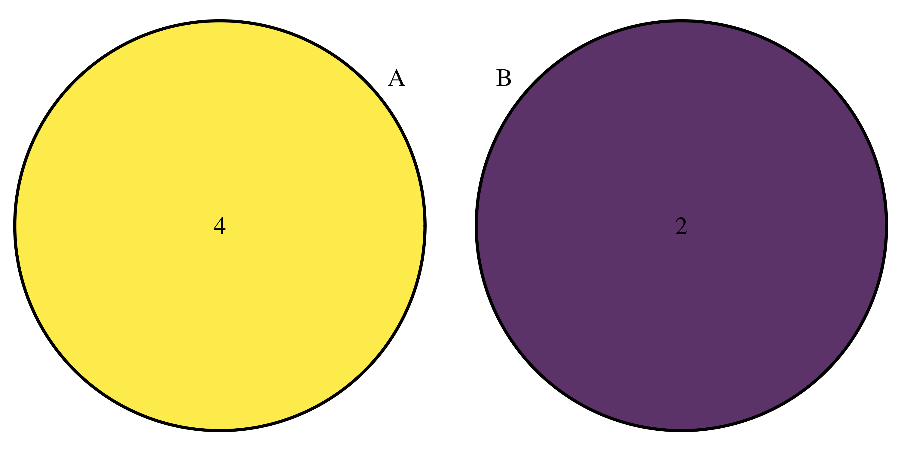
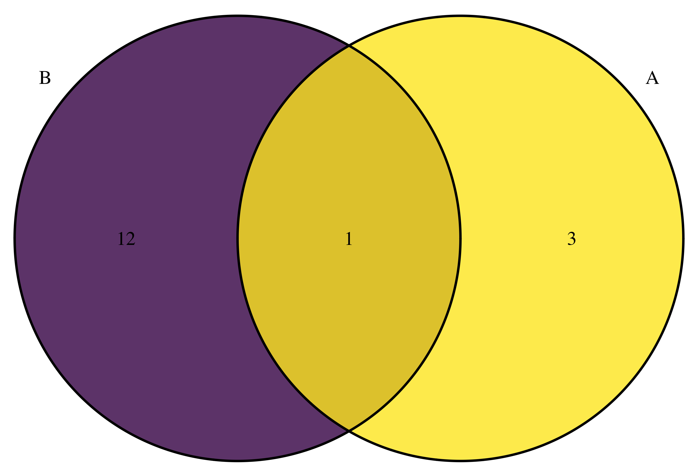
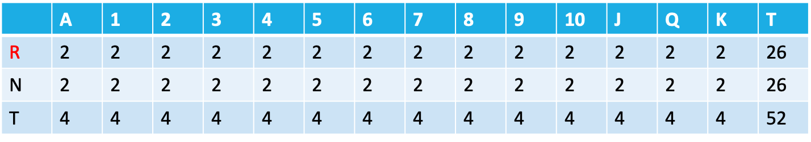
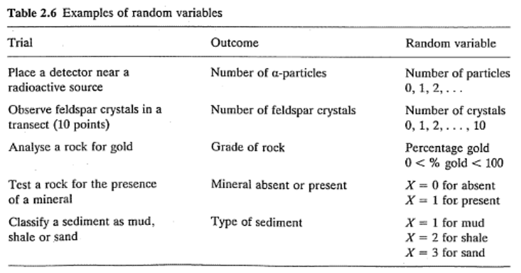

# Probabilidad

```{r prob-setup, include=FALSE}
library(DescTools)
library(summarytools)
library(patchwork)
library(janitor)
library(tidymodels)
library(tidyverse)

knitr::opts_chunk$set(
  echo = TRUE,
  message = FALSE,
  warning = FALSE,
  error = FALSE,
  # fig.path = "figs/",
  fig.retina = 3,
  fig.width = 8,
  fig.asp = 0.618,
  fig.align = "center",
  out.width = "70%"
)

theme_set(theme_bw(base_size = 12))

```

## Introducción

La probabilidad permite cuantificar la frecuencia de un acontecimiento determinado mediante la realización de un experimento aleatorio, del que se conocen todos los resultados posibles, bajo condiciones suficientemente estables. La probabilidad de un suceso es un numero, comprendido entre 0 y 1 (o 0 y 100), que indica las posibilidades que tiene de verificarse cuando se realiza un experimento aleatorio.

Un *experimento aleatorio* es aquella experiencia que trae un resultado que no se sabe a ciencia cierta cuál será, es decir no hay certeza del resultado. Como ejemplos comunes se pueden mencionar tirar una moneda al aire, tirar los dados. El conjunto de todos los resultados posibles arrojados por un experimento aleatorio se denomina *espacio muestral ($\Omega$)*. En el caso de tirar una moneda al aire seria $\Omega=\lbrace escudo,corona \rbrace$, en el caso de un dado $\Omega=\lbrace 1,2,3,4,5,6 \rbrace$. Un *evento o suceso* es cualquier subconjunto del espacio muestral, cada uno de los resultados posibles de una experiencia aleatoria [@walpole2012].

## Axiomas y Nomenclatura

Hay ciertos conceptos que son propios del tema de probabilidad y es necesario conocer para poder comprenderlos y aplicarlos, éstos se mencionan con más detalle en @walpole2012.

* $P[A]$ es la probabilidad de que el evento o suceso $A$ ocurra,
* $P[A']=1-P[A]$ es la probabilidad de que el evento o suceso $A$ no ocurra, lo que se conoce como el complemento del evento,
* $P[A \cap B]$ es la probabilidad de que el evento $A$ **y** el evento $B$ ocurran (intersección),
* $P[A \cup B]$ es la probabilidad de que el evento $A$ **o** el evento $B$ ocurran (unión),
* $P[A | B]$ es la probabilidad de que el evento $A$ ocurra **dado** el evento $B$ ha ocurrido (condicional),
* $P[A \cap B] = 0$ indica eventos mutuamente excluyentes, que no tienen elementos en común,
* $0<P[A]<1$, la probabilidad siempre se encuentra en 0 y 1.

## Reglas de probabilidad

Lo que se expone aquí proviene en su mayoría de @walpole2012.

### Regla de la suma

De manera general esta regla aplica cuando se quiere obtener la probabilidad de que $A$ **o** $B$ ocurran, o sea que al menos uno de los eventos de interés debe ocurrir. La forma general de la regla de la suma se muestra en la Ecuación \@ref(eq:p-suma).

\begin{equation}
  P[A \cup B] = P[A] + P[B] - P[A \cap B]
  (\#eq:p-suma)
\end{equation}

Cuando los eventos son excluyentes (no pueden ocurrir al mismo tiempo) se tiene que $P[A \cap B] = 0$ y la ecuación se reduce a $P[A] + P[B]$. Si los eventos no son excluyentes (pueden ocurrir al mismo tiempo) se utiliza toda la ecuación donde $P[A \cap B]$ va a ser la intersección (cantidad de datos en común) entre los eventos y debe ser sustraída para que no se contabilice dos veces.

Un ejemplo de eventos excluyentes puede ser el sacar un As ($A$) o un Rey rojo ($B$) de una baraja de 52 cartas, donde los eventos son excluyentes porque no hay intersección entre As y Rey, una representación del problema se muestra en la Figura \@ref(fig:suma1). Se tiene $P[A]=\frac{4}{52}$, $P[B]=\frac{2}{52}$, entonces $P[A \cup B]=\frac{4}{52}+\frac{2}{52}=\frac{6}{52}=0.115$ o $11.5\%$.

```{r suma1, echo=F, fig.cap='Ejemplo de regla de la suma para eventos excluyentes.'}

```

Un ejemplo de eventos no excluyentes puede ser el sacar un As ($A$) o una carta de espadas negra ($B$) de una baraja de 52 cartas, donde los eventos son no excluyentes porque hay un As de espadas negra, una representación del problema se muestra en la Figura \@ref(fig:suma2). Se tiene $P[A]=\frac{4}{52}$, $P[B]=\frac{13}{52}$, $P[A \cap B] = \frac{1}{52}$, entonces $P[A \cup B]=\frac{4}{52}+\frac{13}{52}-\frac{1}{52}=\frac{4}{13}=0.308$ o $30.8\%$.

```{r suma2, echo=F, fig.cap='Ejemplo de regla de la suma para eventos no excluyentes.'}

```

### Regla de la multiplicación

De manera general esta regla aplica cuando se quiere obtener la probabilidad de que $A$ **y** $B$ ocurran, o sea que todos los eventos de interés deben ocurrir. La forma general de la regla de la suma se muestra en la Ecuación \@ref(eq:p-mult).

\begin{equation}
  P[A \cap B] = P[A] * P[B|A]
  (\#eq:p-mult)
\end{equation}

Cuando los eventos son independientes (ocurrencia de A no afecta la ocurrencia de B) se tiene que $P[B|A] = P[B]$ y la ecuación se reduce a $P[A] * P[B]$. Si los eventos no son independientes (ocurrencia de A afecta la ocurrencia de B) y se utiliza toda la ecuación.

$P[B|A]$ es la probabilidad condicional de $B$ dado $A$. La Ecuación \@ref(eq:p-mult) se puede arreglar para encontrar esta probabilidad condicional como se muestra en la Ecuación \@ref(eq:p-cond), donde la principal idea es que al condicionar por un evento, ahora el total (denominador) no va a ser el total de las observaciones sino el total de observaciones del evento condicionante.

\begin{equation}
  P[B|A] = \frac{P[A \cap B]}{P[A]}
  (\#eq:p-cond)
\end{equation}

Un ejemplo de eventos independientes puede ser el siguiente. Consideremos un experimento en el que se sacan 2 cartas, una después de la otra, de una baraja ordinaria, con reemplazo. Los eventos se definen como $A$: la primera carta es un As, $B$: la segunda carta es una espada. Como la primera carta se reemplaza, nuestro espacio muestral para la primera y segunda cartas consta de 52 cartas, que contienen 4 ases y 13 espadas. Se tiene $P[A]=\frac{4}{52}$, $P[B]=\frac{13}{52}$, entonces $P[A \cap B]=\frac{4}{52}*\frac{2}{52}=\frac{52}{2704}=0.019$ o $1.9\%$; que sería lo mismo que la intersección $P[A \cap B]$ donde solo hay una opción de que se den los dos eventos entonces $P[A \cap B]=\frac{1}{52}=0.019$.

Un ejemplo de eventos no independientes puede ser el siguiente. Suponga que se tiene una caja de fusibles con 20 unidades, de las cuales 5 están defectuosas. Si se seleccionan 2 fusibles al azar y se retiran de la caja, uno después del otro, sin reemplazar el primero, ¿cuál es la probabilidad de que ambos fusibles estén defectuosos? Se tiene $P[A]=\frac{5}{20}$, $P[B|A]=\frac{4}{19}$, entonces $P[A \cap B]=\frac{5}{20}*\frac{4}{19}=\frac{20}{380}=\frac{1}{19}=0.053$ o $5.3\%$

Un ejemplo de probabilidad condicional puede ser el siguiente. Consideremos ahora una baraja ordinaria con 52 cartas, de 4 tipos, 13 de cada tipo y 2 colores (Figura \@ref(fig:cartas)).

```{r cartas, echo=F, fig.cap='Cartas de una baraja de naipes.'}

```

¿Cuál es la probabilidad de sacar 1 As si la carta que se saca es Roja $P[As|Roja]$? Se puede resolver de dos maneras. Primero, y la que resulta más intuitiva, se puede condicionar y el nuevo total cambia, con lo que el nuevo total es el total de cartas Rojas (26), y de ese total cuántas son As (2), entonces $P[As|Roja]=\frac{2}{26}=0.077$ o $7.7\%$. Segundo, se puede usar la ecuación de la probabilidad condicional, usando siempre el total de observaciones, $P[As|Roja]=\frac{P[Roja \ \cap \ As]}{P[Roja]}=\frac{2/52}{26/52}=0.077$ o $7.7\%$.

## Variables aleatorias

Una variable aleatoria es una variable X a la que le puede corresponder cada uno de los eventos del espacio muestral un número real (x). Si el número real sólo se puede expresar en enteros, a la variable aleatoria se le denomina variable aleatoria discreta, si puede tener decimales y por ende un gran número de posibilidades, es una variable aleatoria continua [@walpole2012]. Ejemplos de estas variables aleatorias se presentan en la Figura \@ref(fig:var-aleat) [@swan1995].

(ref:var-aleat) Ejemplos de variables aleatorias mostrando casos discretos y continuos [@swan1995].

```{r var-aleat, echo=F, fig.cap='(ref:var-aleat)'}

```

Tanto para las variables aleatorias discretas como continuas existen dos funciones de densidad o probabilidad que las pueden caracterizar: función de densidad de probabilidad (ésta realmente aplica más para variables discretas) y función de densidad acumulada [@walpole2012]. 

La función de densidad de probabilidad (Figura \@ref(fig:disc-pdf)) brinda la probabilidad puntual de cada uno de los posibles resultados para una variable aleatoria discreta; para una variable aleatoria continua el valor de esta función de probabilidad va a ser muy pequeño dada la gran cantidad de valores que puede tomar esta variable. La función de densidad acumulada brinda la probabilidad de obtener un valor menor o igual (mayor o igual) al de interés (Figuras \@ref(fig:disc-cdf), \@ref(fig:cont-cdf)), y siempre comprende de 0 a 1 (0 a 100). 

Para un ejemplo discreto, en el caso de lanzar una moneda al aire y de contar la corona como un éxito, se pueden tener 3 resultados 0 coronas y 2 escudos, 1 corona y 1 escudo, o 2 coronas. La probabilidad de cada uno de los posibles resultados (0, 1, 2) se muestra en la Figura \@ref(fig:disc-pdf), y la probabilidad acumulada se muestra en la Figura \@ref(fig:disc-cdf).

```{r disc-pdf, echo=FALSE, fig.cap='Función de densidad de probabilidad para una variable aleatoria discreta.'}
ggplot(data.frame(x=as.factor(0:2),y=dbinom(0:2,2,.5)),aes(x,y)) + 
  geom_col(width = .25,fill='steelblue') + 
  labs(x='',y='f(x)')
```

```{r disc-cdf, echo=FALSE, fig.cap='Función de densidad acumulada para una variable aleatoria discreta'}
ggplot(data.frame(x=as.factor(0:2),y=pbinom(0:2,2,.5)),aes(x,y)) + 
  geom_col(width = .25,fill='steelblue') + 
  labs(x='',y='F(x)')
```

Para un ejemplo de variable continua, se puede tener una variable con media de 30 y desviación estándar de 3, y se quiere encontrar la probabilidad de que esta variable sea menor a 25 (Figura \@ref(fig:cont-pdf) A), de que sea mayor a 35 (Figura \@ref(fig:cont-pdf) B), o de que se encuentre entre 25 y 35 (Figura \@ref(fig:cont-pdf) C). La curva de densidad acumulada se presenta en la Figura \@ref(fig:cont-cdf), a partir de la cual se pueden responder las mismas preguntas anteriores, lo único que cambia es la presentación de la distribución.

```{r cont-pdf, echo=FALSE, out.width='90%', fig.cap='Ejemplos de función de densidad de probabilidad para una variable aleatoria continua. **A** Para X menor a un valor. **B** Para X mayor a un valor. **C** Para X entre entre dos valores.'}
xmin = 20
xmax = 40
x1 = 25
x2 = 35
mu = 30
s = 3
cont_menor = ggplot(NULL,aes(xmin:xmax)) + 
  stat_function(fun = dnorm, args = list(mean = mu, sd = s)) + 
  stat_function(fun = dnorm, args = list(mean = mu, sd = s),
                geom = 'area',
                xlim = c(xmin,x1),fill='coral1') +
  labs(x='',y='f(x)')
cont_mayor = ggplot(NULL,aes(xmin:xmax)) + 
  stat_function(fun = dnorm, args = list(mean = mu, sd = s)) + 
  stat_function(fun = dnorm, args = list(mean = mu, sd = s),
                geom = 'area',
                xlim = c(x2,xmax),fill='coral1') +
  labs(x='',y='f(x)')
cont_entre = ggplot(NULL,aes(xmin:xmax)) + 
  stat_function(fun = dnorm, args = list(mean = mu, sd = s)) + 
  stat_function(fun = dnorm, args = list(mean = mu, sd = s),
                geom = 'area',
                xlim = c(x1,x2),fill='coral1') +
  labs(x='',y='f(x)')

(cont_menor | cont_mayor | cont_entre) + 
  plot_annotation(tag_levels = 'A')
```

```{r cont-cdf, echo=FALSE, fig.cap='Función de densidad acumulada para una variable aleatoria continua.'}
ggplot(NULL,aes(xmin:xmax)) + 
  stat_function(fun = pnorm, args = list(mean = mu, sd = s)) + 
  stat_function(fun = pnorm, args = list(mean = mu, sd = s),
                geom = 'area',
                xlim = c(xmin,x1),fill='coral1') +
  labs(x='',y='F(x)')
```

```{r include=FALSE}
# automatically create a bib database for R packages
knitr::write_bib(c(
  .packages(), 'bookdown', 'knitr', 'rmarkdown'
), 'packages.bib')
```
