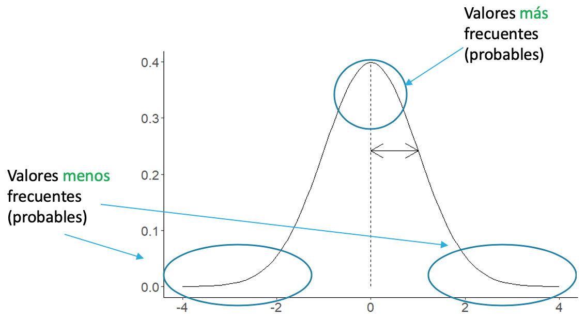
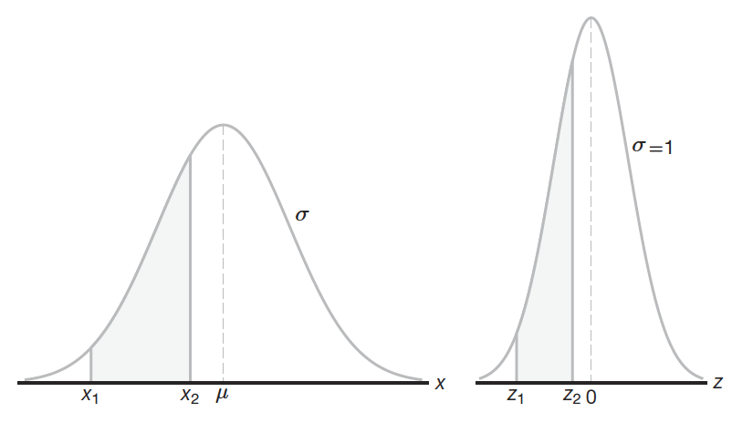

# Distribuciones de Probabilidad

```{r dist-setup, include=FALSE}
library(DescTools)
library(summarytools)
library(patchwork)
library(janitor)
library(tidymodels)
library(tidyverse)

knitr::opts_chunk$set(
  echo = TRUE,
  message = FALSE,
  warning = FALSE,
  error = FALSE,
  # fig.path = "figs/",
  fig.retina = 3,
  fig.width = 8,
  fig.asp = 0.618,
  fig.align = "center",
  out.width = "70%"
)

theme_set(theme_bw(base_size = 12))

```

## Introducción

En el capítulo anterior se introdujeron los principios de probabilidad y las variables aleatorias (discretas y continuas), y se mencionaron las funciones (distribuciones) de probabilidad, así como unos ejemplo básicos de lo que representan. Estas distribuciones permiten aproximar de forma analítica los fenómenos que dan orígenes a las variables de interés, permitiendo obtener probabilidades para todos los posibles resultados. En este capítulo se van a introducir las distribuciones de probabilidad más utilizadas para variables discretas y continuas (haciendo referencia a una población), y que serán ampliadas en capítulos posteriores tomando en cuenta una muestra.

## Distribución Binomial

Esta distribución aplica para variables discretas, de ensayos repetidos cuyo resultado se puede clasificar como de *éxito* (existe, está presente, está por encima, etc.) o *fracaso* (no existe, no está presenta, está por debajo, etc.), y la probabilidad de éxito se conoce y mantiene constante para cada ensayo (repetición) [@triola2004; @trauth2015; @walpole2012]. 

La Ecuación \@ref(eq:binom) muestra cómo se pueden obtener probabilidades para esta distribución, donde se tiene una variable $X$ distribuida de forma binomial con $n$ cantidad de intentos (ensayos), una probabilidad de éxito $p$ y probabilidad de fracaso $1-p$ para cada ensayo, y $x \ (0,1,2,\cdots,n)$ representa el número de éxitos para el cual obtener la probabilidad.

\begin{equation}
  X \sim Bin(n,p) = \frac{n!}{(n-x)!x!} p^x q^{n-x}
  (\#eq:binom)
\end{equation}

Para demostrar y visualizar esta distribución se presenta el siguiente ejemplo, modificado de @trauth2015. En el caso de una perforación para petróleo, la probabilidad de éxito está dada por 0.1 (10%). ¿Cuál es la probabilidad de tener 1 pozo exitoso de un total de 6 intentos? ¿Cuál es la probabilidad de tener al menos 2 pozos exitosos? 

Lo que se tiene: $p=0.1$, $n=6$, y se pide la probabilidad de $x=1$ pozo exitoso y la probabilidad de al menos 2 pozos exitosos, que es lo mismo que decir 2 o más. Una representación de la función (distribución) de densidad para este caso se muestra en la Figura \@ref(fig:binom-ej-pdf). De manera manual se puede resolver de la siguiente manera.

\begin{align}
  Bin(n,p) &= \frac{n!}{(n-x)!x!} p^x q^{n-x}\\
  Bin(6,0.1) &= \frac{6!}{(6-1)!1!} 0.1^1 0.9^{6-1} = 0.35 = 35 \%
\end{align}

En **R** se puede usar `dbinom` para obtener la probabilidad puntual y `pbinom` para obtener la probabilidad acumulada.

```{r binom-ej}
p = 0.1
n = 6
x = 1

dbinom(x = x, size = n, prob = p) # probabilidad de x = 1
pbinom(q = 1, size = n, prob = p, lower.tail = F) # probabilidad de x >= 2
```

```{r binom-ej-pdf, echo=FALSE, fig.cap='Función de probabilidad binomial para los datos del ejemplo.'}
ggplot(data.frame(x=0:n,y=dbinom(0:n,n,p)),aes(x,y)) + 
  geom_col(width = .25,fill='steelblue') + 
  labs(x='',y='f(x)')
```

Esta distribución se puede caracterizar por medio de los parámetros $\mu=pq$ y $\sigma=\sqrt{npq}$, donde éstos corresponden con la media y desviación estándar de una aproximación a la distribución normal [@triola2004; @walpole2012], la cual se va a introducir más adelante. El efecto de estos parámetros se puede visualizar en la Figura \@ref(fig:binom-norm), donde se grafica la distribución de probabilidad y se observa como se puede aproximar a la distribución normal definida por dichos parámetros.

```{r binom-norm, echo=FALSE, out.width='90%', fig.cap='Aproximación de la distribución binomial a la normal por medio de los parámetros de la media y desviación estándar, mostrando la ubicación de la media y una desviación estándar por debajo y encima de la misma.'}
set.seed(101)
b1 = ggplot(data.frame(y=rbinom(10000,10,.5)),aes(y)) + 
  geom_bar(fill='steelblue') + 
  geom_vline(xintercept = c(3,5,7),col=c('orange','red','orange')) +
  labs(x='',y='') + 
  scale_x_continuous(breaks = seq(0,10,2))
b2 = ggplot(data.frame(y=rbinom(10000,100,.2)),aes(y)) + 
  geom_bar(fill='steelblue') + 
  geom_vline(xintercept = c(16,20,24),col=c('orange','red','orange')) +
  labs(x='',y='') + 
  scale_x_continuous(breaks = seq(5,40,5))

(b1 | b2) +
  plot_annotation(tag_levels = 'A')
```

El caso de la Figura \@ref(fig:binom-norm) A corresponde con una variable distribuida binomialmente con 10 intentos y una probabilidad de éxito de 0.5 ($Bin(10,0.5)$), dando como resultado los siguientes parámetros:

\begin{equation}
  \mu = np = 10 \cdot 0.5 = 5\\
  \sigma = \sqrt{npq} = \sqrt{10 \cdot 0.5 \cdot 0.5} = 1.58 \approx 2
\end{equation}

El caso de la Figura \@ref(fig:binom-norm) B corresponde con una variable distribuida binomialmente con 100 intentos y una probabilidad de éxito de 0.2 ($Bin(100,0.2)$), dando como resultado los siguientes parámetros:

\begin{equation}
  \mu = np = 100 \cdot 0.2 = 20\\
  \sigma = \sqrt{npq} = \sqrt{100 \cdot 0.2 \cdot 0.8} = 4
\end{equation}

## Distribución de Poisson

Esta distribución aplica para variables discretas, para eventos que se presentan en una región (distancia, área, volumen) o intervalo de tiempo. Estos eventos, aleatorios e independientes, se consideran poco probables en largos intervalos de ocurrencia, y la cantidad puede ser infinita. Ejemplos de eventos que se pueden caracterizar serían: terremotos, erupciones volcánicas, inundaciones, etc. [@triola2004; @trauth2015; @walpole2012].

La Ecuación \@ref(eq:poiss) muestra cómo se pueden obtener probabilidades para esta distribución, donde se tiene una variable $X$ distribuida de forma Poisson con $\lambda$ como único parámetro, que corresponde con un promedio de eventos por unidad de tiempo o espacio ($t$), y $x \ (0,1,2,\cdots)$ representa el número de eventos.

\begin{equation}
  X \sim Poiss(\lambda) = \frac{e^{-\lambda t}(\lambda t)^x}{x!}
  (\#eq:poiss)
\end{equation}

Para demostrar y visualizar esta distribución se presenta el siguiente ejemplo, modificado de @triola2004. Al analizar los impactos de las bombas V1 en la Segunda Guerra Mundial, el sur de Londres se subdividió en 576 regiones, cada una con un área de 0.25 $km^2$. En total, 535 bombas estallaron en el área combinada de 576 regiones. 

a. Si se selecciona una región aleatoriamente, calcule la probabilidad de que fuese blanco de impactos exactamente en dos ($x=2$) ocasiones.
b. Con base en la probabilidad que se calculó en el inciso a, ¿cuántas de las 576 regiones se espera que reciban impactos exactamente dos veces? 

Se tiene que calcular $\lambda$ el promedio de impactos por región ($t=1$), y se pide la probabilidad de $x=2$ impactos y la probabilidad de 3 o más impactos. Una representación de la función (distribución) de densidad para este caso se muestra en la Figura \@ref(fig:poiss-ej-pdf). De manera manual se puede resolver de la siguiente manera.

\begin{equation}
  \lambda = \frac{535}{576} = 0.929\\
  Poiss(0.292) = \frac{e^{-0.929 * 1}(0.929 * 1)^2}{2!} = 0.17 = 17 \%\\
  \text{Número de regiones que pudieran recibir 2 impactos} = 576 * 0.17 = 97.9
\end{equation}

En **R** se puede usar `dpois` para obtener la probabilidad puntual y `ppois` para obtener la probabilidad acumulada.

```{r poiss-ej}
lambda = 535/576
x = 2

dpois(x = x, lambda = lambda)  # probabilidad de x = 2
ppois(q = 2, lambda = lambda, lower.tail = F)  # probabilidad de x >= 3
```

```{r poiss-ej-pdf, echo=FALSE, fig.cap='Función de probabilidad de Poisson para los datos del ejemplo.'}
ggplot(data.frame(x=0:6,y=dpois(0:6,lambda)),aes(x,y)) + 
  geom_col(width = .25,fill='steelblue') + 
  labs(x='',y='f(x)')
```

Esta distribución se puede caracterizar por medio de los parámetros $\mu=\lambda$ y $\sigma=\sqrt{\lambda}$, donde éstos corresponden con la media y desviación estándar de una aproximación a la distribución normal [@triola2004; @walpole2012]. El efecto de estos parámetros se puede visualizar en la Figura \@ref(fig:poiss-norm), donde se grafica la distribución de probabilidad y se observa como se puede aproximar a la distribución normal definida por dichos parámetros.

```{r poiss-norm, echo=FALSE, out.width='90%', fig.cap='Aproximación de la distribución de Poisson a la normal por medio de los parámetros de la media y desviación estándar, mostrando la ubicación de la media y una desviación estándar por debajo y encima de la misma.'}
set.seed(101)
p1 = ggplot(data.frame(y=rpois(10000,3)),aes(y)) + 
  geom_bar(fill='steelblue') + 
  geom_vline(xintercept = c(1,3,5),col=c('orange','red','orange')) +
  labs(x='',y='') + 
  scale_x_continuous(breaks = seq(0,12,2))
p2 = ggplot(data.frame(y=rpois(10000,10)),aes(y)) + 
  geom_bar(fill='steelblue') + 
  geom_vline(xintercept = c(7,10,13),col=c('orange','red','orange')) +
  labs(x='',y='') + 
  scale_x_continuous(breaks = seq(0,25,5))

(p1 | p2) +
  plot_annotation(tag_levels = 'A')
```

El caso de la Figura \@ref(fig:poiss-norm) A corresponde con una variable distribuida como Poisson con $\lambda=3$ ($Poiss(3)$), dando como resultado los siguientes parámetros:

\begin{equation}
  \mu = \lambda = 3\\
  \sigma = \sqrt{\lambda} = \sqrt{3} = 1.73 \approx 2
\end{equation}

El caso de la Figura \@ref(fig:poiss-norm) B corresponde con una variable distribuida como Poisson con $\lambda=10$ ($Poiss(10)$), dando como resultado los siguientes parámetros:

\begin{equation}
  \mu = \lambda = 10\\
  \sigma = \sqrt{\lambda} = \sqrt{10} = 3.16 \approx 3
\end{equation}

```{block2 normal-approx, type='rmdnote'}
Para las distribución binomial conforme incrementa la probabilidad de éxito ($p$) más se asemeja a una distribución normal, y para la distribución de Poisson conforme incrementa el promedio de eventos ($\lambda$) más se asemeja a una distribución normal.
```

## Distribución Normal o Gaussiana

Esta distribución es utilizada para variables continuas, y es la más utilizada en estadística porque "describe de manera aproximada muchos fenómenos que ocurren en la naturaleza, la industria y la investigación" [@walpole2012]. Tiene una forma de campana donde los valores más frecuentes o probables se encuentran en la parte central y los valores menos frecuentes o probables se encuentran en las colas (Figura \@ref(fig:dist-norm))

```{r dist-norm, echo=FALSE, fig.cap='Forma de la distribución normal mostrando donde se presentan los valores más y menos frecuentes.'}

```

Esta distribución se puede describir por medio de los parámetros de la media ($\mu$) y desviación estándar ($\sigma$), donde la media representa el valor más probable [@trauth2015]. Para indicar que una variable se distribuye normalmente se usa la siguiente sintaxis:

\begin{equation}
  X \sim N(\mu,\sigma)
  (\#eq:norm)
\end{equation}

Las características principales de esta distribución son [@walpole2012]:

* Simétrica alrededor de $\mu$
* Centrada y con valor máximo en $\mu$
* Puntos de inflexión en $x = \mu \pm \sigma$
* El área bajo la curva es 1

La Figura \@ref(fig:norm-comp) demuestra cómo afectan la media y desviación estándar la forma de la curva comparando dos curvas.

(ref:norm-comp) Comparación entre curvas normales con diferentes parámetros. **A** con diferente media ($\mu_1 < \mu_2$) pero misma desviación estándar ($\sigma_1 = \sigma_2$). **B** con misma media ($\mu_1 = \mu_2$) pero diferente desviación estándar ($\sigma_1 < \sigma_2$). **C** con diferente media ($\mu_1 < \mu_2$) y diferente desviación estándar ($\sigma_1 < \sigma_2$). Tomado de [@walpole2012].

```{r norm-comp, echo=FALSE, fig.cap='(ref:norm-comp)', out.width='90%'}
comp1 = cowplot::ggdraw() + cowplot::draw_image('images/dist-norm-comp1.png')
comp2 = cowplot::ggdraw() + cowplot::draw_image('images/dist-norm-comp2.png')
comp3 = cowplot::ggdraw() + cowplot::draw_image('images/dist-norm-comp3.png')

cowplot::plot_grid(comp1, comp2, comp3, labels = 'AUTO')
```

### Distribución Normal Estándar (Z)

Un caso especial de la distribución normal es la distribución normal estándar. Ésta se caracteriza por tener una media de o y desviación estándar de 1 [@triola2004; @walpole2012].

Para transformar (estandarizar) una variable se usa la Ecuación \@ref(eq:norm-z) y se describe que esta nueva variable estandarizada está distribuida normalmente con media 0 y desviación estándar 1.

\begin{equation}
  Z = \frac{x - \mu}{\sigma}\\
  Z \sim N(0,1)
  (\#eq:norm-z)
\end{equation}

```{block2 Z, type='rmdnote'}
$Z$ es una medida estandarizada y lo que indica es cuántas desviaciones estándar por encima o por debajo de la media se encuentra el valor $x$. Si $Z > 0$ entonces $x$ es mayor que la media y si $Z < 0$ entonces $x$ es menor que la media.
Imaginemos tenemos una población con media 45 y desviación estándar 5.
Para un $x=50$ tenemos $Z = \frac{50 - 45}{5} = 1$, entonces $x$ está 1 $\sigma$  por encima de $\mu$.
Para un $x=35$ tenemos $Z = \frac{35 - 45}{5} = -2$, entonces $x$ está 2 $\sigma$  por debajo de $\mu$.
```

El área bajo la curva original y la curva estandarizada es la misma (Figura \@ref(fig:dist-norm-z)), entonces las probabilidades son las mismas, además es útil para comparar distribuciones aún cuando tienen diferentes escalas y/o unidades [@walpole2012].

(ref:dist-norm-z) El área bajo la curva original es la misma que bajo la curva estandarizada, por ende las probabilidades son las mismas [@walpole2012].

```{r dist-norm-z, echo=FALSE, fig.cap='(ref:dist-norm-z)'}

```

Se va a demostrar cómo utilizar la curva normal estándar ($Z$) para obtener probabilidades por medio de ejemplos tomados de @walpole2012. El procedimiento manual general es calcular $Z$ y buscar el área a la izquierda para este valor (tablas de distribuciones en @walpole2012), y dependiendo de lo que se pida se realiza algún cálculo adicional.

Dada una variable aleatoria X que tiene una distribución normal con $\mu=50$ y $\sigma=10$, calcule la probabilidad de que X tome un valor entre 45 y 62. La idea es obtener al área a la izquierda del valor mayor y restarle el área a la izquierda del valor menor, obteniendo así la intersección (Figura \@ref(fig:norm-ej1)).

\begin{equation}
  X \sim N(50,10)\\
  z_1 = \frac{45 - 50}{10} = -0.5\\
  z_2 = \frac{62 - 50}{10} = 1.2\\
  P(45 < X < 62) = P(-0.5 < Z < 1.2) = P(Z < 1.2) - P(Z < -0.5)\\
  P(Z < 1.2) - P(Z < -0.5) = 0.8849 - 0.3085 = 0.5764 = 57.6 \%
\end{equation}

```{r norm-ej1, echo=FALSE, fig.cap='Curva normal para el ejemplo mostrando el área entre los valores de 45 y 62.'}
ggplot(NULL, aes(20:80)) + 
  stat_function(fun = dnorm, args = list(mean = 50, sd = 10)) + 
  stat_function(fun = dnorm, args = list(mean = 50, sd = 10), 
                xlim = c(45,62), geom = 'area', fill = 'coral1') +
  labs(x='',y='')
```

En **R** se realiza como se muestra, usando `pnorm`, donde esta función va a calcular, por defecto, el área a la izquierda para $x=q$ con una media $\mu$ y desviación estándar $\sigma$. La función `pnorm` y el resto de funciones relacionadas con la distribución normal tienen por defecto una media de 0 y desviación estándar de 1, correspondiendo con la distribución normal estándar, por lo que se pueden usar valores de $z$ directamente y obtener los mismos resultados.

```{r}
mu = 50
sigma = 10
x1 = 45
x2 = 62
z1 = (x1 - mu) / sigma
z2 = (x2 - mu) / sigma
pnorm(q = x2,mean = mu,sd = sigma) - pnorm(q = x1,mean = mu,sd = sigma)
pnorm(q = z2) - pnorm(q = z1)
```

Dado que X tiene una distribución normal con $\mu=300$ y $\sigma=50$, calcule la probabilidad de que X tome un valor mayor que 362. Aquí la idea es obtener el área a la derecha de 362 (Figura \@ref(fig:norm-ej2)), por lo que hay que encontrar el área la izquierda y restárcela a 1.

\begin{equation}
  X \sim N(300,50)\\
  z = \frac{362 - 300}{50} = 1.24\\
  P(X > 362) = P(Z > 1.24) = 1 - P(Z > 1.24)\\
  1 - P(Z > 1.24) = 1 - 0.8925 = 0.1075 = 10.7 \%
\end{equation}

```{r norm-ej2, echo=FALSE, fig.cap='Curva normal para el ejemplo mostrando el área a la derecha de 362.'}
ggplot(NULL, aes(150:450)) + 
  stat_function(fun = dnorm, args = list(mean = 300, sd = 50)) + 
  stat_function(fun = dnorm, args = list(mean = 300, sd = 50), 
                xlim = c(362,450), geom = 'area', fill = 'coral1') +
  labs(x='',y='')
```

En **R** se realiza como se muestra, usando `pnorm`, donde esta función va a calcular, por defecto, el área a la izquierda para $x=q$ con una media $\mu$ y desviación estándar $\sigma$. Para calcular el área a la derecha se puede restar el resultado a 1 o se puede usar el argumento `lower.tail = F` para obtener directamente el área a la derecha.

```{r}
mu = 300
sigma = 50
x = 362
z = (x - mu) / sigma
pnorm(q = x,mean = mu,sd = sigma,lower.tail = F)
1 - pnorm(q = z)
```

Así como se puede calcular la probabilidad para un $x$ se puede a partir de una probabilidad dada encontrar el $x$ que corresponde con dicha probabilidad. Se muestra un ejemplo a continuación.

Dada una distribución normal con $\mu = 40$ y $\sigma = 6$, calcule el valor de $x$ que tiene: 45% del área a la izquierda, y 14% del área a la derecha (o sea 86% área a la izquierda), ver Figura \@ref(fig:norm-ej3). Para ésto se despeja $x$ de la Ecuación \@ref(eq:norm-z) y se tiene que encontrar el valor de $z$ que corresponde con la probabilidad dada.

\begin{equation}
  p = 0.45, \text{resultando en un } z = -0.13\\
  x = \sigma * z + \mu = 6 * -0.13 + 40 = 39.24\\
  p = 0.86, \text{resultando en un } z = 1.08\\
  x = \sigma * z + \mu = 6 * 1.08 + 40 = 46.48
\end{equation}

En **R** se usa la función `qnorm` para encontrar el valor de la variable para una probabilidad dada.

```{r}
qnorm(.45,40,6)
qnorm(.14,40,6,lower.tail = F)
qnorm(.86,40,6)
```

```{r norm-ej3, echo=FALSE, fig.cap='Curva normal para el ejemplo mostrando el valor para un área a la izquierda de 45% (coral) y el valor para un área a la derecha de 14% (celeste).'}
ggplot(NULL, aes(20:60)) + 
  stat_function(fun = dnorm, args = list(mean = 40, sd = 6)) + 
  stat_function(fun = dnorm, args = list(mean = 40, sd = 6), 
                xlim = c(20,39.24), geom = 'area', fill = 'coral1') +
  stat_function(fun = dnorm, args = list(mean = 40, sd = 6), 
                xlim = c(46.48,60), geom = 'area', fill = 'dodgerblue') +
  labs(x='',y='')
```

## Distribuciones de probabilidad en **R**

**R** tiene funciones para las distribuciones más usadas (Tabla \@ref(tab:dist-r)). Existen 4 funciones generales para todas las distribuciones, donde empiezan con la misma letra y después le sigue el nombre de la distribución:

* `d*`: Las funciones que empiezan con `d` calculan la probabilidad puntual. Éstas aplican más para distribuciones discretas (binomial, poisson).
* `p*`: Las funciones que empiezan con `p` calculan la probabilidad acumulada inferior (por defecto) o superior. Éstas aplican para todas pero especialmente para las distribuciones continuas (normal, $Z$, $t$, $\chi^2$, $F$).
* `q*`: Las funciones que empiezan con `q` calculan el valor de la variable o estadístico (cuantil) que corresponde con cierta probabilidad.
* `r*`: Las funciones que empiezan con `r` generan datos aleatorio (`r`andom) para la distribución deseada y con los parámetros deseados.

```{r dist-r, echo=FALSE, results='as is'}
distribuciones = tibble(Distribucion = c('Binomial','Poisson','Normal',
                                         't','chi2','F'),
                        Puntual = c('dbinom','dpois','dnorm',
                                    'dt','dchisq','df'),
                        Acumulada = c('pbinom','ppois','pnorm',
                                      'pt','pchisq','pf'),
                        Cuantil = c('qbinom','qpois','qnorm',
                                    'qt','qchisq','qf'),
                        Aleatorios = c('rbinom','rpois','rnorm',
                                       'rt','rchisq','rf'))
knitr::kable(distribuciones,
             caption = 'Funciones de R para las distribuciones más usadas',
             format = 'html') %>% 
  kableExtra::kable_styling() %>% 
  kableExtra::add_header_above(c(' ','Probabilidad' = 2, 'Valores' = 2))
```


```{r include=FALSE}
# automatically create a bib database for R packages
knitr::write_bib(c(
  .packages(), 'bookdown', 'knitr', 'rmarkdown'
), 'packages.bib')
```
