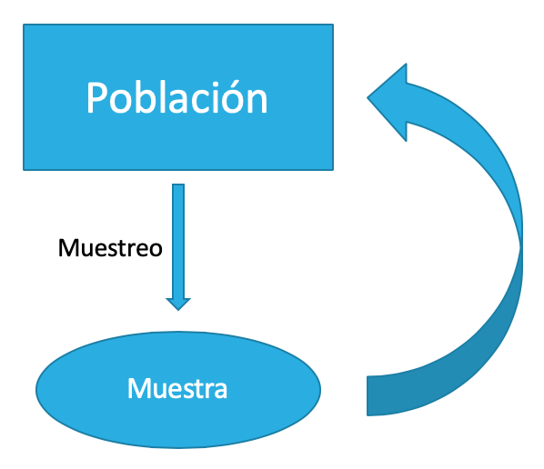
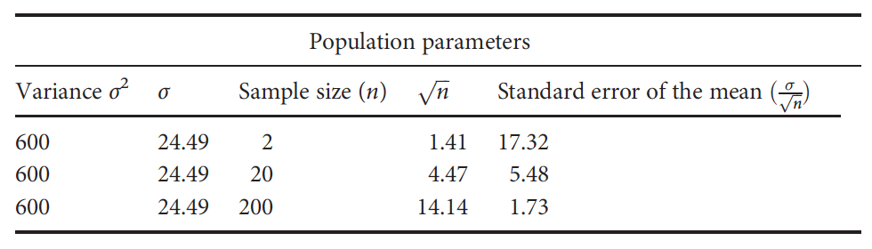
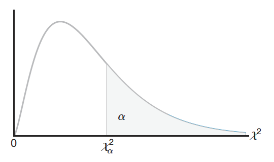

# Introducción a Estadística Inferencial

```{r infer-setup, include=FALSE}
library(DescTools)
library(summarytools)
library(patchwork)
library(janitor)
library(tidymodels)
library(tidyverse)

knitr::opts_chunk$set(
  echo = TRUE,
  message = FALSE,
  warning = FALSE,
  error = FALSE,
  # fig.path = "figs/",
  fig.retina = 3,
  fig.width = 8,
  fig.asp = 0.618,
  fig.align = "center",
  out.width = "70%"
)

theme_set(theme_bw(base_size = 12))

```

En los capítulos anteriores se han venido construyendo las bases para poder, ahora sí, responder a preguntas acerca de poblaciones a partir de datos muestrales, esta es la esencia de la estadística inferencial, ir más allá de describir los datos recolectados para poder hacer generalizaciones con fundamento teórico y cuantitativo. Este flujo de análisis se resume en la Figura \@ref(fig:infer-diag). En este capítulo se introducen conceptos fundamentales de la estadística inferencial, para posteriormente expandir sobre éstos utilizando estimación y pruebas de hipótesis para responder formalmente a una pregunta de investigación.

```{r infer-diag, echo=FALSE, fig.cap='Diagrama del análisis en estadística inferencial.'}

```

Es necesario introducir algunos conceptos nuevos que son muy usados y conocidos en estadística inferencial [@walpole2012]:

* Parámetro: Es una medida estadística *poblacional*, cuyo valor es de interés conocer. Por ejemplo, la media poblacional $\mu$ y la varianza poblacional $\sigma^2$ son parámetros. Todos los parámetros se representan por medio de letras griegas.
* Estadístico o Estimador: Es una variable aleatoria definida con las variables de la muestra aleatoria. Por ejemplo, la media muestral $\bar{x}$ y la varianza muestral $s^2$ son estadísticos. Es lo que se mide a partir de la muestra recolectada.
* Distribución muestral de un estadístico: Es la distribución de probabilidad de un estadístico. Va a ser diferente a la distribución poblacional ya que toma en cuenta el tamaño de la muestra. Los diferentes estadísticos van a aproximarse a diferentes curvas de distribución.
* Estadística paramétrica: Es la estadística convencional, en la que se basan la mayoría de técnicas de análisis. Hace suposiciones, siendo la más importante que los datos siguen una distribución conocida, por lo general siendo esta la distribución normal.
* Estadística no-paramétrica: A diferencia de la paramétrica, ésta no hace suposiciones respecto a distribuciones y se emplean otros métodos de análisis, que en algunos casos se pueden realizar únicamente por medios computacionales.

## Distribuciones muestrales

### Media $(\bar{x})$

Es la distribución de probabilidad de medias muestrales, donde las diferentes muestras presentan el mismo tamaño o número de observaciones [@triola2004]. La distribución de medias muestrales va a tener la misma media de la población pero la desviación estándar va a ser el *error estándar de la media*.

A continuación se exponen dos conceptos muy importantes en estadística que permiten aproximar una gran variedad de problemas a la distribución normal [@mckillup2010; @walpole2012].

```{block2 TLC1, type='rmdnote'}
**Teorema del Límite Central**: La distribución de las medias de las muestras tenderá a ser normalmente distribuida aún cuando la población de la cual se muestreó no es normal.
  
La media de la distribución de medias es la media de la población y la distribución de medias tiene menos dispersión que la población.
```

```{block2 TLC2, type='rmdnote'}
**Ley de los números grandes**: Si tomamos muestras de una población con distribución desconocida, ya sea finita o infinita, la distribución muestral de $\bar{x}$ aún será aproximadamente normal con media $\mu$ y varianza \frac{\sigma^2}{n} o \frac{s^2}{n}, siempre que el tamaño de la muestra sea grande ($n ≥ 30$) y la distribución no sea muy asimétrica.
```

En función de si se conoce o no la varianza poblacional ($\sigma^2$), el error estándar va a ser $\sigma_\bar{x} = \frac{\sigma}{\sqrt{n}}$ o $s_\bar{x} = \frac{s}{\sqrt{n}}$, respectivamente, donde cuando no se conoce $\sigma^2$ se usa la varianza muestral ($s^2$) como estimador de la varianza poblacional [@triola2004; @mckillup2010; @walpole2012]. 

Lo anterior también afecta la distribución a usar para la inferencia. Si se conoce $\sigma^2$ se usa la distribución normal estándar ($Z$), pero si no se conoce $\sigma^2$ se usa la distribución $t$ de Student. Esta distribución es similar a al normal en términos de que tiene forma de campana y es simétrica alrededor de la media, pero tiene la característica de que va a estar en función del tamaño de la muestra ($n$, y por ende de los grados de libertad $v$), donde a menor tamaño de la muestra va a permitir más probabilidad en las colas y a mayor tamaño de la muestra se va a parecer más a la curva normal [@triola2004; @mckillup2010; @walpole2012]. Una comparación entre la distribución normal y la distribución $t$ se muestra en la Figura \@ref(fig:norm-t-comp).

```{r norm-t-comp, echo=FALSE, fig.cap='Comparación entre la distribución normal Z y la distribución t, esta última con diferentes grados de libertad.'}
ggplot(NULL, aes(x = -4:4)) + 
  stat_function(fun = dnorm, aes(col='Z')) +
  stat_function(fun = dt, args = list(df=5), aes(col='t (2)'), n = 300) +
  stat_function(fun = dt, args = list(df=10), aes(col='t (15)'), n = 300) +
  stat_function(fun = dt, args = list(df=20), aes(col='t (30)'), n = 300) + 
  scale_color_viridis_d(option = 'C', begin = .1, end = .9,
                        breaks = c('Z','t (2)','t (15)','t (30)')) + 
  labs(x = NULL, y = NULL, col = 'Distribución \n(Grados de \n libertad)') + 
  geom_hline(yintercept = -0.01, col='black') + 
  theme_void()
```

Dado lo anterior, la distribución toma la forma de la Ecuación \@ref(eq:dist-medias) para la distribución normal y la Ecuación \@ref(eq:dist-medias-t) para la distribución $t$:

\begin{equation}
  Z = \frac{\bar{x} - \mu}{\sigma_\bar{x}}\\
  \sigma_\bar{x} = \frac{\sigma}{\sqrt{n}}
  (\#eq:dist-medias)
\end{equation}

\begin{equation}
  t = \frac{\bar{x} - \mu}{s_\bar{x}}\\
  s_\bar{x} = \frac{s}{\sqrt{n}}
  (\#eq:dist-medias-t)
\end{equation}

Conforme el tamaño de la muestra incrementa el error estándar decrece y las inferencias/conclusiones se vuelven más precisas. Este concepto se puede observar en la Figura \@ref(fig:sem-n) [@mckillup2010].

(ref:sem-n) Efecto del tamaño de la muestra en el error estándar. Al aumentar el tamaño de la muestra, manteniendo el resto de parámetros poblacionales constantes, el error estándar decrece, incrementando la precisión de las conclusiones sobre la media poblacional. Tomado de @mckillup2010.

```{r sem-n, echo=FALSE, fig.cap='(ref:sem-n)'}

```

El siguiente ejemplo tomado de @davis2002 muestra cómo se puede tomar en cuenta una muestra para calcular probabilidades y empezar a hacer inferencias. Se realiza primero con la distribución $Z$ (asumiendo que se conoce $\sigma$) y luego con la distribución $t$.

La longitud de especímenes de belemnite tiene una distribución normal con $\mu = 3.5 \ cm$ y $\sigma = 0.2 \ cm$. Se obtiene una muestra al azar de 8 belemnites. Cuál es la probabilidad de que cuando se selecciona una muestra al azar, le media de la muestra sea de 3.7 cm?

Si se asume $\sigma = 0.2$ se puede usar $Z$

\begin{equation}
  \bar{x} = 3.7, \mu = 3.5, \sigma = 0.2, n = 8\\
  \sigma_\bar{x} = \frac{\sigma}{\sqrt{n}} = \frac{0.2}{\sqrt{8}} = 0.0707\\
  Z = \frac{\bar{x} - \mu}{\sigma_\bar{x}} = \frac{3.7 - 3.5}{0.0707} = 2.82\\
  P(X > 3.7) = P(Z > 2.82) = 1 - P(Z < 2.82)\\
  1 - P(Z < 2.82) = 1 - 0.9976 = 0.0024 \approx 0.2\%
\end{equation}

Si no se asume $\sigma = 0.2$ se usa $t$

\begin{equation}
  \bar{x} = 3.7, \mu = 3.5, s = 0.2, n = 8, v = 8 - 1 = 7\\
  s_\bar{x} = \frac{s}{\sqrt{n}} = \frac{0.2}{\sqrt{8}} = 0.0707\\
  t = \frac{\bar{x} - \mu}{s_\bar{x}} = \frac{3.7 - 3.5}{0.0707} = 2.82\\
  P(X > 3.7) = P(t_7 > 2.82) = 1 - P(t_7 < 2.82)\\
  1 - P(t_7 < 2.82) = 1 - 0.9873 = 0.0127 \approx 1.27\%
\end{equation}

En **R** se usan las funciones de las distribuciones. En el caso de que conozca $\sigma$ se usa la distribución la normal, si no se conoce $\sigma$ se usa la distribución $t$. En general se ajusta la desviación estándar y se usa el error estándar respectivo.

```{r}
x = 3.7
mu = 3.5
sigma = 0.2
n = 8

pnorm(q = x, mean = mu, sd = sigma/sqrt(n), lower.tail = F)

s = 0.2
v = n - 1

pt(q = (x-mu)/(s/sqrt(n)), df = v, lower.tail = F)
```

Con los ejemplos anteriores se observa como al usar la distribución $t$ la probabilidad en los extremos es mayor, especialmente cuando el tamaño de la muestra es pequeño.

### Diferencia de medias $(\bar{x}_1-\bar{x}_2)$

Es la distribución de probabilidad de la diferencia entre medias muestrales, donde las muestras pueden o no presentar el mismo tamaño o número de observaciones. Ésta se utiliza cuando se desean comparar dos posibles poblaciones, dos métodos de análisis, etc. Asumiendo que se cumple el Teorema del Límite Central, se asume que las muestras van a estar normalmente distribuidas y por ende la diferencia de medias tendrá esta forma. La distribución toma la forma presentada en la Ecuación \@ref(eq:dist-diff-medias) si se conoce $\sigma$, sino se puede ajustar y usar la distribución $t$ usando la Ecuación \@ref(eq:dist-diff-medias-t) [@walpole2012]:

\begin{equation}
  Z = \frac{(\bar{x}_1-\bar{x}_2) - (\mu_1-\mu_2)}{\sigma_{\bar{x}_1-\bar{x}_2}}\\
  \sigma_{\bar{x}_1-\bar{x}_2} = \sqrt{\frac{\sigma_1^2}{n_1}+\frac{\sigma_2^2}{n_2}}
  (\#eq:dist-diff-medias)
\end{equation}

\begin{equation}
  t = \frac{(\bar{x}_1-\bar{x}_2) - (\mu_1-\mu_2)}{s_{\bar{x}_1-\bar{x}_2}}\\
  s_{\bar{x}_1-\bar{x}_2} = \sqrt{\frac{s_1^2}{n_1}+\frac{s_2^2}{n_2}}
  (\#eq:dist-diff-medias-t)
\end{equation}

El contenido de humedad del sitio A tiene una media 35% y una desviación estándar de 5%, el contenido de humedad del sitio B tiene una media 30% y una desviación estándar de 6%. Cuál es la probabilidad de que una muestra de tamaño 25 del sitio A tenga un 7% más de contenido de humedad que el una muestra de tamaño 30 del sitio B?

\begin{equation}
  \mu_1-\mu_2 = 35 - 30 = 5\\
  \sigma_{\bar{x}_1-\bar{x}_2} = \sqrt{\frac{\sigma_1^2}{n_1}+\frac{\sigma_2^2}{n_2}} = \sqrt{\frac{5^2}{25}+\frac{6^2}{30}} = 1.48\\
  Z = \frac{(\bar{x}_1-\bar{x}_2) - (\mu_1-\mu_2)}{\sigma_{\bar{x}_1-\bar{x}_2}}\\
  Z = \frac{7 - 5}{1.48} = 1.35\\
  P(\bar{X}_1-\bar{X}_2 > 7) = P(Z > 1.35) = 1 - P(Z < 1.35)\\
  1 - P(Z < 1.35) = 1 - 0.911 = 0.088 \approx 8.85 \%
\end{equation}

En **R** se hace de manera similar al caso de una media. Se puede realizar de dos maneras, calculando el $z$ (o $t$) y usándolo directamente, o en el caso de usar $z$, incluyendo en la función la diferencia de medias muestrales como el valor de interés, la diferencia de medias poblaciones como la media, y el error estándar como la desviación estándar.

```{r}
x = 7
mu1 = 35
mu2 = 30
sigma1 = 5^2
sigma2 = 6^2
n1 = 25
n2 = 30

z = (x - (mu1-mu2)) / sqrt(sigma1/n1 + sigma2/n2)
z

pnorm(q = z, lower.tail = F)

pnorm(q = x, mean = mu1-mu2, sd = sqrt(sigma1/n1 + sigma2/n2), lower.tail = F)

s1 = 5^2
s2 = 6^2
v = n1 + n2 -2

t = (x - (mu1-mu2)) / sqrt(s1/n1 + s2/n2)
t

pt(q = t, df = v, lower.tail = F)
```

En el ejemplo anterior se cumple todavía que la probabilidad usando $t$ es mayor que usando $z$, pero la diferencia no es tan grande ya que el tamaño de muestra combinado (por ende los grados de libertad) es grande y se empieza a aproximar a la distribución normal.

@triola2004 muestra una figura (\@ref(fig:z-t)) que puede servir para decidir qué distribución/método utilizar cuando el parámetro de interés es la media.

(ref:z-t) Diagrama de flujo para ayudar a decidir qué distribución usar cuando se quiere hacer inferencia sobre la media poblacional. Tomado de @triola2004.

```{r z-t, echo=FALSE, fig.cap='(ref:z-t)'}
knitr::include_graphics('images/norm-t-flow.png')
```

### Varianza $(s^2)$

Las distribuciones de estadísticos anteriores se enfocaron en la media, cuando es de interés sacar conclusiones para el comportamiento típico de un fenómeno o proceso. Cuando el interés es la variabilidad de un fenómeno o proceso el estadístico de interés es la varianza muestral, como proxy de la varianza poblacional. Dado que esta medida es siempre positiva se ocupa una distribución que imponga esta condición, por lo que se usa la distribución $\chi^2$, con $v = n - 1$ grados de libertad, Ecuación \@ref(eq:dist-var) [@triola2004; @walpole2012].

\begin{equation}
  \chi^2 = \frac{(n-1)s^2}{\sigma^2}
  (\#eq:dist-var)
\end{equation}

La Figura \@ref(fig:dist-chi2) [@walpole2012] muestra la forma de la distribución $\chi^2$, donde la probabilidad de que el estadístico tome un valor mayor o igual al calculado corresponde con el área a la derecha de dicho estadístico. Esta distribución no es simétrica, pero conforme incrementan los grados de libertad se vuelve más simétrica [@triola2004], Figura \@ref(fig:dist-chi2-df).

(ref:dist-chi2) Distribución $\chi^2$ mostrando el área a la derecha (probabilidad de un valor mayor) para un valor específico de $\chi^2$. Tomada de @walpole2012.

```{r dist-chi2, echo=FALSE, fig.cap='(ref:dist-chi2)'}

```

(ref:dist-chi2-df) Distribución $\chi^2$ con diferentes grados de libertad.

```{r dist-chi2-df, echo=FALSE, fig.cap='(ref:dist-chi2-df)'}
ggplot(NULL, aes(x = 0:40)) + 
  stat_function(fun = dchisq, args = list(df=3), aes(col='3'), n = 300) +
  stat_function(fun = dchisq, args = list(df=5), aes(col='5'), n = 300) +
  stat_function(fun = dchisq, args = list(df=10), aes(col='10'), n = 300) +
  stat_function(fun = dchisq, args = list(df=20), aes(col='20'), n = 300) + 
  scale_color_viridis_d(option = 'C', begin = .1, end = .9, 
                        breaks = c('3','5','10','20')) + 
  labs(x = NULL, y = NULL, col = 'Grados de \nlibertad') + 
  geom_hline(yintercept = -0.01, col='black') + 
  theme_void()
```

*Ejemplo*: Una población con distribución aproximadamente normal tiene varianza especificada de 0.8. Calcule la probabilidad que una muestra aleatoria de tamaño 6 tenga una varianza mayor o igual a 1.2.

\begin{equation}
  \chi^2 = \frac{(n-1)s^2}{\sigma^2} = \frac{(6-1)1.2}{0.8} = 7.5\\
  P(s^2 > 1.2) = P(\chi^2 > 7.5) = 0.186 \approx 18.6 \%
\end{equation}

En **R** se puede usar la función `pchisq` con el estadístico y grados de libertad específicos.

```{r}
sigma2 = 0.8
s2 = 1.2
n = 6
v = n - 1

chi = (v * s2) / sigma2
chi

pchisq(q = chi, df = v, lower.tail = F)
```

### Dos varianzas $\left( \frac{s_1^2}{s_2^2} \right)$

Así como se pueden hacer inferencias sobre dos medias, se pueden hacer inferencias sobre la relación entre dos varianzas (desviaciones estándar). De igual manera a la distribución $\chi^2$ para una varianza, se ocupa una distribución que sea positiva, pero al tratarse de dos muestras (poblaciones) esta distribución ocupa dos grados de libertad, uno para cada muestra, este es el caso de la distribución $F$. Esta distribución tiene una amplia aplicación en la comparación de varianzas muestrales, así como en problemas que implican dos o más muestras [@walpole2012], lo que se cubrirá en los próximos capítulos.

Si $s_1^2$ y $s_2^2$ son las varianzas de muestras aleatorias independientes de tamaño $n_1$ y $n_2$ tomadas de poblaciones normales con varianzas $\sigma_1^2$ y $\sigma_1^2$, respectivamente, entonces el estadístico $F$ se define como:

\begin{equation}
  F = \frac{s_1^2}{s_2^2}
  (\#eq:dist-f)
\end{equation}

La distribución $F$ depende de $v_1 = n_1 - 1$ y $v_2 = n_2 - 1$, como se muestra en la Figura \@ref(fig:dist-f).

(ref:dist-f) Distribución $F$ con diferentes grados de libertad.

```{r dist-f, echo=FALSE, fig.cap='(ref:dist-f)'}
ggplot(NULL, aes(x = 0:5)) + 
  stat_function(fun = df, args = list(df1=6,df2=10), aes(col='6,10'), n = 300) +
  stat_function(fun = df, args = list(df1=10,df2=30), aes(col='10,30'), n = 300) +
  stat_function(fun = df, args = list(df1=20,df2=20), aes(col='30,30'), n = 300) +
  scale_color_viridis_d(option = 'C', begin = .1, end = .9, 
                        breaks = c('6,10','10,30','30,30')) + 
  labs(x = NULL, y = NULL, col = 'Grados de \nlibertad') + 
  geom_hline(yintercept = -0.01, col='black') +
  theme_void()
```

*Ejemplo*: Se tienen dos muestras de tamaño $n_1 = 6$ y $n_2 = 9$. Cuál es la probabilidad de que la razón de varianzas sea mayor a 2?

\begin{equation}
  F = \frac{s_1^2}{s_2^2} = 2\\
  P(F_{5,8} > 2) = 1 - P(F_{5,8} < 2) = 1 - 0.817 = 0.183 \approx 18.3 \%
\end{equation}

En **R** se usa `pf` donde se requiere el valor de $F$ y los dos grados de libertad ($df1, df2$).

```{r}
f = 2
n1 = 6
n2 = 9
v1 = n1 - 1
v2 = n2 - 1

pf(q = f, df1 = v1, df2 = v2, lower.tail = F)
```

Lo presentado en este capítulo es la base de lo que se va a cubrir en los próximos capítulos, donde se introducirán temas y técnicas de inferencia muy utilizadas que permiten responder a preguntas de investigación, como lo son [Estimación] y [Pruebas estadísticas]. Estas a su vez van a sentar la base para posteriormente aplicar conceptos y técnicas similares a datos típicos en geociencias.

```{r include=FALSE}
# automatically create a bib database for R packages
knitr::write_bib(c(
  .packages(), 'bookdown', 'knitr', 'rmarkdown'
), 'packages.bib')
```
