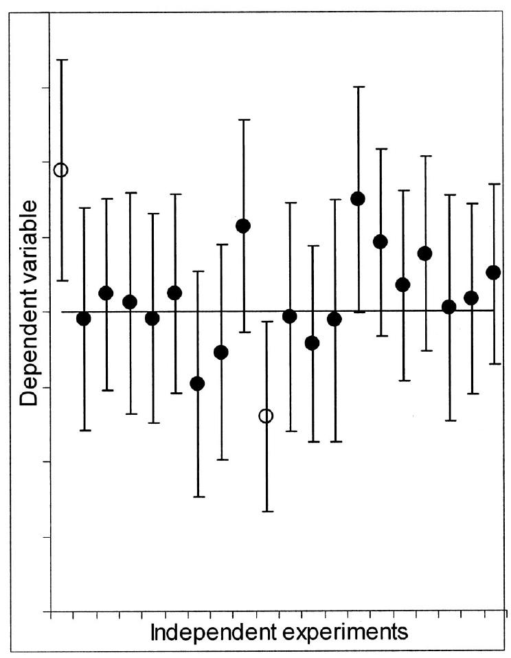
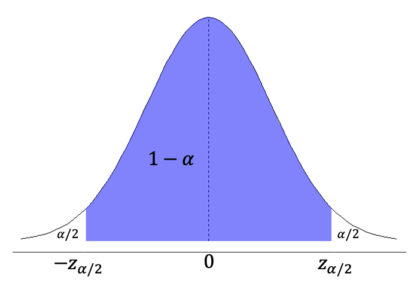
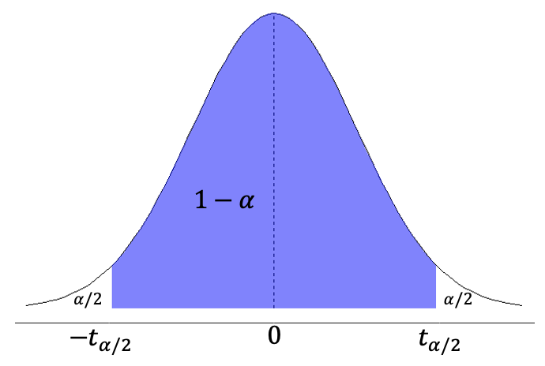
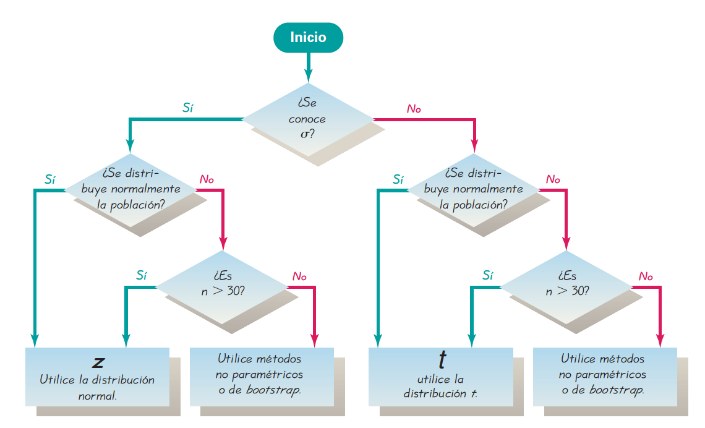
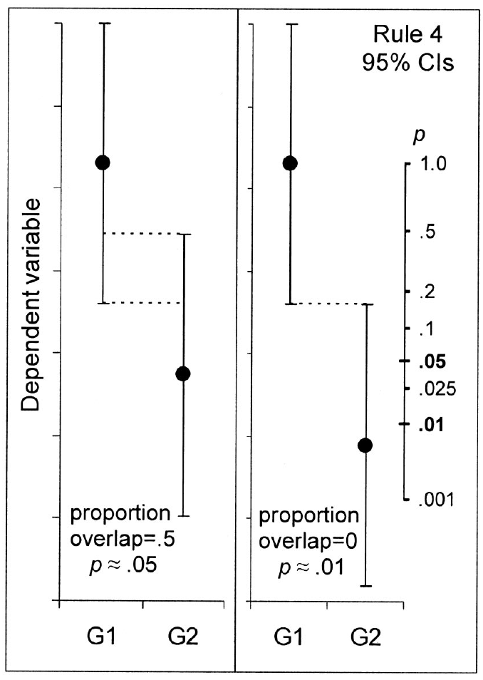
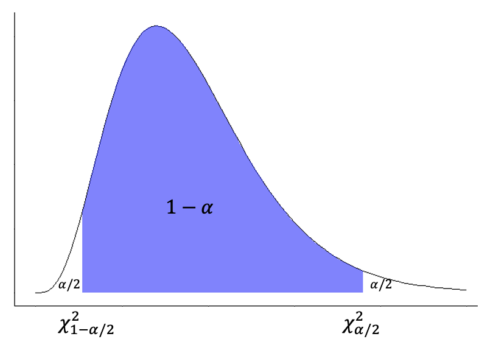
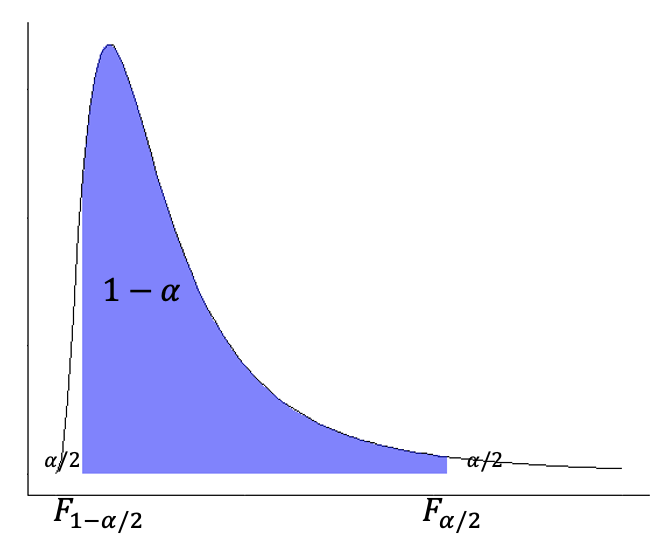
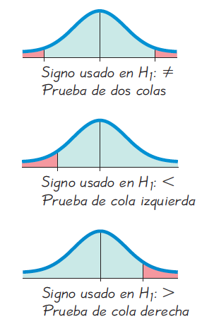
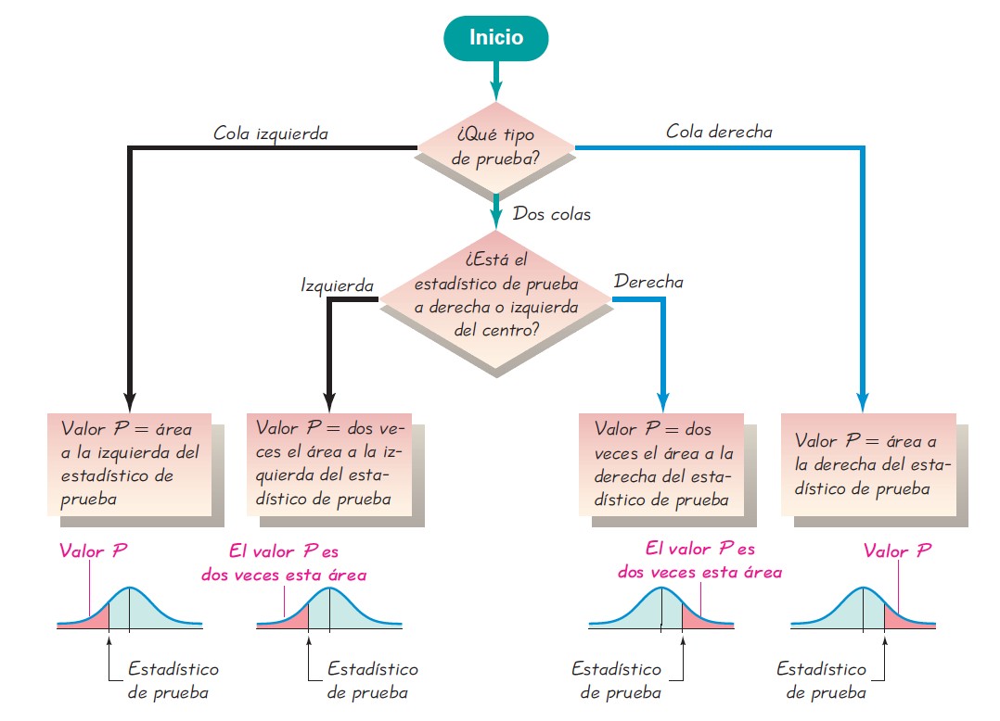

# Estimación e Hipótesis

```{r estimacion-setup, include=FALSE}
library(GMisc)
library(DescTools)
library(OneTwoSamples)
library(kableExtra)
library(summarytools)
library(patchwork)
library(janitor)
library(tidymodels)
library(tidyverse)

knitr::opts_chunk$set(
  echo = TRUE,
  message = FALSE,
  warning = FALSE,
  error = FALSE,
  # fig.path = "figs/",
  fig.retina = 3,
  fig.width = 8,
  fig.asp = 0.618,
  fig.align = "center",
  out.width = "70%"
)

theme_set(theme_bw(base_size = 12))

```

## Introducción

En los capítulos anteriores ([Distribuciones de Probabilidad] e [Introducción a Estadística Inferencial]) se introdujeron principios básicos de la estadística inferencial: el uso de distribuciones y distribuciones muestrales. Estos conceptos serán ampliados en este capítulo donde se introducirán los dos métodos de estadística inferencial más usados: *estimación* e *hipótesis*. En ambos casos se trabaja a partir de una muestra o muestras para indicar la incertidumbre que se tiene sobre un parámetro poblacional (estimación), o para responder a una pregunta de investigación (hipótesis); ambos métodos se pueden complementar, aunque la tendencia va más hacia la estimación, junto con tamaños de efecto.

## Estimación {#estim}

Existen dos tipos de estimación principales: puntual y por intervalo. Un estimador puntual es un valor único que se considera representa o aproxima de mejor manera a un parámetro poblacional [@triola2004; @walpole2012]. Una estimación por intervalo representa un rango de posibles valores para el parámetro poblacional [@cumming2005ap; @cumming2011; @cumming2014ps; @triola2004]. 

La ventaja de un intervalo de confianza, sobre una prueba de hipótesis (como se va a ver más adelante y en el próximo capítulo), es que brinda una medida de la incertidumbre que se tiene sobre un parámetro específico, brindando más información que responder sí o no a una pregunta de hipótesis.

Lo que se obtiene a partir de la estimación por intervalo es lo que se conoce como *intervalo de confianza (IC)*. Éste se construye a partir de un nivel de confianza ($1 - \alpha$,  $\alpha$ = nivel de significancia), el cual "es la proporción de veces que el intervalo de confianza realmente contiene el parámetro de población, suponiendo que el proceso de estimación se repite un gran número de veces" [@triola2004]. Los valores más comunes para el nivel de confianza son 90% ($\alpha = 0.1$), 95% ($\alpha = 0.05$), y 99% ($\alpha = 0.01$) [@triola2004; @walpole2012].

```{block2 IC, type='rmdnote'}
**Interpretación correcta del intervalo de confianza (frecuentista)**
  
Si se tiene una cantidad infinita de muestras con sus respectivos intervalos de confianza, el $100(1 - \alpha)\%$ de esos intervalos va a contener el valor poblacional [@cumming2005ap; @cumming2011; @cumming2014ps; @triola2004; @nolan2014]. El intervalo que se obtiene puede ser uno del $100(1 - \alpha)\%$ o del $100(\alpha)\%$, esto no se sabe.

El intervalo de confianza es el rango de valores más probables para el parámetro poblacional [@cumming2005ap; @cumming2011; @cumming2014ps].
```

La nota anterior se puede visualizar o imaginar a como lo definen @cumming2005ap y se muestra en la Figura \@ref(fig:IC-baile), donde el intervalo que se calcula es uno de muchos posibles intervalos que se pudo obtener y contiene o no el parámetro poblacional, pero ésto no se sabe.

(ref:IC-baile) Intervalos de confianza al 95% para una media poblacional conocida, donde los puntos representan la media de la muestra. Los puntos sólidos contienen $\mu$ y los puntos abiertos no contienen $\mu$. Aquí 18 de los 20 (90%) IC contienen a $\mu$. A la larga, el 95% de los intervalos va a contener $\mu$. Tomado de @cumming2005ap.

```{r IC-baile, echo=FALSE, fig.cap='(ref:IC-baile)'}

```

Para distribuciones simétricas ($Z, t$) los intervalos de confianza siguen la forma que se muestra en la Ecuación \@ref(eq:IC-sim), mientras que para distribuciones asimétricas ($\chi^2, F$) los intervalos de confianza siguen la forma que se muestra en la Ecuación \@ref(eq:IC-asim).

\begin{equation}
  \hat{\theta} \pm MoE\\
  \hat{\theta} = \text{estadístico o estimador}\\
  MoE = \text{margen de error} =  SE \cdot stat_{crit,\alpha/2,v}\\
  \alpha/2 \text{ va a estar en función del nivel de confianza elegido}\\
  SE = \text{error estándar}\\
  v = \text{grados de libertad}
  (\#eq:IC-sim)
\end{equation}

\begin{equation}
  \hat{\theta}_i < \hat{\theta} < \hat{\theta}_s\\
  \hat{\theta}_i = \text{límite inferior}\\
  \hat{\theta}_s = \text{límite superior}
  (\#eq:IC-asim)
\end{equation}

El estadístico crítico ($stat_{crit,\alpha/2,v}$) se puede encontrar en tablas de valores críticos [@davis2002; @nolan2014; @swan1995; @triola2004; @walpole2012], o a partir de la función `q` respectiva en **R**. A excepción de $Z$ todos van a estar en función de los grados de libertad, que es lo mismo que decir el tamaño de la(s) muestra(s).

### Media

Cuando se quiere estimar una media poblacional ($\mu$) a partir de intervalos de confianza se puede usar la distribución normal estándar ($Z$) si se conoce la desviación estándar poblacional ($\sigma$), que es la menor cantidad del tiempo, o se puede usar la distribución $t$ si no se conoce $\sigma$. Esto se introdujo en la sección [Distribuciones muestrales] del capítulo anterior.

#### Se conoce $\sigma$ {#estim-ic-z}

Si se conoce $\sigma$ o se tiene una muestra grande (por lo general $n > 30$) se puede usar la distribución $Z$ para construir el intervalo de confianza. Modificando la Ecuación \@ref(eq:IC-sim) y ajustándola a $Z$ se tiene la Ecuación \@ref(eq:ic-media-z), donde $z_{\alpha/2}$ corresponde con el valor crítico de $Z$ para el nivel de confianza escogido, que se puede encontrar usando `qnorm`. Para este caso se puede visualizar conforme la Figura \@ref(fig:z-crit).

\begin{equation}
  \bar{x} \pm z_{\alpha/2} \frac{\sigma}{\sqrt{n}}\\
  MoE = z_{\alpha/2} \frac{\sigma}{\sqrt{n}}
  (\#eq:ic-media-z)
\end{equation}

```{r z-crit, echo=FALSE, fig.cap='Representación de los valores críticos en la distribución normal estándar para un dado nivel de confianza.'}

```

Como la distribución $Z$ no depende del tamaño de la muestra los valores críticos van a ser constantes para un dado nivel de confianza. Un resumen de los valores críticos de $Z$ se muestra en la Tabla \@ref(tab:z-crit-tab).

```{r z-crit-tab, echo=FALSE}
data.frame(conf = c('90%','95%','99%'),
           alfa = c(0.1,0.05,0.01),
           crit = c(1.645,1.96,2.575)) %>% 
  kable(col.names = c('Nivel de confianza',
                      '$\\alpha$',
                      'Valor crítico, $z_{\\alpha/2}$'),
        caption = 'Valores críticos para $Z$',
        align = 'c') %>% 
  kable_styling(full_width = F)
```

El siguiente ejemplo de @walpole2012 demuestra lo expuesto anteriormente. Se encuentra que la concentración promedio de zinc que se obtiene en una muestra de mediciones en 36 sitios diferentes de un río es de 2.6 gramos por mililitro. Calcule los intervalos de confianza del 95% y 99% para la concentración media de zinc en el río. Suponga que la desviación estándar de la población es de 0.3 gramos por mililitro.

\begin{equation}
  \bar{x} \pm z_{\alpha/2} \frac{\sigma}{\sqrt{n}}\\
  Para \ (1-\alpha) = 95\% \ se \ tiene \ z_{\alpha/2} = z_{0.05/2} = 1.96\\
  2.6 \pm 1.96 \frac{0.3}{\sqrt{36}} = 2.6 \pm 0.1 \to 95\% \ IC [2.50,2.70]\\
  Para \ (1-\alpha) = 99\% \ se \ tiene \ z_{\alpha/2} = z_{0.01/2} = 2.575\\
  2.6 \pm 2.575 \frac{0.3}{\sqrt{36}} = 2.6 \pm 0.13 \to 95\% \ IC [2.47,2.73]
\end{equation}

Dado que este tipo de inferencia es poco común, ya que se requiere conocer $\sigma$, no hay funciones nativas en **R**, pero los paquetes *DescTools* [@R-DescTools], *OneTwoSamples* [@R-OneTwoSamples], y *GMisc* [@R-GMisc], ofrecen diferentes funciones que pueden ser implementadas. 

A diferencia de la mayoría de funciones que requieren vectores de datos para realizar los cálculos, el paquete *GMisc* ofrece funciones para estimar intervalos de confianza  partir de datos puntuales.

```{r}
x = 2.6
sig = 0.3
n = 36

ci_z(x = x, sig = sig, n = n, conf.level = 0.95) # Para 95%
ci_z(x = x, sig = sig, n = n, conf.level = 0.99) # Para 99%
```

Simulando un vector de datos con estos valores se pueden demostrar funciones de *DescTools* y *OneTwoSamples* (Los resultados no van a ser exactos, dado que es una simulación, pero la idea es demostrar funciones a base de vectores). En la función `MeanCI` si se pasa el argumento `sd` y en la función `interval_estimate1` si se pasa el argumento `sigma` se usa $Z$ para el intervalo de confianza.

```{r}
set.seed(123)
vec = rnorm(n = n, mean = x, sd = sig)

MeanCI(x = vec, sd = sig, conf.level = 0.95) # DescTools
interval_estimate1(x = vec, sigma = sig, alpha = 0.05) # OneTwoSamples
```

#### No se conoce $\sigma$ {#estim-ic-t}

Si no se conoce $\sigma$ o se tiene una muestra pequeña se puede usar la distribución $t$ para construir el intervalo de confianza. Modificando la Ecuación \@ref(eq:IC-sim) y ajustándola a $t$ se tiene la Ecuación \@ref(eq:ic-media-t), donde $t_{\alpha/2,v}$ corresponde con el valor crítico de $t$ para el nivel de confianza escogido y los grados de libertad respectivos, que se puede encontrar usando `qt`. Para este caso se puede visualizar conforme la Figura \@ref(fig:t-crit). En general los intervalos de confianza usando $t$ son más conservadores (amplios) que usando $Z$.

\begin{equation}
  \bar{x} \pm t_{\alpha/2,v} \frac{s}{\sqrt{n}}\\
  MoE = t_{\alpha/2,v} \frac{s}{\sqrt{n}}
  (\#eq:ic-media-t)
\end{equation}

```{r t-crit, echo=FALSE, fig.cap='Representación de los valores críticos en la distribución t para un dado nivel de confianza.'}

```

El siguiente ejemplo de @swan1995 demuestra lo expuesto anteriormente. Se tiene el porcentaje de cuarzo estimado en secciones delgadas de una roca ígnea: 23.5, 16.6, 25.4, 19.1, 19.3, 22.4, 20.9, 24.9. Estime el intervalo de confianza al 95% para el contenido de cuarzo.

\begin{equation}
  \bar{x} \pm t_{\alpha/2,v} \frac{s}{\sqrt{n}}\\
  \bar{x} = 21.512, s = 3.083, n = 8, v = 7\\
  21.512 \pm 2.365 \frac{3.083}{\sqrt{8}} = 21.512 \pm 2.578 \to 95\% \ IC [218.93,24.09]
\end{equation}

En **R** se pueden de nuevo usar funciones de los paquetes *DescTools*, *OneTwoSamples*, y *GMisc*, donde para los primeros dos ahora no se brinda el argumento de la desviación estándar poblacional, y para el último se pueden pasar las estadísticas a partir del vector.

```{r}
cuarzo = c(23.5, 16.6, 25.4, 19.1, 19.3, 22.4, 20.9, 24.9)
a = 0.05

MeanCI(x = cuarzo, conf.level = 1-a) # DescTools

interval_estimate1(x = cuarzo, alpha = a) # OneTwoSamples

ci_t(x = mean(cuarzo), s = sd(cuarzo), n = length(cuarzo), conf.level = 1-a) # GMisc
```

@triola2004 presenta un diagrama de flujo (Figura \@ref(fig:z-t-flow)) que puede servir como guía de cuando usar $Z$, cuando usar $t$, o cuando usar métodos no-paramétricos (*bootstrap*), los cuales serán cubiertos en el capítulo [Estadística No Paramétrica].

(ref:z-t-flow) Diagrama de flujo para la elección de la distribución (o método) a usar en el cálculo de intervalos de confianza. Tomado de @triola2004.

```{r z-t-flow, echo=FALSE, fig.cap='(ref:z-t-flow)'}

```

### Diferencia de medias {#estim-diff-medias}

En el caso de que se quieren comparar dos muestras independientes para determinar su similitud o no, o dos muestras dependientes (apareadas) para determinar el efecto de un fenómeno o evento, se pueden calcular intervalos de confianza para la diferencia de medias.

Muestras independientes son aquellas que no tienen relación entre ellas, por lo general indicando que son muestras tomadas a partir de la misma o diferente población pero en diferentes momentos o sitios. Muestras dependientes son aquellas donde se muestrean y miden las mismas observaciones (puntos) antes y después de una intervención (fenómeno, evento, proceso, intervención, etc.) [@triola2004; @nolan2014].

En este caso el estadístico o estimador va a ser la diferencia de medias muestrales ($\bar{x}_1-\bar{x}_2$) y el parámetro al diferencia de medias poblacionales ($\mu_1-\mu_2$).

#### Se conoce $\sigma$ {#estim-ic-z2}

Si se conoce $\sigma$ (de nuevo, es lo menos común) se puede usar la distribución $Z$. Modificando la Ecuación \@ref(eq:IC-sim) y ajustándola a $Z$, para dos muestras con $n_1$ y $n_2$ como los tamaño de muestra y $\sigma_1^2$ y $\sigma_1^2$ como las varianzas poblacionales, se tiene la Ecuación \@ref(eq:ic-media-z2), donde $z_{\alpha/2}$ corresponde con el valor crítico de $Z$ para el nivel de confianza escogido [@walpole2012], que se puede encontrar usando `qnorm`.

\begin{equation}
  (\bar{x}_1-\bar{x}_2) \pm z_{\alpha/2} \sqrt{\frac{\sigma_1^2}{n_1}+\frac{\sigma_2^2}{n_2}}\\
  MoE = z_{\alpha/2} \sqrt{\frac{\sigma_1^2}{n_1}+\frac{\sigma_2^2}{n_2}}
  (\#eq:ic-media-z2)
\end{equation}

Lo anterior se demuestra con el siguiente ejemplo. Se tienen dos rocas ígneas, A y B, a las cuales se les realizan diferentes mediciones de la densidad, con tamaños 20 y 25 respectivamente. La densidad promedio de A se estima en 2.75 $g/cm^3$, mientras que la densidad promedio de B se estima en 2.85 $g/cm^3$. Construya un intervalo de confianza, al 95%, para la diferencia entre B y A, asumiendo varianzas poblacionales de 0.01 para A y 0.05 para B.

\begin{equation}
  (\bar{x}_B-\bar{x}_A) \pm z_{\alpha/2} \sqrt{\frac{\sigma_B^2}{n_B}+\frac{\sigma_A^2}{n_A}}\\
  (2.85-2.75) \pm 1.96 \sqrt{\frac{0.05}{25}+\frac{0.1}{20}}\\
  0.1 \pm 0.164 \to 95\% \ IC [-0.06,0.26]
\end{equation}

En **R** se pueden usar funciones de *OneTwoSamples* y *GMisc*. En este caso como se dan valores puntuales es más fácil usar `ci_z2` de *GMisc*. Para mostrar como usar `interval_estimate2` de *OneTwoSamples*, se simularon datos de acuerdo a la información (lo más cercano posibles), por lo que hay una diferencia ya que no son exactos.

```{r}
xB = 2.85
xA = 2.75
varB = 0.05
varA = 0.1
nB = 25
nA = 20
a = 0.05

set.seed(125)
A = rnorm(n = nB, mean = xA, sd = sqrt(varA))
B = rnorm(n = nA, mean = xB, sd = sqrt(varB))

interval_estimate2(x = B, y = A, 
                   sigma = c(sqrt(varB), sqrt(varA)),
                   alpha = a)

ci_z2(x1 = xB, sig1 = sqrt(varB), n1 = nB, 
      x2 = xA, sig2 = sqrt(varA), n2 = nA,
      conf.level = 1-a)
```

#### No se conoce $\sigma$ {#estim-ic-t2}

Como se ha mencionado anteriormente, y corresponde con la mayoría de las situaciones, cuando no se conoce $\sigma$ (o $n < 30$) se usa la distribución $t$. Aquí se pueden encontrar diferentes escenarios:

* Muestras independientes con varianzas iguales,
* Muestras independientes con varianzas diferentes,
* Muestras dependientes.

##### Muestras independientes {#estim-ic-t2-ind}

Como se definió en la sección \@ref(estim-diff-medias), las muestras independientes no tienen relación entre ellas. En esta situación se pueden encontrar dos escenarios dependiendo de si las varianzas son iguales o no. Lo que va a cambiar para los dos casos es el error estándar.

###### Varianzas iguales {-}

En el caso de que se pueda determinar que las varianzas (desviaciones estándar) de las dos muestras son iguales o podrían ser iguales (sección \@ref(estim-ic-f)), se usa lo que se conoce como varianza agrupada (*pooled variance* en inglés) que se muestra en la Ecuación \@ref(eq:ic-var-agrupada), con lo que el error estándar se convierte en lo que se muestra en la Ecuación \@ref(eq:ic-t2-se1), y el intervalo de confianza para la diferencia de medias cuando las varianzas se pueden considerar iguales queda como se muestra en la Ecuación \@ref(eq:ic-media-t2-ind-igual), con $t_{\alpha/2,v}$ como el estadístico crítico a los $v = n_1 + n_2 - 2$ grados de libertad [@davis2002; @nolan2014; @swan1995; @triola2004; @walpole2012].

\begin{equation}
  s_p^2 = \frac{(n_1-1)s_1^2 + (n_2-1)s_2^2}{n_1 + n_2 - 2}
  (\#eq:ic-var-agrupada)
\end{equation}

\begin{equation}
  s_e = s_p \sqrt{\frac{1}{n_1} + \frac{1}{n_2}}
  (\#eq:ic-t2-se1)
\end{equation}

\begin{equation}
  (\bar{x}_1-\bar{x}_2) \pm MoE\\
  MoE = t_{\alpha/2,v} \cdot s_e\\
  v = n_1 + n_2 - 2
  (\#eq:ic-media-t2-ind-igual)
\end{equation}

El siguiente ejemplo de @swan1995 demuestra lo expuesto anteriormente. Se recolectaron braquiópodos en dos capas (A, B) y se les midió la longitud (cm), con los siguientes resultados: A $\to$ 3.2, 3.1, 3.1, 3.3, 2.9, 2.9, 3.5, 3.0; B $\to$ 3.1, 3.1, 2.8, 3.1, 3.0, 2.6, 3.0, 3.0, 3.1, 2.8. Calcule el intervalo de confianza, al 95%, para la diferencia de medias. Un resumen de los datos se muestra en la Tabla \@ref(tab:ej-t2-ind-igual).

```{r ej-t2-ind-igual, echo=FALSE}
data.frame(Capa = c('A','B'),
           m = c(3.125,2.96),
           s2 = c(.042,.029),
           n = c(8,10)) %>% 
  kable(col.names = c('Capa',
                      '$\\bar{x}$',
                      '$s^2$',
                      'n'),
        caption = 'Datos ejemplo',
        align = 'c') %>% 
  kable_styling(full_width = F)
```

\begin{equation}
  s_p^2 = \frac{(n_1-1)s_1^2 + (n_2-1)s_2^2}{n_1 + n_2 - 2}\\
  s_p^2 = \frac{(8-1)0.042 + (10-1)0.029}{8 + 10 - 2} = 0.0348\\
  
  s_e = s_p \sqrt{\frac{1}{n_1} + \frac{1}{n_2}}\\
  s_e = 0.1865 \sqrt{\frac{1}{8} + \frac{1}{10}} = 0.0885\\
  
  MoE = t_{\alpha/2,v} \cdot s_e = t_{0.05/2,16} \cdot s_e\\
  MoE = 2.12 \cdot 0.0885 = 0.1876\\
  
  (\bar{x}_1-\bar{x}_2) \pm MoE\\
  (3.125-2.96) \pm 0.1876\\
  
  0.165 \pm 0.1876 \to 95\% \ IC [-0.023,0.353]
\end{equation}

En **R** de nuevo se utilizan funciones de los paquetes *OneTwoSamples* y *GMisc*. En `interval_estimate1` y `ci_t` hay que especificar que las varianzas son iguales (`var.equal = T`) ya que no es el comportamiento por defecto.

```{r}
A = c(3.2, 3.1, 3.1, 3.3, 2.9, 2.9, 3.5, 3.0)
B = c(3.1, 3.1, 2.8, 3.1, 3.0, 2.6, 3.0, 3.0, 3.1, 2.8)
a = 0.05

interval_estimate2(x = A, y = B, var.equal = T, alpha = a)

ci_t2(x1 = mean(A), s1 = sd(A), n1 = length(A), 
      x2 = mean(B), s2 = sd(B), n2 = length(B), 
      var.equal = T, conf.level = 1-a, digits = 3)
```

###### Varianzas diferentes {-}

En el caso de que las varianzas no se puedan considerar iguales el error estándar se convierte en lo que se muestra en la Ecuación \@ref(eq:ic-t2-se2) (el error estándar del estadístico Welch), y el intervalo de confianza para la diferencia de medias cuando las varianzas no se pueden considerar iguales queda como se muestra en la Ecuación \@ref(eq:ic-media-t2-ind-dif), con $t_{\alpha/2,v}$ como el estadístico crítico a los grados de libertad mostrados en la Ecuación \@ref(eq:satterthwaite), donde se redondean al entero más cercano [@swan1995; @triola2004; @walpole2012; @mckillup2010].

\begin{equation}
  s_e = \sqrt{\frac{s_1^2}{n_1} + \frac{s_2^2}{n_2}}
  (\#eq:ic-t2-se2)
\end{equation}

\begin{equation}
  (\bar{x}_1-\bar{x}_2) \pm MoE\\
  MoE = t_{\alpha/2,v} \cdot s_e\\
  (\#eq:ic-media-t2-ind-dif)
\end{equation}

\begin{equation}
  v = \frac{(s_1^2/n_1 + s_2^2/n_2)^2}{[(s_1^2/n_1)^2/(n_1-1)] + [(s_2^2/n_2)^2/(n_2-1)]}
  (\#eq:satterthwaite)
\end{equation}

El siguiente ejemplo de @mckillup2010 demuestra lo expuesto anteriormente. Se recolectaron 15 braquiópodos en cada uno de dos afloramientos (A, B) y se les midió la longitud de la concha (mm), con los siguientes resultados: A $\to$ 25, 40, 34, 37, 38, 35, 29, 32, 35, 44, 27, 33, 37, 38, 36; B $\to$ 45, 37, 36, 38, 49, 47, 32, 41, 38, 45, 33, 39, 46, 47, 40. Calcule el intervalo de confianza, al 95%, para la diferencia de medias. Un resumen de los datos se muestra en la Tabla \@ref(tab:ej-t2-ind-dif).

```{r ej-t2-ind-dif, echo=FALSE}
data.frame(Aflor = c('A','B'),
           m = c(34.67,40.87),
           s2 = c(24.67,28.69),
           n = c(15,15)) %>% 
  kable(col.names = c('Afloramiento',
                      '$\\bar{x}$',
                      '$s^2$',
                      'n'),
        caption = 'Datos ejemplo',
        align = 'c') %>% 
  kable_styling(full_width = F)
```

\begin{equation}
  s_e = \sqrt{\frac{s_1^2}{n_1} + \frac{s_2^2}{n_2}}\\
  s_e = \sqrt{\frac{24.67}{15} + \frac{28.69}{15}} = 1.886\\
  
  MoE = t_{\alpha/2,v} s_e = t_{0.05/2,28} \cdot s_e\\
  MoE = 2.05 \cdot 1.886 = 3.863\\
  
  (\bar{x}_1-\bar{x}_2) \pm MoE\\
  (34.67-40.87) \pm 3.863\\
  
  -6.2 \pm 3.863 \to 95\% \ IC [-10.063,-2.337]
\end{equation}

En **R** de nuevo se utilizan funciones de los paquetes *DescTools*, *OneTwoSamples*, y *GMisc*. `MeanDiffCI` asume varianzas diferentes, para `interval_estimate2` y `ci_t2` se especifica que las varianzas son diferentes (el comportamiento por defecto).

```{r}
A = c(25, 40, 34, 37, 38, 35, 29, 32, 35, 44, 27, 33, 37, 38, 36)
B = c(45, 37, 36, 38, 49, 47, 32, 41, 38, 45, 33, 39, 46, 47, 40)
a = 0.05

MeanDiffCI(x = A, y = B, conf.level = 1-a)

interval_estimate2(x = A, y = B, var.equal = F, alpha = a)

ci_t2(x1 = mean(A), s1 = sd(A), n1 = length(A), 
      x2 = mean(B), s2 = sd(B), n2 = length(B), 
      var.equal = F, conf.level = 1-a, digits = 3)
```

@cumming2005ap dan algunas pautas de cómo se pueden interpretar los intervalos de confianza, al 95%, para el caso de dos muestras independientes (Figura \@ref(fig:ic-comparacion)), con el fin de determinar si las muestras se pueden consideras iguales o no (Esto es similar a realizar pruebas de hipótesis que serán cubiertas en el próximo capítulo). El punto principal es qué tanto se traslapan los intervalos, conforme más se traslapen más probable que las muestras sean similares y viceversa. Esto es más fácil y directo de interpretar con la diferencia de medias y su respectivo intervalo de confianza.

(ref:ic-comparacion) Regla, según @cumming2005ap, de cómo interpretar intervalos de confianza al 95%, con la finalidad de determinar si las muestras se pueden considerar iguales o no. Si el traslape es igual o superior al 50% entre los brazos (márgenes de error) es probable que sean similares a un nivel de significancia $\alpha = 0.05$, pero si el traslape es menor o nulo es poco probable que sean similares. 

```{r ic-comparacion, echo=FALSE, fig.cap='(ref:ic-comparacion)'}

```

Esto se puede representar para los ejemplo anteriores. La Figura \@ref(fig:ci-comp1) muestra los intervalos de confianza para las muestras y para la diferencia de medias del ejemplo de muestras independientes con varianzas iguales, donde 0 cae dentro del intervalo de confianza para la diferencia, por lo que se pueden considerar iguales. La Figura \@ref(fig:ci-comp2) muestra los intervalos de confianza para las muestras y para la diferencia de medias del ejemplo de muestras independientes con varianzas diferentes, donde 0 no cae dentro del intervalo de confianza para la diferencia, por lo que no se pueden considerar iguales. Estas figuras se generaron con la función `NewStats_2samples` del paquete *GMisc*.

```{r ci-comp1, echo=FALSE, fig.cap='Comparación de los intervalos de confianza para el ejemplo de muestras independientes con varianza igual. El valor de 0 cae dentro del intervalo de confianza para la diferencia, por lo que se pueden considerar iguales.'}
A = c(3.2, 3.1, 3.1, 3.3, 2.9, 2.9, 3.5, 3.0)
B = c(3.1, 3.1, 2.8, 3.1, 3.0, 2.6, 3.0, 3.0, 3.1, 2.8)
NewStats_2samples(A,B,ylab.diff = 'Diferencia') + 
  labs(y = 'Longitud (cm)') + 
  scale_x_discrete(labels = c('A','B','Diferencia'))
```

```{r ci-comp2, echo=FALSE, fig.cap='Comparación de los intervalos de confianza para el ejemplo de muestras independientes con varianza diferente. El valor de 0 no cae dentro del intervalo de confianza para la diferencia, por lo que no se pueden considerar iguales.'}
A = c(25, 40, 34, 37, 38, 35, 29, 32, 35, 44, 27, 33, 37, 38, 36)
B = c(45, 37, 36, 38, 49, 47, 32, 41, 38, 45, 33, 39, 46, 47, 40)
NewStats_2samples(A,B,ylab.diff = 'Diferencia') + 
  labs(y = 'Longitud (mm)') + 
  scale_x_discrete(labels = c('A','B','Diferencia'))
```

##### Muestras dependientes (apareadas) {#estim-ic-t2-dep}

Aunque se tratan de dos muestras, por estar relacionadas el análisis es muy similar al de una muestra, donde la diferencia es que no se trabaja con los datos de las muestras sino con la diferencia entre las muestras. Por lo anterior es que en vez de trabajar con la media y la desviación estándar de una muestra, ahora se trabaja con la media de las diferencias ($\bar{d}$) y la desviación estándar de las diferencias ($s_d$). El intervalo de confianza entonces queda como se presenta en la Ecuación \@ref(eq:ic-media-t2-dep), donde el parámetro de interés es la media de las diferencias ($\mu_d$), no la diferencia de medias, y los grados de libertad son $v=n-1$, ya que se analizan las mismas observaciones dos veces [@mckillup2010; @nolan2014; @triola2004; @walpole2012].

\begin{equation}
  \bar{d} \pm MoE\\
  MoE = t_{\alpha/2,v} \cdot s_e = t_{\alpha/2,v} \frac{s_d}{\sqrt{n}}\\
  v = n-1
  (\#eq:ic-media-t2-dep)
\end{equation}

El siguiente ejemplo de @mckillup2010 se usa para demostrar lo expuesto arriba. Se tiene el contenido de $FeO$ en porcentaje de peso para 10 granitos que fueron preparados a diferentes tamaños de grano: $< 25 \ \mu m$ y $< 125 \ \mu m$. Los datos se muestran en la Tabla \@ref(tab:ej-t2-dep), donde $\bar{d} = 0.1$, $s_d = 0.1247$, $n = 10$, $v = 9$.

```{r ej-t2-dep, echo=FALSE}
tibble(Granito = 1:10,
           m1 = c(13.5,14.6,12.7,15.5,11.1,16.4,13.2,19.3,16.7,18.4),
           m2 = c(13.6,14.6,12.6,15.7,11.1,16.6,13.2,19.5,16.8,18.7),
           dif = m2-m1) %>% 
  kable(col.names = c('Granito',
                      '< 25 $\\mu m$',
                      '< 125 $\\mu m$',
                      'Diferencia'),
        caption = 'Datos ejemplo muestras dependientes',
        align = 'c') %>% 
  kable_styling(full_width = F)
```

\begin{equation}
  \bar{d} \pm MoE\\
  MoE = t_{\alpha/2,v} \cdot s_e = t_{\alpha/2,v} \frac{s_d}{\sqrt{n}}\\
  MoE = t_{0.05/2,9} \frac{0.1247}{\sqrt{10}} = 2.262 \cdot 0.0394 = 0.0891\\
  0.1 \pm 0.0981 \to 95\% \ IC [0.0108,0.189]
  (\#eq:ic-media-t2-dep)
\end{equation}

En **R** de nuevo se utilizan funciones de los paquetes *DescTools*, *OneTwoSamples*, y *GMisc*. En el caso de `MeanDiffCI`, esta función tiene el argumento `paired` que es para indicar que las muestras son dependientes (apareadas). Para `interval_estimate1` y `ci_t`, se trabaja con el vector de diferencias como el caso de una muestra.

```{r}
m1 = c(13.5,14.6,12.7,15.5,11.1,16.4,13.2,19.3,16.7,18.4)
m2 = c(13.6,14.6,12.6,15.7,11.1,16.6,13.2,19.5,16.8,18.7)
diferencia = m2 - m1
a = 0.05

MeanDiffCI(x = m2, y = m1, paired = T, conf.level = 1-a)

interval_estimate1(x = diferencia, alpha = a)

ci_t(x = mean(diferencia), s = sd(diferencia), 
     n = length(diferencia), conf.level = 1-a, digits = 4)
```

En este caso el MoE es muy pequeño dada la alta correlación entre las muestras $r = `r round(cor(m1,m2),4)`$.

A diferencia de las muestras independientes, donde se pueden analizar los intervalos de confianza para las dos muestras y sacar conclusiones, ésto no es posible para las muestras dependientes (apareadas), donde la única forma de analizar la relación es por medio del intervalo de confianza para la media de las diferencias. Lo anterior se debe a que usualmente las muestras están correlacionadas, y conforme la correlación incrementa el margen de error del intervalo de confianza se reduce, a como se muestra en la Ecuación \@ref(eq:moe-dep). Gráficamente las muestras dependientes se representan por medio de una línea que une las medias de las muestras [@cumming2005ap].

\begin{equation}
  MoE_d^2 = MoE_1^2 + MoE_2^2 - 2rMoE_1MoE_2\\
  MoE_1 = \text{margen de error de la muestra 1}\\
  MoE_2 = \text{margen de error de la muestra 2}\\
  r = \text{coeficiente de correlación de Pearson}
  (\#eq:moe-dep)
\end{equation}

La Figura \@ref(fig:ci-comp3) muestra los intervalos de confianza para las muestras y para la media de las diferencias del ejemplo de muestras dependientes, donde 0 no cae dentro del intervalo de confianza para la diferencia, por lo que no se pueden considerar iguales. Esta figura se generó con la función `NewStats_2samples` del paquete *GMisc*.

```{r ci-comp3, echo=FALSE, fig.cap='Comparación de los intervalos de confianza para el ejemplo de muestras dependientes. El análisis se debe enfocar en el intervalo de confianza para media de las diferencias, donde aquí el valor de 0 no cae dentro del intervalo de confianza para la diferencia, por lo que no se pueden considerar iguales.'}
NewStats_2samples(m2,m1,dep = T,ylab.diff = 'Diferencia') + 
  labs(y = 'Contenido de FeO (%)') + 
  scale_x_discrete(labels = c('< 125','< 25','Diferencia'))
```

### Varianza {#estim-ic-chi}

A veces es el caso que se quieren hacer inferencias, sacar conclusiones para la dispersión (variabilidad) de un proceso o fenómeno (normalmente distribuido), por lo que el parámetro de interés es la varianza poblacional $\sigma^2$ y el estadístico o estimador es $s^2$. En estos casos, y como se introdujo y mencionó en la sección \@ref(infer-chi), se usa la distribución $\chi^2$, ya que el parámetro de interés es siempre positivo.

Para este caso la Ecuación \@ref(eq:IC-asim) se puede ajustar a $\chi^2$, con lo que se tiene la Ecuación \@ref(eq:ic-chi2), donde $\chi^2_{\alpha/2}$ y $\chi^2_{1-\alpha/2}$ corresponden con el valores críticos de $\chi^2$ para el nivel de confianza escogido y los grados de libertad respectivos, que se puede encontrar usando `qchi`. Para este caso se puede visualizar conforme la Figura \@ref(fig:chi2-crit) [@triola2004; @walpole2012].

\begin{equation}
  \frac{(n-1)s^2}{\chi^2_{\alpha/2,v}} < \sigma^2 < \frac{(n-1)s^2}{\chi^2_{1-\alpha/2,v}}
  (\#eq:ic-chi2)
\end{equation}

```{r chi2-crit, echo=FALSE, fig.cap='Representación de los valores críticos en la distribución $\\chi^2$ para un dado nivel de confianza y grados de libertad.'}

```

Utilizando de nuevo el ejemplo de @swan1995 donde se tiene el porcentaje de cuarzo estimado en secciones delgadas de una roca ígnea: 23.5, 16.6, 25.4, 19.1, 19.3, 22.4, 20.9, 24.9, se puede utilizar para estimar el intervalo de confianza al 95% para la variabilidad del contenido de cuarzo.

En **R** las funciones `VarCI` de *DescTools*, `interval_var1` de *OneTwoSamples*, y `ci_chisq` de *GMisc*, proporcionan opciones para calcular el intervalo de confianza para $\sigma^2$. De éstas `ci_chisq` es la única que también muestra el intervalo de confianza para $\sigma$, que es simplemente sacar la raíz cuadrada del intervalo de confianza para $\sigma^2$.

\begin{equation}
  \frac{(n-1)s^2}{\chi^2_{\alpha/2,v}} < \sigma^2 < \frac{(n-1)s^2}{\chi^2_{1-\alpha/2,v}}\\
  \frac{(8-1)9.507}{\chi^2_{0.05/2,7}} < \sigma^2 < \frac{(8-1)9.507}{\chi^2_{1-0.05/2,7}}\\
  \frac{(8-1)9.507}{16.012} < \sigma^2 < \frac{(8-1)9.507}{1.689}\\
  4.16 < \sigma^2 < 39.38
\end{equation}

```{r}
cuarzo = c(23.5, 16.6, 25.4, 19.1, 19.3, 22.4, 20.9, 24.9)
a = 0.05

VarCI(x = cuarzo, conf.level = 1-a)

interval_var1(x = cuarzo, alpha = a)

ci_chisq(s = sd(cuarzo), n = length(cuarzo), conf.level = 1-a)
```

### Dos varianzas {#estim-ic-f}

Cuando se desea estimar la similitud entre dos varianzas se usa la distribución $F$, que se usa para la razón de varianzas $\frac{\sigma^2_1}{\sigma^2_2}$ poblaciones. Para este escenario la Ecuación \@ref(eq:IC-asim) se puede ajustar a $F$, con lo que se tiene la Ecuación \@ref(eq:ic-f), donde $F_{\alpha/2}$ y $F_{1-\alpha/2}$ corresponden con el valores críticos de $F$ para el nivel de confianza escogido y los grados de libertad respectivos, que se puede encontrar usando `qf`. Para este caso se puede visualizar conforme la Figura \@ref(fig:f-crit) [@swan1995; @davis2002; @triola2004; @walpole2012]. Aquí la idea es que si el valor de 1 cae dentro del intervalo, entonces las varianzas se pueden considerar iguales, ya que es un valor posible para la razón de varianzas. Lo típico es usar la varianza mayor como la primera para que la razón esté por encima de 1, pero no es necesario.

\begin{equation}
  \frac{s^2_1}{s^2_2} \frac{1}{F_{\alpha/2(v_1,v_2)}} < \frac{\sigma^2_1}{\sigma^2_2} < \frac{s^2_1}{s^2_2} F_{\alpha/2(v_2,v_1)}
  (\#eq:ic-f)
\end{equation}

```{r f-crit, echo=FALSE, fig.cap='Representación de los valores críticos en la distribución $F$ para un dado nivel de confianza y grados de libertad.'}

```

Para ilustrar este concepto se utilizan de nuevo los datos del ejemplo de @swan1995, que se usó en la sección de muestras independientes con varianzas iguales, donde se recolectaron braquiópodos en dos capas (A, B), por lo que aquí se usa para comprobar si la suposición de varianzas iguales estaría correcta.

\begin{equation}
  \frac{s^2_1}{s^2_2} \frac{1}{F_{\alpha/2(v_1,v_2)}} < \frac{\sigma^2_1}{\sigma^2_2} < \frac{s^2_1}{s^2_2} F_{\alpha/2(v_2,v_1)}\\
  \frac{0.042}{0.029} \frac{1}{F_{0.05/2(7,9)}} < \frac{\sigma^2_1}{\sigma^2_2} < \frac{0.042}{0.029} F_{0.05/2(9,7)}\\
  \frac{0.042}{0.029} \frac{1}{4.197} < \frac{\sigma^2_1}{\sigma^2_2} < \frac{0.042}{0.029} 4.823\\
  0.345 < \frac{\sigma^2_1}{\sigma^2_2} < 6.985
\end{equation}

```{r}
A = c(3.2, 3.1, 3.1, 3.3, 2.9, 2.9, 3.5, 3.0)
B = c(3.1, 3.1, 2.8, 3.1, 3.0, 2.6, 3.0, 3.0, 3.1, 2.8)
a = 0.05

interval_var2(x = A, y = B, alpha = a)

ci_F(s1 = sd(A), n1 = length(A), 
     s2 = sd(B), n2 = length(B), 
     conf.level = 1-a, digits = 3)
```

Como se observa en este caso 1 cae dentro del intervalo, por lo que las varianzas se pueden considerar iguales, y se consideraría correcto suponer ésto para la construcción del intervalo de confianza para la diferencia de medias.

## Hipótesis {#hip}

Como se mencionó al principio del capítulo, en estadística inferencial se usan los métodos de estimación e hipótesis. En la sección anterior se introdujeron los conceptos de estimación y varios de los casos donde se suelen utilizar. Esta sección y el resto del capítulo se va a enfocar en introducir lo que es una hipótesis estadística, cuáles son de forma general las hipótesis que se usan, y qué conclusiones (resultados) se obtienen a partir de éstas. En el próximo capítulo ([Pruebas Estadísticas]) se presentarán diferentes pruebas que se pueden realizar y que complementan a la estimación.

De acuerdo con @triola2004 y @walpole2012 una hipótesis es una aseveración o conjetura respecto a una o más poblaciones, y nunca se va a saber con certeza si es correcta o no. Para intentar responder a la hipótesis planteada se toma una muestra representativa y los datos de ésta se usan en pruebas estadísticas para llegar a una conclusión [@walpole2012].

### Nula ($H_0$) y Alterna ($H_1$)

Las pruebas de hipótesis, que se van a mostrar más específicamente en el próximo capítulo, se formalizan por medio de lo que se conoce como **hipótesis nula** e **hipótesis alterna**. La hipótesis alterna es típicamente la aseveración de interés o lo que quiere probar, y se simboliza con $H_1$, mientras que la hipótesis nula es lo que se opone a la alterna y se simboliza con $H_0$. La hipótesis nula por lo general hace referencia a la ausencia de una relación o diferencia, mientras que la hipótesis alterna hace referencia a la existencia de una relación o diferencia, un efecto medible [@swan1995; @trauth2015; @triola2004; @walpole2012].

### Resultados y Errores

Dado que no se sabe con certeza si las aseveraciones propuestas son correctas o no es que los dos posibles resultados o conclusiones después de realizar una prueba de hipótesis son:

* *rechazar $H_0$* en favor de $H_1$
  - hay suficiente evidencia,
  - resultado erróneo al azar ($\alpha$)
* *no rechazar $H_0$*
  - no hay suficiente evidencia,
  - muestra no representativa,
  - es verdadera,
  - resultado erróneo al azar ($\beta$)

De nuevo, dada la incertidumbre en los datos es que no se puede aceptar $H_0$, solo se puede no rechazar, ya que la muestra que se utilizó puede que no fuera lo suficientemente representativa o grande [@swan1995; @triola2004; @walpole2012].

La Tabla \@ref(tab:errores) muestra los posibles resultados que se pueden obtener al realizar una prueba de hipótesis (Tabla \@ref(tab:errores2) muestra la misma tabla pero con términos estadísticos). Dentro de éstos se incluyen los mencionado anteriormente, y se incluyen los posibles errores que se pueden cometer, dado que hay incertidumbre en los datos. El error tipo I es cuando se rechaza $H_0$ cuando ésta es correcta y corresponde con $\alpha$ el nivel de significancia. El error tipo II es cuando no se rechaza $H_0$ cuando ésta es falsa y corresponde con $\beta$. El complemento de $\beta$ ($1-\beta$) corresponde con el poder (potencia) de la prueba y corresponde con rechazar $H_0$ cuando es falsa (decisión correcta), y en la mayoría de los círculos científicos se usa 80% como mínimo valor aceptable. Ambos errores se pueden reducir incrementando el tamaño de la muestra [@nolan2014; @swan1995; @walpole2012].

```{r errores, echo=FALSE}
data.frame(res = c('No rechazar $H_0$', 'Rechazar $H_0$'),
           H0_v = c('Decisión correcta','Error Tipo I'),
           H0_f = c('Error Tipo II','Decisión correcta')) %>% 
  kable(col.names = c('',
                      '$H_0$ es verdadera',
                      '$H_0$ es falsa'),
        caption = 'Posibles resultados de una prueba de hipótesis',
        align = 'c') %>% 
  kable_styling(full_width = F)
```

```{r errores2, echo=FALSE}
data.frame(res = c('No rechazar $H_0$', 'Rechazar $H_0$'),
           H0_v = c('Nivel de confianza (1 - $\\alpha$)','$\\alpha$'),
           H0_f = c('$\\beta$','Potencia ($1-\\beta$)')) %>% 
  kable(col.names = c('',
                      '$H_0$ es verdadera',
                      '$H_0$ es falsa'),
        caption = 'Términos estadísticos para posibles resultados de una prueba de hipótesis',
        align = 'c') %>% 
  kable_styling(full_width = F)
```

### Estadístico de prueba y crítico

El estadístico de prueba ($z$, $t$, $\chi^2$, $F$, etc.) es el que se obtiene a partir de los datos muestrales y es el que se va a usar para decidir si se rechaza o no la hipótesis nula. El estadístico o valor crítico es el que va a delimitar el valor mínimo de la región de rechazo, la cuál va a comprender todos los valores posibles que van a resultar en un rechazo de la hipótesis nula. El valor crítico está en función del nivel de significancia $\alpha$, y debe ser escogido con anterioridad a la recolección de los datos [@swan1995; @triola2004; @walpole2012]. Este estadístico crítico era el que se usó en la sección de [Estimación] para construir los intervalos de confianza.

### Contrastes y valor-*p*

Al formular las hipótesis (especialmente la alterna $H_1$) éstas pueden ser de tres tipos (Figura \@ref(fig:hip-contrastes)) [@nolan2014; @triola2004; @walpole2012]:

* Dos colas (bilateral): La región de rechazo se divide en dos partes iguales en ambos extremos de la distribución
  - $H_0: \theta = \theta_0$
  - $H_1: \theta \ne \theta_0$
* Cola izquierda (unilateral izquierda): La región de rechazo se encuentra completamente en el extremo izquierdo (inferior) de la distribución.
  - $H_0: \theta \ge \theta_0$
  - $H_1: \theta < \theta_0$
* Cola derecha (unilateral derecha): La región de rechazo se encuentra completamente en el extremo derecho (superior) de la distribución.
  - $H_0: \theta \le \theta_0$
  - $H_1: \theta > \theta_0$
  
(ref:hip-contrastes) Posibles contrastes para una prueba de hipótesis. Superior es bilateral, Medio es unilateral izquierda, Inferior es unilateral derecha. Tomado de @triola2004. 

```{r hip-contrastes, echo=FALSE, fig.cap='(ref:hip-contrastes)', out.width='50%'}

```

El valor-*p* ($p$) es la probabilidad de obtener un resultado tan extremo como el observado si $H_0$ es verdadera (NO es la probabilidad de que $H_0$ sea verdad), en notación probabilística sería $P(resultado|H_0)$, la probabilidad del resultado dado $H_0$. Este valor va a depender del tamaño de la muestra, ya que a mayor tamaño de la muestra menor el error estándar ($s/\sqrt(n)$) y menor el valor-*p* y más extremo el resultado [@nolan2014; @triola2004; @walpole2012]. El procedimiento de cómo calcular el valor-*p* se muestra en la Figura \@ref(fig:valor-p).

(ref:valor-p) Procedimiento para calcular el valor-*p*. Tomado de @triola2004. 

```{r valor-p, echo=FALSE, fig.cap='(ref:valor-p)'}

```

### Decisión

De manera general se rechaza $H_0$ si:

* $p < \alpha$,
* estadístico de prueba es mayor que el estadístico crítico (ej: $t > t_{crit}$),
* parámetro poblacional cae fuera del intervalo de confianza.


```{r include=FALSE}
# automatically create a bib database for R packages
knitr::write_bib(c(
  .packages(), 'bookdown', 'knitr', 'rmarkdown'
), 'packages.bib')
```
