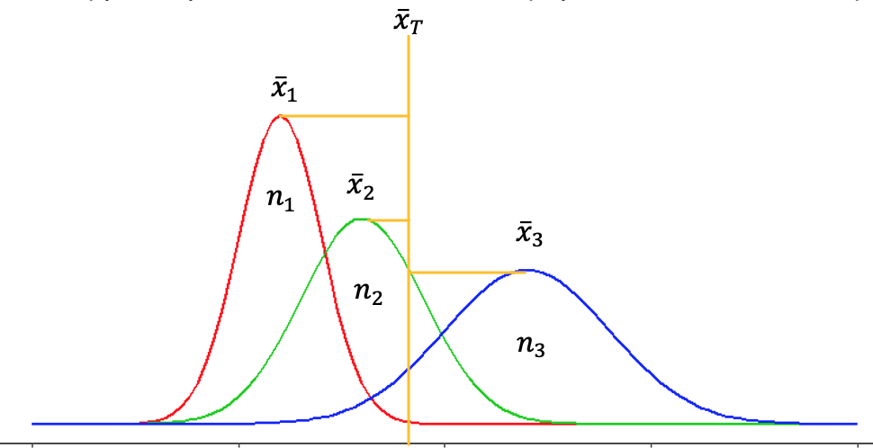
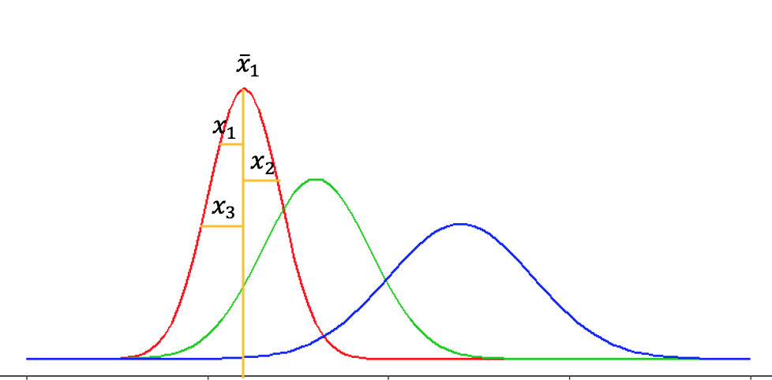

# Pruebas Estadísticas

```{r pruebas-setup, include=FALSE}
library(GMisc) # para intervalos de confianza
library(OneTwoSamples) # para intervalos y pruebas
library(psych)
library(latex2exp)
library(papaja)
library(DescTools) # para pruebas
library(effsize) # para tamanho del efecto
library(effectsize) # para tamanho del efecto
library(MOTE) # para tamanho del efecto
library(itns) # para tamanho del efecto
library(multcomp) # comparaciones multiples
library(ggstatsplot)
library(kableExtra)
library(summarytools)
library(patchwork)
library(janitor)
library(rio)
library(conflicted)
library(tidymodels)
library(tidyverse)

knitr::opts_chunk$set(
  echo = TRUE,
  message = FALSE,
  warning = FALSE,
  error = FALSE,
  # fig.path = "figs/",
  fig.retina = 3,
  fig.width = 8,
  fig.asp = 0.618,
  fig.align = "center",
  out.width = "70%"
)

theme_set(theme_bw(base_size = 12))
conflict_prefer('select','dplyr')
conflict_prefer("cohen.d", "effsize")
conflict_prefer("TeX", "latex2exp")
conflict_prefer("stack", "utils")

U3 = function(m1,m2=0,s=1) {
  m.min = min(c(m1,m2))
  m.max = max(c(m1,m2))
  xmin = m.min - s * 3
  xmax = m.max + s * 3
  flecha = dnorm(m.min,m.min,s) * 1.03
  delta = dnorm(m.min,m.min,s) * 1.1
  
  g = ggplot(NULL,aes(x=seq(xmin,xmax,length.out = 20))) + 
    stat_function(fun = dnorm,args = list(mean=m.min,sd=s),col='blue') +
    stat_function(fun = dnorm,args = list(mean=m.max,sd=s),col='red') +
    stat_function(fun = dnorm,args = list(mean=m.max,sd=s),
                  fill='yellow',geom = 'area',
                  xlim = c(m.min,xmax),alpha=0.5) +
    geom_segment(aes(x=m.min,y=0,xend=m.min,yend=dnorm(m.min,m.min,s)),
                 col='blue',linetype=2) + 
    geom_segment(aes(x=m.max,y=0,xend=m.max,yend=dnorm(m.max,m.max,s)),
                 col='red',linetype=2) + 
    geom_segment(aes(x=m.min,y=flecha,xend=m.max,yend=flecha),
                 arrow = arrow(length = unit(0.03, "npc"),ends = 'both')) + 
    geom_text(aes(x=(m.max+m.min)/2,y=delta,
                  fontface='italic'),
              label=ifelse(m2 == 0, 'd', expression(Delta)),
              size=5) + 
    scale_x_continuous(breaks = pretty_breaks(n = 10)) + 
    scale_y_continuous(labels = NULL,expand = expansion(c(.01,.05))) +
    labs(x='',y='') + 
    theme_classic() + 
    theme(axis.line.y = element_blank(),
          axis.ticks.y = element_blank())
  
  return(g)
}

```

## Introducción

En la sección \@ref(hip) del capítulo anterior se introdujeron las bases teóricas de lo que son las pruebas de hipótesis, las partes o elementos que la componen, y cómo tomar una decisión una vez llevada a cabo la prueba. Este capítulo se centra en la parte práctica de cómo realizar una prueba estadística paramétrica (los pasos generales). Además se introduce el concepto de tamaño del efecto (effect size - ES - en inglés), y de cómo puede éste agregar información después de realizada la prueba, así como la importancia práctica que representa.

## Pruebas paramétricas {#pruebas-param}

De manera general se van a cubrir las pruebas estadísticas homólogas con las estimaciones que se presentaron en el capítulo anterior en la sección [Estimación] (\@ref(estim)), donde la práctica en general es usar un contraste bilateral a menos que sea muy justificado un contraste unilateral. Las pruebas se resumen a continuación y serán detalladas más adelante:

* Prueba $z$ de 1 muestra (\@ref(prueba-z1))
  - $H_0: \mu = \mu_0$
* Prueba $t$ de 1 muestra (\@ref(prueba-t1))
  - $H_0: \mu = \mu_0$
* Prueba $t$ de 2 muestras independientes (\@ref(prueba-t2-ind))
  - $H_0: \mu_1 = \mu_2$
* Prueba $t$ de 2 muestras dependientes (\@ref(prueba-t2-dep))
  - $H_0: \mu_D = 0$
* Prueba $F$ para 2 o más muestras (\@ref(prueba-aov))
  - $H_0: \mu_1 = \mu_2 = \mu_3 = \cdots = \mu_k$
* Prueba $t$ de correlación (\@ref(prueba-t-cor))
  - $H_0: r = 0$
* Prueba $\chi^2$ para 1 varianza (\@ref(prueba-chi))
  - $H_0: \sigma^2 = \sigma^2_0$
* Prueba $F$ para 2 varianzas (\@ref(prueba-f))
  - $H_0: \sigma^2_1 = \sigma^2_2 \to \frac{\sigma^2_1}{\sigma^2_2} = 1$

### Supuestos y Pasos {#supuestos-pasos}

Las pruebas presentadas en este capítulo se conocen como pruebas paramétricas, que a diferencia de las pruebas no-parámetricas que se presentan en el próximo capítulo, hacen supuestos sobre los datos que se van a analizar, siendo el mayor supuesto de que los datos siguen una distribución aproximadamente normal (o se tiene una muestra grande, $n > 30$), y que las muestras son aleatorias independientes (excepto en el caso de datos apareados) [@nolan2014; @triola2004]; en algunos casos pueden haber otros supuestos (parámetros conocidos, varianzas iguales, etc.) pero en general éstos son los más importantes.

Para evaluar la "normalidad" de los datos se pueden generar gráficos como el de caja, histogramas, y QQ (Figura \@ref(fig:normalidad)). El gráfico de caja muestra la mediana y los cuartiles, mientras la mediana no se encuentre muy cerca de alguno de los extremos de la caja se puede considerar normalmente distribuida; en caso de haber valores atípicos (extremos) éstos aparecerían como puntos en los extremos. El gráfico QQ hace una comparación de los valores originales con los cuantiles teóricos, la idea es que si los puntos caen cerca de la línea se puede considerar normalmente distribuida; puede que en las colas haya cierta desviación pero eso es normal siempre y cuando no sea muy extrema. El histograma se puede comparar con una curva normal y ver asimetrías, similar al de caja, mientras las asimetría sea nula o mínima se puede considerar normalmente distribuida. Hay pruebas específicas para evaluar la normalidad (Shapiro-Wilk), pero éstas tienden a ser muy sensibles a desviaciones por lo que en general es más recomendado hacer una evaluación visual

```{r normalidad, echo=FALSE, out.width='90%', fig.cap='Gráficos que se pueden usar para evaluar si los datos siguen una distribución aproximandamente normal. **A** Gráfico de caja. **B** Gráfico QQ. **C** Histograma.'}
n1 = ggplot(airquality,aes('1',Temp)) + 
  geom_boxplot(fill='coral') + 
  labs(x='') + 
  scale_x_discrete(labels = '')
n2 = ggplot(airquality,aes(sample=Temp)) + 
  geom_qq(shape=1,size=2) + 
  geom_abline(slope = sd(airquality$Temp),
              intercept = mean(airquality$Temp),
              col='red',size=1)
n3 = ggplot(airquality,aes(Temp)) + 
  geom_histogram(bins = 15,fill='coral',col='black')
(n1 | n2 | n3) +
  plot_annotation(tag_levels = 'A')
```

@nolan2014 establecen una serie de pasos que se pueden aplicar de manera general a las pruebas estadísticas:

1. Identificar la población, distribución, y la prueba apropiada:
    - En función del parámetro de interés ($\mu, \sigma^2$)
2. Establecer las hipótesis nula y alterna:
    - En función de la prueba escogida en el punto anterior ($z,t,\chi^2,F$)
3. Determinar parámetros de la distribución a comparar ($H_0$):
    - En función del parámetro de interés y datos disponibles
4. Determinar valores críticos
    - En función de la distribución y el nivel de significancia ($\alpha$)
5. Calcular el estadístico de prueba
    - En función de la prueba escogida y datos disponibles
    - Aquí se puede agregar calcular los intervalos de confianza respectivos
6. Tomar una decisión
    - En función de valores críticos y estadístico de prueba, valor-*p*, o intervalos de confianza

Si se rechaza $H_0$ se dice que hay un resultado __*estadísticamente significativo*__. Esta aseveración se refiere a que hay poca probabilidad de que los datos observados provengan de una población representada por $H_0$. El hecho de que se rechace $H_0$ y se obtenga un resultado __*estadísticamente significativo*__ no quiere decir que éste sea importante desde el punto de vista práctico [@nolan2014]. Esto último es lo que va a indicar el tamaño del efecto.

## Tamaño del Efecto {#ES-p}

Cuando una prueba da un resultado estadísticamente significativo, quiere decir que se determinó que hay una diferencia o relación. Como se mencionó en el capítulo anterior, este resultado se va a ver afectado directamente por el tamaño de la muestra, por lo que en el caso de muestras grandes casi siempre se va a encontrar un resultado estadísticamente significativo, aun cuando la diferencia o relación real sea pequeña. El tamaño del efecto (ES) es lo que indica la magnitud real de esa diferencia o relación, no se ve afectada por el tamaño de la muestra, e indica la importancia práctica de un efecto, y debe ser el objetivo a la hora de realizar análisis estadísticos [@cohen1988; @cumming2012; @cumming2017; @nolan2014].

El tamaño del efecto puede presentarse en las unidades originales o de forma estandarizada (más usadas) y se reconocen dos familias: diferencia entre medias (familia $d$ y sus variantes), asociación/relación entre variables (familia $r$ y similares como $R^2, \eta^2, V$), y dentro de lo posible es recomendable incluir intervalos de confianza [@cohen1988; @cumming2012; @cumming2017; @lakens2013fp; @nakagawa2007br]. Para los tamaños de efecto es complicado calcular de forma manual los intervalos de confianza, en la mayoría de los casos se usa la distribución $t$ no-central, por lo que se recomienda utilizar métodos computacionales [@cumming2012; @cumming2017].

A parte de presentar los resultados de pruebas estadísticas, sea que se rechace o no la hipótesis nula, es necesario incluir el tamaño del efecto para brindar una mejor idea del resultado encontrado, así como para posibles usos en futuros estudios (meta-análisis, cálculos de tamaños de muestra, potencia, etc.), y generar una base de resultados reportados en un área específica del saber para determinar qué se puede considerar como un efecto pequeño, mediano o grande [American Psycological Association [APA] -@americanpsychologicalassociation2010; @cumming2012; @cumming2017; @nakagawa2007br; @thompson2007ps; @tomczak2014tss].

La diferencia entre medias estandarizada se conoce como Cohen $d$ [@cohen1988], de manera general se presenta en la Ecuación \@ref(eq:cohen-d-pop), y se puede visualizar en la Figura \@ref(fig:cohen-d). Se interpreta de manera similar a $Z$, donde la diferencia entre medias está dada en función de una desviación estándar. La desviación estándar (denominador) es la que va a cambiar dependiendo de la prueba y condiciones de la misma (Tabla \@ref(tab:ES-p)).

\begin{equation}
  d = \frac{\bar{x}_1-\bar{x}_2}{\sigma}
  (\#eq:cohen-d-pop)
\end{equation}

```{r cohen-d, echo=FALSE, fig.cap='Representación del Cohen $d$.'}
ggplot(NULL,aes(x=10:45)) + 
  stat_function(fun = dnorm,args = list(mean=25,sd=5),col='blue') +
  stat_function(fun = dnorm,args = list(mean=30,sd=5),col='red') + 
  geom_segment(aes(x=25,y=0,xend=25,yend=dnorm(25,25,5)),
               col='blue',linetype=2) + 
  geom_segment(aes(x=30,y=0,xend=30,yend=dnorm(30,30,5)),
               col='red',linetype=2) + 
  geom_segment(aes(x=25,y=.083,xend=30,yend=.083),
               arrow = arrow(length = unit(0.03, "npc"),ends = 'both')) + 
  geom_text(aes(x=27.5,y=0.088,label='d',fontface='italic'),size=10) + 
  geom_hline(yintercept = -.001) + 
  theme_void()
```

Hay dos factores que controlan el tamaño de $d$, primero al incrementar la diferencia entre medias (manteniendo la dispersión constante) mayor será $d$, segundo al disminuir la dispersión (manteniendo la diferencia de medias constante) mayor será $d$. Estos dos factores van a influenciar el traslape entre las curvas, donde a mayor $d$ menor el traslape y mayor la diferencia entre las curvas y las muestras. Al igual que $Z$ puede tomar valores de $-∞$ a $∞$. 

Dada la naturaleza estadística del Cohen $d$ y la dificultad de su interpretación para personas con poco conocimiento estadístico, se han generado otras métricas comparables que pueden ser más fáciles de entender en términos generales. @grissom2005, @mcgraw1992pb, y @ruscio2008pm desarrollaron el concepto de probabilidad de superioridad (PS) o lenguaje común del tamaño del efecto (CL) el cuál se puede calcular de acuerdo a la Ecuación \@ref(eq:PS). Este concepto se interpreta como la probabilidad de que un elemento del grupo con media superior (elegido al azar) tenga un valor superior al de un elemento del grupo con media inferior, y al ser una probabilidad se encuentra entre 0 y 100%, conforme mayor sea $d$ mayor será PS. @reiser1999jrss modificaron de @cohen1988 el traslape (OVL) entre las curvas (grupos), dado por la Ecuación \@ref(eq:traslape), donde a mayor $d$ menor el traslape y más diferenciados los grupos. @cohen1988 definió el concepto de $U_3$, denominado la medida de no-traslape, presentado en Ecuación \@ref(eq:U3), y se puede interpretar como el porcentaje del grupo con media superior que va a estar por encima de la media del grupo con media inferior. Para todos estos casos $\Phi$ corresponde con la función de densidad acumulada de la distribución normal estándar $Z$. *Cabe resaltar que éstos conceptos y cálculos se basan en grupos de mismo tamaño y misma desviación estándar*.Un muy buen recurso para visualizar todos estos conceptos lo brinda @magnusson2020 en [Interpreting Cohen's d](https://rpsychologist.com/d3/cohend/).

\begin{equation}
  PS = CL = \Phi \left( \frac{|d|}{\sqrt{2}} \right)
  (\#eq:PS)
\end{equation}

\begin{equation}
  OVL = 2 \Phi \left( \frac{-|d|}{2} \right)
  (\#eq:traslape)
\end{equation}

\begin{equation}
  U_3 = \Phi \left( |d| \right)
  (\#eq:U3)
\end{equation}

Aquí se presenta cómo calcular estos conceptos en **R**, donde el único dato necesario es el $d$.

```{r PS-OVL-U3}
d = 2
pnorm(abs(d)/sqrt(2))*100 # PS, CL
2*pnorm(-abs(d)/2)*100 # traslape
pnorm(abs(d))*100 # U3
```

Muchos autores han trabajado en este tema, proponiendo mejoras a los tamaños de efecto inicialmente planteados y resumiendo los diferentes tamaños de efecto para las diferentes pruebas y condiciones [@cohen1988; @cumming2012; @cumming2017; @ellis2010; @grissom2005; @hedges1985; @lakens2013fp; @mcgrath2006pm; @mcgraw1992pb; @nakagawa2007br; @thompson2007ps; @tomczak2014tss; @zou2007pm; @fritz2012joepg]. Aquí se presenta un resumen de los diferentes tamaños de efecto (Tabla \@ref(tab:ES-p)) y se remite al lector a revisar las referencias aquí mencionadas y las que se incluyen en las mismas, en el caso de querer ahondar en alguno de los casos presentados.

```{r ES-p, echo=FALSE}
ESp = tibble(
  Prueba = c('Z de 1 muestra',
             't de 1 muestra',
             't de 2 muestras independientes',
             't de 2 muestras dependientes usando la desviación de las diferencias',
             't de 2 muestras dependientes tomando en cuenta la correlación',
             't de 2 muestras dependientes usando el promedio de las desviaciones',
             't con corrección de Hedges',
             'Correlación punto biserial a partir de $d_s$ para 2 muestras independientes',
             'Correlación',
             'Regresión',
             'ANOVA',
             'ANOVA'),
  ES = c('\\begin{equation}
              d_{pop} = \\frac{\\bar{x}-\\mu_0}{\\sigma}
              (\\#eq:d-pop)
              \\end{equation}',
         '\\begin{equation}
              d_s = \\frac{\\bar{x}-\\mu_0}{s}
              (\\#eq:d-t1)
              \\end{equation}',
         '\\begin{equation}
              d_s = \\frac{\\bar{x}_1-\\bar{x}_2}{\\sqrt{\\frac{(n_1-1)s_1^2 + (n_2-1)s_2^2}{n_1 + n_2 - 2}}}
              (\\#eq:d-t2-d)
              \\end{equation}',
         '\\begin{equation}
              d_z = \\frac{\\bar{x}_d}{s_d}
              (\\#eq:d-t2-dep1)
              \\end{equation}',
         '\\begin{equation}
              d_{rm} = \\frac{\\bar{x}_d}{\\sqrt{s_1^2 + s_2^2 - 2 \\cdot r \\cdot s_1 \\cdot s_2}}\\sqrt{2(1-r)}
              (\\#eq:d-t2-dep2)
              \\end{equation}',
         '\\begin{equation}
              d_{av} = \\frac{\\bar{x}_d}{\\sqrt{\\frac{s_1^2 + s_2^2}{2}}}
              (\\#eq:d-t2-dep3)
              \\end{equation}',
         '\\begin{equation}
              g = d \\cdot \\left( 1 - \\frac{3}{4v-1} \\right)
              (\\#eq:d-g)
              \\end{equation}',
         '\\begin{equation}
              r_{pb} = \\frac{d_s}{\\sqrt{d_s^2 + \\frac{(n_1 + n_2)^2}{n_1  n_2}}}
              (\\#eq:r-pb)
              \\end{equation}',
         '\\begin{equation}
              r
              (\\#eq:r)
              \\end{equation}',
         '\\begin{equation}
              R^2
              (\\#eq:r2)
              \\end{equation}',
         '\\begin{equation}
              \\eta^2 = \\frac{SC_{efecto}}{SC_{total}}
              (\\#eq:eta2-1)
              \\end{equation}',
         '\\begin{equation}
              \\eta_p^2 = \\frac{SC_{efecto}}{SC_{efecto}+SC_{error}}
              (\\#eq:eta2-2)
              \\end{equation}')
) 

ESp %>% 
  kable(col.names = c('Prueba',
                      'Tamaño de efecto'
                      ),
        caption = 'Tamaños de efecto estandarizados para pruebas paramétricas',
        align = 'c',
        escape = F) %>% 
  kable_styling(full_width = T) %>% 
  column_spec(1,width = '15em') %>% 
  column_spec(2,width = '25em') %>% 
  footnote(general_title = 'Notas:',
           general = c('$\\mu_0$ = media poblacional',
                       '$\\sigma$ = desviación estándar poblacional',
                       '$\\bar{x}_k$ = media muestral de $k$',
                       '$s_k$ = desviación estándar muestral de $k$',
                       '$s_k^2$ = varianza muestral de $k$',
                       '$n_k$ = tamaño de muestra de $k$',
                       '$v$ = grados de libertad',
                       '$\\bar{x}_d$ = media de la diferencia entre muestras',
                       '$s_d$ = desviación estándar de la diferencia entre muestras',
                       '$r$ = coeficiente de correlación de Pearson',
                       '$r_{pb}$ = coeficiente de correlación punto biserial',
                       '$SC$ = suma de cuadrados en ANOVA'
                       ))
```

La Tabla \@ref(tab:ES-p) presenta ambas familias de tamaños de efecto, donde $r$ y $R^2$ se interpretan como en las secciones \@ref(bivar-cor) y \@ref(bivar-reg-r2), respectivamente. $\eta^2$ se interpreta igual a $R^2$, como el porcentaje de variación en la variable respuesta explicado por la variable predictora [@cohen1988; @lakens2013fp; @tomczak2014tss].

Una pregunta que puede surgir es qué magnitud de los diferentes tamaños de efecto se puede considerar pequeña, mediana, o grande. @cohen1988 sugirió unos valores que se pueden usar como guías (Tabla \@ref(tab:ES-p-clas)), los cuales han surgido y fueron determinados como tales en las ciencias sociales. El mismo autor advierte sobre utilizar estos valores como definitivos y estrictos, y menciona que se debe aplicar criterio de experto en el área específica para determinar que califica como pequeño, mediano, o grande.

```{r ES-p-clas, echo=FALSE}
ESpc = tibble(Prueba = c('Comparación de medias',
                         'Correlación',
                         'Correlación',
                         'Correlación',
                         'Regresión',
                         'ANOVA'),
              ES = c('$d$, $g$',
                     '$r$',
                     '$R^2$',
                     '$r_{pb}$',
                     '$R^2$',
                     '$\\eta^2$'),
              peque = c(0.20,0.10,0.01,0.10,0.02,0.01),
              mediana = c(0.50,0.30,0.09,0.24,0.13,0.06),
              grande = c(0.80,0.50,0.25,0.37,0.26,0.14)
              )

ESpc %>% 
  kable(col.names = c('Prueba',
                      'Tamaño de efecto',
                      'Pequeño',
                      'Mediano',
                      'Grande'
                      ),
        caption = 'Clases comúnmente usadas para diferentes tamaños de efecto',
        align = 'c',
        escape = F) %>% 
  kable_styling(full_width = T) %>% 
  add_header_above(c(' ' = 2, 'Clases del tamaño del efecto' = 3)) %>% 
  collapse_rows(columns = 1, valign = "top") %>% 
  footnote(general_title = 'Nota:',
           general = c('Conforme @cohen1988'),
           footnote_as_chunk = T)
```

## $z$ de 1 muestra {#prueba-z1}

El uso de la prueba $z$ de 1 muestra se realiza con el ejemplo de la sección \@ref(estim-ic-z) [@walpole2012], donde se tenía una media muestral de $2.6 \ g/ml$ para una muestra de tamaño 36 y se asumía una desviación poblacional de $0.3 \ g/ml$. Es posible que esta muestra provenga de una población con media 2.8 ($\mu_0=2.8$)? Asuma $\alpha = 0.05$.

Usando los pasos mencionados anteriormente (\@ref(supuestos-pasos)) se tiene:

1. Identificar la población, distribución, y la prueba apropiada:
    - Población: concentración de zinc en un río
    - Distribución: de medias
    - Prueba: $Z$ de 1 muestra porque se tiene 1 muestra, se quiere comparar con un valor hipotético, y se tiene $\sigma$
2. Establecer las hipótesis nula y alterna:
    - $H_0: \mu = \mu_0 \to$ La concentración de zinc en el río es *igual* a un valor hipotético o conocido (2.8)
    - $H_1: \mu \neq \mu_0 \to$ La concentración de zinc en el río es *diferente* a un valor hipotético o conocido (2.8)
3. Determinar parámetros de la distribución a comparar ($H_0$):
    - $\mu_0 = 2.8$
    - $\sigma_\bar{x} = \frac{\sigma}{\sqrt{n}} = \frac{0.3}{\sqrt{36}} = 0.05$
4. Determinar valores críticos
    - $\alpha = 0.05$
    - $z_{\alpha/2} = z_{0.05/2} = |1.96|$
5. Calcular el estadístico de prueba
    - $Z = \frac{\bar{x} - \mu}{\sigma_\bar{x}} = \frac{2.6 - 2.8}{0.05} = -4$
    - $2.6 \pm 0.1 \to 95\% \ IC \ [2.50,2.70]$
6. Tomar una decisión
    - El estadístico de prueba es mayor al crítico, $z > z_{\alpha/2}$
    - El valor-*p* es menor a $\alpha = 0.05$, $p < .001$
    - El valor hipotético del parámetro cae fuera del intervalo de confianza, $IC \ [2.50,2.70]$
    - *Decisión*: Se rechaza $H_0$

En **R** el paquete *DescTools* tiene la función `ZTest` para realizar esta prueba, pero necesita un vector de datos, por lo que se genera un vector aleatorio, y se demuestra a continuación.

```{r z1}
x = 2.6
n = 36
sig = 0.3
mu0 = 2.8
a = 0.05

set.seed(123)
vec = rnorm(n = n, mean = x, sd = sig)

z1.res = ZTest(vec, 
               mu = mu0, # valor del parámetro a comparar
               sd_pop = sig, # deviación poblacional
               conf.level = 1-a) # nivel de confianza
z1.res
```

El tamaño del efecto se puede calcular de acuerdo a la Ecuación \@ref(eq:d-pop) de la siguiente manera:

\begin{equation}
  d_{pop} = \frac{\bar{x}-\mu_0}{\sigma}\\
  d_{pop} = \frac{2.6-2.8}{0.3} = -0.67
\end{equation}

En **R** se puede calcular de forma básica y el intervalo de confianza con la función `d.ci` del paquete *psych* [@R-psych], donde es necesario indicar $d$ y $n$.

```{r dpop}
dpop = (x - mu0) / sig

dpop.ci = d.ci(dpop,n1=n) %>% round(2)
dpop.ci
```

```{r echo=F}
z1.apa = apa_print.htest(z1.res,n = n)
```

Usando las medidas PS, OVL, y $U_3$ (Figura \@ref(fig:z1-u3)).

```{r echo=FALSE}
tibble(PS = pnorm(abs(dpop)/sqrt(2))*100,
       OVL = 2*pnorm(-abs(dpop)/2)*100,
       U3 = pnorm(abs(dpop))*100) %>% 
  round(1)
```

```{r z1-u3, echo=FALSE, warning=FALSE, fig.cap='$U_3$ para el ejemplo de la prueba $z$ de 1 muestra. **A** Corresponde con los datos en escala original. **B** Corresponde con el tamaño del efecto $d$.'}
u.z1.1 = U3(m1 = 2.6,
            m2 = 2.8,
            s = .3)
u.z1.2 = U3(dpop)
(u.z1.1 / u.z1.2) + 
  plot_annotation(tag_levels = 'A')
```

> Conclusión: La concentración de zinc (`r z1.apa$estimate %>% str_replace('CI','IC')`) es significativamente diferente a la media de 2.8 g/ml, `r z1.apa$statistic %>% str_replace('z',str_glue('z({n})'))`, $d = `r dpop.ci[2]` \ [`r dpop.ci[1]`, `r dpop.ci[3]`]$. El efecto se puede considerar mediano, pero con un rango de pequeño hasta muy grande. Hay una probabilidad de 68.1% (PS) que un elemento de la población hipotética tenga una concentración mayor a un elemento de la muestra; las dos curvas se traslapan en un 73.9% (OVL); el 74.8% ($U_3$) de la población hipotética se encuentra por encima de la media de la muestra.

## $t$ de 1 muestra {#prueba-t1}

El uso de la prueba $t$ de 1 muestra se realiza con el ejemplo de la sección \@ref(estim-ic-t) [@swan1995], donde se tenía el contenido de cuarzo en secciones delgadas de una roca ígnea. Es posible que esta muestra provenga de una población con media 20% ($\mu_0=20$)? Asuma $\alpha = 0.05$.

1. Identificar la población, distribución, y la prueba apropiada:
    - Población: contenido de cuarzo en la roca ígnea
    - Distribución: de medias
    - Prueba: $t$ de 1 muestra porque se tiene 1 muestra, se quiere comparar con un valor hipotético, y no se tiene $\sigma$
2. Establecer las hipótesis nula y alterna:
    - $H_0: \mu = \mu_0 \to$ El contenido de cuarzo en la roca ígnea es *igual* a un valor hipotético o conocido (20)
    - $H_1: \mu \neq \mu_0 \to$ El contenido de cuarzo en la roca ígnea es *diferente* a un valor hipotético o conocido (20)
3. Determinar parámetros de la distribución a comparar ($H_0$):
    - $\mu_0 = 20$
    - $s_\bar{x} = \frac{s}{\sqrt{n}} = \frac{3.083}{\sqrt{8}} = 1.09$
4. Determinar valores críticos
    - $\alpha = 0.05$
    - $t_{\alpha/2,v} = t_{0.05/2,7} = |2.365|$
5. Calcular el estadístico de prueba
    - $t = \frac{\bar{x} - \mu}{s_\bar{x}} = \frac{21.5 - 20}{1.09} = 1.37$
    - $21.512 \pm 2.578 \to 95\% \ IC \ [18.93, 24.09]$
6. Tomar una decisión
    - El estadístico de prueba es menor al crítico, $t < t_{\alpha/2,v}$
    - El valor-*p* es mayor a $\alpha = 0.05$, $p = 0.2079$
    - El valor hipotético del parámetro cae dentro del intervalo de confianza, $IC \ [18.93, 24.09]$
    - *Decisión*: No se rechaza $H_0$

**R** trae la función `t.test` que puede realizar las diferentes pruebas $t$. Para el caso de 1 muestra se brinda el vector de datos, la media poblacional con la cual comparar (`mu`), y el nivel de confianza.

```{r}
mu0 = 20
a = 0.05

cuarzo = c(23.5, 16.6, 25.4, 19.1, 19.3, 22.4, 20.9, 24.9)

t1.res = t.test(cuarzo, 
                mu = mu0, 
                conf.level = 1-a)
t1.res
```

El tamaño del efecto se puede calcular de acuerdo a la Ecuación \@ref(eq:d-t1) de la siguiente manera:

\begin{equation}
  d_s = \frac{\bar{x}-\mu_0}{s}\\
  d_s = \frac{21.5-20}{3.083} = 0.49
\end{equation}

En **R** se puede calcular con la función `d.single.t` del paquete *MOTE* [@R-MOTE], donde es necesario indicar la media muestral, media poblacional a comparar, desviación estándar muestral, tamaño de la muestra, y nivel de significancia.

```{r}
d.t1.res = d.single.t(m = mean(cuarzo), 
                      u = mu0, 
                      sd = sd(cuarzo), 
                      n = length(cuarzo), 
                      a = a)
d.t1.res[1:3] %>% unlist()
```

```{r echo=F}
t1.apa = apa_print(t1.res)
```

Usando las medidas PS, OVL, y $U_3$ (Figura \@ref(fig:t1-u3)).

```{r echo=FALSE}
tibble(PS = pnorm(abs(d.t1.res$d)/sqrt(2))*100,
       OVL = 2*pnorm(-abs(d.t1.res$d)/2)*100,
       U3 = pnorm(abs(d.t1.res$d))*100) %>% 
  round(1)
```

```{r t1-u3, echo=FALSE, warning=FALSE, fig.cap='$U_3$ para el ejemplo de la prueba $t$ de 1 muestra. **A** Corresponde con los datos en escala original. **B** Corresponde con el tamaño del efecto $d$.'}
u.t1.1 = U3(m1 = 21.5,
          m2 = 20,
          s = 3.083)
u.t1.2 = U3(d.t1.res$d)
(u.t1.1 / u.t1.2) + 
  plot_annotation(tag_levels = 'A')
```

> Conclusión: El contenido de cuarzo de la roca ígnea (`r t1.apa$estimate %>% str_replace('CI','IC')`) no es significativamente diferente a la media de 20% , `r t1.apa$statistic`, `r d.t1.res$estimate %>% str_sub(end = 10)` $`r d.t1.res$estimate %>% str_sub(start = 21)`$. El efecto se puede considerar mediano, pero con un rango de pequeño, en dirección opuesta, hasta muy grande. Hay una probabilidad de 63.6% (PS) que un elemento de la muestra tenga un contenido de cuarzo mayor a un elemento de la población hipotética; las dos curvas se traslapan en un 80.6% (OVL); el 68.8% ($U_3$) de la muestra se encuentra por encima de la media de la población hipotética.

```{r echo=FALSE}
t1.stats = TeX(str_interp("$\\mathit{t}(${t1.res$parameter}) = ${apa(t1.res$statistic,2)}, \\mathit{p} ${printp(t1.res$p.value,add_equals = T)}, \\mathit{d} = ${apa(d.t1.res[[1]],2)}, IC_{${(1-a)*100}%} \\[${apa(d.t1.res[[2]],2)}, ${apa(d.t1.res[[3]],2)}\\]"))
```

```{r t1-stats, echo=FALSE, out.width='90%', fig.cap='Histograma del contenido de cuarzo, mostrando la media muestral (azul) y el valor a comparar (rojo), así como el resumen estadístico respectivo.'}
Q = tibble(Q = cuarzo)
gghistostats(Q,Q,type = 'p',
             bf.message = F,
             results.subtitle = F,
             xlab = 'Contenido de cuarzo (%)',
             test.value = mu0,test.value.line = T,
             test.value.line.args = list(col='red',size=1),
             test.value.label.args = list(col='red',size=3),
             subtitle = t1.stats)
```

## $t$ de 2 muestras independientes {#prueba-t2-ind}

Para este caso es cuando, en teoría, se debiera cumplir no solo la normalidad de las muestras, sino también la igualdad de varianzas. Si se quiere relajar el supuesto de igualdad de varianzas se usa el estadístico Welch o Welch-Satterthwaite (\@ref(estim-ic-t2-ind) - varianzas diferentes). En general la diferencia entre asumir igualdad de varianzas o no va a ser pequeña, siempre y cuando éstas no sean muy diferentes y los tamaños de muestra no sean muy disparejos, y es recomendado indicar qué método se usó [@cumming2017].

El uso de la prueba $t$ de 2 muestras independientes se realiza con el ejemplo de la sección \@ref(estim-ic-t2-ind) [@swan1995], el de varianzas iguales, donde se tenían braquiópodos en dos capas (A, B) y se les midió la longitud (cm). Es posible que estas muestras provenga de una misma población ($\mu_1=\mu_2$)? Asuma $\alpha = 0.05$.

1. Identificar la población, distribución, y la prueba apropiada:
    - Población: braquiópodos en capas A y B
    - Distribución: diferencia de medias
    - Prueba: $t$ de 2 muestras independientes porque se tienen 2 muestras, y las dos provienen de sitios diferentes (independientes uno del otro)
2. Establecer las hipótesis nula y alterna:
    - $H_0: \mu_1 = \mu_2 \to$ La longitud e los braquiópodos en la capa A es *igual* a la longitud e los braquiópodos en la capa B
    - $H_1: \mu \neq \mu_0 \to$ La longitud e los braquiópodos en la capa A es *diferente* la longitud e los braquiópodos en la capa B
3. Determinar parámetros de la distribución a comparar ($H_0$):
    - $\mu_1 - \mu_2 = 0$
    - $s_p = \sqrt{\frac{(n_1-1)s_1^2 + (n_2-1)s_2^2}{n_1 + n_2 - 2}} = \sqrt{\frac{(8-1)0.042 + (10-1)0.029}{8 + 10 - 2}} = 0.1865$
    - $s_{\bar{x}_1-\bar{x}_2} = s_p \sqrt{\frac{1}{n_1} + \frac{1}{n_2}} = 0.1865 \sqrt{\frac{1}{8} + \frac{1}{10}} = 0.0885$
4. Determinar valores críticos
    - $\alpha = 0.05$
    - $t_{\alpha/2,v} = t_{0.05/2,16} = |2.12|$
5. Calcular el estadístico de prueba
    - $t = \frac{(\bar{x}_1-\bar{x}_2) - (\mu_1-\mu_2)}{s_{\bar{x}_1-\bar{x}_2}} = \frac{(3.125-2.96) - 0}{0.0885} = 1.86$
    - $0.165 \pm 0.1876 \to 95\% \ IC \ [-0.023,0.353]$
6. Tomar una decisión
    - El estadístico de prueba es menor al crítico, $t < t_{\alpha/2,v}$
    - El valor-*p* es mayor a $\alpha = 0.05$, $p = 0.081$
    - El valor de $0$ cae dentro del intervalo de confianza, $IC \ [-0.023,0.353]$
    - *Decisión*: No se rechaza $H_0$

**R** trae la función `t.test` que puede realizar las diferentes pruebas $t$. Para el caso de 2 muestras independientes se brindan los vectores de datos, el indicador lógico de si las varianzas se deben considerar iguales, y el nivel de confianza.

```{r}
a = 0.05

A = c(3.2, 3.1, 3.1, 3.3, 2.9, 2.9, 3.5, 3.0)
B = c(3.1, 3.1, 2.8, 3.1, 3.0, 2.6, 3.0, 3.0, 3.1, 2.8)

t2.ind.res = t.test(x = A,
                    y = B,
                    var.equal = T, 
                    conf.level = 1-a)
t2.ind.res
```

Como se mencionó en la sección \@ref(estim-ic-t2-ind), las pruebas de hipótesis se pueden aproximar por medio de la estimación, más específicamente, los intervalos de confianza (Figura \@ref(fig:t2-ind-ci)), siguiendo las guías de @cumming2005ap, @cumming2012, y @cumming2017. El intervalo de confianza para el parámetro de interés se puede comparar con $H_0$, y se puede obtener la misma conclusión a realizar la prueba estadística.

```{r t2-ind-ci, echo=FALSE, fig.cap='Intervalos de confianza para la prueba t de 2 muestras independientes. El valor de 0 cae dentro del intervalo de confianza para la diferencia, por lo que se pueden considerar iguales o que no hay diferencia entre las capas.'}
NewStats_2samples(A,B,ylab.diff = 'Diferencia') + 
  labs(y = 'Longitud (cm)') + 
  scale_x_discrete(labels = c('A','B','Diferencia'))
```

El tamaño del efecto se puede calcular de acuerdo a las Ecuaciones \@ref(eq:d-t2-d) y \@ref(eq:d-g), donde de manera general se usa la desviación agrupada (pooled standard deviation ,$s_p$) como el estandarizador, sin importar si se asumen varianzas iguales o no para la prueba, pero es buena práctica reportar qué se uso como estandarizador [@cumming2017].

\begin{equation}
  d_s = \frac{\bar{x}_1-\bar{x}_2}{\sqrt{\frac{(n_1-1)s_1^2 + (n_2-1)s_2^2}{n_1 + n_2 - 2}}}\\
  d_s = \frac{3.125-2.96}{\sqrt{\frac{(8-1)0.042 + (10-1)0.029}{8 + 10 - 2}}} = 0.88
\end{equation}

\begin{equation}
  g_s = d_s \cdot \left( 1 - \frac{3}{4v-1} \right)\\
  g_s = 0.88 \cdot \left( 1 - \frac{3}{4(16)-1} \right) = 0.84
\end{equation}

La corrección de Hedges ($g_s$) se usa ya que $d_s$ se considera un estimador sesgado (biased) especialmente para muestras pequeñas, conforme mayor sea el tamaño de muestra más similares $d_s$ y $g_s$ [@cumming2012; @cumming2017; @fritz2012joepg; @mcgrath2006pm].

En **R** se puede calcular $d_s$ con la función `d.ind.t` y $g_s$ con la función `g.ind.t` del paquete *MOTE*, donde es necesario indicar la media muestral de ambas muestras, desviación estándar muestral de ambas muestras, tamaño ambas muestras, y nivel de significancia. Adicionalmente existen las funciones `cohens_d` y `hedges_g` de *effectsize* [@R-effectsize], y `cohen.d` de *effsize* [@R-effsize].

Usando *MOTE*

```{r}
d.t2.ind.res = d.ind.t(m1 = mean(A), m2 = mean(B), 
                       sd1 = sd(A), sd2 = sd(B), 
                       n1 = length(A), n2 = length(B),
                       a = a)
d.t2.ind.res[1:3] %>% unlist()
```

```{r}
g.t2.ind.res = g.ind.t(m1 = mean(A), m2 = mean(B), 
                       sd1 = sd(A), sd2 = sd(B), 
                       n1 = length(A), n2 = length(B),
                       a = a)
g.t2.ind.res[1:3] %>% unlist()
```

Usando *effectsize*

```{r}
cohens_d(A,B,
         ci = 1-a)
hedges_g(A,B,
         ci = 1-a)
```

Usando *effsize*

```{r}
cohen.d(A,B,
        conf.level = 1-a,
        noncentral=T)
cohen.d(A,B,
        conf.level = 1-a,
        hedges.correction = T,
        noncentral=T)
```

```{r echo=F}
t2.ind.apa = apa_print(t2.ind.res, digits = 3)
```

Usando las medidas PS, OVL, y $U_3$ (Figura \@ref(fig:t2-ind-u3)).

```{r echo=FALSE}
tibble(PS = pnorm(abs(d.t2.ind.res$d)/sqrt(2))*100,
       OVL = 2*pnorm(-abs(d.t2.ind.res$d)/2)*100,
       U3 = pnorm(abs(d.t2.ind.res$d))*100) %>% 
  round(1)
```

```{r t2-ind-u3, echo=FALSE, warning=FALSE, fig.cap='$U_3$ para el ejemplo de la prueba $t$ de 2 muestras independientes. **A** Corresponde con los datos en escala original. **B** Corresponde con el tamaño del efecto $d$.'}
u.ind1 = U3(m1 = 3.125,
            m2 = 2.96,
            s = .186)
u.ind2 = U3(d.t2.ind.res$d)
(u.ind1 / u.ind2) +
  plot_annotation(tag_levels = 'A')
```

> Conclusión: La longitud de los braquiópodos en la capa A no es significativamente diferente de la longitud de los braquiópodos en la capa B (`r t2.ind.apa$estimate %>% str_replace('CI','IC')`), `r t2.ind.apa$statistic`, `r d.t2.ind.res$estimate %>% str_sub(end = 12)` $`r d.t2.ind.res$estimate %>% str_sub(start = 23)`$. El efecto se puede considerar grande, pero con un rango de muy pequeño, en dirección opuesta, hasta muy grande. Hay una probabilidad de 73.4% (PS) que un elemento de la muestra A tenga una longitud mayor que un elemento de la muestra B; las dos curvas se traslapan en un 65.9% (OVL); el 81.8% ($U_3$) de la muestra A se encuentra por encima de la media de la muestra B.

```{r echo=FALSE}
t2.ind.stats = TeX(str_interp("$\\mathit{t}(${t2.ind.res$parameter}) = ${apa(t2.ind.res$statistic,2)}, \\mathit{p} ${printp(t2.ind.res$p.value,add_equals = T)}, \\mathit{g} = ${apa(g.t2.ind.res[[1]],2)}, IC_{${(1-a)*100}%} \\[${apa(g.t2.ind.res[[2]],2)}, ${apa(g.t2.ind.res[[3]],2)}\\]"))
```

```{r t2-ind-stats, echo=FALSE, out.width='90%', fig.cap='Gráfico de caja mostrando el efecto de la capa sobre la longitud de los braquiópodos, así como el resumen estadístico respectivo.'}
braq = stack(list(A=A,
                  B=B)) %>% 
  mutate(ranking = rank(values))

ggbetweenstats(braq,ind,values,
               type = 'p',
               plot.type = 'box',
               pairwise.comparisons = T,
               pairwise.display = 'all',
               var.equal = T,
               bf.message = F,
               results.subtitle = F,
               sample.size.label = F,
               xlab = 'Capa',ylab = 'Longitud (cm)',
               subtitle = t2.ind.stats)
```

## $t$ de 2 muestras dependientes {#prueba-t2-dep}

Estas muestras que miden la misma observación (objeto, sujeto) más de una vez también se conocen como *muestras pareadas* o *mediciones repetidas* (repeated measures - en inglés).

El uso de la prueba $t$ de 2 muestras dependientes se realiza con el ejemplo de la sección \@ref(estim-ic-t2-dep) [@mckillup2010], donde se tenía el contenido de $FeO$ en porcentaje de peso para 10 granitos que fueron preparados a diferentes tamaños de grano: $< 25 \ \mu m$ y $< 125 \ \mu m$. Hay un efecto en el tratamiento, en este caso, cambio del tamaño de grano ($\mu_D=0$)? Asuma $\alpha = 0.05$.

1. Identificar la población, distribución, y la prueba apropiada:
    - Población: contenido de $FeO$ a diferentes tamaños de grano: $< 25 \ \mu m$ y $< 125 \ \mu m$
    - Distribución: media de las diferencia
    - Prueba: $t$ de 2 muestras dependientes porque se tienen los mismos elementos antes y después de un tratamiento (cambio de tamaño de grano)
2. Establecer las hipótesis nula y alterna:
    - $H_0: \mu_D = 0 \to$ El contenido de $FeO$ es *igual* a los diferentes tamaños de grano
    - $H_1: \mu_D \neq 0 \to$ El contenido de $FeO$ es *diferente* a los diferentes tamaños de grano
3. Determinar parámetros de la distribución a comparar ($H_0$):
    - $\mu_D  = 0$
    - $s_{\bar{x}_d} = \frac{s_d}{\sqrt{n}} = \frac{0.1247}{\sqrt{10}} = 0.0394$
4. Determinar valores críticos
    - $\alpha = 0.05$
    - $t_{\alpha/2,v} = t_{0.05/2,9} = |2.262|$
5. Calcular el estadístico de prueba
    - $t = \frac{\bar{x}_d}{s_{\bar{x}_d}} = \frac{0.1}{0.0394} = 2.538$
    - $0.1 \pm 0.0981 \to 95\% \ IC \ [0.0108,0.189]$
6. Tomar una decisión
    - El estadístico de prueba es mayor al crítico, $t > t_{\alpha/2,v}$
    - El valor-*p* es menor a $\alpha = 0.05$, $p = 0.032$
    - El valor de $0$ no cae dentro del intervalo de confianza, $IC \ [0.0108,0.189]$
    - *Decisión*: Se rechaza $H_0$

**R** trae la función `t.test` que puede realizar las diferentes pruebas $t$. Para el caso de 2 muestras dependientes se brindan los vectores de datos, el indicador lógico de si es una prueba dependiente (`paired`), y el nivel de confianza.

```{r}
a = 0.05

m1 = c(13.5,14.6,12.7,15.5,11.1,16.4,13.2,19.3,16.7,18.4)
m2 = c(13.6,14.6,12.6,15.7,11.1,16.6,13.2,19.5,16.8,18.7)
n = length(m2)
r = cor(m1,m2)

t2.dep.res = t.test(x = m2,
                    y = m1,
                    paired = T,
                    conf.level = 1-a)
t2.dep.res
```

Como se mencionó en la sección \@ref(estim-ic-t2-dep), y a diferencia de muestras independientes, las pruebas de hipótesis para muestras dependientes no se pueden aproximar por medio de los intervalos de confianza (Figura \@ref(fig:t2-dep-ci)), siguiendo las guías de @cumming2005ap, @cumming2012, y @cumming2017. En este caso solo se puede utilizar el intervalo de confianza para la diferencia, que va a estar en función de los márgenes de error de las muestras y la correlación entre las mismas ($MoE_d^2 = MoE_1^2 + MoE_2^2 - 2rMoE_1MoE_2$), donde a mayor correlación menor el margen de error para la diferencia y mayor precisión [@cumming2005ap].

```{r t2-dep-ci, echo=FALSE, fig.cap='Intervalos de confianza para la prueba t de 2 muestras independientes. El valor de 0 cae fuera del intervalo de confianza para la diferencia, por lo que no se pueden considerar iguales o que hay diferencia entre la concentración de $FeO$ para los tamaños.'}
NewStats_2samples(m2,m1,dep = T,ylab.diff = 'Diferencia') + 
  labs(y = 'Contenido FeO') + 
  scale_x_discrete(labels = c('< 125','< 25','Diferencia'))
```

El tamaño del efecto se puede calcular de acuerdo a las Ecuaciones \@ref(eq:d-t2-dep1), \@ref(eq:d-t2-dep2) y \@ref(eq:d-t2-dep3), donde la diferencia es qué se usa como estandarizador. De nuevo es buena práctica reportar qué se usó como estandarizador para claridad en lo que se reporta [@cumming2017]. Si la correlación entre las muestras es $r \sim |0.5|$ no hay mucha diferencia entre los tamaños de efecto, pero conforme la correlación se acerque a $0$ o $1$ mayor será la diferencia entre $d_z$ con respecto a $d_{rm}$ y $d_{av}$ [@lakens2013fp]. Debido al punto anterior, y la típica relación entre muestras, @cumming2012, @cumming2017, y @lakens2013fp sugieren utilizar $d_{av}$ como el tamaño del efecto.

\begin{equation}
  d_z = \frac{\bar{x}_d}{s_d}\\
  d_z = \frac{0.1}{0.1247} = 0.80
\end{equation}

\begin{equation}
  d_{rm} = \frac{\bar{x}_d}{\sqrt{s_1^2 + s_2^2 - 2 \cdot r \cdot s_1 \cdot s_2}}\sqrt{2(1-r)}\\
  d_{rm} = \frac{0.1}{\sqrt{7.33 + 6.79 - 2 \cdot 0.9996 \cdot 2.7 \cdot 2.6}}\sqrt{2(1-0.9996)} = 0.001\\
  \text{usando todos los decimales da } d_{rm} = 0.022)
\end{equation}

\begin{equation}
  d_{av} = \frac{\bar{x}_d}{\sqrt{\frac{s_1^2 + s_2^2}{2}}}\\
  d_{av} = \frac{0.1}{\sqrt{\frac{7.33 + 6.79}{2}}} = 0.038
\end{equation}

En **R** se puede calcular $d_z$ con la función `d.dep.t.diff`, $d_{rm}$ con la función `d.dep.t.rm`, y $d_{av}$ con la función `d.dep.t.avg`, todas del paquete *MOTE*. Adicionalmente existen las funciones `cohens_d` de *effectsize*, y `cohen.d` de *effsize*, donde de nuevo se tiene que definir el argumento `paired`, pero en los dos casos el efecto que calculan es $d_z$, el cual es el menos recomendado. Además, la función `cohensd_rm` del paquete *itns* [@R-itns] calcula $d_{av}$.

Usando *MOTE*

```{r}
a = 0.05
d.t2.dep.res1 = d.dep.t.diff(mdiff = mean(m2-m1),
                             sddiff = sd(m2-m1),
                             n = n,
                             a = a)
d.t2.dep.res1[1:3] %>% unlist()
```

```{r}
d.t2.dep.res2 = d.dep.t.rm(m1 = mean(m2),
                           m2 = mean(m1),
                           sd1 = sd(m2),
                           sd2 = sd(m1),
                           r = r,
                           n = n,
                           a = a)
d.t2.dep.res2[1:3] %>% unlist()
```

```{r}
d.t2.dep.res3 = d.dep.t.avg(m1 = mean(m2),
                            m2 = mean(m1),
                            sd1 = sd(m2),
                            sd2 = sd(m1),
                            n = n,
                            a = a)
d.t2.dep.res3[1:3] %>% unlist()
```

La Tabla \@ref(tab:d-dep-comparacion) muestra la comparación entre los diferentes tamaños de efecto para el ejemplo de muestras dependientes. Los resultados muestran como $d_z$ sobrestima (y por mucho) a $d_{rm}$ y $d_{av}$, donde $d_{rm}$ es el más conservador de todos. [@lakens2013fp]. El hecho de que $d_z$ sobrestima el tamaño del efecto es debido a la alta correlación entre las muestras $r = `r round(cor(m1,m2),4)`$.

```{r d-dep-comparacion, echo=FALSE}
bind_rows(d.t2.dep.res1[1:3] %>% unlist(),
          d.t2.dep.res2[1:3] %>% unlist(),
          d.t2.dep.res3[1:3] %>% unlist(),
          .id = 'ES') %>% 
  mutate(ES = c('$d_z$','$d_{rm}$','$d_{av}$')) %>% 
  kable(col.names = c('ES',
                      '$d$',
                      '$IC_{inf}$',
                      '$IC_{sup}$'),
        align = 'c',
        digits = 3,
        caption = 'Comparación de tamaños de efecto para muestras dependientes')
```

Un panorama general del efecto de $r$ en el tamaño del efecto para muestras dependientes se muestra en la Tabla \@ref(tab:d-dep-comparacion2), donde se generaron tres juegos de datos, provenientes de poblaciones con $r=0.1$, $r=0.5$, y $r=0.9$, respectivamente. Se observa como a bajos valores de $r$ $d_z$ subestima el tamaño del efecto (con respecto a $d_{rm}$ y $d_{av}$), a valores intermedios todos son muy similares, y a altos valores de $r$ $d_z$ sobrestima el tamaño del efecto (con respecto a $d_{rm}$ y $d_{av}$), lo que muestra la sensibilidad y el efecto de $r$ en el uso de $d_z$, y por lo que se recomienda usar $d_{rm}$ o $d_{av}$.

```{r echo=FALSE}
set.seed(123)

correls = c('0.1'=.1,'0.5'=.5,'0.9'=.9) %>% 
  map_df(~MASS::mvrnorm(n = 20,mu = c(0.5,0),
                        Sigma = matrix(c(1,.x,.x,1),2)) %>% 
           as_tibble() %>% 
           set_names(c('x','y')),
         .id = 'rho')
```

```{r d-dep-comparacion2, echo=FALSE}
correls %>% 
  group_by(rho) %>% 
  nest() %>% 
  mutate(r = map_dbl(data,~cor(.$x,.$y)) %>% round(3),
         d_z = map_dbl(data,~d.dep.t.diff(mean(.$x-.$y),
                                          sd(.$x-.$y),
                                          nrow(.))[[1]]) %>% round(3),
         d_rm = map2_dbl(data,r,~d.dep.t.rm(mean(.x$x),
                                            mean(.x$y),
                                            sd(.x$x),
                                            sd(.x$y),
                                            .y,
                                            nrow(.x))[[1]]) %>% round(3),
         d_av = map_dbl(data,~d.dep.t.avg(mean(.x$x),
                                          mean(.x$y),
                                          sd(.x$x),
                                          sd(.x$y),
                                          nrow(.))[[1]]) %>% round(3)) %>% 
  unnest(c(d_z,d_rm,d_av)) %>% 
  ungroup() %>% 
  select(-data) %>%
  kable(col.names = c('$\\rho$',
                      '$r$',
                      '$d_z$',
                      '$d_{rm}$',
                      '$d_{av}$'),
        caption = 'Comparación de los diferentes $d$ para muestras dependientes')
```

Usando *itns*

```{r}
d.t2.dep.res4 = cohensd_rm(m2,m1,
                           ci = 1-a)
d.t2.dep.res4
```

Usando *effectsize*

```{r}
cohens_d(m2,m1,
         paired = T,
         ci = 1-a)
```

Usando *effsize*

```{r}
cohen.d(m2,m1,
        conf.level = 1-a,
        paired = T,
        noncentral=T)
```

```{r echo=F}
t2.dep.apa = apa_print(t2.dep.res, digits = 3)
```

Usando las medidas PS, OVL, y $U_3$ (Figura \@ref(fig:t2-dep-u3)).

```{r echo=FALSE}
tibble(PS = pnorm(abs(d.t2.dep.res3$d)/sqrt(2))*100,
       OVL = 2*pnorm(-abs(d.t2.dep.res3$d)/2)*100,
       U3 = pnorm(abs(d.t2.dep.res3$d))*100) %>% 
  round(1)
```

```{r t2-dep-u3, echo=FALSE, warning=FALSE, fig.cap='$U_3$ para el ejemplo de la prueba $t$ de 2 muestras dependientes. **A** Corresponde con los datos en escala original. **B** Corresponde con el tamaño del efecto $d$.'}
u.dep1 = U3(m1 = 15.14,
            m2 = 15.24,
            s = 2.65)
u.dep2 = U3(d.t2.dep.res3$d)
(u.dep1 / u.dep2) +
  plot_annotation(tag_levels = 'A')
```

> Conclusión: La concentración de $FeO$ es significativamente diferente para los diferentes tamaños (`r t2.dep.apa$estimate %>% str_replace('CI','IC')`), `r t2.dep.apa$statistic`, $N = `r n`$, $r = `r r`$, `r d.t2.dep.res3$estimate %>% str_sub(end = 15)` $`r d.t2.dep.res3$estimate %>% str_sub(start = -13)`$. El efecto se puede considerar muy pequeño, con un rango de mediano, en dirección opuesta, hasta mediano en la dirección del efecto. Hay una probabilidad de 51.1% (PS) que un elemento de la muestra de $< 125 \ \mu m$ tenga una concentración mayor que un elemento de la muestra de $< 25 \ \mu m$; las dos curvas se traslapan en un 98.5% (OVL); el 51.5% ($U_3$) de la muestra de $< 125 \ \mu m$ se encuentra por encima de la media de la muestra de $< 25 \ \mu m$.

```{r echo=FALSE}
t2.dep.stats = TeX(str_interp("$\\mathit{t}(${t2.dep.res$parameter}) = ${apa(t2.dep.res$statistic,2)}, \\mathit{p} ${printp(t2.dep.res$p.value,add_equals = T)}, \\mathit{d_{av}} = ${apa(d.t2.dep.res3[[1]],2)}, IC_{${(1-a)*100}%} \\[${apa(d.t2.dep.res3[[2]],2)}, ${apa(d.t2.dep.res3[[3]],2)}\\]"))
```

```{r t2-dep-stats, echo=FALSE, out.width='90%', fig.cap='Gráfico de caja mostrando el efecto del tamaño de partícula sobre el contenido de FeO, así como el resumen estadístico respectivo.'}
FeO = stack(list(m1=m1,
                 m2=m2))

ggwithinstats(FeO,ind,values,
              type = 'p',
              bf.message = F,
              results.subtitle = F,
              sample.size.label = F,
              xlab = 'Tamaño',ylab = 'Contenido de FeO (%)',
              subtitle = t2.dep.stats) + 
  scale_x_discrete(labels = c('< 25','< 125'))
```

## ANOVA de 1-factor entre-grupos {#prueba-aov}

Hasta el momento solo se han analizado casos donde se tenían 1 o 2 muestras  y se desean hacer inferencias sobre la media, pero en muchos casos se pueden llegar a tener 3 o más muestras. 

Se podría pensar en realizar diferentes pruebas $t$ de dos muestras, pero esto genera dos problemas: primero, dependiendo de la cantidad de grupos el número de comparaciones sería muy grande, y segundo y más importante al realizar diferentes pruebas $t$ se va a inflar el error tipo-I ($\alpha$), pudiendo incurrir en conclusiones equivocadas [@nolan2014]. 

La prueba del análisis de varianza (ANOVA - Analysis of Variance, en inglés), es una prueba que permite dilucidar la similitud entre muestras sin incurrir en los problemas antes mencionados, y la cual hace uso de la distribución y prueba $F$ para el análisis. La base teórica y procedimental que se va a exponer aquí se puede encontrar en [@borradaile2003; @davis2002; @mckillup2010; @nolan2014; @swan1995; @walpole2012]

Una suposición de ANOVA es que las varianzas son iguales; esta prueba es relativamente robusta a esta suposición siempre y cuando la razón entre las varianzas mayor y menor no sea superior a 2. ANOVA es una técnica que permite diferentes diseños, pero en esta sección se presenta el caso más sencillo, el cual se conoce como ANOVA de 1 factor entre-grupos (between-groups ANOVA). Este diseño quiere decir que la variable de interés (numérica continua) está en función de una variable categórica (factor o tratamiento) con $2+$ grupos o clases. De hecho la prueba $t$ de 2 muestras independientes es un caso especial de ANOVA con 2 grupos, y se puede comprobar que $F=t^2$.

De manera general las hipótesis nula y alterna serían:

- $H_0: \mu_1 = \mu_2 = \mu_3 = \cdots = \mu_k$
- $H_1: \text{Al menos 1 de las media es diferente}$

Para poder determinar el efecto de los diferentes grupos (muestras) en la variación de la media de la variable de interés, se puede pensar en que hay dos fuentes de variación: **entre** las muestras (Figura \@ref(fig:anova-entre)) y **dentro** de las muestras (Figura \@ref(fig:anova-dentro)).

```{r anova-entre, echo=FALSE, fig.cap='Representación de la variación entre grupos. Conforme más separados estén y más distancia con respecto a la media general, mayor la variación.'}

```

```{r anova-dentro, echo=FALSE, fig.cap='Representación de la variación dentro de grupos. Conforme más dispersión haya en las muestras mayor la vriación dentro de lo grupos.'}

```

La variación entre grupos va a cuantificar la diferencia real entre las medias más el error (variación dentro de los grupos), por lo que de manera general se puede estimar este efecto por medio del estadístico $F$ a como se muestra en la Ecuación \@ref(eq:anova-F-gen). Conforme mayor sea la diferencia entre los grupos mayor será el valor de $F$, mientras que conforme más similares sean los grupos $F \sim 1$. Para este caso la prueba $F$ va a ser siempre de una cola, donde hay un único valor crítico y la región de rechazo se encuentra a la derecha. 

\begin{equation}
  F = \frac{\text{variación entre grupos (diferencia + error)}}{\text{variación dentro de grupos (error)}}
  (\#eq:anova-F-gen)
\end{equation}

```{r anova-F, echo=FALSE, fig.cap='Representación de la distribución $F$, donde se muestra la región crítica o de rechazo en color rojo.'}
ggplot(NULL,aes(x=0:6)) + 
  stat_function(fun = df, args = list(df1=7,df2=9), n = 200) + 
  stat_function(fun = df, args = list(df1=7,df2=9), 
                geom = 'area', xlim = c(3.5,6), fill = 'coral') + 
  labs(x='',y='') + 
  scale_y_continuous(labels = NULL) + 
  theme(axis.line.y = element_blank(),
        axis.ticks.y = element_blank())
```

El resultado de ANOVA por lo general se presenta como una tabla, donde manera general lleva la estructura presentada en la Tabla \@ref(tab:anova-tabla). El tamaño del efecto para ANOVA se puede obtener de los valores de la tabla: $\eta^2=SCG/SCT$, donde $SCT$ es la suma de cuadrados total ($SCT=SCG+SCE$) y corresponde con el porcentaje de variación en la variable respuesta explicado por el efecto de los grupos.

```{r anova-tabla, echo=FALSE}
tibble(variacion = c('Entre grupos', 'Dentro de grupos (error)'),
       SC = c('$SCG = \\sum(\\bar{x}_g-\\bar{x}_T)^2 \\cdot n_g$',
              '$SCE = \\sum\\sum(x_{ig}-\\bar{x}_g)^2$'),
       df = c('$k-1$','$N-k$'),
       CM = c('$s_1^2 = \\frac{\\sum(\\bar{x}_g-\\bar{x}_T)^2 \\cdot n_g}{k-1}$',
              '$s^2 = \\frac{\\sum\\sum(x_{ig}-\\bar{x}_g)^2}{N-k}$'),
       f = c('$\\frac{s_1^2}{s^2}$','')) %>% 
  kable(col.names = c('Fuente de variación',
                      'Suma de cuadrados',
                      'Grados de liberta',
                      'Cuadrados medios',
                      'F'
                      ),
        caption = 'Tabla de ANOVA',
        align = 'c',
        escape = F) %>% 
  kable_styling(full_width = T) %>% 
  footnote(general_title = 'Notas:',
           general = c('$\\bar{x}_g$ = media del grupo',
                       '$\\bar{x}_T$ = media total (global)',
                       '$x_{ig}$ = valor $i$ del grupo $g$',
                       '$n_g$ = tamaño del grupo $g$',
                       '$k$ = número de grupos',
                       '$N$ = total de observaciones'
                       ))
```

Cuando el resultado de la prueba de ANOVA es significativo esto indica que al menos uno de los grupos es diferente, pero no se sabe cuál. Para poder responder hay dos opciones:

- Si no se tiene idea o no se ha decidido con anterioridad de cuáles grupos se quieren comparar se pueden realizar análisis posteriores (post-hoc) comparando todos los grupos, donde se ajusta para el error tipo-I. El post-hoc más utilizado es TukeyHSD (Honestly Significant Difference), pero existen otros como Bonferroni, Holm, Scheffe, etc. La ventaja de Tukey es que brinda más información que los otros (diferencia entre grupos e intervalo de confianza para la diferencia).
- Si se han decidido comparaciones (contrastes) *a priori* éstas son las que se analizan, pero debieron haberse especificado durante la planificación del estudio y antes de recolectar los datos. Estas tienen la ventaja de que se reducen el número de comparaciones, y por lo general se obtienen las mismas conclusiones.

Para demostrar el ANOVA se usa un ejemplo de @mckillup2010, donde se tiene el contenido de $MgO$ presente en cuatro turmalinas en tres sitios diferentes: Mount Mica, Sebago Batholith, Black Mountain. Asuma $\alpha=0.05$.

1. Identificar la población, distribución, y la prueba apropiada:
    - Población: contenido de $MgO$ presente en turmalinas en Mount Mica, Sebago Batholith, Black Mountain
    - Distribución: F
    - Prueba: $F$
2. Establecer las hipótesis nula y alterna:
    - $H_0: \mu_1 = \mu_2 = \mu_3 \to$ El contenido de $MgO$ presente en las turmalinas de los tres sitios es el mismo
    - $H_1:$ El contenido de $MgO$ presente en las turmalinas difiere por lo menos en uno de los tres sitios 
3. Determinar parámetros de la distribución a comparar ($H_0$):
    - $v_1 = k-1 = 3-1=2$
    - $v_2 = N-k = 12-3 = 9$
4. Determinar valores críticos
    - $\alpha = 0.05$
    - $F_{\alpha,v_1,v_2} = F_{0.05,2,9} = 4.256$
5. Calcular el estadístico de prueba
    - $F = \frac{36}{3.3} = 10.8$
    - El procedimiento manual no se detalla aquí por ser más extenso y elaborado de lo normal, pero se recomienda al lector revisar las referencias mencionadas para detallarlo y entenderlo
6. Tomar una decisión
    - El estadístico de prueba es mayor al crítico, $F > F_{\alpha,v_1,v_2}$
    - El valor-*p* es menor a $\alpha = 0.05$, $p = 0.004$
    - *Decisión*: Se rechaza $H_0$ y por lo menos uno de los contenidos de $MgO$ es diferente

En **R** los datos tienen que estar en formato largo, lo que quiere decir una columna con los valores de la variable de interés, y otra columna con el grupo al que pertenece la medición. Otro punto importante es que la variable agrupadora es mejor que sea del tipo *factor*.

Los datos del ejemplo se encuentran en el archivo *anova MgO.csv*

```{r}
a = 0.05
dat.aov = import('data/anova MgO.csv', setclass = 'tibble') %>% 
  mutate(Location = as.factor(Location) %>% 
           fct_reorder(MgO))
dat.aov
```

Es recomendable hacer una inspección de los grupos, tanto numérica (Tabla \@ref(tab:mgo-resumen)) como gráfica, para darnos una idea de la media y desviaciones estándar. Aquí se observa que todos los grupos tienen la misma desviación estándar (algo poco común), por lo que el supuesto de la homogeneidad de varianzas se mantiene.

```{r eval=FALSE}
dat.aov %>% 
  group_by(Location) %>% 
  summarise_all(list(N = ~n(),
                     Avg = ~mean(.),
                     SD = ~sd(.)))
```

```{r mgo-resumen, echo=FALSE}
dat.aov %>% 
  group_by(Location) %>% 
  summarise_all(list(N = ~n(),
                     Avg = ~mean(.),
                     SD = ~sd(.))) %>% 
  kable(digits = 3,
        caption = 'Resumen por grupo')
```

```{r mgo-ci, fig.cap='Medias e intervalos de confianza (95%) para cada grupo.'}
ggplot(dat.aov, aes(Location, MgO)) + 
  stat_summary(fun.data = mean_cl_normal, 
               fun.args = list(conf.int = 1-a), 
               geom = 'pointrange', size = .75) + 
  labs(x='')
```

Para realizar el ANOVA se puede hacer de diferentes maneras, pero de manera general se expresa como un modelo lineal `y ~ x`, donde `y` es la variable de interés y `x` es la variable agrupadora. Se pueden usar diferentes funciones, dentro de ellas `aov`, `lm`, donde siempre es necesario especificar la tabla de datos. La tabla resumen se muestra en la Tabla \@ref(tab:mgo-anova), donde se puede confeccionar a partir de la función `anova` o `summary`.

```{r}
mgo.aov = aov(MgO ~ Location, dat.aov)
```

```{r echo=FALSE}
aov.apa = apa_print(mgo.aov)
```

```{r eval=FALSE}
anova(mgo.aov)
```

```{r mgo-anova, echo=FALSE}
mgo.aov %>% 
  tidy() %>% 
  kable(caption = 'Tabla de ANOVA para el ejemplo',
        digits = 4,
        col.names = c('Variación',
                      'Grados libertad',
                      'Suma Cuadrados',
                      'Cuadrados Medios',
                      'F',
                      'Valor-*p*'))
```

El resultado es significativo, indicando que por lo menos uno de los contenidos de $MgO$ difiere del resto. 

El tamaño del efecto $\eta^2$ se puede calcula usando las Ecuaciones \@ref(eq:eta2-1) o \@ref(eq:eta2-2), donde $SC_{total}$ es la suma de la columna *Suma de cuadrados (Sum Sq)*. Para este tipo de ANOVA (1-factor entre grupos) se cumple que $\eta^2 = \eta_p^2$, ya que hay solo 1 factor, pero para el resto de ocasiones donde haya más de un factor esta igualdad no se cumple y se recomienda incluir ambos tamaños de efecto.

\begin{equation}
  \eta^2 = \frac{SC_{efecto}}{SC_{total}} = \frac{72}{72+30} = 0.706
\end{equation}

En **R** el tamaño del efecto así, como el intervalo de confianza, se puede obtener por medio de las funciones `eta.F` de *MOTE* y `eta_squared` de *effectsize*. Para `eta.F` es necesario indicar los grados de liberta, el valor de $F$, y el nivel de significancia $\alpha$. Para `eta_squared` lo que se necesita es el objeto de ANOVA y el nivel se confianza.

```{r}
aov.eta = eta.F(dfm = 2, dfe = 9, Fvalue = 10.8, a = a)
aov.eta[1:3] %>% unlist()
```

```{r}
eta_squared(mgo.aov,ci = 1-a)
```

Como se encontró un resultado significativo, es necesario indicar dónde se encuentran esas diferencias. Aquí no se definieron contrastes *a priori*, por lo que se usa Tukey para ajustar el error tipo-I para todas las comparaciones. Se usa la función `TukeyHSD` donde los argumentos necesarios son el objeto de ANOVA y el nivel de confianza. Aquí se puede interpretar el valor-*p* con respecto al nivel de significancia escogido, ya que es un valor-*p* ajustado, de igual manera se puede interpretar el intervalo de confianza. El resumen de la prueba de Tukey se presenta en la Tabla \@ref(tab:mgo-tukey-resumen) y la Figura \@ref(fig:mgo-tukey-ci). En los resultados se observa que la única diferencia significativa es la de *Mount Mica-Black Mountain*, ya que el valor-*p* está por debajo del $\alpha$ y el intervalo de confianza no incluye 0.

```{r}
tukey = TukeyHSD(mgo.aov, 
                 conf.level = 1-a) %>% 
  tidy() %>% 
  select(-term)
```

```{r echo=FALSE}
pht <- glht(mgo.aov, linfct = multcomp::mcp('Location' = "Tukey"))
tukey.apa = summary(pht) %>% 
  apa_print.summary.glht(ci=1-a)
```

```{r mgo-tukey-resumen, echo=F}
TukeyHSD(mgo.aov) %>% 
  tidy() %>% 
  select(-term) %>% 
  kable(digits = 3,
        caption = 'Resumen de la prueba de Tukey',
        col.names = c('Comparación',
                      'Diferencia',
                      '$IC_{inf}$',
                      '$IC_{sup}$',
                      'Valor-*p* ajustado'))
```

```{r mgo-tukey-ci, fig.cap='Intervalos de confianza (95%) para las comparaciones usando la prueba de Tukey.'}
ggplot(tukey, aes(comparison, estimate, 
                  ymin = conf.low, ymax = conf.high)) +
  geom_pointrange(size = 1) + 
  geom_hline(yintercept = 0, col = 'red') +
  coord_flip() + 
  theme_bw() + 
  labs(y = 'Diferencia en medias', x = 'Comparación')
```

Además de realizar los análisis posteriores (contrastes *a priori* o comparaciones múltiples posteriores) y determinar en dónde hay diferencias significativas, es recomendable calcular el tamaño del efecto ($d$ o $g$) para estos contrastes/comparaciones. Ésto se demuestra en el siguiente bloque de código donde a los resultados de Tukey se le agregan el tamaño de efecto y el intervalo de confianza para éste.

```{r tukey-d}
dat.aov.wide = dat.aov %>% 
  mutate(id = 1:nrow(.)) %>%
  pivot_wider(names_from = 'Location',values_from = 'MgO')

tukey %>% 
  separate(comparison,c('G1','G2'),'-') %>% 
  mutate(d = map2(G1,G2,~hedges_g(dat.aov.wide[[.x]] %>% na.omit(),
                                  dat.aov.wide[[.y]] %>% na.omit(),
                                  ci = 1-a,correction = F) %>%
                    as.data.frame)) %>%
  unnest(d) %>% 
  as.data.frame() %>% 
  select(-CI) %>% 
  mutate_if(is.numeric,~round(.,3))
```

> Conclusión: El contenido de $MgO$ varía significativamente entre las localidades, `r aov.eta$statistic`. El tamaño del efecto es grande, `r aov.eta$estimate %>% str_replace_all(c('CI'='IC','0.'='.'))`, pero con un rango muy amplio. Análisis posteriores con Tukey HSD indican que hay una diferencia entre Mount Mica - Black Mountain (`r tukey.apa$full_result$Mount_Mica___Black_Mountain`), pero no así entre Mount Mica - Sebago Batholith (`r tukey.apa$full_result$Mount_Mica___Sebago_Batholith`), ni Sebago Batholith - Black Mountain (`r tukey.apa$full_result$Sebago_Batholith___Black_Mountain`).

```{r echo=FALSE}
aov.stats = TeX(str_interp("$\\mathit{F}(${aov.eta$dfm},${aov.eta$dfe}) = ${apa(aov.eta$F,2)}, \\mathit{p} ${printp(aov.eta$p,add_equals = T)}, \\eta^2 = ${apa(aov.eta[[1]],2,F)}, IC_{${(1-a)*100}%} \\[${apa(aov.eta[[2]],2,F)}, ${apa(aov.eta[[3]],2,F)}\\]"))
```

```{r aov-stats, echo=FALSE, out.width='90%', fig.cap='Gráfico de caja mostrando el efecto de localidad sobre el contenido de MgO, la comparación significativa, así como el resumen estadístico respectivo.'}
ggbetweenstats(dat.aov,Location,MgO,
               plot.type = 'box',
               type = 'p',
               var.equal = T,
               pairwise.comparisons = T,
               # pairwise.display = 'all',
               bf.message = F,
               results.subtitle = F,
               sample.size.label = F,
               xlab = 'Localidad',ylab = 'Contenido de MgO (%)',
               subtitle = aov.stats)
```

## $t$ de correlación {#prueba-t-cor}

En la sección de [Correlación] (\@ref(bivar-cor)) se introdujo el concepto de correlación, más específicamente la correlación de Pearson. Esta es una medida de asociación entre dos variables (en este caso numéricas) que indica la magnitud y dirección de dicha asociación. La idea de la prueba para la correlación es determinar si la correlación encontrada es significativa o no, o sea, si difiere de cero [@borradaile2003; @davis2002; @field2012; @nolan2014; @swan1995; @trauth2015].

El uso de la prueba $t$ de correlación se realiza con un ejemplo de @davis2002, donde se tiene la longitud de los ejes de cantos en una playa (Tabla \@ref(tab:cantos-playa)). Se quiere determinar si la correlación entre los ejes $a$ y $b$ es significativa, asumiendo $\alpha = 0.1$.

```{r cantos-playa, echo=FALSE}
tibble(Canto = 1:10,
       a = c(8,16,12,13,16,14,16,11,15,13),
       b = c(7,8,10,12,14,9,13,6,9,10),
       c = c(3,5,9,5,5,8,13,3,9,9)) %>% 
  kable(col.names = c('Canto',
                      'Eje-a',
                      'Eje-b',
                      'Eje-c'),
        align = 'c',
        caption = 'Longitudes de los ejes de cantos en una playa') %>% 
  footnote(general_title = '',
           general = c('Fuente: @davis2002'),
           footnote_as_chunk = T)
```

1. Identificar la población, distribución, y la prueba apropiada:
    - Población: relación entre ejes $a$ y $b$
    - Distribución: de correlaciones
    - Prueba: $t$ de correlación
2. Establecer las hipótesis nula y alterna:
    - $H_0: \rho = 0 \to$ No hay relación entre los ejes
    - $H_1: \rho \neq 0 \to$ Hay una relación entre los ejes
    - *Nota*: $\rho$ es el parámetro poblacional para la correlación
3. Determinar parámetros de la distribución a comparar ($H_0$):
    - $r_{a,b} = 0.597$
    - $v = N-2 = 10-2 = 8$
    - Aquí el único parámetro del que depende la prueba son los grados de libertad $v$, pero se muestra el valor de $r$ encontrado
4. Determinar valores críticos
    - $\alpha = 0.1$
    - $t_{\alpha/2,v} = t_{0.1/2,8} = |1.860|$
5. Calcular el estadístico de prueba
    - $t = \frac{r \sqrt{v}}{\sqrt{1-r^2}} = \frac{0.597 \cdot \sqrt{8}}{\sqrt{1-0.597^2}} = 2.10$
    - $90\% \ IC \ [0.066,0.864]$
6. Tomar una decisión
    - El estadístico de prueba es mayor al crítico, $t > t_{\alpha/2,v}$
    - El valor-*p* es menor a $\alpha = 0.1$, $p = 0.068$
    - El valor de $0$ no cae dentro del intervalo de confianza, $IC \ [0.0108,0.189]$
    - *Decisión*: Se rechaza $H_0$
    - *Nota*: Tomar en cuenta que si se escogiera $\alpha=0.05$, no se rechazaría $H_0$

En **R** así como está la función `cor` para calcular el coeficiente de correlación, se tiene la función `cor.test` para la prueba específica. Se pueden especificar el tipo de correlación (`method`) y el nivel de significancia. El coeficiente de correlación es ya un tamaño de efecto, por lo que no es necesario realizar ningún cálculo adicional.

```{r}
cantos = tibble(Canto = 1:10,
                a = c(8,16,12,13,16,14,16,11,15,13),
                b = c(7,8,10,12,14,9,13,6,9,10),
                c = c(3,5,9,5,5,8,13,3,9,9))
a = 0.1

r.res = cor.test(~a+b,data = cantos,
                 method = 'pearson',
                 conf.level = 1-a)
r.res
```

```{r echo=FALSE}
r.res2 = r.correl(.597,10,a = a)
r.apa = apa_print(r.res)
```

> Conclusión: Los ejes $a$ y $b$ están correlacionados, `r r.apa$full_result %>% str_replace('CI','IC')`. El efecto se puede considerar grande, con un rango de pequeño,  hasta muy grande.

```{r pearson-stats, echo=FALSE, out.width='90%', fig.cap='Gráfico de dispersión mostrando la relación entre longitud de 2 ejes de cantos de playa, así como el resumen estadístico respectivo.'}
cantos %>% 
  ggplot(aes(a,b)) + 
  geom_point(size=2,col='blue') + 
  labs(x = 'Longitud de eje a',
       y = 'Longitud de eje b',
       subtitle = TeX(str_interp("$\\mathit{r} = ${apa(r.res$estimate,2,F)}, IC_{${(1-a)*100}%} \\[${apa(r.res$conf.int[[1]],2,F)}, ${apa(r.res$conf.int[[2]],2,F)}\\], \\mathit{p} ${printp(r.res$p.value,add_equals = T)}"))) + 
  theme(plot.subtitle = element_text(size = 10))
```

## $\chi^2$ para 1 varianza {#prueba-chi}

Así como se pueden realizar pruebas estadísticas sobre la media poblacional ($\mu$), se pueden realizar pruebas estadísticas sobre la varianza poblacional ($\sigma^2$), aunque son menos comunes. Por esto último es que para estas pruebas no hay tamaños de efecto estandarizados, sino más bien se usan los datos en escala original.

El uso de la prueba $\chi^2$ de 1 muestra se realiza con el ejemplo de la sección \@ref(estim-ic-chi) [@swan1995], donde se tenía el contenido de cuarzo en secciones delgadas de una roca ígnea. Es posible que esta muestra provenga de una población con varianza 12 ($\sigma^2_0=12$)? Asuma $\alpha = 0.05$.

1. Identificar la población, distribución, y la prueba apropiada:
    - Población: variabilidad del contenido de cuarzo en la roca ígnea
    - Distribución: de varianza
    - Prueba: $\chi^2$ de 1 muestra porque se tiene 1 muestra, se quiere hacer inferencia sobre la variabilidad, y se quiere comparar con un valor hipotético
2. Establecer las hipótesis nula y alterna:
    - $H_0: \sigma^2 = \sigma^2_0 \to$ La variabilidad en el contenido de cuarzo en la roca ígnea es *igual* a un valor hipotético o conocido (12)
    - $H_1: \sigma^2 \neq \sigma^2_0 \to$ La variabilidad en el contenido de cuarzo en la roca ígnea es *diferente* a un valor hipotético o conocido (12)
3. Determinar parámetros de la distribución a comparar ($H_0$):
    - $\sigma^2_0 = 20$
    - $v = N-1 = 8-1 = 7$
4. Determinar valores críticos
    - $\alpha = 0.05$
    - $\chi^2_{\alpha/2,v} = \chi^2_{0.05/2,7} = 12.83$
    - $\chi^2_{1-\alpha/2,v} = \chi^2_{1-0.05/2,7} = 0.83$
5. Calcular el estadístico de prueba
    - $\chi^2 = \frac{(n-1)s^2}{\sigma_0^2} = \frac{(8-1)9.507}{12} = 5.546$
    - $4.16 < \sigma^2 < 39.38 \to 95\% \ IC \ [4.16,39.38]$
6. Tomar una decisión
    - El estadístico de prueba cae entre los valores críticos
    - El valor-*p* es mayor a $\alpha = 0.05$, $p = 0.8127$
    - El valor hipotético del parámetro cae dentro del intervalo de confianza, $IC \ [4.16, 39.38]$
    - *Decisión*: No se rechaza $H_0$

En **R** el paquete *DescTools* trae la función `VarTest` para realizar esta prueba, donde ocupa brindar el vector de datos, la varianza poblacional (`sigma.squared`), y el nivel de confianza.

```{r}
sigma0 = 12
a = 0.05

cuarzo = c(23.5, 16.6, 25.4, 19.1, 19.3, 22.4, 20.9, 24.9)
n = length(cuarzo)

chi.res = VarTest(x = cuarzo, 
                  sigma.squared = sigma0,
                  conf.level = 1-a)
chi.res
```

```{r echo=FALSE}
chi.apa = apa_print(chi.res,n=n)
```

> Conclusión: La variabilidad del contenido de cuarzo no difiere significativamente del valor propuesto, $s^2 `r chi.apa$full_result %>% str_replace('CI','IC') %>% str_sub(start = 18)`.

## $F$ para 2 varianzas {#prueba-f}

En algunas de las pruebas se hace la suposición de igualdad de varianzas. Lo anterior se puede evaluar empíricamente comparando la menor y mayor desviación estándar, donde la relación entre ellas no debiera ser mayor a 2 [@cumming2017]. Si se quiere realizar de manera formal se puede realizar la prueba aquí descrita.

El uso de la prueba $F$ para 2 varianzas se realiza con el ejemplo de la sección \@ref(prueba-t2-ind) [@swan1995], donde se tenían braquiópodos en dos capas (A, B) y se les midió la longitud (cm). Es factible la suposición de igualdad de varianzas ($\sigma^2_1=\sigma^2_2$)? Asuma $\alpha = 0.05$.

1. Identificar la población, distribución, y la prueba apropiada:
    - Población: variabilidad de la longitud de braquiópodos en las capas A y B
    - Distribución: de razón de varianzas ($F$)
    - Prueba: $F$ para 2 muestras (varianzas), se quiere hacer inferencia sobre la variabilidad, y se quieren comparar las varianzas de 2 muestras
2. Establecer las hipótesis nula y alterna:
    - $H_0: \sigma^2_1 = \sigma^2_2, \ \frac{\sigma^2_1}{\sigma^2_2} = 1 \to$ La variabilidad la longitud de braquiópodos de la capa A es *igual* a la variabilidad la longitud de braquiópodos de la capa B
    - $H_1: \sigma^2_1 \neq \sigma^2_2, \ \frac{\sigma^2_1}{\sigma^2_2} \neq 1 \to$ La variabilidad la longitud de braquiópodos de la capa A es *diferente* a la variabilidad la longitud de braquiópodos de la capa B
3. Determinar parámetros de la distribución a comparar ($H_0$):
    - $v_1 = n_1-1 = 8-1 = 7$
    - $v_2 = n_2-1 = 10-1 = 9$
4. Determinar valores críticos
    - $\alpha = 0.05$
    - $F_{\alpha/2,v_1,v_2} = F_{0.05/2,8,10} = 3.85$
    - $F_{1-\alpha/2,v_1,v_2} = F_{1-0.05/2,8,10} = 0.23$
5. Calcular el estadístico de prueba
    - $\frac{\sigma^2_1}{\sigma^2_2} = \frac{0.042}{0.029} = 1.45$
    - $0.345 < \frac{\sigma^2_1}{\sigma^2_2} < 6.985 \to 95\% \ IC \ [0.345,6.985]$
6. Tomar una decisión
    - El estadístico de prueba cae entre los valores críticos
    - El valor-*p* es mayor a $\alpha = 0.05$, $p = 0.599$
    - El valor hipotético del parámetro (1) cae dentro del intervalo de confianza, $IC \ [0.345, 6.985]$
    - *Decisión*: No se rechaza $H_0$

En **R** la función `var.test` para realizar esta prueba, donde se ocupan brindar los vectores de datos, la razón de varianzas (`ratio`), y el nivel de confianza.

```{r}
a = 0.05

f.res = var.test(x = A,y = B,
                 ratio = 1,
                 conf.level = 1-a)
f.res
```

```{r echo=FALSE}
f.apa = apa_print(f.res)
```

> Conclusión: La variabilidad de la longitud de los braquiópodos en las capas A y B no varia significativamente, $\text{razón de varianzas} `r f.apa$full_result %>% str_replace('CI','IC') %>% str_sub(start = 20)`.

```{r include=FALSE}
# automatically create a bib database for R packages
knitr::write_bib(c(
  .packages(), 'bookdown', 'knitr', 'rmarkdown'
), 'packages.bib')
```
