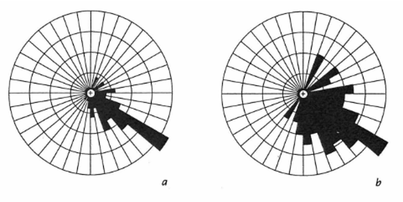
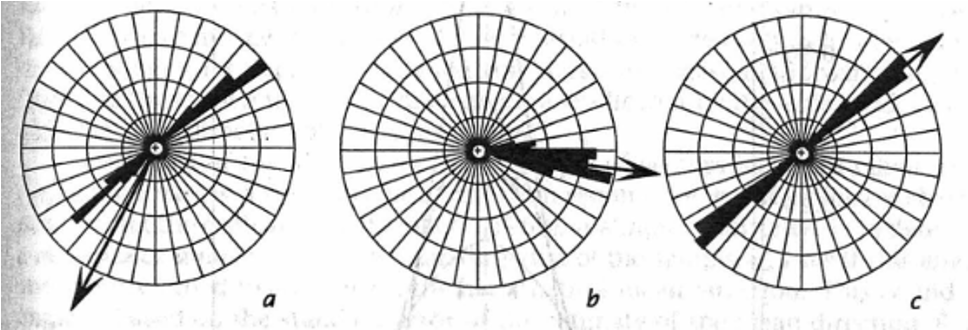
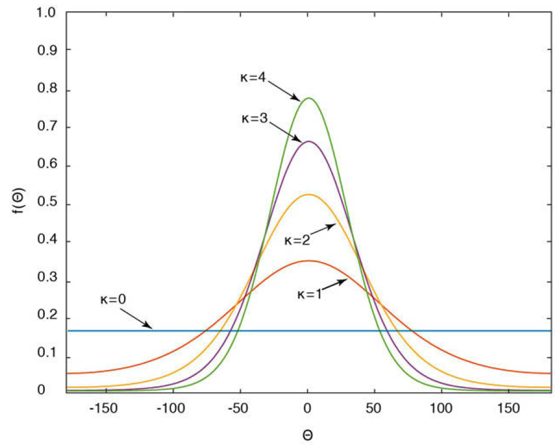

# Estadística Direccional

```{r dir-setup, include=FALSE}
library(latex2exp)
library(DescTools)
library(MOTE)
library(papaja)
library(GMisc)
library(CircStats)
library(kableExtra)
library(rio)
library(patchwork)
library(janitor)
library(conflicted)
library(tidymodels)
library(tidyverse)

knitr::opts_chunk$set(
  echo = TRUE,
  message = FALSE,
  warning = FALSE,
  error = FALSE,
  # fig.path = "figs/",
  fig.retina = 3,
  fig.width = 8,
  fig.asp = 0.618,
  fig.align = "center",
  out.width = "70%"
)

theme_set(theme_bw(base_size = 12))
conflict_prefer('select','dplyr')
conflict_prefer('filter','dplyr')
conflict_prefer("TeX", "latex2exp")
```

## Introducción

Los temas que se han introducido hasta este punto van a servir de base para el poder analizar datos geológicos de una manera más estadística y cuantitativa, brindado apoyo sobre los resultados encontrados.

El tema de estadística direccional es uno de estos temas muy específicos del quehacer geológico, ya que son la base de una gran mayoría de los tipos de datos que se pueden recolectar tanto en el campo como en trabajo de oficina.

Los métodos y técnicas de análisis que se van a presentar y explicar en este capítulo se basan en capítulos de @davis2002, @swan1995, @borradaile2003, @trauth2015, y @mckillup2010, y en los textos más exhaustivos de @fisher1993 y @mardia2000.

Es necesario hacer la distinción entre datos direccionales y no-direccionales (esta es la nomenclatura que se va a utilizar en este libro):

- Direccionales: tienen una dirección específica (polaridad), apuntan en una sola dirección. Pueden ser líneas o planos, aunque generalmente se asocian más con líneas.
- No-direccionales: apuntan en dos direcciones a 180° una de la otra, no tienen dirección específica (polaridad). Pueden ser líneas o planos, aunque generalmente se asocian más con planos.

No hay realmente un consenso de la nomenclatura. Algunos los llaman también direccionales y orientados, otros unidireccionales y bidireccionales, y otros tratan orientaciones desde otra perspectiva. 

Ejemplos de estos tipos de datos serían:

- Estrías (direccionales)
    * Planos de falla 
    * Glaciares
- Paleomagnetismo (direccionales)
- Forma y orientación de ejes de granos en sección delgada (ambos)
- Paleocorrientes (ambos)
    * Fósiles alineados (direccionales)
    * Clastos orientados (direccionales)
    * Ripples simétricos (no-direccionales)
    * Ripples asimétricos (direccionales)
- Dirección de buzamiento (direccionales)
    * Fallas
    * Capas
    * Pliegues
- Dirección de rumbo (no-direccionales)
    * Fallas
    * Capas
    * Pliegues
- Lineamientos regionales (no-direccionales)

Tambén se tiene que hacer distinción entre datos circulares y esféricos, donde la diferencia es que circulares se refieren a datos en 2-dimensiones (solo dirección), mientras que esféricos se refierena a datos en 3-dimensiones (dirección e inclinacción). Una característica de los datos direccionales es la naturaleza del espacio en que se trabajan, que para direcciones va de 0° a 360° y para inclinaciones va de 0° a 90°. Esta particularidad hace que se tengan que tratar de manera especial, ajustando las técnicas convencionales a este tipo de datos.

Cabe mencionar que hay softwares libres multi-plataforma que brindan mucha de la funcioanlidad que se va a presentar en este capítulo, y representan buenas opciones y herramientas a tener en cuenta. Dentro de estos softwares están: [Stereonet](http://www.geo.cornell.edu/geology/faculty/RWA/programs/stereonet.html), [Orient](http://www.frederickvollmer.com/orient/), y [OpenStereo](http://igc.usp.br/openstereo/).

## Representación gráfica

Así como para visualziar una variable se tiene el histograma, para datos direccionales se tiene el *diagrama de rosa*, que es simplemente un histograma e coordenadas polares, como se muestra en la Figura \@ref(fig:rose-diags-circ), donde la rosa para datos direccionales se denomina rosa asimétrica, y para datos no-direccionales se denomina rosa simétrica.

(ref:rose-diags-circ) Diagramas de rosa para el caso de datos direccionales (**A** - rosa asimétrica) y no-direccionales (**B** - rosa simétrica).

```{r rose-diags-circ, echo=FALSE, fig.cap='(ref:rose-diags-circ)', out.width='80%'}
comp1 = cowplot::ggdraw() + cowplot::draw_image('images/rose-diag-dir.png')
comp2 = cowplot::ggdraw() + cowplot::draw_image('images/rose-diag-nodir.png')

cowplot::plot_grid(comp1, comp2, labels = 'AUTO')
```

El diagrama puede ser engañoso, debido a que el ancho y el área de cada segmento del arco incrementa con la distancia desde el origen. Si solo la longitud del pétalo es proporcional a la frecuencia la percepción de frecuencias bajas se verá disminuida y la de frecuencias altas se verá aumentada. Por ésto, los diagramas deben ser hechos con el área del pétalo proporcional a la frecuencia. Un ejemplo de esta distorsión es proporcionado por @davis2002, y se muestra en la Figura \@ref(fig:rose-area).

(ref:rose-area) Figura de @davis2002 donde se muestra el efecto de utilizar la longitud del pétalo proporcional a la frecuencia (*a*), o el área del pétalo proporcional a la frecuencia (*b*), siendo esta última la adecuada.

```{r rose-area, echo=FALSE, fig.cap='(ref:rose-area)'}

```

## Datos circulares

Se describen métodos de análisis para datos circulares (2D), donde se tiene por muestra 1 vector de datos (direcciones).

### Estadística descriptiva

Cuando se tiene un conjunto de datos direccionales ($\theta_1,\theta_2,\theta_3,\dots,\theta_N$), se pueden obtener estadísticas univariables que describen a la muestra.

Para obtener la dirección media y la longitd de la resultante, es necesario calcular las componentes mostradas en las Ecuaciones \@ref(eq:xr-circ) y \@ref(eq:yr-circ).

\begin{equation}
  x_r = \sum_{i=1}^N \sin\theta_i
  (\#eq:xr-circ)
\end{equation}

\begin{equation}
  y_r = \sum_{i=1}^N \cos\theta_i
  (\#eq:yr-circ)
\end{equation}

La dirección media ($\bar{\theta}$) y longitud de la resultante ($R$) se obtienen con las Ecuaciones \@ref(eq:dir-media-circ) y \@ref(eq:resultante-circ).

\begin{equation}
  \bar{\theta} = \tan^{-1}(x_r/y_r)
  (\#eq:dir-media-circ)
\end{equation}

Dada la naturaleza cíclica de los datos (0-360) el valor de la dirección media requiere de una correción que va a estar en función del signo de las componentes, y se detalla en la Tabla \@ref(tab:dir-media-ajuste-circ).

```{r dir-media-ajuste-circ, echo=FALSE}
tibble(xr = c('Positivo','Negativo','Negativo'),
       yr = c('Positivo','Negativo','Positivo'),
       dir = c('$\\bar{\\theta}$',
               '$\\bar{\\theta}$+180',
               '$\\bar{\\theta}$+360')) %>% 
  kable(col.names = c('$x_r$','$y_r$','$\\bar{\\theta}$'),
        caption = 'Ajustes para la dirección media',
        align = 'c') %>% 
  kable_styling(full_width = F)
```

\begin{equation}
  R = \sqrt{x_r^2+y_r^2}
  (\#eq:resultante-circ)
\end{equation}

La longitud de la resultante depende de la cantidad de datos. Para contrarrestar ésto y para comparar resultantes de diferentes muestras, con diferente número de mediciones, se debe estandarizar la longitud resultante, mostrada en la Ecuación \@ref(eq:resultante-media-circ), brindando la resultante media ($\bar{R}$), la cual va a tener el rango de 0 a 1.

\begin{equation}
  \bar{R} = R/N
  (\#eq:resultante-media-circ)
\end{equation}

La resultante media es una indicación de la dispersión de los datos, conforme más cercana a 1 más concentrados y conforme más cercana a 0 más dispersos. Por ésto es que se relaciona con la varianza circular ($s_0$), conforme la Ecuación \@ref(eq:s0).

\begin{equation}
  s_0^2 = 1 - \bar{R} = (N-R)/N
  (\#eq:s0)
\end{equation}

Para el caso de datos no-direccionales es necesario transformar los datos (duplicar los ángulos) a direccionales para poder calcularle las estadísticas, ésto porque se si calculan las estadísticas sobre los datos sin transformar se van a obtener resultados incorrectos y sin sentido. Después de obtener las estadísticas es necesario dividir la dirección media entre 2 para re-transformar los datos a las direcciones originales. Este concepto se puede visualizar en la Figura \@ref(fig:krumbein), donde la flecha indica la dirección media; se observa como cuando no se corrigen los datos (*a*) se obtiene una dirección media que no coincide con los datos, pero cuando se transforman (*b*) y se re-transforman (*c*) ahora sí la dirección media coincide y tiene sentido con los datos.

(ref:krumbein) Demostración del efecto de no transformar los datos (*a*), transformación (*b*) y re-transformación (*c*), en la obtención de una dirección media (flecha) apropiada. Tomado de @davis2002.

```{r krumbein, echo=FALSE, fig.cap='(ref:krumbein)'}

```

Para demostrar lo expuesto hasta este punto se va a utilizar un ejemplo de @trauth2015, donde se tienen los siguientes datos:

```{r}
theta0 = c(255, 239, 222, 231, 199, 271, 222, 274, 228, 
           246, 177, 199, 257, 201, 237, 209, 216, 180, 
           182, 250, 219, 196, 197, 246, 218, 235, 232, 
           243, 232, 180, 231, 254, 242, 149, 212, 210, 
           230, 205, 220, 268)
```

Componentes:

\begin{equation}
  x_r = \sum_{i=1}^N \sin\theta_i = -24.38\\
  y_r = \sum_{i=1}^N \cos\theta_i = -25.94
\end{equation}

Dirección media:

\begin{equation}
  \bar{\theta} = \tan^{-1}(x_r/y_r) = \tan^{-1}(-24.38/-25.94) = 43.22^{\circ}\\
  \text{Como } x \text{ y } y \text{ son negativas hay que agregar } 180^{\circ}\\
  \bar{\theta} = 43.22^{\circ} + 180^{\circ} = 223.22^{\circ}
\end{equation}

La resultante y resultante media:

\begin{equation}
  R = \sqrt{x_r^2+y_r^2} = \sqrt{-23.38^2+-25.94^2} = 35.61\\
  \bar{R} = R/N = 35.61/40 = .89
\end{equation}

La varianza circular:

\begin{equation}
  s_0^2 = 1 - \bar{R} = 1 - .89 = .11
\end{equation}

En **R** se pueden simplemente programar estas funciones ya que son sencillas, pero el paquete *GMisc* [@R-GMisc] tiene la función `dir_stats_2D` que calcula éstos y otros valores que se van a exponer más adelante. Primero se muestra el paso a paso y luego se usa la función mencionada. Muchas de las funciones de *GMisc* tienen el argumento `dir`, donde 1 representa datos direccionales y 0 datos no-direccionales.

Componentes:

```{r}
(x = sum(sin(rads(theta0))))
(y = sum(cos(rads(theta0))))
meanrad = atan(x/y) # direccion media en radianes
(meandeg = degs(meanrad)) # direccion media en grados
```

Dirección media:

```{r}
meantrue = case_when(x & y > 0 ~ meandeg,
                     x & y < 0 ~ meandeg + 180,
                     T ~ meandeg + 360)
meantrue
```

La resultante media y varianza circular:

```{r}
(R = sqrt(x^2+y^2)/length(theta0)) # resultante media
(s0 = 1-R) # varianza circular
```

Usando `dir_stats_2D`.

```{r}
a = .05
dir_stats_2D(theta0, dir = 1, conf.level = 1-a)
```

El diagrama de rosa se puede generar con la función `rose_diag_2D` de *GMisc*, donde el argumento `width` corresponde con el ancho del pétalo.

```{r}
rose_diag_2D(theta0, width = 30, dir = 1, conf.level = 1-a)
```

Un ejemplo de datos no-direccionales corresponde con los datos `carolina`, disponibles en el paquete *GMisc*, tomados de @davis2002. El cuidado que hay que tener es duplicar los datos antes de los cálculos, y cuando se calcula la dirección media (la que se llamó `meantrue`) hay que dividirla entre 2.

```{r}
dir_stats_2D(carolina, dir = 0, conf.level = 1-a)
```

```{r}
rose_diag_2D(carolina, width = 20, dir = 0, conf.level = 1-a)
```

### Estadística inferencial

Así como para datos convencionales ($-∞,∞$) se tenía la distribuió normal (o $t$) para hacer inferencias, se ocupa una distribución apropiada para datos circulares. Esta distribución es la *von Mises* (Figura \@ref(fig:von-mises)) y depende de 2 parámetros: dirección media ($\theta$) y el parámetro de concentración ($\kappa$). Esta distribución es unimodal y semétrica alrededor de $\theta$, y conforme $\kappa$ incrementa es más probable que los datos tengan una dirección preferencial cercana $\theta$. De manera general se relaciona $\kappa$ con $\bar{R}$.

(ref:von-mises) Distribución *von Mises* centrada en $\theta=0$ y con diferentes parámetros de concentración $\kappa$. Conforme incrementa $\kappa$ más probabilidad de estar cerca de $\theta$. $\kappa=0$ es igual a una distribución uniforme. Tomado de @trauth2015.

```{r von-mises, echo=FALSE, fig.cap='(ref:von-mises)'}

```

#### Prueba de aleatoriedad

Esta prueba, conocida también como la prueba de Rayleigh, es para determinar si los datos presentan una dirección preferencial o no, y se aplica por medio de la relación entre $\kappa$ y $\bar{R}$, donde las hipótesis nula y alterna serían las siguientes:

- $H_0: \kappa = 0 \to$ No hay dirección preferencial
- $H_1: \kappa \neq 0 \to$ Hay dirección preferencial

Como se basa en la relación entre $\kappa$ y $\bar{R}$, lo que se hace es determinar $\bar{R}$ y compararlo con valores críticos ya establecidos en función del tamaño de la muestra $N$, y si $\bar{R} > \bar{R}_{crit}$ entonces e rechazaría $H_0$. Los valores críticos se encuentran en tablas en los diferentes textos. Para el caso de datos no-direccionales no es necesario realizar ninguna correción más que la inicial para encontrar $\bar{R}$.

Para el caso del ejemplo que se venía trabajando en la parte descriptiva, se tiene $\bar{R}_{crit}=\bar{R}_{40,.05}=.273$ y se tenía que $\bar{R}=.89$, con lo que $\bar{R} > \bar{R}_{crit}$ y se rechaza la hipótesis nula de que no hay dirección preferencial, y en este caso corresponde con $\bar{\theta}=223.22^{\circ}$.

En **R** se tiene la función `dir_unif_test_2D` del paquete *GMisc* que arroja los valores $\bar{R}$ y $\bar{R}_{crit}$, y una breve interpretación.

```{r}
dir_unif_test_2D(theta0, dir = 1, conf.level = 1-a)
```

> Conclusión: La muestra presenta una direccional preferencial, $\bar{\theta}=223.22^{\circ}$, $\bar{R}=.89$.

```{r}
dir_unif_test_2D(carolina, dir = 0, conf.level = 1-a)
```

#### Prueba de tendencia específica

Esta prueba es homóloga a la prueba $t$ de una muestra, ya que quiere probar si las mediciones corresponden con una dirección específica. No hay una prueba *per se*, sino lo que se hace es calcular un cono de confianza alrededor de la dirección media de la muestra y ver si la dirección a la cual se quiere comparar cae dentro de este ángulo, similar a usar intervalos de confianza en estadística clásica.

Las hipótesis nula y alterna serían las siguientes:

- $H_0: \bar{\theta} = \theta_0$
- $H_1: \bar{\theta} \neq \theta_0$

El cono de confianza, Ecuación \@ref(eq:cono-conf-circ), se basa en el error estándar de la dirección media, Ecuación \@ref(eq:se-theta-circ), y por ende toma en cuenta el tamaño de la muestra y su dispersión. El error estándar resulta en **radianes**, por lo que hay que pasarlo a grados multplicando por 57.2956. El parámetro de concentración $\kappa$ se puede obtener conforme la Ecuación \@ref(eq:kappa-circ).

\begin{equation}
  \kappa = 
  \begin{cases}
  \frac{\bar{R}}{6}\left( 12 + 6\bar{R}^2 + 5\bar{R}^4 \right) & \text{si } \bar{R} < .65\\
  \frac{1}{\left( 2 (1-\bar{R}) - (1-\bar{R})^2 - (1-\bar{R})^3 \right)} & \text{si } \bar{R} > .65
  \end{cases}
  (\#eq:kappa-circ)
\end{equation}

\begin{equation}
  s_e = 1 / \sqrt{N \bar{R} \kappa}
  (\#eq:se-theta-circ)
\end{equation}

\begin{equation}
  \bar{\theta} \pm z_{\alpha/2} s_e
  (\#eq:cono-conf-circ)
\end{equation}

donde $z_{\alpha/2}$ corresponde con el valor crítico de la curva normal estándar usada en las pruebas estadísticas convencionales.

De nuevo, si se están trabajando con datos no-direccionales hay que dividir el error estándar entre 2 para volverlo a la dirección original.

En **R** se pueden programar las ecuaciones:

```{r}
(k = ifelse(R<0.65, 
            R/6*(12+6*R^2+5*R^4), 
            1/(2*(1-R)-(1-R)^2-(1-R)^3)))
se = (1/sqrt(length(theta0)*R*k))*180/pi
(cono = qnorm(1-a/2)*se)
cono_sup = meantrue + cono
cono_inf = meantrue - cono
cono_inf; meantrue; cono_sup
```

El cono y cono de confianza se incluye en el resultado de `dir_stats_2D`:

```{r}
dir_stats_2D(theta0, dir = 1, conf.level = 1-a)
```

> Conclusión: La muestra pudo provenir de una población con dirección $214.7^{\circ} < \bar{\theta} < 231.8^{\circ}$.

#### Prueba de igualdad entre dos muestras

Esta prueba es homóloga a la prueba $t$ de dos muestras independientes, y se denomina prueba de Watson-Williams. La idea es determinar si dos muestras de mediciones poseen una misma dirección media. Se hace comparando las longitudes resultantes de los 2 grupos con la longitud resultante cuando se combinan los 2 grupos de mediciones. Si las dos muestras provienen de la misma población la longitud resultante de la combinación de los 2 grupos debiera ser igual a la suma de las dos resultantes. Si las direcciones medias son significativamente diferentes, la resultante combinada va a ser menor que la suma de las dos resultantes.

Las hipótesis nula y alterna serían las siguientes:

- $H_0: \bar{\theta}_1 = \bar{\theta}_2$
- $H_1: \bar{\theta}_1 \neq \bar{\theta}_2$

La prueba es una prueba $F$ con grados de libertad $1$ y $N-2$. Al obtener la resultante combinada se estima un $\kappa$, a partir de la magnitud de éste se usa la Ecuación \@ref(eq:f-k-circ).

\begin{equation}
  F_{1,N-2} = 
  \begin{cases}
  \frac{(N-2)(R_1+R_2-R_c)}{N-R_1-R_2} & \text{si } \kappa > 10\\
  \left(1+\frac{3}{8\kappa}\right)\frac{(N-2)(R_1+R_2-R_c)}{N-R_1-R_2} & \text{si } 2 < \kappa < 10
  \end{cases}
  (\#eq:f-k-circ)
\end{equation}

donde $N$ es el total de observaciones de las dos muestras, $R_1$ es la resultante de la muestra 1, $R_2$ es la resultante de la muestra 2, $R_c$ es la resultante combinando las dos muestras, $\kappa$ es el parámetro de concentración a partir de $R_c$.

Para demostrar esta prueba se tienen otros datos direccionales [@trauth2015] contra los cuales se quiere comparar los que se venían trabajando.

```{r}
theta1 = c(225, 208, 172, 198, 204, 183, 190, 212, 247, 
           127, 167, 234, 217, 192, 212, 171, 169, 210, 
           245, 222, 185, 227, 193, 178, 187, 182, 194, 
           217, 168, 211, 234, 204, 221, 198, 261, 228, 
           146, 201, 146, 231)
```

Con estos datos se tiene $R_2=35.26$, y se tenía $R_1=35.61$, con lo que $R_c=69.51$, y ahora $N=80$. $\bar{R}_c=R_c/N=69.51/80=.8689$ y con ésto se tiene $\kappa=4.18$, con lo que $2 < \kappa < 10$.

\begin{equation}
  F_{1,N-2} = \left(1+\frac{3}{8\kappa}\right)\frac{(N-2)(R_1+R_2-R_c)}{N-R_1-R_2}\\
  F_{1,78} = \left(1+\frac{3}{8\cdot4.18}\right)\frac{(78)(35.61+35.26-69.51)}{80-35.61-35.26} = 12.58\\
  F_{1,78,.05} = 3.96 \to F > F_{crit}, \text{se rechaza } H_0
\end{equation}

La función `dir_2sample_test_2D` de *GMisc* realiza esta prueba, brindando $F$, $F_{crit}$, valor-*p*, y una interpretación.

```{r}
dir_2sample_test_2D(theta0, theta1,
                    dir = 1, conf.level = 1-a)
```

> Conclusión: Las muestras difieren singificativamente en su dirección, $F(1,78) = 12.26$, $p `r printp(.000768,add_equals = T)`$

Otra forma de realizar la prueba sería obtener los conos de confianza para ambas muestras y ver si la dirección media de una cae dentro del cono de la otra.

```{r}
dir_stats_2D(theta0, dir = 1, conf.level = 1-a)
dir_stats_2D(theta1, dir = 1, conf.level = 1-a)
```

Lo anterior se puede visualizar en una red esterográfica, que por tratarse de datos circulares (2D) se usa una inclinación de 0. La función `stereo_mean` de *GMisc* permite graficar la dirección media junto con el cono de confianza en la red esterográfica, donde la Figura \@ref(fig:stereo-2-circ) muestra los datos del ejemplo.

```{r stereo-2-circ, out.width='100%', fig.cap='Red estereográfica mostrando la dirección media y cono de confianza para los datos del ejemplo de dos muestras de datos circulares. En rojo los datos de la muestra 1 y en azul los datos de la muestra 2.'}
stereo_mean(theta0,0)
stereo_mean(theta1,0,mean.col = 'blue',add = T)
```

## Datos esféricos

Los datos esféricos (3D) van a estar representados por dos vectores: uno para direcciones y otro para inclinaciones. En este apartado, y en el libro en general, se van a trabar como datos direccionales únicamente, por lo que si se quieren analizar datos no-direccionales se recomienda pasarlos a direccionales, la única excepción es la confección del diagrama de rosa. Los métodos de análisis para datos esféricos son simplemente una expansión sobre los métodos para datos circulares.

### Estadística descriptiva

Para datos esféricos se van a tener dos vectores de datos:

- Ángulo de inclinación: $\theta_1,\theta_2,\theta_3,\dots,\theta_N$, 
- Dirección de inclinación: $\phi_1,\phi_2,\phi_3,\dots,\phi_N$

Para obtener la dirección media y la longitd de la resultante, es necesario calcular las componentes mostradas en las Ecuaciones \@ref(eq:xr-esf), \@ref(eq:yr-esf), y \@ref(eq:zr-esf).

\begin{equation}
  x_r = \sum_{i=1}^N \cos\theta_i \cos\phi_i
  (\#eq:xr-esf)
\end{equation}

\begin{equation}
  y_r = \sum_{i=1}^N \cos\theta_i \sin\phi_i
  (\#eq:yr-esf)
\end{equation}

\begin{equation}
  z_r = \sum_{i=1}^N \sin\theta_i
  (\#eq:zr-esf)
\end{equation}

La dirección media ($\bar{\phi}$), inclinación media ($\bar{\theta}$), y longitud de la resultante ($R$) se obtienen con las Ecuaciones \@ref(eq:dir-media-esf), \@ref(eq:inc-media-esf), y \@ref(eq:resultante-esf). Hay que realizar un ajuste para la dirección media según la Tabla \@ref(tab:dir-media-ajuste-esf).

\begin{equation}
  \bar{\phi} = \tan^{-1}(y_r/x_r)
  (\#eq:dir-media-esf)
\end{equation}

```{r dir-media-ajuste-esf, echo=FALSE}
tibble(yr = c('Positivo','Negativo','Negativo'),
       xr = c('Positivo','Negativo','Positivo'),
       dir = c('$\\bar{\\phi}$',
               '$\\bar{\\phi}$+180',
               '$\\bar{\\phi}$+360')) %>% 
  kable(col.names = c('$y_r$','$x_r$','$\\bar{\\phi}$'),
        caption = 'Ajustes para la dirección media',
        align = 'c') %>% 
  kable_styling(full_width = F)
```

\begin{equation}
  \bar{\theta} = \sin^{-1}(z_r/R)
  (\#eq:inc-media-esf)
\end{equation}

\begin{equation}
  R = \sqrt{x_r^2+y_r^2+z_r^2}
  (\#eq:resultante-esf)
\end{equation}

La resultante media ($\bar{R}$) se obtiene de la misma manera que para datos circulares, Ecuación \@ref(eq:resultante-media-circ).

\begin{equation}
  \bar{R} = R/N
  (\#eq:resultante-media-circ)
\end{equation}

La varianza esférica ($s_s$) de nuevo se relaciona con la resultante media, conforme la Ecuación \@ref(eq:s-esf).

\begin{equation}
  s_s^2 = 1 - \bar{R} = (N-R)/N
  (\#eq:s-esf)
\end{equation}

El parámetro de concentración se determina mediante la Ecuación \@ref(eq:kappa-esf).

\begin{equation}
  \kappa = \frac{N-2}{N-R}
  (\#eq:kappa-esf)
\end{equation}

Se demuestran estos conceptos con un ejemplo con los siguientes datos:

```{r}
direcciones = c(12,18,22,15,10,20) # phi
inclinaciones = c(42,40,48,30,42,30) # theta
```

Con estos datos se tiene:

\begin{equation}
  N = 6\\
  x_r = \sum_{i=1}^N \cos\theta_i \cos\phi_i = 4.46\\
  y_r = \sum_{i=1}^N \cos\theta_i \sin\phi_i = 1.29\\
  z_r = \sum_{i=1}^N \sin\theta_i = 3.72\\
  R = \sqrt{x_r^2+y_r^2+z_r^2} = 5.95\\
  \bar{\phi} = \tan^{-1}(y_r/x_r) = 16.13^{\circ}\\
  \bar{\theta} = \sin^{-1}(z_r/R) = 38.7^{\circ}\\
  \bar{R} = R/N = .992\\
  s_s^2 = 1 - \bar{R} = (N-R)/N = .008\\
  \kappa = \frac{N-2}{N-R} = 80
\end{equation}

En **R** se pueden simplemente programar estas funciones ya que son sencillas, pero el paquete *GMisc* tiene la función `dir_stats_3D` que calcula éstos y otros valores que se van a exponer más adelante.

```{r}
a = .05
dir_stats_3D(dir = direcciones, dip = inclinaciones, conf.level = 1-a)
```

El diagrama de rosa se puede generar con la función `rose_diag_3D` de *GMisc*, donde el argumento `width` corresponde con el ancho del pétalo.

```{r}
rose_diag_3D(az = direcciones, dip = inclinaciones, 
             width = 20, dir = 1, conf.level = 1-a)
```

### Estadística inferencial

Similar a los datos circulares es necesaria una distribución para poder realizar inferencias, y para el caso de datos esféricos la más común es la Bingham. Esta distribución depende de tres parámetros: dirección media ($\bar{\phi}$), inclinación media ($\bar{\theta}$), y parámetro de concentración ($\kappa$). El parámetro de concentración presenta el mismo efecto y comportamiento que el caso de dato circulares, digase que se relaciona con $\bar{R}$ y conforme incrementa es más probable que los datos tengan una dirección preferencial.

#### Prueba de aleatoriedad

Esta prueba es similar a la de datos circulares, donde se usa la relación entre $\kappa$ y $\bar{R}$, y donde las hipótesis nula y alterna serían las siguientes:

- $H_0: \kappa = 0 \to$ No hay dirección preferencial
- $H_1: \kappa \neq 0 \to$ Hay dirección preferencial

El procedimiento es el mismo a la prueba para datos circulares pero los valores críticos $\bar{R}_{crit}$ son ahora para datos esféricos. 

Para el caso del ejemplo, se tiene $\bar{R}_{crit}=\bar{R}_{6,.05}=.642$ y se tenía que $\bar{R}=.992$, con lo que $\bar{R} > \bar{R}_{crit}$ y se rechaza la hipótesis nula de que no hay dirección preferencial, y en este caso corresponde con $\phi=16.13^{\circ}$.

En **R** se tiene la función `dir_unif_test_3D` del paquete *GMisc* que arroja los valores $\bar{R}$ y $\bar{R}_{crit}$, y una breve interpretación.

```{r}
dir_unif_test_3D(dir = direcciones,dip = inclinaciones,conf.level = 1-a)
```

> Conclusión: La muestra presenta una direccional preferencial, $\bar{\theta}=16.13^{\circ}$, $\bar{R}=.992$.

#### Prueba de tendencia específica

Esta prueba es similar a la de datos circulares, y es homóloga a la prueba $t$ de una muestra, ya que quiere probar si las mediciones corresponden con una dirección específica. L que se hace es calcular un cono de confianza alrededor de la dirección media de la muestra y ver si la dirección a la cual se quiere comparar cae dentro de este ángulo, similar a usar intervalos de confianza en estadística clásica.

Las hipótesis nula y alterna serían las siguientes:

- $H_0: \bar{\phi} = \phi_0$
- $H_1: \bar{\phi} \neq \phi_0$

El cono de confianza, Ecuación \@ref(eq:cono-conf-esf), está en función del error estándar, Ecuacuón \@ref(eq:se-esf), que se basa en la resultante y el nivel de significancia deseado. El resultado del error estándar está en **radianes**, por lo que hay que pasarlo a grados.

\begin{equation}
  s_{1-\alpha} = \arccos \left( 1 - \frac{N-R}{R} \left[ \left( \frac{1}{\alpha} \right)^{\frac{1}{N-1}} - 1\right] \right)
  (\#eq:se-esf)
\end{equation}

\begin{equation}
  \bar{\phi} \pm s_{1-\alpha}
  (\#eq:cono-conf-esf)
\end{equation}

El cono y cono de confianza se incluye en el resultado de `dir_stats_3D`:

```{r}
dir_stats_3D(dir = direcciones,dip = inclinaciones,conf.level = 1-a)
```

> Conclusión: La muestra pudo provenir de una población con dirección $9.5^{\circ} < \bar{\theta} < 22.8^{\circ}$.

#### Prueba de igualdad entre dos muestras

Esta prueba es homóloga a la prueba $t$ de dos muestras independientes, y la idea es determinar si dos muestras de mediciones poseen una misma dirección media.

Las hipótesis nula y alterna serían las siguientes:

- $H_0: \bar{\phi}_1 = \bar{\phi}_2$
- $H_1: \bar{\phi}_1 \neq \bar{\phi}_2$

La prueba tiene el supuesto de que la varianza es la misma en las muestras, por lo que es recomendado revisar que se cumpla. La prueba de la igualdad de varianzas se realiza similar a la de igualdad de varianzas en estadística clásica, donde para este caso se analiza la razón entre parámetros de concentración conforme la Ecuación \@ref(eq:k-esf), dada la relación inversa entre varianza esférica y $\kappa$.

\begin{equation}
  F_{2n_1-2,2n_2-2} = \frac{\kappa_1}{\kappa_2}, \kappa_1 > \kappa_2
  (\#eq:k-esf)
\end{equation}

La prueba es una prueba $F$ con grados de libertad $2$ y $2[N-2]$, y se usa la Ecuación \@ref(eq:f-esf).

\begin{equation}
  F_{2,2[N-2]} = \frac{(N-2)(R_1+R_2-R_c)}{N-R_1-R_2}
  (\#eq:f-esf)
\end{equation}

donde $N$ es el total de observaciones de las dos muestras, $R_1$ es la resultante de la muestra 1, $R_2$ es la resultante de la muestra 2, y $R_c$ es la resultante combinando las dos muestras.

Analizando la igualdad de varianzas se tiene:

\begin{equation}
  n_1=6; n_2=6\\
  F_{2n_1-2,2n_2-2} = \frac{\kappa_1}{\kappa_2}\\
  F_{10,10} = \frac{81.2}{2.01} = 40.4\\
  F_{crit} = 2.98
\end{equation}

Con este análisis se obtiene que las varianzas no son iguales, por lo que técnicamente no sería conveneinte realizar la prueba de igualdad de direcciones medias, pero se realiza para efectos demostrativos.

La función `dir_2sample_test_3D` de *GMisc* realiza esta prueba, brindando $F$, $F_{crit}$, valor-*p*, y una interpretación.

```{r}
d2 = c(111.7,109.2,185.1,83.1,235.2,226.7)
i2 = c(40.4,31.4,25.9,26.2,27,31.5)
dir_2sample_test_3D(direcciones, inclinaciones, d2, i2, conf.level = 1-a)
```

> Conclusión: Las muestras presentan diferentes varianzas, $F(10,10) = 40.4$, $p `r printp(9.5e-7,add_equals = T)`$, y difieren singificativamente en su dirección, $F(2,20) = 12.59$, $p `r printp(.000289,add_equals = T)`$

Otra forma de realizar la prueba sería obtener los conos de confianza para ambas muestras y ver si la dirección media de una cae dentro del cono de la otra.

Lo anterior es más fácil visualizarlo en una red esterográfica. La función `stereo_mean` de *GMisc* grafica la dirección media junto con el cono de confianza en la red esterográfica, donde la Figura \@ref(fig:stereo-2-esf) muestra los datos del ejemplo.

```{r stereo-2-esf, out.width='100%', fig.cap='Red estereográfica mostrando la dirección media y cono de confianza para los datos del ejemplo de dos muestras de datos esféricos. En rojo los datos de la muestra 1 y en azul los datos de la muestra 2.'}
stereo_mean(direcciones,inclinaciones)
stereo_mean(d2,i2,mean.col = 'blue',add = T)
```

```{r include=FALSE}
# automatically create a bib database for R packages
knitr::write_bib(c(
  .packages(), 'bookdown', 'knitr', 'rmarkdown'
), 'packages.bib')
```
