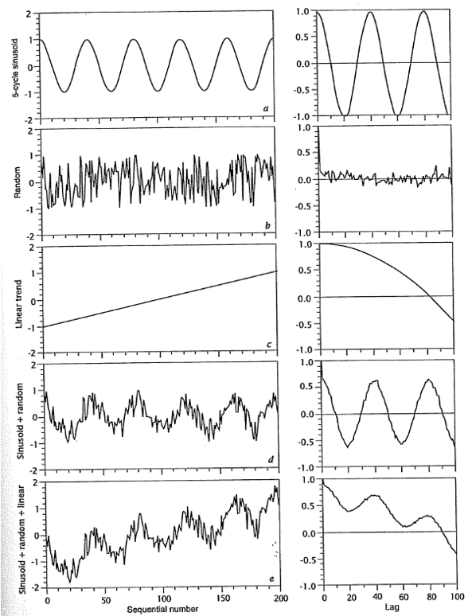

# Secuencias de Datos

```{r secuencias-setup, include=FALSE}
library(MOTE)
library(papaja)
library(plotly)
library(zoo)
library(ggfortify)
library(GMisc)
library(DescTools)
library(kableExtra)
library(rio)
library(patchwork)
library(janitor)
library(conflicted)
library(tidymodels)
library(tidyverse)

knitr::opts_chunk$set(
  echo = TRUE,
  message = FALSE,
  warning = FALSE,
  error = FALSE,
  # fig.path = "figs/",
  fig.retina = 3,
  fig.width = 8,
  fig.asp = 0.618,
  fig.align = "center",
  out.width = "70%"
)

theme_set(theme_bw(base_size = 12))
conflict_prefer('select','dplyr')
conflict_prefer('filter','dplyr')
```

## Introducción {#secuencias-intro}

En geología es común recolectar datos en función del tiempo o espacio (proxy para el tiempo), donde los datos pueden presentarse de forma continua (equidistantes, mediciones a intervalos definidos) o simplemente cuando se observa cierto fenómeno o evento. Estos datos, en cualquiera de las dos formas, se consideran como secuencias de datos, donde una variable es la posición (tiempo o espacio) y la otra variable (interés) es la observación en dicha posición. Ejemplos de estos datos sería: registro de una perforación, secuencia estratigráfica, temperatura, etc.

Dentro de las preguntas que se pueden responder por medio del análisis de secuencias están (en función del tipo de secuencia):

- Los datos son aleatorios o presentan una tendencia o patrón?
- Si hay una tendencia, qué forma tiene?
- Hay periodicidad o ciclos en los datos? Se puede medir?
- Se pueden hacer estimaciones o predicciones a partir de los datos?

Los métodos y técnicas de análisis que se van a presentar y explicar en este capítulo se basan en capítulos de @davis2002, @swan1995, @borradaile2003, y @mckillup2010.

## Eventos {#secuencias-eventos}

Una serie de eventos no es más que una secuencia de intervalos entre ocurrencias, o una longitud acumulada de tiempo (espacio) sobre el cual ocurren los eventos, se registra cuando/donde ocurre el evento. **Se pueden considerar como observaciones discretas a lo largo de una secuencia**. Estos eventos son distinguibles por cuándo ocurren en el tiempo, se consideran instantáneos, y son tan infrecuentes que dos eventos no ocurren en el mismo intervalo de tiempo.

### Prueba de tendencia de intervalos {#prueba-tend-int}

Esta prueba se usa cuando se desea cuantificar si los intervalos entre eventos (ocurrencia de los eventos) cambian a lo largo de la secuencia. 

Para esta prueba se usa la correlación de Spearman (\@ref(prueba-spearman)), y las hipótesis serían las siguientes:

- $H_0: \rho_s = 0 \to$ No hay tendencia en la longitud de los intervalos
- $H_1: \rho_s \neq 0 \to$ Hay una tendencia en la longitud de los intervalos de acortarse o alargarse.

La ecuación para la correlación de Spearman se modifica conforme la Ecuación \@ref(eq:spearman-intervalos), donde $i$ es el número de intervalo, $h_i$ es la longitud del intervalo, y $N$ es el total de intervalos o total de eventos menos 1.

\begin{equation}
  r_{s} = 1 - \frac{6\sum_i^N[i-R(h_i)]^2}{N(N^2-1)}
  (\#eq:spearman-intervalos)
\end{equation}

Esta prueba se demuestra con un ejemplo de @swan1995, donde se tiene una secuencia de 45 m de carbonatos en la cual se observaron horizontes de toba a las siguientes distancias de la base: 0.5, 2.3, 3.2, 4.2, 4.9, 7, 11.4, 12.7, 14.6, 16, 21.5, 22.5, 25.8, 30.3, 31.9, 36.2, 42.8. Presenta la secuencia una tendencia? Los datos se muestran en la Tabla \@ref(tab:toba-int).

```{r}
toba = c(0.5, 2.3, 3.2, 4.2, 4.9, 7, 11.4, 12.7, 14.6, 
         16, 21.5, 22.5, 25.8, 30.3, 31.9, 36.2, 42.8)
Toba = tibble(i = 1:(length(toba)-1),
              h = diff(toba)) %>% 
  mutate(Rh = rank(h), 
         Dif = (i-Rh)^2)
```

```{r toba-int, echo=FALSE}
Toba %>% 
  kable(col.names = c('Número (i)','Intervalo (h)',
                      '$R(h_{i})$','$(i-R(h_{i}))^2$'),
        align = 'c',
        caption = 'Intervalos de los horizontes de toba') %>% 
  kable_styling(full_width = F)
```

La suma de las diferencias al cuadrado resulta en:

```{r}
Toba %>% 
  summarise(Suma = sum(Dif))
```

\begin{equation}
  r_{s} = 1 - \frac{6\sum_i^N[i-R(h_i)]^2}{N(N^2-1)}\\
  r_{s} = 1 - \frac{6 \cdot 287.5}{16(16^2-1)} = .577
\end{equation}

En **R** se tiene la función `cor.test`, donde para obtener más información (prueba $t$, intervalos de confianza) se puede realizar la correlación de Pearson sobre los datos ranqueados. Otra función que brinda el coeficiente de correlación y su intervalo de confianza es `SpearmanRho` del paquete *DescTools* [@R-DescTools].

```{r}
a = .05
tend.spearman = cor.test(~i+Rh,Toba,method='pearson',conf.level=1-a)
tend.spearman
with(Toba,SpearmanRho(i,Rh,conf.level = 1-a))
```

La relación se puede visualizar por medio de un gráfico de dispersión, que para el caso del ejemplo se muestra en la Figura \@ref(fig:toba-int-disp).

```{r toba-int-disp, echo=FALSE, fig.cap='Gráfico de dispersión mostrando la relación entre el número de intervalo y la longitud del mismo.'}
ggplot(Toba, aes(i,h)) + 
  geom_point(size=2,col='coral') +
  lims(x=c(0,17),y=c(0,7)) + 
  labs(x='Número de intervalo',y='Longitud de intervalo')
```

> Conclusión: Hay una relación entre la longitud del intervalo y el tiempo (distancia) donde los intervalos tienden a incrementar con el tiempo, $r_s = `r apa(tend.spearman$estimate,3,F)`$, `r (1-a)*100`% IC `r str_glue("$[{apa(tend.spearman$conf.int[1],2,F)}, {apa(tend.spearman$conf.int[2],2,F)}]$")`, `r str_glue("$p {printp(tend.spearman$p.value,add_equals = T)}$")`. El tamaño del efecto es grande con un rango amplio de pequeño hasta muy grande.

### Prueba de corridas (rachas) {#prueba-runs}

Esta prueba se usa cuando se quiere determinar la presencia o no de patrones en una secuencia. Para esta prueba se requiere que la secuencia consista en dos estados (categorías, niveles) mutuamente excluyentes (secuencia dicotómica). La secuencia puede haberse registrado en esta forma o se puede transformar de diferentes maneras.

Para demostrar cómo se determinan las corridas o rachas se puede usar el ejemplo de lanzar una moneda 20 veces y se registra si cae 'Escudo (E)' o 'Corona (C)', donde se obtienen los siguientes resultados: CCCECECCCECECEECCEEE.

Las corridas consisten en grupos de observaciones consecutivas del mismo estado o categoría. Para el caso del ejemplo se tendría: CCC E C E CCC E C E C EE CC EEE, dando como resultado 12 corridas, lo que se denomina como $U$. La cantidad de observaciones de la primer y segunda categorías se denominan $n_1$ y $n_2$ respectivamente.

La idea de la prueba es comparar lo observado ($U, \ n_1, \ n_2$) con una secuencia aleatoria que no tiene patrón, donde el número promedio de corridas esperado está dado por la Ecuación \@ref(eq:runs-ubar), la varianza esperada está dada por la Ecuación \@ref(eq:runs-sigbar), y la significancia se puede evaluar por medio de una aproximación a la distribución normal estándar conforme la Ecuación \@ref(eq:runs-z). **Resultados significativos se obtendrían cuando se tiene ya sea una gran cantidad de corridas (cambios más frecuentes) o un número de corridas muy bajo**. 

Las hipótesis para esta prueba serían las siguientes:

- $H_0: U = \bar{U} \to$ La secuencia es aleatoria
- $H_1: U \neq \bar{U} \to$ La secuencia no es aleatoria, hay un patrón

\begin{equation}
  \bar{U} = \frac{2n_1n_2}{n_1+n_2}+1
  (\#eq:runs-ubar)
\end{equation}

\begin{equation}
  \sigma^2_{\bar{U}} = \frac{2n_1n_2(2n_1n_2-n_1-n_2)}{(n_1+n_2)^2(n_1+n_2-1)}
  (\#eq:runs-sigbar)
\end{equation}

\begin{equation}
  Z = \frac{U-\bar{U}}{\sigma_{\bar{U}}}
  (\#eq:runs-z)
\end{equation}

Aplicando la prueba de corridas al ejemplo del lanzamiento de la moneda se tiene $U=12$, $n_1=11$ y $n_1=9$.

\begin{equation}
  \bar{U} = \frac{2n_1n_2}{n_1+n_2}+1\\
  \bar{U} = \frac{2 \cdot 11 \cdot 9}{11+9}+1 = 10.9
\end{equation}

\begin{equation}
  \sigma^2_{\bar{U}} = \frac{2n_1n_2(2n_1n_2-n_1-n_2)}{(n_1+n_2)^2(n_1+n_2-1)}\\
  \sigma^2_{\bar{U}} = \frac{2 \cdot 11 \cdot 9(2 \cdot 11 \cdot 9-11-9)}{(11+9)^2(11+9-1)}=4.6
\end{equation}

\begin{equation}
  Z = \frac{U-\bar{U}}{\sigma_{\bar{U}}}\\
  Z = \frac{12-10.9}{2.1} = 0.52
\end{equation}

El estadístico encontrado es menor al valor crítico de $z_{\alpha/2}$ que para un $\alpha=.05$ es de $\pm 1.96$, por lo que no se rechaza $H_0$ y se concluye que la secuencia podría ser aleatoria.

En el caso de que se tuviera una secuencia de datos no dicotómicos, ya sea datos continuos u observaciones con más de dos categorías, es necesario dicomotizar la secuencia. 

Para el caso de datos continuos se pueden emplear dos estrategias: 

1. Corridas arriba-abajo: En ésta lo que se hace es determinar cómo cambia una observación con respecto a la anterior (mayor o menor).
1. Corridas con respecto a la mediana: Aquí lo que se hace es comparar todas las observaciones con respecto a la mediana, si son mayores o menores.

En ambos casos cuando se presenta hay dos valores consecutivos iguales, la diferencia es 0, se asigna el 0 a la tendencia que traen las corridas. Por ejemplo, si se tiene $+ + - 0 - + - - 0 +$, el primer cero se asigna como $-$ para mantener la corrida, mientras que el segundo cero no afecta si se asigna como $-$ o como $+$, el número total de corridas quedaría $U=5$, $n_{1+}=4$ y $n_{2-}=6$.

Como ejemplo de corridas arriba-abajo se tienen los datos de espesores de capas consecutivas de caliza en una secuencia del Jurásica Inferior [@swan1995]: 17, 14, 13, 17, 9, 15, 36, 13, 26, 10, 25, 13, 25, 8, 28, 15, 19, 34, 22.

Se puede hacer el ejercicio de las corridas y contar el número de observaciones en las dos categorías a mano, pero se demuestra en **R** con la función `dichotomy` del paquete *GMisc* [@R-GMisc], donde se brinda el vector de observaciones y se escoge el criterio de dicotomización. La función básica `table` hace el conteo de cada categoría.

```{r}
calizas = c(17, 14, 13, 17, 9, 15, 36, 13, 26, 
            10, 25, 13, 25, 8, 28, 15, 19, 34, 22)
(calizas.di = dichotomy(calizas, criteria = 'up-down'))
table(calizas.di)
```

Con estos datos se tiene $U=15$, $n_1=9$, y $n_2=9$.

\begin{equation}
  \bar{U} = \frac{2n_1n_2}{n_1+n_2}+1\\
  \bar{U} = \frac{2 \cdot 9 \cdot 9}{9+9}+1 = 10
\end{equation}

\begin{equation}
  \sigma^2_{\bar{U}} = \frac{2n_1n_2(2n_1n_2-n_1-n_2)}{(n_1+n_2)^2(n_1+n_2-1)}\\
  \sigma^2_{\bar{U}} = \frac{2 \cdot 9 \cdot 9(2 \cdot 9 \cdot 9-9-9)}{(9+9)^2(9+9-1)}=4.23
\end{equation}

\begin{equation}
  Z = \frac{U-\bar{U}}{\sigma_{\bar{U}}}\\
  Z = \frac{15-10}{2.06} = 2.43
\end{equation}

La función `RunsTest` de *DescTools* realiza la prueba sobre el vector de datos dicotómicos. Los argumentos `correct=F` y `exact=F` son necesarios para que los resultados coincidan con los cálculos manuales.

```{r}
calizas.runs = RunsTest(calizas.di,correct = F,exact = F)
calizas.runs
```

Los resultados se pueden graficar para visualizar el patrón (en caso de existir) con mayor facilidad.

```{r calizas-runs, echo=FALSE, fig.cap='Espesor de capas consecutivas de caliza.'}
ggplot(NULL,aes(1:length(calizas),calizas)) + 
  geom_point(size=2,col='skyblue') + 
  geom_path(col='skyblue') + 
  labs(x='Número de capa', y='Espesor (cm)')
```

> Conclusión: El espesor de las calizas no es aleatorio, la gran cantidad de corridas indica una alternancia de capas gruesas y delgadas, $U = `r calizas.runs$parameter[1]`, n_1 = `r calizas.runs$parameter[2]`, n_2 = `r calizas.runs$parameter[3]`$, $Z = `r apa(calizas.runs$statistic,2,T)`$, `r str_glue("$p {printp(calizas.runs$p.value,add_equals = T)}$")`.

## Series {#secuencias-series}

Secuencias de series temporales/espaciales son diferentes a las secuencias de eventos, ya que las series se caracterizan por tener $N$ observaciones espaciadas a un intervalo constante ($\Delta$), y la longitud total de la secuencia ($T$) se determina como $T = \Delta(N-1)$.

Estas series pueden analizarse para determinar si dentro de una serie hay ciclos, patrones o tendencias (auto-correlación, \@ref(series-ac)), o si dos series presentan similitudes (correlación cruzada, \@ref(series-cc)). Dependiendo de la calidad de las observaciones y/o presencia de tendencias, será necesario realizar tratamientos o preparación de los datos antes de los análisis.

### Tratamiento de datos {#series-tratamiento}

#### Interpolación

En caso de que la serie no cuente con observaciones equidistantes se pueden remover o interpolar valores, haciendo la aclaración y justificación respectiva. De manera general se recomienda realizar interpolaciones entre observaciones cercanas, donde se puede asumir un comportamiento lineal entre ellas, minimizando cualquier artefacto de la interpolación.

#### Filtros

Este es probablemente uno de los pasos de pre-procesamiento más importantes y utilizados. La mayoría de los datos recolectados están compuestos por los datos crudos ("señal") generados por el proceso geológico de interés, y "ruido" causado por interferencia. El filtrado intenta separar estos dos, resaltando la "señal" sobre el "ruido". El "ruido" por lo general ocurre a frecuencias altas por lo que tiene efectos inconsistentes en observaciones adyacentes, y se puede reducir si se promedian unas pocas observaciones.

El proceso de filtrado, de manera general, sería el siguiente:

- Se promedia en el punto su valor y valores adyacentes (ventana),
- Si se desea se pueden ponderar (dar pesos) los valores, con los más distantes teniendo menos influencia, a como se muestra de manera general en la Ecuación \@ref(eq:filtro-pesos),
- Se recomienda usar un número de observaciones impar, para ser simétrico alrededor del punto central (a valorar), donde la cantidad de observaciones a usar va a depender principalmente de la frecuencia de medición.

\begin{equation}
  y_i' = \frac{w_1y_{i-2}+w_2y_{i-1}+w_3y_{i}+w_2y_{i+1}+w_1y_{i+2}}{W}
  (\#eq:filtro-pesos)
\end{equation}

donde $w_i$ corresponden con los diferentes pesos para las observaciones cercanas a la observación central, y $W$ es la suma de todos los pesos.

Las funciones `moving_avg_filter` y `moving_wt_filter` de *GMisc* permiten filtrar una secuencia de datos usando un promedio aritmético o ponderado, respectivamente. Para graficar los resultados de estas funciones están las funciones `moving_filter_plot_f` y `moving_filter_plot_r`, del mismo paquete, que grafican los datos filtrados y los residuales, respectivamente; ambas funciones arrojan un gráfico estático (*ggplot2*, [@R-ggplot2]) y uno dinámico (*plotly*, [@R-plotly]).

Para demostrar el filtrado se van a usar datos de @swan1995 que corresponden con la línea de crecimiento de un nautiloide. Las funciones de filtrado ocupan los vectores de posición (`x`) y los datos (`y`), así como la ventana de datos a usar en el promedio. Para el ejemplo se usan ventanas de 3, 5, y 9 datos, y se muestran los datos filtrados (Figuras \@ref(fig:filtro1) y \@ref(fig:filtro3)) y los residuales (Figuras \@ref(fig:filtro2) y \@ref(fig:filtro4)) en forma estática (`$GGPLOT`), para obtener el gráfico dinámico se acceder por medio de `$PLOTLY`

```{r}
k = c(3, 5, 9)
filt = moving_avg_filter(nautilus$x, nautilus$y, k)
filt2 = moving_wt_filter(nautilus$x, nautilus$y, k)
```

```{r filtro1, fig.cap='Ejemplo de datos crudos y filtrados (sin pesos)'}
moving_filter_plot_f(filt)$GGPLOT
```

```{r filtro2, fig.cap='Ejemplo de residuales de datos filtrados (sin pesos)'}
moving_filter_plot_r(filt)$GGPLOT
```

```{r filtro3, fig.cap='Ejemplo de datos crudos y filtrados (con pesos)'}
moving_filter_plot_f(filt2)$GGPLOT
```

```{r filtro4, fig.cap='Ejemplo de residuales de datos filtrados (con pesos)'}
moving_filter_plot_r(filt2)$GGPLOT
```

#### Tendencias

Para las técnicas que se van a exponer en los siguientes apartados, la presencia de una tendencia en los datos puede ser perjudicial en la medida que puede oscurecer los ciclos o patrones presentes en los datos, por lo que es recomendado remover la tendencia y realizar el análisis sobre los datos sin tendencia.

La tendencia más sencilla es la lineal y la forma de determinar si existe una tendencia o relación significativa entre la posición (o tiempo) y los datos es por medio de una regresión lineal simple (\@ref(bivar-reg)) o correlación de Pearson (\@ref(bivar-cor), \@ref(prueba-pearson)).

Para ejemplificar este concepto se van a usar los datos del nivel del agua en el lago Hurón, presentes en los juegos datos por defecto en **R** como `LakeHuron`. Éste es un objeto de tipo serie temporal (*ts*, \@ref(series-ts)) por lo que tiene una estructura especial, pero en el fondo es simplemente una secuencia con posición (en este caso tiempo) y observaciones (nivel del agua). Para visualizarlo con *ggplot* se puede usar la función `autoplot` de *ggfortify* [@R-ggfortify], a como se muestra en la Figura \@ref(fig:huron-ts).

```{r huron-ts, fig.cap='Visualización de la serie temporal del nivel del agua del lago Hurón.'}
autoplot(LakeHuron) + 
  labs(x='Año', y='Nivel del lago')
```

Para pasar un objeto *ts* a un formato tabla, más universal, se puede usar la función `tidy` de *broom* [@R-broom], del metapaquete *tidymodels* [@R-tidymodels]. 

```{r}
LakeHuron
Huron = LakeHuron %>% tidy()
Huron
```

Con los datos en formato tabla se puede realizar la regresión o correlación. Tal vez la forma más sencilla y directa de cuantificar la relación (tendencia) y ver si es significativa o no es por medio de la correlación de Pearson, como se expuso en la sección \@ref(prueba-pearson), ya que como hay una relación entre correlación y regresión lineal simple, si una es significativa la otra lo va a ser también.

```{r}
a = .05
huron.cor = Huron %>% 
  cor.test(~index+value,
           data = .,
           conf.level=1-a,
           method = 'pearson')
huron.cor
```

```{r echo=FALSE}
huron.cor.apa = apa_print(huron.cor)
```

En este caso la correlación (tendencia) es significativa y negativa (`r huron.cor.apa$full_result %>% str_replace('CI','IC')`), por lo que para cualquier análisis posterior es necesario remover dicha tendencia.

Para demostrar que se obtiene la misma conclusión con la regresión lineal simple se muestra el procedimiento. Una regresión se realiza por medio de la función `lm` a como se había introducido en el capítulo [Estadística Descriptiva Bivariable], sección \@ref(bivar-reg). Ahora se va a hacer énfasis en mostrar cómo determinar si la regresión (pendiente) es significativa.

```{r}
huron.reg = lm(value ~ index, data = Huron)
huron.reg %>% 
  tidy(conf.int=T,conf.level=1-a)
```

```{r echo=FALSE}
huron.reg.apa = apa_print(huron.reg,digits=3,ci=1-a)
```

La significancia de la pendiente se puede determinar por medio del valor-*p* o el intervalo de confianza en el resumen de la regresión. A como se ha venido trabajando, si el valor-*p* está por debajo de un $\alpha$ escogido y si 0 cae fuera del intervalo de confianza, entonces el estadístico es significativo. Para el caso del ejemplo, la pendiente es significativa y negativa (`r huron.reg.apa$full_result$index %>% str_replace('CI','IC')`).

Tanto la correlación como la regresión muestran una tendencia negativa, o sea el nivel del lago Hurón ha ido en descenso a lo largo del tiempo en que se tomaron los datos, y ésto se puede observar si se grafica la secuencia, a como se presentó en la Figura \@ref(fig:huron-ts).

Para series de datos una manera de remover la tendencia es por medio de diferenciación, donde una tendencia lineal se remueve con una diferenciación de orden 1, una tendencia cuadrática se remueve con una diferenciación de orden 2, y así sucesivamente. Para ésto existe la función `diff`, a la cual se le puede pasar un vector de datos o el objeto de la serie, y el argumento `differences` se refiere al orden de la diferenciación.

```{r}
Huron.dif = diff(LakeHuron,differences = 1)
Huron.dif
```

Otra forma de remover la tendencia es obteniendo los residuales a partir de la regresión. Lo anterior se puede obtener de forma sencilla aplicando la función `augment` de *broom* sobre el objeto de regresión. El objeto resultante va a tener los datos usados en la regresión así como otras columnas, incluida `.resid` que almacena los residuales.

```{r}
Huron.aug = huron.reg %>% augment()
Huron.aug
```

Una vez removida la tendencia se puede graficar de nuevo la serie, a como se muestra en la Figura \@ref(fig:huron-ts-dif) para el caso de la diferenciación, y en la Figura \@ref(fig:huron-ts-resid) para el caso de los residuales de la regresión.

```{r huron-ts-dif, fig.cap='Serie de diferencias del cambio en el nivel del agua en el lago Hurón.'}
Huron.dif %>% 
  autoplot() + 
  labs(x='Año', y='Cambio en el nivel del lago')
```

```{r huron-ts-resid, fig.cap='Serie de residuales del nivel del agua en el lago Hurón.'}
Huron.aug %>% 
  ggplot(aes(index,.resid)) +
  geom_line() +
  labs(x='Año', y='Residuales del nivel del lago')
```

Estos datos sin tendencia serían los que se usan en análisis posteriores.

### Auto-correlación {#series-ac}

La auto-correlación es simplemente comparar una secuencia o serie con ella misma, a diferentes separaciones o lags ($\tau$). La comparación se realiza por medio del coeficiente de correlación a los diferentes lags, donde cada vez que se desplaza la secuencia se calcula el coeficiente, por medio de la Ecuación \@ref(eq:r-tau). 

\begin{equation}
  r_{\tau} = \frac{\sum_{i=1}^{N-\tau} Z_{yi}Z_{y(i+\tau)}}{N-\tau}
  (\#eq:r-tau)
\end{equation}

A un lag de 0 la correlación siempre va a ser $r_{\tau}=1$ y conforme se va desplazando va a tender a disminuir. El resultado de la auto-correlación se representa por medio del correlograma, el cual puede tomar diferentes formas dependiendo de los datos, y se muestran varios ejemplos en la Figura \@ref(fig:autocor-ejs) [@davis2002]. Si al incrementar el lag se vuelve a dar un alto coeficiente de correlación ($r_{\tau}$), ésto puede indicar presencia de ciclos o patrones en los datos. Se recomienda, para un resultado más confiable, realizar este análisis sobre series de datos que tengan $N>50$ y calcular la auto-correlación a no más de $N/4$, ya que conforme más se desplace la secuencia menos datos se usan en el cálculo y menos confiable (más variable) el resultado.

(ref:autocor-ejs) Ejemplos de series de datos con su respectivo correlograma, tomada de @davis2002. *a* Serie sinusoidal. *b* Serie aleatoria. *c* Serie con tendencia lineal. *d* Serie sinusoidal con componente aleatorio. *e* Serie sinusoidal con componente aleatorio y una tendencia.

```{r autocor-ejs, echo=FALSE, fig.cap='(ref:autocor-ejs)'}

```

Para determinar si existe una auto-correlación significativa se puede realizar la prueba de significancia conforme la Ecuación \@ref(eq:z-ac), donde $r_{\tau}$ es el valor de auto-correlación a un lag ($\tau$) específico (valor más alto después de un ciclo), y $N$ es la longitud de la serie.

\begin{equation}
  z_{\tau} = r_{\tau}\sqrt{N-\tau+3}
  (\#eq:z-ac)
\end{equation}

- $H_0: \rho_{\tau} = 0 \to$ No hay patrón en la serie (aleatoria)
- $H_1: \rho_{\tau} \neq 0 \to$ Hay un patrón en la serie

En **R** se tiene la función `acf` que calcula la auto-correlación a diferentes lags, donde se ocupa un vector de datos o el objeto de serie, el resto de los argumentos son opcionales, `lag.max` es el lag hasta el cual calcular la auto-correlación, y `plot=F` es para suprimir que grafique el resultado, ya que se pasa el resultado a `autoplot` de *ggfortify* para poder visualizarlo con *ggplot2* (Figura \@ref(fig: huron-acf)). La visualización muestra una líneas punteadas que corresponden con el intervalo de confianza, por lo que si un pico de auto-correlación sobrepasa esta línea es indicativo de una auto-correlación significativa al lag del pico. 

```{r huron-acf, fig.cap='Correlograma para el cambio del nivel de agua en el lago Hurón.'}
N = length(Huron.dif)
Huron.dif %>% 
  acf(lag.max = N/4, plot = F) %>% 
  autoplot(conf.int.value = 1-a)
```

No hay una forma directa de realizar la prueba de significancia de auto-correlación, por lo que desarrollé una serie de comandos para extraer la información necesaria ($r_{\tau}, \tau$) y calcular el estadístico de la prueba (**no es a prueba de errores, se recomienda inspeccionar el resultado**).

```{r}
ac = acf(Huron.dif,plot = F)
ac = tidy(ac)
lagt = ac %>% 
  filter(acf < 0) %>% 
  slice(1) %>% 
  select(lag) %>% 
  pull()
(rtau = ac %>% 
    slice((which(ac$lag==lagt)[1]+1):n()) %>% 
    summarise(max(acf)) %>% 
    pull()) # valor maximo de autocorrelacion
(tau = ac %>% 
    filter(acf == rtau) %>% 
    select(lag) %>% 
    pull())# lag donde ocurre el valor maximo de autocorrelacion
(z = rtau * sqrt(N - tau + 3)) # prueba de significancia de autocorrelacion
```

De forma manual la significancia se estima de la siguiente manera:

\begin{equation}
  z_{\tau} = r_{\tau}\sqrt{N-\tau+3}\\
  z_{\tau} = .2\sqrt{97-9+3} = 1.91
\end{equation}

Los resultados muestran que hay un pico importante a un lag de 9 ($\tau=9$), donde $r_{\tau}=.2$, y con ésto se obtiene un estadístico $z=1.91$, que al comparar con el valor crítico de $z_{\alpha/2}=1.96$ (para $\alpha=.05$) se tiene que es menor por lo que la auto-correlación no es significativa, aunque por muy poco, por lo que hay evidencia marginal de una posible auto-correlación.

### Correlación-cruzada {#series-cc}

La correlación cruzada sirve para comparar dos series con el fin de determinar la magnitud de la relación y a qué lag se da la máxima relación. Difiere de la auto-correlación en el sentido de que no se posible establecer un cero lag, a menos que las dos series tengan un origen y escala común (por lo que el correlograma-cruzado tiene lags positivos y negativos), y las dos series pueden tener diferente longitud (número de observaciones).

Se pueden usar las siguientes dos reglas para la interpretación:

- Cuando se tiene una correlación importante en los lags negativos, quiere decir que **_x_ está por delante de _y_**
- Cuando se tiene una correlación importante en los lags positivos, quiere decir que **_x_ está atrasada con respecto a _y_**

Para determinar si existe una correlación-cruzada significativa se puede realizar la prueba de significancia conforme la Ecuación \@ref(eq:t-cc), donde $r_{\tau}$ es el valor de auto-correlación (valor más alto) a un lag ($\tau$) específico, y $N$ es la longitud de la serie. Esta prueba sigue una distribución $t$ con $v=N-\tau-2$ grados de libertad.

\begin{equation}
  t_{\tau} = r_{\tau}\sqrt{\frac{N-\tau-2}{1-r_{\tau}^2}}
  (\#eq:t-cc)
\end{equation}

- $H_0: \rho_{\tau} = 0 \to$ No hay relación entre las series
- $H_1: \rho_{\tau} \neq 0 \to$ Hay relación entre las series al lag $\tau$

Para demostrar este análisis se usa un ejemplo de @davis2002, donde se tienen los datos de agua inyectada en un pozo y el número de sismos por mes, buscando si existe una relación entre el agua inyectada y los sismos, y si la hay con que frecuencia o desfase.

```{r}
arsenal = import('data/ARSENAL.csv',setclass = 'tbl')
arsenal
```

**R** tiene la función `ccf` que ocupa los dos vectores de datos u objetos de series. Es importante pensar en qué va en *x* y qué va en *y* de acuerdo a la interpretación que se quiera obtener o hipótesis que se tenga.

(ref:arsenal-ccf) Correlograma-cruzado entre inyección de agua sobre la presencia de sismos. Datos de @davis2002.

```{r arsenal-ccf, fig.cap='(ref:arsenal-ccf)'}
with(arsenal,
     ccf(x = Quakes, y = WasteInjected, plot = F)) %>% 
  autoplot(ylab='CCF', conf.int.value = 1-a)
```

La significancia se estima de la siguiente manera:

\begin{equation}
  t_{\tau} = r_{\tau}\sqrt{\frac{N-\tau-2}{1-r_{\tau}^2}}\\
  t_{\tau} = .62\sqrt{\frac{40-1-2}{1-.62^2}} = 4.81\\
  t_{\alpha/2,v} = t_{.05/2,37} = 2.03
\end{equation}

El correlograma-cruzado muestra la mayor relación a un lag de $+1$, donde $r_{\tau}=.62$, y este valor está por encima del intervalo de confianza ($t_{\tau} > t_{\alpha/2,v}$), por lo que es significativo. Este resultado indica que hay una relación entre la inyección de agua y los sismos registrados, con un desfase de 1 mes. Usando las reglas de interpretación mencionadas anteriormente se tiene una correlación importante en los lags positivos, por lo que **_x_ está atrasada con respecto a _y_**, y en este caso, los sismos están atrasados con respecto a la inyección de agua por 1 mes.

```{block2 lag, type='rmdnote'}
Hay que tener en cuenta que el correlograma y la prueba de significancia indican el lag al que ocurre la máxima correlación (auto, cruzada), pero para saber a qué unidades (tiempo o distancia) de la variable original corresponde es necesario conocer el intervalo de muestreo.

Si $\Delta = 1$ entonces la distancia o tiempo al cual ocurre la correlación es igual a $\tau$.

Si $\Delta \neq 1$, por ejemplo $\Delta = 0.5$, entonces la distancia o tiempo al cual ocurre la correlación es igual a $\Delta \cdot \tau$.
```

### Objetos de serie {#series-ts}

Esta sección hace una breve introducción a los objetos de serie temporal, principalmente cómo crearlos, y qué carácterísticas o atributos especiales tienen.

Los objetos de serie temporal/espacial tienen atributos que definen el inicio (start), final (end), intervalo de medición (deltat), y frecuencia (frequency) de la serie. 

Para crear estos objetos se puede usar la función `ts` que trae **R**. Hay otros paquetes que se especializan en este tipo de objetos y su análisis, como *zoo* [@R-zoo], que trae la función `zoo` para crear este tipo de objetos. 

La función `ts` funciona especialmente para series temporales, ya que dentro de los argumentos que tiene para la creación del objeto están `start`, `end`, y `frequency` o `deltat`, donde todos éstos corresponden con unidades de tiempo. 

Usando los datos del ejemplo de correlación-cruzada sería como se muestra a continuación, donde `start` se define como un vector de dos entradas (año, mes), y se requiere definir solo uno de los otros argumentos, en este caso `frequency` equivale a la cantidad de mediciones por unidad de tiempo.

```{r}
arsenal.sismos.ts = ts(data = arsenal$Quakes,
                       start = c(1962,3),
                       frequency = 12)
arsenal.sismos.ts
```

```{r sismos-ts, fig.cap='Serie temporal de sismos usando `ts`'}
arsenal.sismos.ts %>% 
  autoplot() + 
  labs(x='Año', y='Cantidad de sismos')
```

La función `zoo` requiere el argumento `order.by` que puede tomar cualquier tipo de dato (tiempo, distancia) y tiene la ventaja de que puede crear series con intervalos de muestreo irregular.

Con los datos de arsenal es necesario modificar la columna de fechas a un formato de fecha. Posteriormente se usa esta columna para ordenar los datos.

```{r}
arsenal2 = arsenal %>% 
  mutate(Date = str_replace(Date,'/6','/196') %>% lubridate::mdy())
```

```{r}
arsenal.sismos.zoo = zoo(arsenal2$Quakes, order.by = arsenal2$Date)
arsenal.sismos.zoo
```

```{r sismos-zoo, fig.cap='Serie temporal de sismos usando `zoo`'}
arsenal.sismos.zoo %>% 
  autoplot() + 
  labs(x='Año', y='Cantidad de sismos')
```

Para ejemplificar una serie espacial y con intervalo irregular se usan los datos de un sondeo magnético.

```{r}
mag = import('data/magnetismo.xlsx',setclass = 'tbl')
mag
```

```{r}
mag.zoo = zoo(mag$Anomaly, order.by = mag$Position)
mag.zoo
```

```{r mag-zoo, fig.cap='Serie espacial de sondeo mágnetico usando `zoo`'}
mag.zoo %>% 
  autoplot() + 
  labs(x='Distancia (m)', y='Anomalía magnética (mgal)')
```

Dentro de los métodos o funciones que se pueden aplicar sobre este tipo de objetos están:

- `index`: Extrae vector de valores de la variable de tiempo o espacio.
- `coredata`: Extrae vector de valores de la variable de interés.
- `window`: Extrae una ventana o parte de la serie a partir de un inicio (start) y final (end).
- `diff`: Crea vector u objeto de serie de las diferencias.
- `tidy`: Transforma objeto a tabla (tibble).
- `autoplot`: Visualiza la serie usando *ggplot2*.

```{r include=FALSE}
# automatically create a bib database for R packages
knitr::write_bib(c(
  .packages(), 'bookdown', 'knitr', 'rmarkdown'
), 'packages.bib')
```
