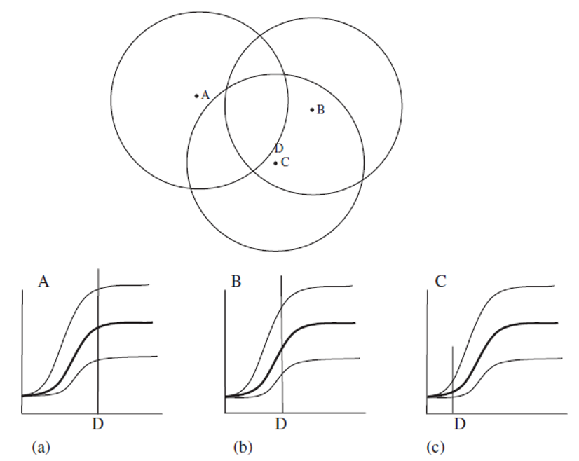
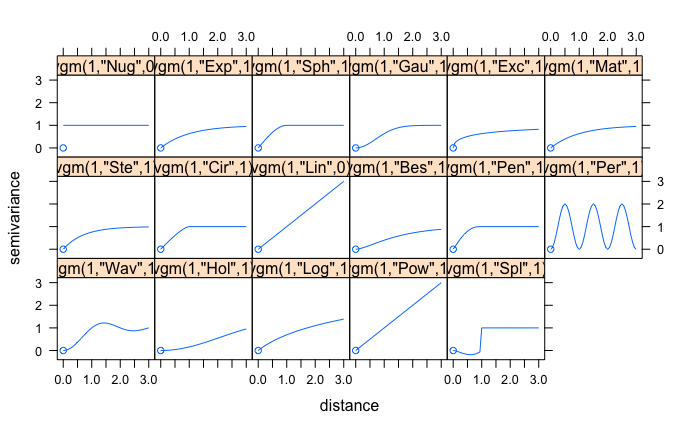

# Geoestadística

```{r geoest-setup, include=FALSE}
# library(gstat)
library(raster)
library(sp)
library(sf)
library(stars)
library(viridis)
library(rgeos)
library(rgdal)
library(DescTools)
library(mapview)
library(RColorBrewer)
library(ggrepel)
library(MOTE)
library(papaja)
library(kableExtra)
library(rio)
library(patchwork)
library(janitor)
library(conflicted)
library(tidymodels)
library(tidyverse)

knitr::opts_chunk$set(
  echo = TRUE,
  message = FALSE,
  warning = FALSE,
  error = FALSE,
  # fig.path = "figs/",
  fig.retina = 3,
  fig.width = 8,
  fig.asp = 0.618,
  fig.align = "center",
  out.width = "70%"
)

theme_set(theme_bw(base_size = 12))
conflict_prefer('select','dplyr')
conflict_prefer('filter','dplyr')

x_var = 'Distancia [m]'
y_var = 'Semivarianza'
x_map = 'X [m]'
y_map = 'Y [m]'
x_vmap = "Distancia E-W [m]"
y_vmap = "Distancia N-S [m]"

load('data/gstat.rdata')
```

## Introducción {#geostats-intro}

En este capítulo se va a introducir el análisis geoestadístico. La geoestadística es una rama de la estadística espacial, donde el principal objetivo es la caracterización de sistemas espaciales que no son por completo conocidos, o sea, hay incertidumbre. La situación típica es tener mediciones de una variable en ciertos puntos, y se quiere conocer (estimar, interpolar, simular) la distribución de esta variable en una región. Por lo anterior, una diferencia con la estadística clásica es que la ubicación de la muestra es importante y es un factor en el análisis, por lo que las muestras **no** van a ser independientes, sino que se espera que presenten una relación (dependencia) espacial. 

La geoestadística se puede usar principalmente con dos fines: interpolación (estimación) o simulación. En la interpolación (estimación) lo que se hace es obtener el valor promedio de la variable de interés, mientras que en la simulación lo que se hace es generar N posibles realizaciones de dicha variable, sujetos (condicionados) o no a datos observados (medidos).

En cierta forma, la dependencia espacial, es similar a la auto-correlación (\@ref(series-ac)), pero a diferencia de ésta, que trabaja con datos en 1 dimensión ($x$ o $t$), la geoestadística lidia con la relación de una o más variables en 2 ($x$, $y$), 3 ($x$, $y$, $z$ o $t$), e inclusive 4 ($x$, $y$, $z$, $t$) dimensiones.

Lo que se va a presentar y explicar en este capítulo se basa en extractos de capítulos de @davis2002, @swan1995, @borradaile2003, y @mckillup2010, así como textos más exhaustivos y completamente dedicados a esta temática, dentro de los cuales @chiles1999, @cressie1993, @goovaerts1997, @isaaks1989, @webster2007, y @wackernagel2003, corresponden con referencias clásicas y actualizadas. Para base teórica y práctica de cómo implementarlo en **R** se recomienda consultar @nowosad2019 y @pebesma2020.

## Métodos de interpolación {#geostats-met-interp}

De manera breve se mencionan diferentes métodos que se pueden usar, y han sido comúnmente utilizados, para la interpolación de variables en dos o más dimensiones. De manera general se tienen:

- Polígonos de Thiessen
- Triangulación
- Vecinos naturales (natural neighbours)
- Inverso de la distancia (inverse distance)
- Superficies de tendencia (trend surface)
- Ajuste polinomial (splines)
- **Kriging**

El énfasis de este capítulo (y de la geoestadística en general) va a ser el método de Kriging, el cual se considera (cuando aplica) como el método más robusto y preciso en comparación con el resto. En inglés se le conoce como **blue** que quiere decir **b**est **l**inear **u**nbiased **e**stimator y significa **mejor estimador lineal no sesgado**.  A diferencia del resto, Kriging brinda una estimación del error de interpolación, por lo que se puede determinar la precisión de los resultados.

## Conceptos de geoestadística {#geostats-conceptos}

En esta sección se definen algunos conceptos fundamentales en geoestadística, que forman las bases teóricas y prácticas para el análisis geoestadístico (\@ref(geostats-analisis)).

### Variable regionalizada

Es una variable aleatoria que varía localmente pero tiene una dependencia (estructura) regional, o sea su valor depende de la ubicación.

### Correlación espacial

Hay una relación que depende de la distancia entre observaciones, donde datos más cercanos entre si se relacionan más que datos más alejados.

### Diagrama de dispersión-$h$ ($h$-scatterplot)

Muestra cómo varia una variable con respecto a si misma a una distancia $h$ y dirección específica (Figura \@ref(fig:h-scatter)). Conforme los valores son menos similares, la nube de puntos se ensancha y dispersa más con respecto a la línea $x=y$.

(ref:h-scatt) Ejemplo de diagrama de dispersión-$h$, donde se observa como al incrementar la distancia la dispersión incrementa. Tomado de @isaaks1989.

```{r h-scatter, echo=FALSE, fig.cap='(ref:h-scatt)'}
knitr::include_graphics('images/h-scatter.png')
```

### Semivarianza

Medida de disimilitud espacial que varía con la distancia entre observaciones, y se expresa mediante la Ecuación \@ref(eq:semivarianza), donde $Z(x_i)$ es el valor de la variable en la posición $x_i$, $Z(x_i+h)$ es el valor de la variable a una distancia $h$, $N$ es el número total de puntos (observaciones), y $N(h)$ es el número de pares de puntos que se encuentran a una distancia $h$ específica. **A modo de recomendación se deben tener más de 30 pares de puntos por cada distancia, y no calcularla a más de la mitad de la máxima distancia**. 

\begin{equation}
  \gamma(h) = \frac{1}{2N(h)}\sum_{i=1}^{N(h)} [Z(x_i+h)-Z(x_i)]^2
  (\#eq:semivarianza)
\end{equation}

Para datos en una grilla regular se puede calcular usando al separación entre puntos como las diferentes distancias $h$ (Figura \@ref(fig:semivar-grilla)). Para datos irregularmente espaciados es necesario agrupar los puntos en bandas (Figura \@ref(fig:semivar-irregular)), donde hay que definir una tolerancia de la distancia ($w$, por lo general $h/2$), y una tolerancia angular ($\alpha/2$).

(ref:semivar-grilla) Esquema del calculo de la semivarianza para diferentes distancias donde los datos están completos (a) y donde hay vacíos de datos (b). Tomado de @webster2007.

```{r semivar-grilla, echo=FALSE, fig.cap='(ref:semivar-grilla)'}
knitr::include_graphics('images/semivar-2.png')
```

(ref:semivar-irregular) Esquema del calculo de la semivarianza para diferentes distancias donde los datos están irregularmente espaciados. Tomado de @webster2007.

```{r semivar-irregular, echo=FALSE, fig.cap='(ref:semivar-irregular)'}
knitr::include_graphics('images/semivar-irregular.png')
```

### Variograma experimental

Representación discreta de la relación espacial de la variable, donde se muestra como varía la semivarianza (para cada $h$) con respecto a la distancia (Figura \@ref(fig:variograma)). Se construye a partir de los datos y es similar a un diagrama de dispersión. Este un paso importante en el análisis geoestadístico (\@ref(geostats-analisis)), ya que el usuario/analista tiene completo control sobre la construcción del variograma. **Es importante definir la distancia máxima, recordando que no debe ser más de la mitad de la máxima separación entre puntos, y el intervalo de distancias, o sea, cada cuánto se va a calcular la semivarianza**. Estos parámetros van a controlar el cálculo del variograma y por ende el ajuste de un modelo y la interpolación.

(ref:variograma) Ejemplo de variograma experimental, mostrando la relación espacial de la variable.

```{r variograma, echo=FALSE, fig.cap='(ref:variograma)'}
knitr::include_graphics('images/variograma-exp.png')
```

### Modelo de variograma

Para poder hacer predicciones a cualquier distancia es necesario ajustar un modelo al variograma experimental, similar al ajuste lineal para un diagrama de dispersión. Para poder ajustar un modelo es necesario determinar las partes que lo van a componer (Figura \@ref(fig:modelo-variog)):

(ref:modelo-variog) Modelo de variograma mostrando las partes: meseta, pepita, y rango. Tomado de @webster2007.

```{r modelo-variog, echo=FALSE, fig.cap='(ref:modelo-variog)'}
knitr::include_graphics('images/variogram.png')
```
  
- Meseta total ($S$, sill): Cota superior del variograma o el limite del variograma cuando la distancia $h$ tiende a infinito, y por lo general corresponde con el valor de la varianza de la variable de interés.
- Meseta parcial ($C_1$, partial sill): Es la diferencia entre la meseta total y la pepita ($C_1 = S - C_0$). Si no hay pepita ($C_0=0$), entonces $C_1 = S$.
- Pepita ($C_0$, nugget): El intercepto y representa una discontinuidad puntual del semivariograma en el origen.
- Rango ($a$, range): Zona de influencia, la distancia a partir de la cual dos observaciones son independientes, el variograma se estabiliza y se alcanza la meseta.

#### Tipos

- Potencia

Este modelo se usa cuando el variograma experimental no presenta una meseta, y se estima mediante la Ecuación \@ref(eq:variog-potencia), donde $\alpha$ es la pendiente, $0<\lambda<2$ y controla la concavidad o convexidad del modelo. Se representa como se muestra en la Figura \@ref(fig:variog-potencia).

\begin{equation}
  \gamma(h) = C_0 + \alpha h^{\lambda}
  (\#eq:variog-potencia)
\end{equation}

(ref:variog-potencia) Modelo de potencia. Tomado de @sarma2009.

```{r variog-potencia, echo=FALSE, fig.cap='(ref:variog-potencia)', out.width='50%'}
knitr::include_graphics('images/variog-potencia.png')
```

- Esférico

Este modelo presenta una meseta clara, es de los más usados en ciencias de la tierra y tiene un comportamiento lineal cerca del origen, y se estima mediante la Ecuación \@ref(eq:variog-esferico). Se representa como se muestra en la Figura \@ref(fig:variog-esferico).

\begin{equation}
  \gamma(h) = 
  \begin{cases}
  C_0 + C_1 \left[ \frac{3}{2}\left( \frac{h}{a}\right) - \frac{1}{2}\left( \frac{h}{a}\right)^3 \right] & \text{para } h < a\\
  C_0 + C_1 & \text{para } h > a
  \end{cases}
  (\#eq:variog-esferico)
\end{equation}

(ref:variog-esferico) Modelo esférico. Tomado de @sarma2009.

```{r variog-esferico, echo=FALSE, fig.cap='(ref:variog-esferico)', out.width='50%'}

```

- Exponencial

Este modelo no alcanza una meseta sino más bien tiene un comportamiento asintótico, y se estima mediante la Ecuación \@ref(eq:variog-exp). Como no alcanza una meseta lo que se usa en el modelo como rango es $r=a/3$, o sea, una tercera parte del rango esperado. Se representa como se muestra en la Figura \@ref(fig:variog-exp).

\begin{equation}
  \gamma(h) = C_0 + C_1 \left[ 1 - exp\left(-\frac{h}{r}\right) \right]
  (\#eq:variog-exp)
\end{equation}

(ref:variog-exp) Modelo exponencial. Tomado de @sarma2009.

```{r variog-exp, echo=FALSE, fig.cap='(ref:variog-exp)', out.width='50%'}

```

- Gaussiano

Este modelo, similar al exponencial, no alcanza una meseta sino más bien tiene un comportamiento asintótico, además tiene un comportamiento suavizado cerca del origen. Como no alcanza una meseta lo que se usa en el modelo como rango es $r=a/\sqrt{3}$, o sea, el rango esperado entre la raíz de 3. Se estima mediante la Ecuación \@ref(eq:variog-gaus), y se representa como se muestra en la Figura \@ref(fig:variog-gaus).

\begin{equation}
  \gamma(h) = C_0 + C_1 \left[ 1 - exp\left(-\frac{h}{r}\right)^2 \right]
  (\#eq:variog-gaus)
\end{equation}

(ref:variog-gaus) Modelo gaussiano. Tomado de @sarma2009.

```{r variog-gaus, echo=FALSE, fig.cap='(ref:variog-gaus)', out.width='50%'}

```

La Figura \@ref(fig:variog-comparacion) muestra los tres modelos más usados en geociencias, donde todos representan una estructura con los parámetros: $C_0=0$, $C_1=30$, y $a=210$. Se observa como el modelo esférico tiene un comportamiento lineal cerca del origen, el modelo exponencial un comportamiento más creciente, y el modelo gaussiano un comportamiento suavizado. Además, los modelos exponencial y gaussiano no alcanzan la meseta, mientras que el esférico sí la alcanza.

```{r variog-comparacion, echo=FALSE, fig.cap='Comparación visual de los tres modelos más usados en geociencias, todos respresentando la misma estructura ($C_0=0$, $C_1=30$, y $a=210$).', out.width='90%'}

```

### Anisotropía

La correlación espacial puede no solo depender de la distancia sino también de la dirección. Si la correlación depende de la dirección se denomina anisotrópica (direccional). Si la correlación no depende de la dirección se denomina isotrópica (omnidireccional). El tipo de anisotropía más común, y fácil de modelar, es la *anisotropía geométrica*, donde se tiene la misma meseta pero diferente rango en diferentes direcciones. La *anisotropía zonal* es donde se tiene diferente mesetas en diferentes direcciones.

La anisotropía se puede detectar por medio de lo que se conoce como mapa de la superficie de variograma (Figura \@ref(fig:variog-anis) **A**) y/o variogramas direccionales (Figura \@ref(fig:variog-anis) **B**). De manera general, para la *anisotropía geométrica*, va a haber una dirección principal que va a coincidir con la dirección que presenta el mayor rango (donde hay más continuidad espacial), y una dirección menor que ocurre de forma perpendicular a la principal. En el caso de la Figura \@ref(fig:variog-anis) la dirección principal ocurre a los 35° y la menor a los 125°. La razón entre la dirección menor y principal se conoce como razón de anisotropía y varía entre 0 y 1, donde valores pequeños indican una fuerte anisotropía y valores altos indican poca o nula anisotropía.

```{r variog-anis, echo=FALSE, fig.cap='**A** Ejemplo de mapa de la superficie de variograma, mostrando anisotropía donde el eje principal ocurre en la dirección 35 y el eje menor ocurre en la dirección 125. **B** Variogramas direccionales donde se observa como en la dirección de 35 se alcanza un rango mayor ($\\sim 25$), mientras que en la dirección perpendicular (125) el rango es menor ($\\sim 15$)', out.width='100%'}

comp1 = cowplot::ggdraw() + cowplot::draw_image('images/variog-map-anis.png')
comp2 = cowplot::ggdraw() + cowplot::draw_image('images/variog-dir-anis.png')

(comp1 / comp2) + 
  plot_annotation(tag_levels = 'A')
```

### Validación cruzada

El ajuste de un modelo de variograma es mejor evaluado por medio de lo que se conoce como validación cruzada. Esta técnica se puede emplear de dos maneras: *LOO* (leave-one-out) o *K-Fold*, en inglés. *LOO* implica que iterativamente se deja por fuera cada uno de los puntos muestreados y con el modelo ajustado se predice el valor en ese punto, obteniéndose así un error con el valor conocido y el predecido. *K-Fold* divide los puntos en K bloques (folds), dejando un bloque por fuera a la vez y prediciendo valores para todos los puntos de este bloque con el modelo ajustado, y se repite para cada uno de los K bloques. Para cantidades de datos grandes *K-Fold* es más rápido que *LOO*.

Para evaluar el ajuste se tienen diferentes métricas, y la idea es comparar cada una de estas métricas para diferentes modelos ajustados y escoger el modelo que presente mejores métricas.

- Error medio ($ME$): Esta métrica corresponde con la media de los errores (residuales), e idealmente se tiene una media de 0. Se expresa mediante la Ecuación \@ref(eq:xval-me). Comparando modelos se escogería el que presente un error más cercano a 0.

\begin{equation}
  ME = \frac{1}{N} \sum_{i=1}^{N} (Y_i-\hat{Y_i})
  (\#eq:xval-me)
\end{equation}

- Error cuadrático medio ($RMSE$): Esta métrica cuantifica la desviación promedio entre los valores observados y predecidos, donde idealmente se desean valores pequeños. Se expresa mediante la Ecuación \@ref(eq:xval-rmse). Comparando modelos se escogería el que presente un $RMSE$ menor.

\begin{equation}
  RMSE = \sqrt{\frac{1}{N} \sum_{i=1}^{N} (Y_i-\hat{Y_i})^2}
  (\#eq:xval-rmse)
\end{equation}

- Razón de desviación cuadrática media ($MSDR$): Esta métrica compara que tan cerca está la diferencia entre predicción y valor actual con respecto a la varianza obtenida de la interpolación (error/varianza de Kriging, $s^2_{ei}$). Idealmente este valor debería andar cerca de 1. Se expresa mediante la Ecuación \@ref(eq:xval-msdr). Comparando modelos se escogería el que presente un MSDR más cercano a 1.

\begin{equation}
  MSDR = \frac{1}{N} \sum_{i=1}^{N} \frac{(Y_i-\hat{Y_i}^2)}{s^2_{ei}}
  (\#eq:xval-msdr)
\end{equation}

### Kriging

Método de interpolación (estimación) que utiliza toda la información procedente del variograma experimental y su ajuste para obtener unos factores de ponderación optimizados. El valor interpolado (estimado) corresponde con una media ponderada basada en la distancia e información del variograma (correlación espacial). Es el mejor ajuste posible con respecto a los puntos más cercanos (al punto a interpolar) en el variograma teórico (modelo). Los puntos que estén dentro del rango van a tener influencia sobre el punto a interpolar, y mientras más alejados los puntos menos peso y menos influencia. Lo anterior se resume en la Figura \@ref(fig:kriging-pesos).

(ref:kriging-pesos) Visualización del proceso de interpolación mediante Kriging, donde para el punto a interpolar (D), el punto que está más cercano (C) tiene más peso (influencia, baja semivarianza), y el punto más lejano (A) prácticamente no tiene peso ya que cae fuera del rango. Tomado de @mckillup2010.

```{r kriging-pesos, echo=FALSE, fig.cap='(ref:kriging-pesos)'}

```

Dentro de las ventajas del Kriging están:

- Compensa por efectos de agrupamiento (clustering), al dar menos peso individual a puntos dentro del agrupamiento que a puntos aislados,
- Da una estimación de la variable y del error (varianza de Kriging).

La interpolación resultante presenta las siguientes características (Figura \@ref(fig:kriging-carac)):

- Suaviza los resultados (puede variar dependiendo del modelo usado en el ajuste),
- Sobre-estima valores pequeños y sub-estima valores grandes.

(ref:kriging-carac) Ejemplo del resultado de interpolación (a), y su error (b), por medio de Kriging. Tomado de @trauth2015.

```{r kriging-carac, echo=FALSE, fig.cap='(ref:kriging-carac)'}

```

Kriging es una metodología general, por lo que hay varios tipos dependiendo de lo que se tenga (conozca), las características de la variable y cantidad y tipos de variables. En general Kriging funciona mejor cuando los datos están normalmente distribuidos y son estacionarios, esto último quiere decir que hay poca o ninguna variación en la media y varianza de la(s) variable(s). Además, si los datos presentan una tendencia (el variograma no alcanza una meseta) es necesario lidiar con ésto, lo se puede trabajar de dos maneras: se trabaja con los residuales al remover la tendencia (esencialmente lo que hace el Kriging Universal), o se ajusta un modelo que no alcance una meseta (potencia).

Los tipos de Kriging más comunes son:

- *Simple*: En este caso se asume que se conoce la media de la variable (lo cual no es necesariamente cierto), y que ésta es constante. Por lo anterior no es práctico de usar.
- *Ordinario*: Éste es el más usado, se asume una media constante pero no conocida, y además los datos no deben tener una tendencia.
- *Lognormal*: Se usa cuando los datos tienen una fuerte asimetría positiva, y corresponde con aplicar Kriging Ordinario sobre los datos log-transformados, por lo general usando el logaritmo natural. **La transformación inversa del resultado de la interpolación NO es simplemente exponenciar los resultados, por lo que hay que tener cuidado con esto. @cressie1993, @webster2007 y otros proveen más detalles y las fórmulas específicas para realizar la transformación inversa de manera apropiada.**
- *Universal*: Para el caso en que la media es no constante y no conocida, se le conoce como Kriging con tendencia. Esta es una forma de lidiar con datos con tendencia, como el caso típico de niveles piezométricos.
- *CoKriging*: Se usa cuando se requiere lidiar con 2 o más variables, es la versión multivariable de Kriging ordinario. Las variables deben presentar co-regionalización, lo que quiere decir que las variables tienen que variar conjuntamente en el espacio.
- *Indicador*: Se usa cuando los datos son cualitativos (categóricos) o se transforman datos cuantitativos en cualitativos, y lo que se obtiene es la probabilidad condicional de cada categoría. Puede lidiar con cualquier distribución de los datos, por lo que se considera un método no-paramétrico.

## Análisis geoestadístico {#geostats-analisis}

Esta sección muestra cómo realizar un análisis geoestadístico completo, usando como ejemplo los datos de `jura` que fueron inicialmente presentados y trabajados por @goovaerts1997, y vienen en el paquete *gstat* [@R-gstat], donde vienen varios juegos de datos y el que se va a usar es `jura.pred`. En estos datos, que se ubican en la región de Jura en Suiza, se va a enfocar el análisis en el contenido de cobre (Cu). El paquete *gstat* es el principal paquete que se va a usar para el análisis geoestadístico.

### Análisis Exploratorio de Datos

La idea de este análisis inicial, exploratorio, es determinar la distribución de la variable de interés, para determinar si es necesaria alguna transformación para que presenten una distribución aproximadamente normal. Además, se determina la varianza que va a ser una aproximación de la meseta del variograma.

```{r AED, fig.cap='Distribución de los datos crudos del contenido de Cu.'}
data('jura',package = 'gstat')
datos = jura.pred

myvar = 'Cu' # variable a modelar
summary(datos)
Desc(datos[[myvar]],plotit = F)
(S = var(datos[[myvar]])) # varianza de la variable
ggplot(datos, aes_string(myvar)) + 
  geom_histogram(aes(y = stat(density)), bins = 10, 
                 col = 'black', fill = 'blue', alpha = .5) + 
  geom_vline(xintercept = mean(datos[[myvar]]), col = 'red') +
  geom_density(col = 'blue') +
  labs(y = 'Densidad')
```

Como los datos muestran una fuerte asimetría positiva $>1$ (Figura \@ref(fig:AED)), es necesario trabajar con el logaritmo de los datos. Si la asimetría estuviera entre 0.5 y 1, se podría trabajar con la raíz cuadrada de los datos.

```{r AED-log, fig.cap='Distribución de los datos log-transformados del contenido de Cu.'}
datos =  datos %>% 
  mutate(logCu = log(Cu))

myvar = 'logCu' # variable a modelar
Desc(datos[[myvar]],plotit = F)
(S = var(datos[[myvar]])) # varianza de la variable
ggplot(datos, aes_string(myvar)) + 
  geom_histogram(aes(y = stat(density)), bins = 10, 
                 col = 'black', fill = 'blue', alpha = .5) + 
  geom_vline(xintercept = mean(datos[[myvar]]), col = 'red') +
  geom_density(col = 'blue') +
  labs(y = 'Densidad')
```

Ya con la transformación los datos muestran una distribución aproximadamente normal (Figura \@ref(fig:AED-log)), por lo que son más aptos para el modelado geoestadístico.

Antes de proceder con el modelado geoestadístico en **R**, es necesario convertir los datos en objetos espaciales y realizar ciertas operaciones previas para preparar y estudiar los datos.

Los datos traen información de dos sistemas de coordenadas, uno local (x,y) y otro global (long, lat). Para efectos de cálculos es recomendado trabajar en sistemas planos (x,y). Para pasar a objeto espacial se usa la función `st_as_sf` del paquete *sf* [@R-sf], donde los argumentos son los datos, las columnas donde están las coordenadas, y el código del sistema de coordenadas. En este caso se van a usar la latitud y longitud, y posteriormente se van a transformar al sistema plano local, para trabajar con unidades plana (SI).

```{r datos-sf}
datos_sf = st_as_sf(datos, coords = 3:4, crs = 4326) %>% 
  st_transform(21781) %>% 
  mutate(X = st_coordinates(.)[,1], Y = st_coordinates(.)[,2]) %>% 
  relocate(X, Y)
datos_sp = as(datos_sf, 'Spatial')
coordnames(datos_sp) = c('X','Y')
```

Es importante conocer las distancias ya que no es recomendado calcular el variograma experimental a distancias mayores a la mitad de la distancia máxima. El siguiente bloque de código calcula las distancias para usar como referencia.

```{r distancias}
dists = st_distance(datos_sf) %>% .[lower.tri(.)] %>% unclass()
distancias = signif(c(min(dists), mean(dists), max(dists)),6) # rango de distancias
names(distancias) = c('min', 'media', 'max') 
distancias
```

Una opción para representar los datos y el resultado de la interpolación, es usando el polígono que encierra los datos. El siguiente bloque realiza el cálculo de dicho polígono.

```{r outline}
outline = st_convex_hull(st_union(datos_sf))
```

Hay que definir una grilla sobre la cual se va a realizar la interpolación, los puntos a los cuáles se les va a estimar el valor de la variable de interés. El siguiente bloque calcula una grilla rectangular y una versión recortada conforme el polígono anterior, generando objetos `stars` [@R-stars] que son similares a objetos `raster` [@R-raster] pero más versátiles, y que se usan en general para arreglos espaciales.

```{r grilla-interp}
bb = st_bbox(datos_sf)
dint = max(c(bb[3]-bb[1],bb[4]-bb[2])/nrow(datos_sf))
dx = seq(bb[1],bb[3],dint) # coordenadas x
dy = seq(bb[4],bb[2],-dint) # coordenadas y
st_as_stars(matrix(0, length(dx), length(dy))) %>%
  st_set_dimensions(1, dx) %>%
  st_set_dimensions(2, dy) %>%
  st_set_dimensions(names = c("X", "Y")) %>% 
  st_set_crs(st_crs(datos_sf)) -> datosint

datosint2 = st_crop(datosint, outline)
```

Siempre es importante visualizar la distribución espacial de los datos. Las Figuras \@ref(fig:dist-espacial) y \@ref(fig:dist-espacial-int) muestran mapas estáticos e interactivos, respectivamente, de los datos, donde los puntos se encuentran rellenados con el contenido de Cu log-transformado.

```{r dist-espacial, fig.cap='Mapa estático de la distribución espacial de los datos.'}
ggplot() + 
  geom_sf(data = outline, col = 'cyan', alpha = .1, size = .75) + 
  geom_sf(data = datos_sf, aes_string(col = myvar), size = 3, alpha = 0.6) + 
  scale_color_viridis_c() + 
  labs(x = x_map, y = y_map) +
  if (!is.na(st_crs(datos_sf))) {
    coord_sf(datum = st_crs(datos_sf))
  }
```

```{r eval=F}
mapview(outline, alpha.regions = 0, layer.name='Border', 
        homebutton = F, legend = F, native.crs = F) + 
  mapview(datos_sf, zcol = myvar, alpha=0.1, 
          layer.name = myvar, native.crs = F, 
          col.regions = brewer.pal(9,'YlOrRd'))
```

```{r dist-espacial-int, echo=F, out.width='90%', fig.cap='Mapa interactivo de la distribución espacial de los datos.'}
mv1 = mapview(outline, alpha.regions = 0, layer.name='Border', 
              homebutton = F, legend = F, native.crs = F) + 
  mapview(datos_sf, zcol = myvar, alpha=0.1, 
          layer.name = myvar, native.crs = F, 
          col.regions = brewer.pal(9,'YlOrRd'))
mv1@map
```

### Modelado geoestadístico 

Ya con los datos presentando una distribución aproximadamente normal, y los objetos espaciales definidos, se puede proceder al modelado geoestadístico. En este caso se va a usar Kriging Lognormal, que es aplicar Kriging Ordinario a los datos log-transformados.

#### Variograma experimental

Lo primero es crear el variograma omnidireccional (Figura \@ref(fig:variog-omni)). Para esto se crea un objeto `gstat` donde se define la fórmula y los datos a usar. La fórmula para el caso de Kriging Ordinario es similar a modelar solamente el intercepto (`variable ~ 1`), mientras que para el Kriging Universal sería similar a agregar predictores (`variable ~ predictor`), donde comúnmente se usan las coordenadas (`variable ~ X + Y`). 

Para crear el variograma como tal, se usa la función `variogram`, que tiene como argumentos el objeto `gstat`, el intervalo de distancia (`width`) y la distancia máxima a la cual calcular la semivarianza (`cutoff`).

```{r eval=FALSE}
g = gstat(formula = as.formula(paste(myvar,'~1')), 
          data = datos_sf) # objeto gstat para hacer geoestadistica

# variograma experimental cada cierta distancia (width), y hasta cierta distancia (cutoff)
dat.vgm = variogram(g, 
                    width = 100,
                    cutoff = 1500) 
```

```{r variog-omni, fig.cap='Variograma omnidireccional del logaritmo de Cu. Las etiquetas de los puntos corresponden con el número de pares de puntos usados para el cálculo de la semivarianza. La línea roja punteada corresponde con la varianza de los datos, que es una aproximación a la meseta de los datos.', out.width='90%'}
ggplot(dat.vgm,aes(x = dist, y = gamma)) + 
  geom_point(size = 2) + 
  labs(x = x_var, y = y_var) +
  geom_hline(yintercept = S, col = 'red', linetype = 2) +
  ylim(0, max(dat.vgm$gamma)) +
  xlim(0, max(dat.vgm$dist)) + 
  geom_text_repel(aes(label = np), size = 3)
```

Para evaluar la anisotropía se realizan tanto el mapa de la superficie de variograma (Figura \@ref(fig:variog-map)), como los variogramas direccionales (Figura \@ref(fig:variog-dir)). Para el mapa de la superficie de variograma es necesario definir la extensión (`cutoff`), el ancho del pixel (`width`, no es el mismo que para el variograma), y definir que es un mapa (`map=TRUE`).

```{r eval=FALSE}
map.vgm <- variogram(g, 
                     width = 200, 
                     cutoff = 1500, 
                     map = TRUE)
```

```{r variog-map, fig.cap='Mapa de la superficie de variograma para los datos del logaritmo de Cu.', out.width='90%'}
ggplot(data.frame(map.vgm), aes(x = map.dx, y = map.dy, fill = map.var1)) +
  geom_raster() + 
  scale_fill_gradientn(colours = plasma(20)) +
  labs(x = x_vmap, y = y_vmap, fill = "Semivarianza") +
  coord_equal()
```

Para el caso de los variogramas direccionales es necesario definir las direcciones (`alpha`) y la tolerancia angular (`tol.hor`), donde lo acostumbrado es usar direcciones cada 45° y la tolerancia angular es la mitad del intervalo entre direcciones.

```{r eval=FALSE}
dat.vgm2 = variogram(g, 
                     alpha = c(0,45,90,135),
                     tol.hor = 22.5, 
                     cutoff = 1500) # con direcciones y tolerancia angular
```

```{r variog-dir, fig.cap='Variogramas direccionales cada 45°. La línea roja punteada representa la varianza de los datos, lo que se aproxima a la meseta total.', out.width='90%'}
ggplot(dat.vgm2,aes(x = dist, y = gamma,
                    col = factor(dir.hor), shape = factor(dir.hor))) + 
  geom_point(size = 2) + 
  # geom_line() +
  labs(x = x_var, y = y_var, col = "Dirección", shape = 'Dirección') +
  geom_hline(yintercept = S, col = 'red', linetype = 2) +
  ylim(0, max(dat.vgm2$gamma)) +
  xlim(0, max(dat.vgm2$dist)) + 
  scale_color_brewer(palette = 'Dark2') +
  facet_wrap(~dir.hor) + 
  geom_text_repel(aes(label = np), size = 3, show.legend = F)
```

Tanto el mapa como los variogramas direccionales no muestran señas de anisotropía, por lo que el modelado se puede hacer con el variograma omnidireccional.

#### Ajuste de modelo de variograma

Lo primero que hay que hacer antes de ajustar un modelo al variograma experimental es estimar las partes del variograma (meseta, pepita, rango) y establecer valores iniciales, para posteriormente realizar el ajuste.

Los valores iniciales se estiman a partir del variograma experimenta, en este caso omnidireccional. Revisando la Figura \@ref(fig:variog-omni), se puede estimar una pepita de aproximadamente 0.1, una meseta de 0.4, un rango de 500, y se puede usar un modelo tipo esférico ('Sph'). Lo anterior se define en el siguiente bloque.

```{r params}
pep = .1 # pepita
meseta = .4 # meseta parcial
mod = "Sph" # modelo a ajustar (esferico)
rango = 500 # rango
```

Los modelos vienen ya definidos en *gstat*, por lo que simplemente hay que indicar cuál se quiere usar. Para ver los modelos disponibles se puede ejecutar la función `show.vgms` (Figura \@ref(fig:gstat-mods)), que muestra una grilla de los diferentes modelos, donde el nombre del modelo se encuentra en comillas. Para los modelos expuestos anteriormente el nombre en *gstat* sería: 'Sph' para esférico, 'Exp' para exponencial, 'Gau' para gaussiano, y 'Pot' para potencia.

```{r eval=FALSE}
show.vgms()
```

```{r gstat-mods, echo=FALSE, out.width='100%', fig.cap='Modelos disponibles en *gstat*'}

```

Con estos valores iniciales se puede proceder al ajuste por medio de la función `fit.variogram`, que requiere el variograma experimental y el modelo que se define por medio de la función `vgm`. Se realiza un ajuste automático, brindando el modelo ajustado, y a su ve se puede calcular un error del ajuste inicial, pero el más confiable se obtiene con la validación cruzada.

```{r ajuste, eval=FALSE}
dat.fit = fit.variogram(dat.vgm, model = vgm(meseta, mod, rango, pep))
fit.rmse = sqrt(attributes(dat.fit)$SSErr/(nrow(datos))) # error del ajuste
varmod = dat.fit # modelo ajustado
```

```{r}
fit.rmse
varmod
```

El ajuste sobre el variograma se puede visualizar en las Figuras \@ref(fig:ajuste-1) y \@ref(fig:ajuste-2), donde la primera muestra el ajuste sobre el variograma omnidireccional y la segunda sobre los variogramas direccionales.

```{r eval=FALSE}
plot(dat.vgm, dat.fit, xlab = x_var, ylab = y_var) # omnidireccional
```

```{r ajuste-1, echo=FALSE, fig.cap='Variograma omnidireccional y modelo esférico ajustado.', out.width='90%'}
knitr::include_graphics('images/gstat-ajuste1.png')
```

```{r eval=FALSE}
plot(dat.vgm2, dat.fit, as.table = T, xlab = x_var, ylab = y_var) # direccionales
```

```{r ajuste-2, echo=FALSE, fig.cap='Variogramas direccionales y modelo esférico ajustado, mostrando que el modelo aplica para todas las direcciones.', out.width='90%'}
knitr::include_graphics('images/gstat-ajuste2.png')
```

#### Validación cruzada

La validación cruzada es una mejor estimación del error del ajuste del modelo, conforme a lo que se explicó en la sección de [Conceptos de geoestadística]. Se presenta aquí una descripción numérica de los residuales (error de ajuste), así como el error cuadrático medio (RMSE), la razón de desviación cuadrática media (MSDR), y la correlación entre los valores observados y predecidos. Para esta última lo que se busca es determinar qué tan similares son los valores.

La validación cruzada se realiza por medio de la función `krige.cv`, la cual requiere los argumentos de la fórmula, datos, y el modelo ajustado.

```{r xval, eval=FALSE}
kcv.ok = krige.cv(as.formula(paste(myvar,'~1')), 
                  locations = datos_sf, model = varmod)
```

```{r xval-metrics}
cl = .95

summary(kcv.ok$residual)

xval.rmse = sqrt(mean(kcv.ok$residual^2)) # RMSE - menor es mejor

xval.msdr = mean(kcv.ok$residual^2/kcv.ok$var1.var) # MSDR - ~1 es mejor

xval.mod = lm(observed ~ var1.pred, as.data.frame(kcv.ok))

xval.r2 = xval.mod %>% broom::glance() %>% pull(r.squared)

correl = signif(CorCI(cor(kcv.ok$observed, kcv.ok$var1.pred), nrow(kcv.ok)),3)

metricas = tibble(metric = c('$RMSE$','$MSDR$','$r$','$R^2$'), 
                  estimate = c(xval.rmse,xval.msdr,correl[1],xval.r2))

CIbeta = signif(broom::tidy(xval.mod, conf.int=T)[2,c(2,6,7)],4)
CIbeta
```

```{r xval-metrics-tab, echo=FALSE}
metricas %>% 
  kable(col.names = c('Métrica','Valor'),
        align = 'c',
        digits = 3,
        caption = 'Métricas de ajuste para la validación cruzada') %>% 
  kable_styling(full_width = F)
```

Las métricas por si solas no dicen mucho, son más útiles cuando se comparan modelos, pero en general se puede decir que presentan valores aceptables (Tabla \@ref(tab:xval-metrics-tab)), la MSDR está muy cerca de 1, la correlación es alta (`r apa(correl[[1]],3,F)`), y el RMSE es menor a la desviación de los datos (`r apa(sqrt(S),3,T)`). De forma ideal se debieran ajustar varios modelos, realizar la validación cruzada y escoger el que muestra mejor desempeño.

```{r xval-plots1, fig.cap='Relación entre los valores observados y predecidos por la validación cruzada. La línea roja es la línea 1:1 y la línea verde es la regresión entre los datos.', out.width='80%'}
ggplot(as.data.frame(kcv.ok), aes(var1.pred, observed)) + 
  geom_point(col = "blue", shape = 1, size = 1.25) + 
  coord_fixed() + 
  geom_abline(slope = 1, col = "red", size = 1) + 
  geom_smooth(se = F, method = 'lm', col = 'green', size = 1.25) +
  labs(x = "Predecidos", y = "Observados")
```

```{r xval-plots2, fig.cap='Histograma de los residuales, donde lo que se busca es que esten centrados alrededor de 0 y sigan una distribución aproximadamente normal.', out.width='80%'}
ggplot(as.data.frame(kcv.ok), aes(residual)) + 
  geom_histogram(bins = 15, col = 'black', fill = "blue") + 
  labs(x = "Residuales", y = "Frecuencia") + 
  geom_vline(xintercept = mean(kcv.ok$residual), col = 'red')
```

> Los valores predecidos y los observados muestran buena correlación (*r* = `r apa(correl[[1]],3,F)`, `r cl*100`% IC [`r apa(correl[[2]],3,F)`, `r apa(correl[[3]],3,F)`]). La pendiente de la relación entre los valores predecidos y los observados es de `r CIbeta[[1]]`, `r cl*100`% IC [`r CIbeta[[2]]`, `r CIbeta[[3]]`]. El histograma de los residuales se observa simétrico y centrado en cero (0). Lo anterior indica un modelo apropiado.

### Interpolación (Kriging)

Una vez se ha calculado el variograma, se le ajusta un modelo, y se valida el modelo se puede proceder a la interpolación mediante Kriging. Hay que recalcar que la interpolación como tal es el último paso de todo el proceso, y si no se ejecutan con cuidado los pasos anteriores el resultado que se obtiene puede no tener validez o sentido.

La función general para realizar la interpolación por Kriging es `krige`, la cual requiere la fórmula, los datos, la grilla a interpolar, y el modelo ajustado al variograma experimental. Esta función resulta en objeto `stars`, ya que es el formato de la grilla a interpolar, con dos atributos o columnas: los valores predecidos (estimados) en `var1.pred` y la varianza de la predicción (estimación) en `var1.var`.

Para el caso de trabajar con datos log-transformados, y como se mencionó en la sección de los tipos de Kriging, no es tan directo como aplicar la transformación inversa para obtener la interpolación en la escala original de los datos. La función `krigeTg` es capaz de realizar esta transformación inversa de la forma adecuada. La diferencia entre `krigeTg` y `krige` es que `krigeTg` ocupa que la fórmula contenga a la variable **SIN** transformar (por ejemplo: `Cu ~ 1`, en vez de `logCu ~ 1`), y definir el parámetro `lambda` que para la transformación logarítmica equivale a 0. El objeto resultante va a tener los mismos atributos a los de la función `krige` y otros más, donde `var1TG.pred` y `var1TG.var` corresponde, respectivamente, con las predicciones y varianzas en la escala original de los datos.

```{r kriging, eval=FALSE}
ok = krige(as.formula(paste(myvar,'~1')), 
           locations = datos_sp,
           newdata = datosint2, 
           model = varmod)

okBT = krigeTg(formula = as.formula(paste(str_remove(myvar,'log'),'~1')), 
               locations = datos_sp,
               newdata = datosint, 
               model = varmod, 
               lambda = 0)
```

Los mapas de predicción (estimación) y de varianza (error de estimación) se presentan en las Figuras \@ref(fig:mapa-pred) y \@ref(fig:mapa-var). Como el objeto a usar es del tipo `stars`, el paquete *stars* trae una geometría (`geom_stars`) para visualizar los datos usando *ggplot2*, a como se muestra en los siguientes dos bloques para visualizar los atributos respectivos, donde el argumento más importante es el `aes(fill)` donde se define el atributo a visualizar.

```{r mapa-pred, warning=FALSE, fig.cap='Mapa de predicción para el logaritmo de Cu.', out.width='90%'}
p1 = ggplot() + 
  geom_stars(data = ok, aes(fill = var1.pred, x = x, y = y)) + 
  scale_fill_gradientn(colours = viridis(10), na.value = NA) + 
  coord_sf() + 
  labs(x = x_map, y = y_map, 
       title = 'Predicción', 
       fill = myvar)
p1
```

```{r mapa-var, warning=FALSE, fig.cap='Mapa de varianza (error) para el logaritmo de Cu.', out.width='90%'}
p2 = ggplot() + 
  geom_stars(data = ok, aes(fill = var1.var, x = x, y = y)) + 
  scale_fill_gradientn(colours = brewer.pal(9,'RdPu'), na.value = NA) + 
  coord_sf() + 
  labs(x = x_map, y = y_map, 
       title = 'Varianza',
       fill = myvar)
p2
```

Este capítulo brinda una introducción básica a geoestadística, presentando los conceptos más importantes, los tipos de Kriging que hay, y se demuestra lo presentado con un ejemplo (usando Kriging Lognormal, Kriging Ordinario en datos log-transformados) que representa el caso más típico y común (tal vez a excepción de la transformación logarítmica) en cómo se realiza un análisis geoestadístico de principio a fin. Para más información, detalle, y ejemplos se remite al lector a consultar las referencias sugeridas.

```{r include=FALSE}
# automatically create a bib database for R packages
knitr::write_bib(c(
  .packages(), 'bookdown', 'knitr', 'rmarkdown'
), 'packages.bib')
```
