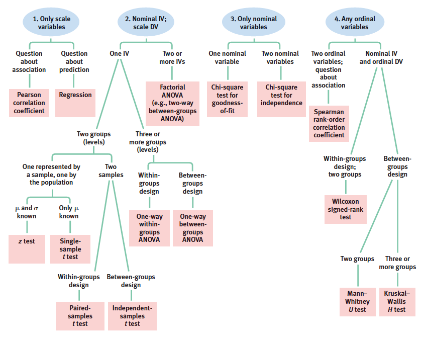
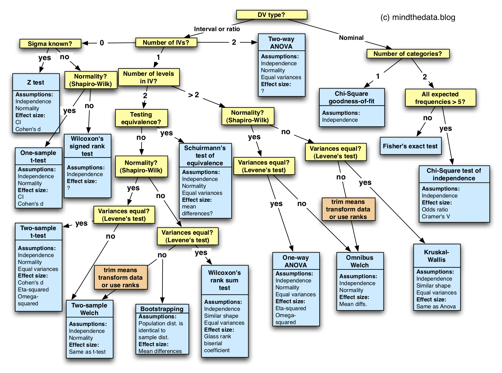

# (APPENDIX) Apéndices {-}

```{r apendice-setup, include=FALSE}
library(kableExtra)
library(tidyverse)

knitr::opts_chunk$set(
  echo = TRUE,
  message = FALSE,
  warning = FALSE,
  error = FALSE,
  # fig.path = "figures/",
  fig.retina = 3,
  fig.width = 8,
  fig.asp = 0.618,
  fig.align = "center",
  out.width = "70%"
)
```

# Reportar estadísticas {#apendice-repote}

El Manual de APA -@americanpsychologicalassociation2010 presenta guías de cómo reportar estadísticas. Estas guías han sido utilizadas a lo largo de este documento y se resumen aquí los aspectos más importantes.

- Fracciones decimales

Para los números que no puedan ser mayor que 1 no se usará cero antes del punto decimal. Ejemplos de este caso son las probabilidades ($p$), medidas de asociación ($r,\ r_s,\ R^2,\ \eta^2,\ V$), y niveles de significancia ($\alpha$). En el caso del valor-$p$ se debe reportar el valor exacto a menos de que sea menor a $.001$.

Por ejemplo: $r=.56$, $\eta^2=.15$, $\alpha=.05$, $p=.21$, $p < .001$.

Se usarán generalmente dos decimales al reportar resultados, ésto para facilitar la comprensión. En caso de que el resultado presente más decimales se puede realizar una conversión de unidades para reportar únicamente dos decimales (ejemplo: metros a milimetros)

- Estadísticas

Para reportar estadísticas se escribirán éstas con su abreviatura o símbolo matemático respectivo en itálica, y se seguirá la recomendación en el uso de decimales mencionada anteriormente.

Por ejemplo: $M=30.53$ o $\bar{X}=30.53$.

La Tabla \@ref(tab:simbologia) muestra algunas de la estadísticas más usadas y las formas aceptadas de reportarlas.

```{r simbologia, echo=FALSE}
simbolos = tibble(
  abrev = c('IC (CI)',
            '$d$',
            'TE (ES)',
            '$RMSE$',
            '$F(v_1,v_2)$',
            '$g$',
            '$M (\\bar{X})$',
            '$Mdn$',
            '$n$',
            '$N$',
            'ns',
            '$r$',
            '$r_s$',
            '$R^2$',
            '$s$',
            'DE (SD)',
            '$t$',
            '$z$',
            '$\\alpha$',
            '$\\eta^2$',
            '$\\mu$',
            '$v$',
            '$\\chi^2$'),
  def = c('Intervalo de confianza',
         'Medida de Cohen para comparación de medias',
         'Tamaño del efecto',
         'Error cuadrático medio',
         'Estadístico $F$ con grados de libertad $v_1,v_2$',
         'Medida de Hedges para comparación de medias, corregida para tamaño de muestra pequeño',
         'Media muestral',
         'Mediana muestral',
         'Número de observaciones en un grupo/muestra específico',
         'Número de observaciones total',
         'Sin significancia estadística',
         'Correlación de Pearson',
         'Correlación de Spearman',
         'Coeficiente de determinación',
         'Desviación estándar muestral',
         'Desviación estándar',
         'Estadístico/distribución $t$',
         'Valor estandarizado',
         'Nivel de significancia',
         'Medida de asociación (eta cuadrada)',
         'Media poblacional',
         'Grados de libertad',
         'Estadístico/distribución chi-cuadrada')
) 

simbolos %>% 
  kable(col.names = c('Abreviatura / Símbolo',
                      'Definición'
                      ),
        caption = 'Abreviaturas y símbolos estadísticos',
        align = 'c',
        escape = F) %>% 
  kable_styling(full_width = T) %>% 
  column_spec(1,width = '10em') %>% 
  column_spec(2,width = '30em') %>% 
  footnote(general_title = 'Nota:',
           general = c('Conforme APA -@americanpsychologicalassociation2010'),
           footnote_as_chunk = T)
```

- Resultados de pruebas estadísticas

A como se mencionó en los capítulos [Pruebas Estadísticas] y [Estadística No Paramétrica], y por recomendaciones de APA -@americanpsychologicalassociation2010, se deberá reportar el resultado de la prueba estadística así como el tamaño de efecto respectivos (y de ser posible su intervalo de confianza).

En los siguientes formatos `prueba` se refiere a la prueba realizada ($z,\ t,\ F$), `parámetro` se refiere a los grados de libertas ($v$), `estadístico` se refiere al valor obtenido en la prueba, `significancia` se refiere al valor-*p* de la prueba, `tamaño del efecto` se refiere al valor del tamaño del efecto respectivo, $\alpha$ se refiere al nivel de significancia escogido (por lo general $\alpha=.05$), e `IC [intervalo de confianza]` se refiere al intervalo de confianza del tamaño del efecto.

El número de sujetos total se reporta como $N$ y de un subconjunto, grupo, o muestra como $n$.

Para reportar resultados de pruebas estadísticas inferenciales *paramétricas* se deberá seguir el formato:
<br>
\begin{equation}
  \text{prueba}(\text{parámetro}) = \text{estadístico},\ p = \text{significancia},\\
  d = \text{tamaño del efecto}, \ (1-\alpha)*100\% \ IC \ [\text{intervalo de confianza}]
  (\#eq:formto-param)
\end{equation}
<br>
Para una prueba $t$ de 1 muestra se tendría: $t(7) = 1.39, p = .208, d = 0.49, \ 95\% \ IC \ [-0.26,\ 1.21]$.

Para una prueba $F$ o de ANOVA se tendría: $F(2,9) = 10.80, p = .004, \eta^2 = .71, \ 95\% \ IC \ [.16,\ .89]$.

Para reportar resultados de pruebas estadísticas inferenciales *no-paramétricas* $\chi^2$ se deberá seguir el formato:
<br>
\begin{equation}
  \chi^2(\text{parámetro}, N) = \text{estadístico},\ p = \text{significancia},\\
  V = \text{tamaño del efecto}, \ (1-\alpha)*100\% \ IC \ [\text{intervalo de confianza}]
  (\#eq:formto-chi2)
\end{equation}
<br>
Por ejemplo, $\chi^2(12, N = 246) = 109.70, p < .001, V = .39, \ 95\% \ IC \ [.32,\ .46]$

Para reportar resultados de pruebas estadísticas inferenciales *no-paramétricas* sobre rangos se deberá seguir el formato:
<br>
\begin{equation}
  \text{prueba} = \text{estadístico},\ p = \text{significancia},\\
  r = \text{tamaño del efecto}, \ (1-\alpha)*100\% \ IC \ [\text{intervalo de confianza}]
  (\#eq:formto-noparam)
\end{equation}
<br>
Por ejemplo, $T = 27.50, p = .207, r = .47, \ 95\% \ IC \ [-.35,\ .88]$

# Escoger prueba estadística {#apendice-pruebas}

Las Figuras \@ref(fig:pruebas1) y \@ref(fig:pruebas2) presentan diagramas de flujo que se pueden usar como guías para determinar la prueba estadística a realizar. En su gran mayoría recopila las pruebas cubiertas en este documento.

(ref:pruebas1) Diagrama de flujo para escoger la prueba estadística apropiada. Tomado de @nolan2014.

```{r pruebas1, echo=FALSE, fig.cap='(ref:pruebas1)'}

```

(ref:pruebas2) Otro diagrama de flujo para escoger pruebas estadísticas. Tomado de @tsirlin2020.


```{r pruebas2, echo=FALSE, fig.cap='(ref:pruebas2)'}

```
