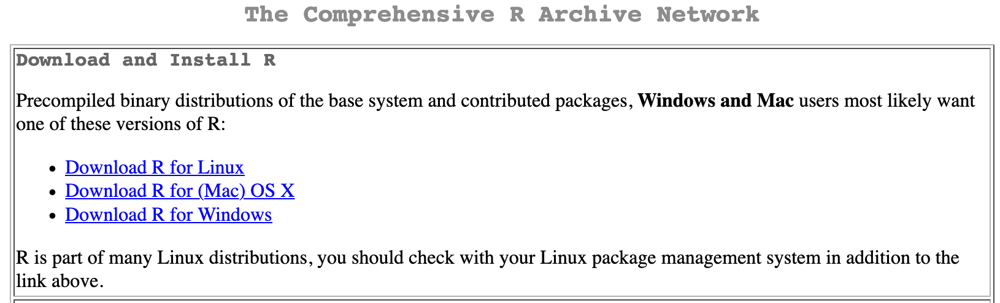
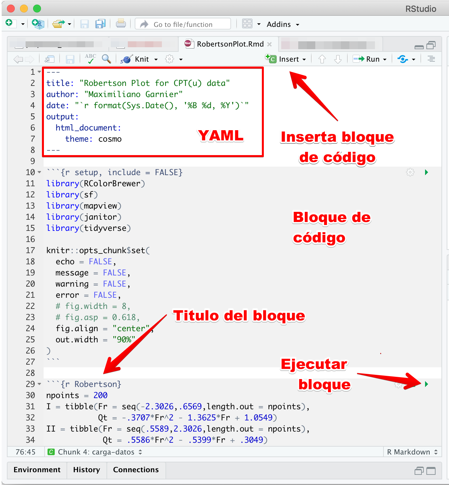

# (PART\*) R {-}

# Introduccion {#intro}

**R** es un programa estadistico y de programacion, el cual le permite al usuario hacer uso de funciones (en paquetes) ya definidas o la creacion de funciones propias para resolver problemas especificos. Muchas de las funciones presentan un gran detalle en los resultados, haciendo facil la interpretacion de los mismos.

## Instalacion de R y RStudio

**R** es el motor, donde se realizan las operaciones, **RStudio** es el chasis, lo que le permite al usuario interactuar con el motor, es una interfaz de desarrollo que facilita las tareas en un proyecto.

Primero hay que instalar **R**:

1. Ir a [R](https://cran.r-project.org/)
2. Descargar la version dependiendo del sistema operativo (Figura \@ref(fig:cran))

<div class="figure">

<p class="caption">(\#fig:cran)Repositorio CRAN para descargar R</p>
</div>

Despues de instalar **R** hay que instalar **RStudio**:

1. Ir a [RStudio](https://rstudio.com/products/rstudio/download/)
2. Descargar RStudio Desktop, la version libre (Free)

## Paquetes

La instalacion de **R** basica trae una serie de paquetes (librerias) instaladas, que funcionan para cosas basicas y sencillas.

Para instalar paquetes de forma interactiva se va a la seccion de paquetes (packages), se hace click en instalar (install), como se muestra en la Figura \@ref(fig:instalar), y se escribe el o los nombres de los paquetes a instalar, separados por espacion.

<div class="figure">

<p class="caption">(\#fig:instalar)Como instalar paquetes de forma manual</p>
</div>

La forma mas practica de instalar (actualizar) paquetes es por medio de codigo, usando `install.packages("paquete")`.

Para cargar paquetes y sus funciones durante una sesion de **R** se usa la funcion `library(paquete)`. Cabe mencionar que en el orden que se carguen los paquetes asi se habilitaran las funciones, y si hay funciones con el mismo nombre en diferentes paquetes, la que se va a habilitar por defecto es la del ultimo paquete cargado. Una forma de solucionar un conflicto de este tipo o llamar una funcion de un paquete sin cargarlo es por medio de `paquete::funcion`, donde se usa del paquete deseado la funcion correspondiente (Ejemplo `dplyr::select`).


```r
install.packages("devtools")
library(lubridate)
library(tidyverse)
```

## Ayuda en R

Para buscar ayuda sobre funciones y cuales argumentos requiere se puede usar `?funcion`, o se para sobre la funcion y se apreta *F1*.


```r
?mean
```

## RMarkdown

Un documento [R Markdown](http://rmarkdown.rstudio.com) es un tipo de documento que permite mezclar texto con codigo, manteniendo el analisis y los resultados en un mismo lugar. La interfaz y estructura tipica se muestran en la Figura \@ref(fig:rmarkdown). Cuando ejecuta el codigo dentro del documento el resultado aparece por debajo del codigo.

<div class="figure">

<p class="caption">(\#fig:rmarkdown)Estructura de un documento RMarkdown</p>
</div>

Todo documento empieza con el encabezado YAML, que se define entre guines consecutivos (`---`). Aqui se definen las caracteristicas generales del documento:

* titulo ('title')
* autor ('author')
* fecha ('date')
* tipo de documento ('output')
* etc

Idealmente todo bloque de codigo debiera llevar un nombre para poder identificarlo, asi como su resultado. Para ejecutar una seccion de codigo se puede hacer click en el boton verde de *Run* dentro de la seccion o colocando el cursor dentro de la seccion y ejecutando _**Ctrl+Shift+Enter**_ (Windows) o _Cmd+Shift+Enter_ (Mac). Asi de facil!

Se puede agregar una nueva seccion haciendo click en *Insert Chunk* o ejecutando *Ctrl+Alt+I* (Windows) o *Cmd+Option+I* (Mac).


### Tipos de resultados

Se pueden tener resultados de diferentes tipos, los cuales se muestran a continuacion.

#### Consola

Podemos crear diferentes objetos dentro de la seccion como sifuera la consola de R. Creemos un objeto que contenga los numeros del 1 al 15.


```r
numeros <- seq_len(15)
numeros
```

```
##  [1]  1  2  3  4  5  6  7  8  9 10 11 12 13 14 15
```

Podemos desplegar tablas (Tabla \@ref(tab:tabla)). La apariencia va a cambiar dependiendo el formato de salida y va a estar sujeta a la opcion `df_print` en el encabezado YAML, a menos de que se sobre-escriba en el codigo. Para darle numero y etiqueta a una tabla se debe usar la funcion `kable` del paquete *knitr* [@knitr2014; @knitr2015].


```r
mtcars %>% 
  knitr::kable(caption = 'Datos de diferentes carros')
```


Table: (\#tab:tabla)Datos de diferentes carros

                        mpg   cyl    disp    hp   drat      wt    qsec   vs   am   gear   carb
--------------------  -----  ----  ------  ----  -----  ------  ------  ---  ---  -----  -----
Mazda RX4              21.0     6   160.0   110   3.90   2.620   16.46    0    1      4      4
Mazda RX4 Wag          21.0     6   160.0   110   3.90   2.875   17.02    0    1      4      4
Datsun 710             22.8     4   108.0    93   3.85   2.320   18.61    1    1      4      1
Hornet 4 Drive         21.4     6   258.0   110   3.08   3.215   19.44    1    0      3      1
Hornet Sportabout      18.7     8   360.0   175   3.15   3.440   17.02    0    0      3      2
Valiant                18.1     6   225.0   105   2.76   3.460   20.22    1    0      3      1
Duster 360             14.3     8   360.0   245   3.21   3.570   15.84    0    0      3      4
Merc 240D              24.4     4   146.7    62   3.69   3.190   20.00    1    0      4      2
Merc 230               22.8     4   140.8    95   3.92   3.150   22.90    1    0      4      2
Merc 280               19.2     6   167.6   123   3.92   3.440   18.30    1    0      4      4
Merc 280C              17.8     6   167.6   123   3.92   3.440   18.90    1    0      4      4
Merc 450SE             16.4     8   275.8   180   3.07   4.070   17.40    0    0      3      3
Merc 450SL             17.3     8   275.8   180   3.07   3.730   17.60    0    0      3      3
Merc 450SLC            15.2     8   275.8   180   3.07   3.780   18.00    0    0      3      3
Cadillac Fleetwood     10.4     8   472.0   205   2.93   5.250   17.98    0    0      3      4
Lincoln Continental    10.4     8   460.0   215   3.00   5.424   17.82    0    0      3      4
Chrysler Imperial      14.7     8   440.0   230   3.23   5.345   17.42    0    0      3      4
Fiat 128               32.4     4    78.7    66   4.08   2.200   19.47    1    1      4      1
Honda Civic            30.4     4    75.7    52   4.93   1.615   18.52    1    1      4      2
Toyota Corolla         33.9     4    71.1    65   4.22   1.835   19.90    1    1      4      1
Toyota Corona          21.5     4   120.1    97   3.70   2.465   20.01    1    0      3      1
Dodge Challenger       15.5     8   318.0   150   2.76   3.520   16.87    0    0      3      2
AMC Javelin            15.2     8   304.0   150   3.15   3.435   17.30    0    0      3      2
Camaro Z28             13.3     8   350.0   245   3.73   3.840   15.41    0    0      3      4
Pontiac Firebird       19.2     8   400.0   175   3.08   3.845   17.05    0    0      3      2
Fiat X1-9              27.3     4    79.0    66   4.08   1.935   18.90    1    1      4      1
Porsche 914-2          26.0     4   120.3    91   4.43   2.140   16.70    0    1      5      2
Lotus Europa           30.4     4    95.1   113   3.77   1.513   16.90    1    1      5      2
Ford Pantera L         15.8     8   351.0   264   4.22   3.170   14.50    0    1      5      4
Ferrari Dino           19.7     6   145.0   175   3.62   2.770   15.50    0    1      5      6
Maserati Bora          15.0     8   301.0   335   3.54   3.570   14.60    0    1      5      8
Volvo 142E             21.4     4   121.0   109   4.11   2.780   18.60    1    1      4      2

#### Graficos

Graficos de **ggplot2** o cualquier otro grafico estatico son resultados que se pueden desplegar. Opciones para el control sobre las figura van a empezar con `fig.` en el encabezado del codigo (como se hace en el siguiente ejemplo, Figura \@ref(fig:grafico) donde se ajusta el ancho a 6 pulgadas - `fig.width=6`).


```r
q = ggplot(mtcars, aes(wt,mpg,col=factor(cyl))) + 
  geom_point(size=2,shape=1) + 
  theme_bw() + 
  labs(x='Peso',y='Millaje',col='Cilindros')
q
```

<div class="figure">

<p class="caption">(\#fig:grafico)Grafico estatico</p>
</div>

#### Widgets HTML

Si el analisis en R involucra componentes interactivos, estos tambien son compatibles con los resultados en el cuaderno o archivo HTML. La opcion `eval=knitr::is_html_output()` se incluye para que el codigo sea evaluado unicamente cuando el formato de salida es HTML, ya que estos no pueden desplegarse en PDF o Word.

El siguiente codigo genera un grafico interactivo (Figura \@ref(fig:widgets)).


```r
dygraph(nhtemp, main = "Temperaturas de New Haven") %>% 
  dyRangeSelector(dateWindow = c("1920-01-01", "1960-01-01"))
```

```
## Registered S3 method overwritten by 'xts':
##   method     from
##   as.zoo.xts zoo
```

<div class="figure">
<!--html_preserve--><div id="htmlwidget-01f868b79934ad6f4672" style="width:672px;height:480px;" class="dygraphs html-widget"></div>
<script type="application/json" data-for="htmlwidget-01f868b79934ad6f4672">{"x":{"attrs":{"title":"Temperaturas de New Haven","labels":["year","V1"],"legend":"auto","retainDateWindow":false,"axes":{"x":{"pixelsPerLabel":60}},"showRangeSelector":true,"dateWindow":["1920-01-01T00:00:00.000Z","1960-01-01T00:00:00.000Z"],"rangeSelectorHeight":40,"rangeSelectorPlotFillColor":" #A7B1C4","rangeSelectorPlotStrokeColor":"#808FAB","interactionModel":"Dygraph.Interaction.defaultModel"},"scale":"yearly","annotations":[],"shadings":[],"events":[],"format":"date","data":[["1912-01-01T00:00:00.000Z","1913-01-01T00:00:00.000Z","1914-01-01T00:00:00.000Z","1915-01-01T00:00:00.000Z","1916-01-01T00:00:00.000Z","1917-01-01T00:00:00.000Z","1918-01-01T00:00:00.000Z","1919-01-01T00:00:00.000Z","1920-01-01T00:00:00.000Z","1921-01-01T00:00:00.000Z","1922-01-01T00:00:00.000Z","1923-01-01T00:00:00.000Z","1924-01-01T00:00:00.000Z","1925-01-01T00:00:00.000Z","1926-01-01T00:00:00.000Z","1927-01-01T00:00:00.000Z","1928-01-01T00:00:00.000Z","1929-01-01T00:00:00.000Z","1930-01-01T00:00:00.000Z","1931-01-01T00:00:00.000Z","1932-01-01T00:00:00.000Z","1933-01-01T00:00:00.000Z","1934-01-01T00:00:00.000Z","1935-01-01T00:00:00.000Z","1936-01-01T00:00:00.000Z","1937-01-01T00:00:00.000Z","1938-01-01T00:00:00.000Z","1939-01-01T00:00:00.000Z","1940-01-01T00:00:00.000Z","1941-01-01T00:00:00.000Z","1942-01-01T00:00:00.000Z","1943-01-01T00:00:00.000Z","1944-01-01T00:00:00.000Z","1945-01-01T00:00:00.000Z","1946-01-01T00:00:00.000Z","1947-01-01T00:00:00.000Z","1948-01-01T00:00:00.000Z","1949-01-01T00:00:00.000Z","1950-01-01T00:00:00.000Z","1951-01-01T00:00:00.000Z","1952-01-01T00:00:00.000Z","1953-01-01T00:00:00.000Z","1954-01-01T00:00:00.000Z","1955-01-01T00:00:00.000Z","1956-01-01T00:00:00.000Z","1957-01-01T00:00:00.000Z","1958-01-01T00:00:00.000Z","1959-01-01T00:00:00.000Z","1960-01-01T00:00:00.000Z","1961-01-01T00:00:00.000Z","1962-01-01T00:00:00.000Z","1963-01-01T00:00:00.000Z","1964-01-01T00:00:00.000Z","1965-01-01T00:00:00.000Z","1966-01-01T00:00:00.000Z","1967-01-01T00:00:00.000Z","1968-01-01T00:00:00.000Z","1969-01-01T00:00:00.000Z","1970-01-01T00:00:00.000Z","1971-01-01T00:00:00.000Z"],[49.9,52.3,49.4,51.1,49.4,47.9,49.8,50.9,49.3,51.9,50.8,49.6,49.3,50.6,48.4,50.7,50.9,50.6,51.5,52.8,51.8,51.1,49.8,50.2,50.4,51.6,51.8,50.9,48.8,51.7,51,50.6,51.7,51.5,52.1,51.3,51,54,51.4,52.7,53.1,54.6,52,52,50.9,52.6,50.2,52.6,51.6,51.9,50.5,50.9,51.7,51.4,51.7,50.8,51.9,51.8,51.9,53]]},"evals":["attrs.interactionModel"],"jsHooks":[]}</script><!--/html_preserve-->
<p class="caption">(\#fig:widgets)Ejemplo de grafico interactivo</p>
</div>

En la Figura \@ref(fig:plotly) se muestra la version interactiva de la Figura \@ref(fig:grafico), anteriormente generada.


```r
ggplotly(q)
```

<div class="figure">
<!--html_preserve--><div id="htmlwidget-99d8225a912f9b29f06d" style="width:672px;height:480px;" class="plotly html-widget"></div>
<script type="application/json" data-for="htmlwidget-99d8225a912f9b29f06d">{"x":{"data":[{"x":[2.32,3.19,3.15,2.2,1.615,1.835,2.465,1.935,2.14,1.513,2.78],"y":[22.8,24.4,22.8,32.4,30.4,33.9,21.5,27.3,26,30.4,21.4],"text":["wt: 2.320<br />mpg: 22.8<br />factor(cyl): 4","wt: 3.190<br />mpg: 24.4<br />factor(cyl): 4","wt: 3.150<br />mpg: 22.8<br />factor(cyl): 4","wt: 2.200<br />mpg: 32.4<br />factor(cyl): 4","wt: 1.615<br />mpg: 30.4<br />factor(cyl): 4","wt: 1.835<br />mpg: 33.9<br />factor(cyl): 4","wt: 2.465<br />mpg: 21.5<br />factor(cyl): 4","wt: 1.935<br />mpg: 27.3<br />factor(cyl): 4","wt: 2.140<br />mpg: 26.0<br />factor(cyl): 4","wt: 1.513<br />mpg: 30.4<br />factor(cyl): 4","wt: 2.780<br />mpg: 21.4<br />factor(cyl): 4"],"type":"scatter","mode":"markers","marker":{"autocolorscale":false,"color":"rgba(248,118,109,1)","opacity":1,"size":7.55905511811024,"symbol":"circle-open","line":{"width":1.88976377952756,"color":"rgba(248,118,109,1)"}},"hoveron":"points","name":"4","legendgroup":"4","showlegend":true,"xaxis":"x","yaxis":"y","hoverinfo":"text","frame":null},{"x":[2.62,2.875,3.215,3.46,3.44,3.44,2.77],"y":[21,21,21.4,18.1,19.2,17.8,19.7],"text":["wt: 2.620<br />mpg: 21.0<br />factor(cyl): 6","wt: 2.875<br />mpg: 21.0<br />factor(cyl): 6","wt: 3.215<br />mpg: 21.4<br />factor(cyl): 6","wt: 3.460<br />mpg: 18.1<br />factor(cyl): 6","wt: 3.440<br />mpg: 19.2<br />factor(cyl): 6","wt: 3.440<br />mpg: 17.8<br />factor(cyl): 6","wt: 2.770<br />mpg: 19.7<br />factor(cyl): 6"],"type":"scatter","mode":"markers","marker":{"autocolorscale":false,"color":"rgba(0,186,56,1)","opacity":1,"size":7.55905511811024,"symbol":"circle-open","line":{"width":1.88976377952756,"color":"rgba(0,186,56,1)"}},"hoveron":"points","name":"6","legendgroup":"6","showlegend":true,"xaxis":"x","yaxis":"y","hoverinfo":"text","frame":null},{"x":[3.44,3.57,4.07,3.73,3.78,5.25,5.424,5.345,3.52,3.435,3.84,3.845,3.17,3.57],"y":[18.7,14.3,16.4,17.3,15.2,10.4,10.4,14.7,15.5,15.2,13.3,19.2,15.8,15],"text":["wt: 3.440<br />mpg: 18.7<br />factor(cyl): 8","wt: 3.570<br />mpg: 14.3<br />factor(cyl): 8","wt: 4.070<br />mpg: 16.4<br />factor(cyl): 8","wt: 3.730<br />mpg: 17.3<br />factor(cyl): 8","wt: 3.780<br />mpg: 15.2<br />factor(cyl): 8","wt: 5.250<br />mpg: 10.4<br />factor(cyl): 8","wt: 5.424<br />mpg: 10.4<br />factor(cyl): 8","wt: 5.345<br />mpg: 14.7<br />factor(cyl): 8","wt: 3.520<br />mpg: 15.5<br />factor(cyl): 8","wt: 3.435<br />mpg: 15.2<br />factor(cyl): 8","wt: 3.840<br />mpg: 13.3<br />factor(cyl): 8","wt: 3.845<br />mpg: 19.2<br />factor(cyl): 8","wt: 3.170<br />mpg: 15.8<br />factor(cyl): 8","wt: 3.570<br />mpg: 15.0<br />factor(cyl): 8"],"type":"scatter","mode":"markers","marker":{"autocolorscale":false,"color":"rgba(97,156,255,1)","opacity":1,"size":7.55905511811024,"symbol":"circle-open","line":{"width":1.88976377952756,"color":"rgba(97,156,255,1)"}},"hoveron":"points","name":"8","legendgroup":"8","showlegend":true,"xaxis":"x","yaxis":"y","hoverinfo":"text","frame":null}],"layout":{"margin":{"t":26.2283105022831,"r":7.30593607305936,"b":40.1826484018265,"l":37.2602739726027},"plot_bgcolor":"rgba(255,255,255,1)","paper_bgcolor":"rgba(255,255,255,1)","font":{"color":"rgba(0,0,0,1)","family":"","size":14.6118721461187},"xaxis":{"domain":[0,1],"automargin":true,"type":"linear","autorange":false,"range":[1.31745,5.61955],"tickmode":"array","ticktext":["2","3","4","5"],"tickvals":[2,3,4,5],"categoryorder":"array","categoryarray":["2","3","4","5"],"nticks":null,"ticks":"outside","tickcolor":"rgba(51,51,51,1)","ticklen":3.65296803652968,"tickwidth":0.66417600664176,"showticklabels":true,"tickfont":{"color":"rgba(77,77,77,1)","family":"","size":11.689497716895},"tickangle":-0,"showline":false,"linecolor":null,"linewidth":0,"showgrid":true,"gridcolor":"rgba(235,235,235,1)","gridwidth":0.66417600664176,"zeroline":false,"anchor":"y","title":{"text":"Peso","font":{"color":"rgba(0,0,0,1)","family":"","size":14.6118721461187}},"hoverformat":".2f"},"yaxis":{"domain":[0,1],"automargin":true,"type":"linear","autorange":false,"range":[9.225,35.075],"tickmode":"array","ticktext":["10","15","20","25","30","35"],"tickvals":[10,15,20,25,30,35],"categoryorder":"array","categoryarray":["10","15","20","25","30","35"],"nticks":null,"ticks":"outside","tickcolor":"rgba(51,51,51,1)","ticklen":3.65296803652968,"tickwidth":0.66417600664176,"showticklabels":true,"tickfont":{"color":"rgba(77,77,77,1)","family":"","size":11.689497716895},"tickangle":-0,"showline":false,"linecolor":null,"linewidth":0,"showgrid":true,"gridcolor":"rgba(235,235,235,1)","gridwidth":0.66417600664176,"zeroline":false,"anchor":"x","title":{"text":"Millaje","font":{"color":"rgba(0,0,0,1)","family":"","size":14.6118721461187}},"hoverformat":".2f"},"shapes":[{"type":"rect","fillcolor":"transparent","line":{"color":"rgba(51,51,51,1)","width":0.66417600664176,"linetype":"solid"},"yref":"paper","xref":"paper","x0":0,"x1":1,"y0":0,"y1":1}],"showlegend":true,"legend":{"bgcolor":"rgba(255,255,255,1)","bordercolor":"transparent","borderwidth":1.88976377952756,"font":{"color":"rgba(0,0,0,1)","family":"","size":11.689497716895},"y":0.913385826771654},"annotations":[{"text":"Cilindros","x":1.02,"y":1,"showarrow":false,"ax":0,"ay":0,"font":{"color":"rgba(0,0,0,1)","family":"","size":14.6118721461187},"xref":"paper","yref":"paper","textangle":-0,"xanchor":"left","yanchor":"bottom","legendTitle":true}],"hovermode":"closest","barmode":"relative"},"config":{"doubleClick":"reset","showSendToCloud":false},"source":"A","attrs":{"65903a33263b":{"x":{},"y":{},"colour":{},"type":"scatter"}},"cur_data":"65903a33263b","visdat":{"65903a33263b":["function (y) ","x"]},"highlight":{"on":"plotly_click","persistent":false,"dynamic":false,"selectize":false,"opacityDim":0.2,"selected":{"opacity":1},"debounce":0},"shinyEvents":["plotly_hover","plotly_click","plotly_selected","plotly_relayout","plotly_brushed","plotly_brushing","plotly_clickannotation","plotly_doubleclick","plotly_deselect","plotly_afterplot","plotly_sunburstclick"],"base_url":"https://plot.ly"},"evals":[],"jsHooks":[]}</script><!--/html_preserve-->
<p class="caption">(\#fig:plotly)Version interactiva del grafico estatico</p>
</div>

### Formulas

Expresiones matematicas y formulas se pueden desplegar en linea, dentro del cuerpo del texto ($A = \pi*r^{2}$) o por separado $$E = mc^{2}$$
Para escribir estas expresiones se usa la metodologia o lenguaje `LaTeX`.

### Importando datos

Los documentos *R Markdown* usan una dirección relativa a la ubicación del archivo.


```r
dat <- import("data/LungCapData2.csv")
```

### Calculos en linea

Siempre que un valor exista dentro de un objeto guardado, este se puede acceder para ser deplegado en el cuerpo del documento. Esto se realiza escribiendo codigo entre comillas invertidas, como por ejemplo `round(mean(airquality$Temp), 2)`, lo que resulta en 77.88, que es la temperatura media en grados Fahrenheit.

### Importando figuras

La mejor manera es usando el paquete `knitr`. Aqui se ajusta no el ancho de la figura directamente sino que se le dice que se ajuste a un 50% del ancho disponible. Existen otras opciones que empiezan con `out.`. En la Figura \@ref(fig:r-rocks) se ajusta el ancho de salida con `out.width='50%'`.


```r
knitr::include_graphics('imgs/r_rocks.jpg')
```

<div class="figure">

<p class="caption">(\#fig:r-rocks)R Rocks</p>
</div>


### Salvando y compartiendo

Los documentos *R Markdown* tienen como extension `.Rmd`. Cuando se crea y se salva un cuaderno se crea un archivo adjunto con extension `.nb.html`. Este archivo contiene una copia renderizada del cuaderno, que puede ser visualizada en cualquier navegador. Cuando se abre el archivo `.nb.html` en un navegador se va a tener la opcion de descargar el codigo original (`.Rmd`).

Para previsualizar el cuaderno renderizado (`.nb.html`) haga click en *Preview*. La previsualizacion le muestra una copia renderizada del HTML. A diferencia de *Knit* (para otros documentos R Markdown), *Preview* no ejecuta ninguna seccion de codigo, por lo que si una seccion no se ha ejecutado en el editor el *Preview* no va a mostrar ningun resultado. La previsualizacion se actualiza cada vez que se salva el documento `.Rmd`.

#### Otros formatos

El cuaderno es un documento R Markdown. Se puede cambiar el formato de salida cambiando el orden en el encabezado YAML. En ese caso el *Preview* es reemplazado por *Knit* y genera un documento HTML corriente. Tambien se puede generar desplegando el menu contextual haciendo click en la flecha junto a *Preview*. Tambien se pueden crear documentos PDF o Word.


